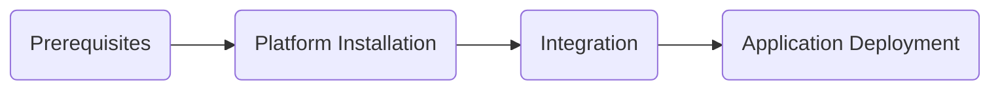

# Overview

This page serves as an introductory part of the Quick Start guide. It outlines the core steps and reasons to perform them.

The purpose of this guide is to swiftly demonstrate the key functionalities of the EPAM Delivery Platform (EDP). After completing this guide, users will have a clear understanding of EDP’s capabilities. This guide is designed for those who wish to quickly explore EDP.

## Setup Flow

Basically, the installation procedure of EDP consists of 4 logical parts:

1. **Prerequisites** -  On this step, Tekton and Argo CD are installed to provide EDP with CI/CD mechanisms.
2. **Platform Installation** - Here we deploy the EPAM Delivery Platform itself and adjust it for work.
3. **Integration** - On this step, third-party tools are integrated with EDP to provide the platform with a minimum functionality set.
4. **Application Deployment** - Here we create and deploy an application, this is the target endpoint of the whole guide.

Formally, the guide is divided by two parts: **CI** and **CD**, corresponding to the stages of the pipeline that the platform supports at each moment.

## Prerequisites

Before deploying EDP, ensure to deploy a local Kubernetes cluster. We recommend allocating 4 CPUs and 8 GB of RAM to it.

Alternatively, use any cloud provider that offers Kubernetes service with sufficient CPU and RAM capacity. For instance, we encourage you to check out our [video tutorial](https://www.youtube.com/watch?v=QjZoPnIKDtA), where we demonstrate the installation of EDP via the Civo Marketplace. In this case you will be able to skip the installation part of the guide and proceed with adjusting integrations.

## Starting Point

The very first step of the guide is to prepare the cluster environment for the EDP setup process by installing the Tekton tool. Immediately after this we will be able to install EDP.

All the guidelines are described in the [Platform Installation](platform-installation.md) page.
Alternatively, watch our [video tutorial](https://www.youtube.com/watch?v=QjZoPnIKDtA) that clearly demonstrates this process.

Good luck!
