---
hide:
  - navigation
---

# Scaffold and Deploy FastAPI Application

## Overview

This use case describes the creation and deployment of a FastAPI application to enable a developer to quickly generate a functional code structure for a FastAPI web application (with basic read functionality), customize it to meet specific requirements, and deploy it to a development environment. By using a scaffolding tool and a standardized process for code review, testing and deployment, developers can reduce the time and effort required to build and deploy a new application while improving the quality and reliability of the resulting code. Ultimately, the goal is to enable the development team to release new features and applications more quickly and efficiently while maintaining high code quality and reliability.


### __Roles__

This documentation is tailored for the Developers and Team Leads.

### __Goals__

- Create a new FastAPI application quickly.
- Deploy the initial code to the DEV environment.
- Check CI pipelines.
- Perform code review.
- Delivery update by deploying the new version.

### __Preconditions__

- EDP instance is [configured](../operator-guide/prerequisites.md) with Gerrit, Tekton and [Argo CD](../operator-guide/argocd-integration.md).
- Developer has access to the EDP instances using the Single-Sign-On approach.
- Developer has the `Administrator` role (to perform merge in Gerrit).

## Scenario

To scaffold and deploy FastAPI Application, follow the steps below.

### Scaffold the New FastAPI Application

1. Open EDP Portal URL. Use the Sign-In option.

  !

2. Ensure `Namespace` value in the User `Settings` tab points to the namespace with the EDP installation.

  !

3. Create the new `Codebase` with the `Application` type using the `Create` strategy. To do this, open EDP tab.

  !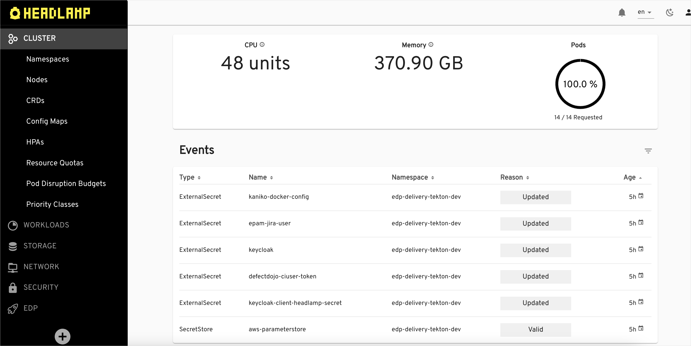

4. Select the `Components` Section under the EDP tab and push the create `+` button.

  !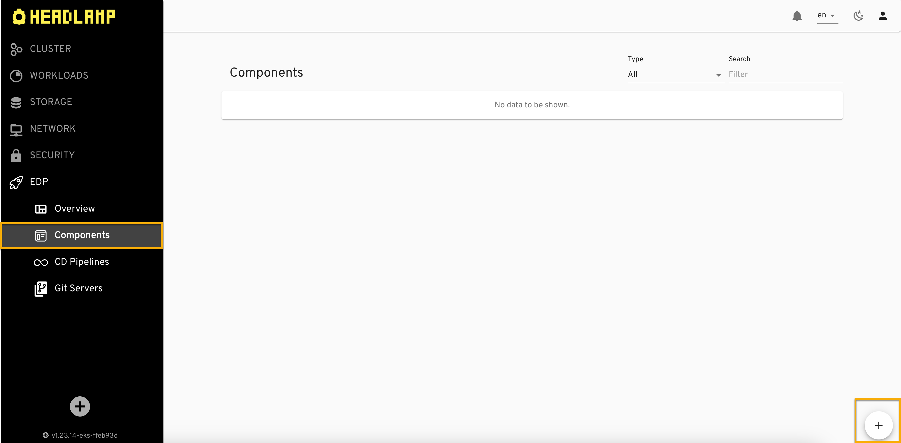

5. Select the `Application` Codebase type because we are going to deliver our application as a container and deploy it inside the Kubernetes cluster. Choose the `Create` strategy to scaffold our application from the template provided by the EDP and press the `Proceed` button.

  !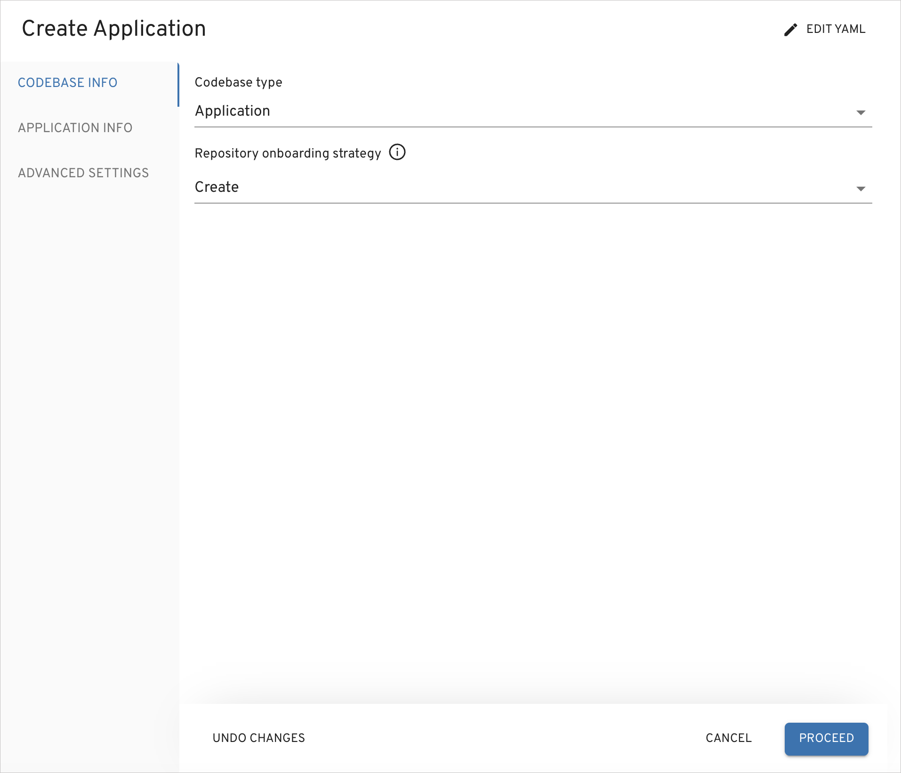

6. On the Application Info tab, define the following values and press the `Proceed` button:

  - Application name: `fastapi-demo`
  - Default branch: `main`
  - Application code language: `Python`
  - Language version/framework: `FastAPI`
  - Build tool: `Python`

  !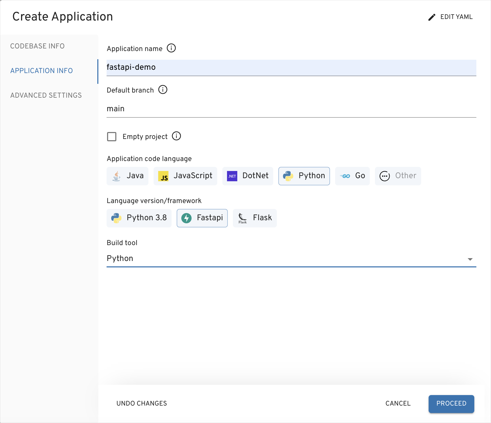

7. On the `Advances Settings` tab, define the below values and push the `Apply` button:

  - CI tool: `Tekton`
  - Codebase versioning type: `edp`
  - Start version from: `0.0.1` and `SNAPSHOT`

  !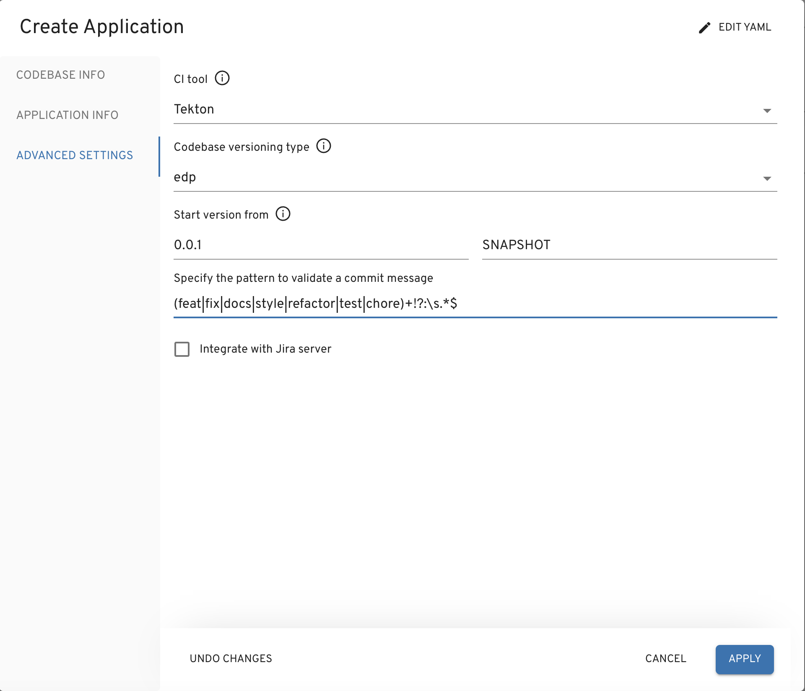

8. Check the application status. It should be green:

  !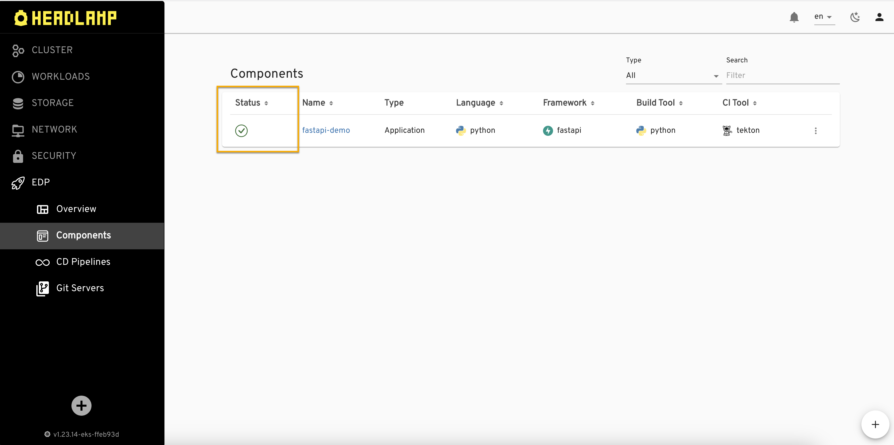

### Deploy the Application to the Development Environment

This section describes the application deployment approach from the latest branch commit. The general steps are:

- Build the initial version (generated from the template) of the application from the last commit of the `main` branch.

- Create a `CD Pipeline` to establish continuous delivery to the development environment.

- Deploy the initial version to the development env.

To succeed with the steps above, follow the instructions below:

1. Build Container from the latest branch commit. To build the initial version of the application's main branch, go to the fastapi-demo application -> branches -> main and select the `Build` menu.

  !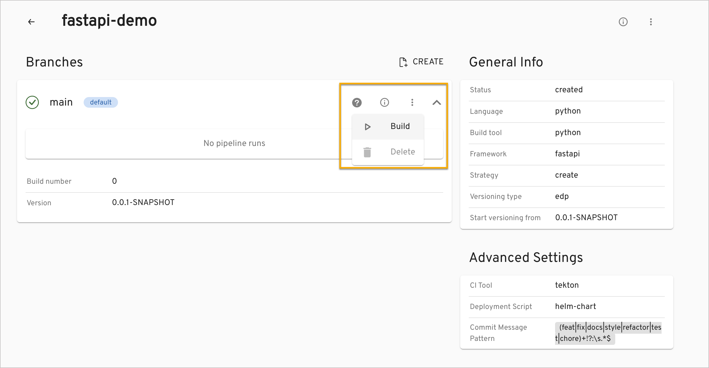

2. Build pipeline for the `fastapi-demo` application starts.

  !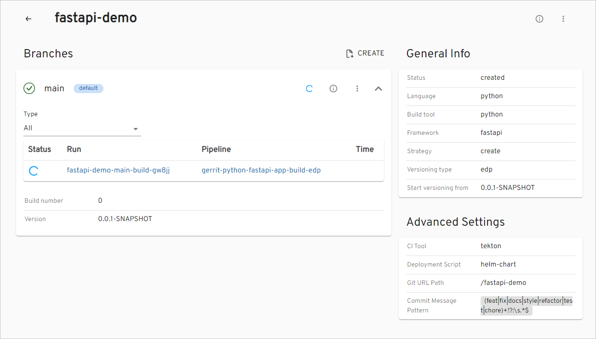

3. Track Pipeline's status by accessing **Tekton Dashboard** by clicking the `fastapi-demo-main-build-lb57m` application link.

  !

4. Ensure that Build Pipeline was successfully completed.

5. Create CD Pipeline. To enable application deployment create a CD Pipeline with a single environment - Development (with the name `dev`).

6. Go to EDP Portal -> EDP -> CD Pipelines tab and push the `+` button to create pipeline. In the `Create CD Pipeline` dialog, define the below values:

  - **Pipeline tab**:
    - Pipeline name: `mypipe`
    - Deployment type: `Container`, since we are going to deploy containers

    !

  - **Applications tab**. Add `fastapi-demo` application, select `main` branch, and leave `Promote in pipeline` unchecked:

    !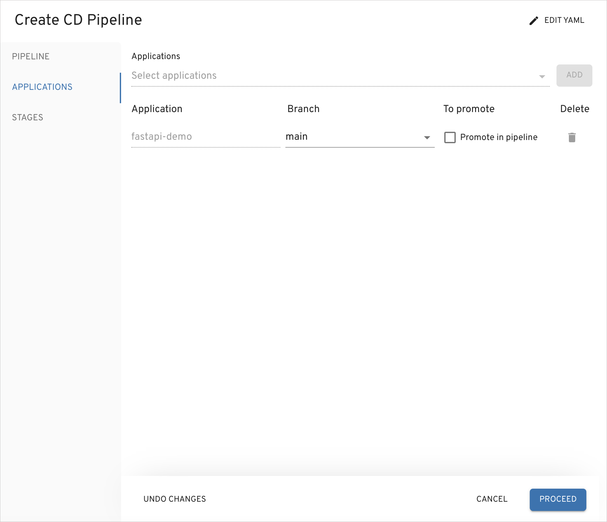

  - **Stages tab**. Add the `dev` stage with the values below:
    - Stage name: `dev`
    - Description: `Development Environment`
    - Trigger type: `Manual`. We plan to deploy applications to this environment manually
    - Quality gate type: `Manual`
    - Step name: `approve`
    - Push the `Apply` button

    !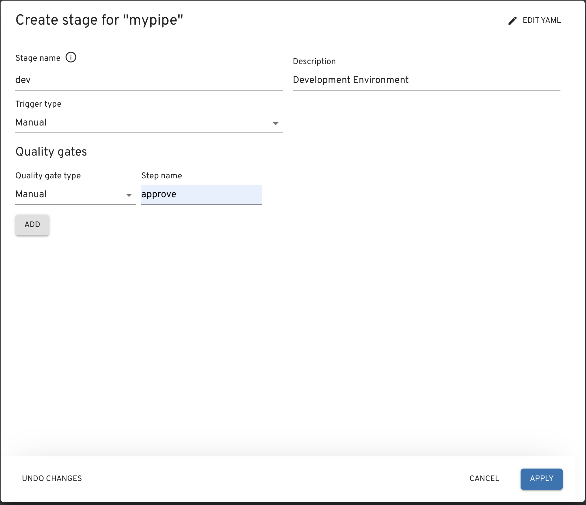


7. Deploy the initial version of the application to the development environment:

   - Open CD Pipeline with the name `mypipe`.
   - Select the `dev` stage from the Stages tab.
   - In the `Image stream version` select version `0.0.1-SNAPSHOT.1` and push the `Deploy` button.

  !

### Check the Application Status

To ensure the application is deployed successfully, follow the steps below:

1. Ensure application status is `Healthy` and `Synced`, and the `Deployed version` points to `0.0.1-SNAPSHOT.1`:

  !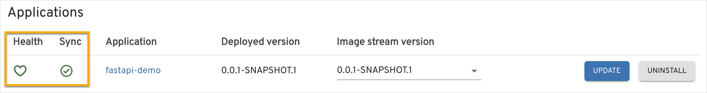

2. Check that the selected version of the container is deployed on the `dev` environment. `${EDP_ENV}` - is the EDP namespace name:

    ```bash
    # Check the deployment status of fastapi-demo application
    $ kubectl get deployments -n ${EDP_ENV}-mypipe-dev
    NAME                 READY   UP-TO-DATE   AVAILABLE   AGE
    fastapi-demo-dl1ft   1/1     1            1           30m

    # Check the image version of fastapi-demo application
    $ kubectl get pods -o jsonpath="{.items[*].spec.containers[*].image}" -n ${EDP_ENV}-mypipe-dev
    012345678901.dkr.ecr.eu-central-1.amazonaws.com/${EDP_ENV}/fastapi-demo:0.0.1-SNAPSHOT.1
    ```

### Deliver New Code

This section describes the `Code Review` process for a new code. We need to deploy a new version of our `fastapi-demo` application that deploys `Ingress` object to expose API outside the Kubernetes cluster.

Perform the below steps to merge new code (Pull Request) that passes the Code Review flow. For the steps below, we use Gerrit UI but the same actions can be performed using the command line and git tool:

1. Login to Gerrit UI, select `fastapi-demo` project, and create a change request.

2. Browse Gerrit Repositories and select `fastapi-demo` project.

  !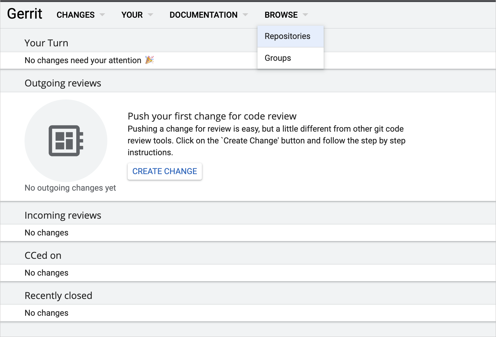

3. In the `Commands` section of the project, push the `Create Change` button.

  !

4. In the `Create Change` dialog, provide the branch `main` and the `Description` (commit message):

  ```txt
  Enable ingress for application

  Closes: #xyz
  ```

5. Push the `Create` button.

  !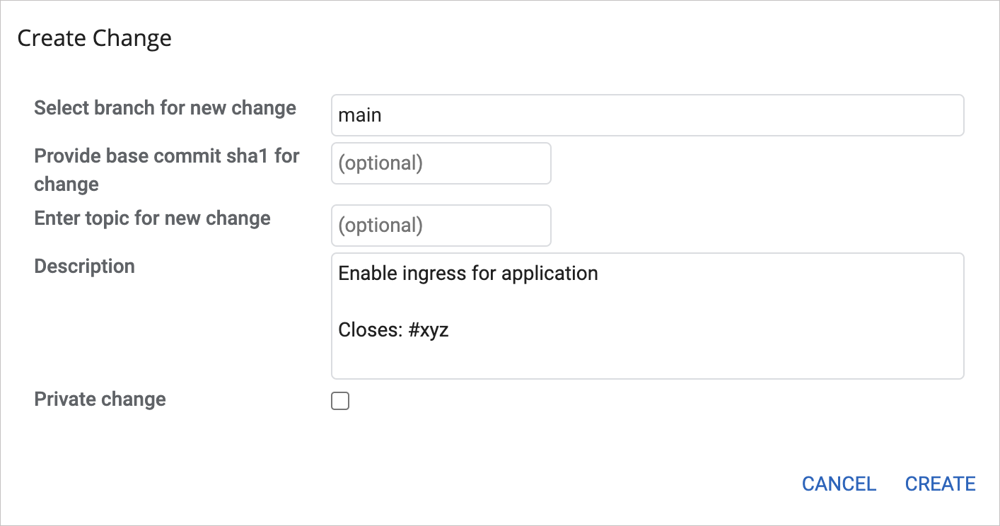

6. Push the `Edit` button of the merge request and add `deployment-templates/values.yaml` for modification.

  !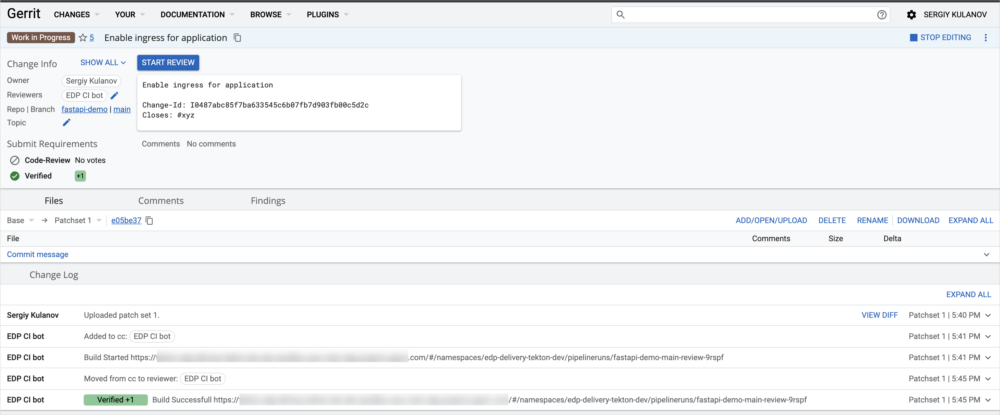

7. Review the `deployment-templates/values.yaml` file and change the `ingress.enabled` flag from `false` to `true`. Then push the `SAVE & PUBLISH` button. As soon as you get `Verified +1` from CI, you are ready for review: Push the `Mark as Active` button.

  !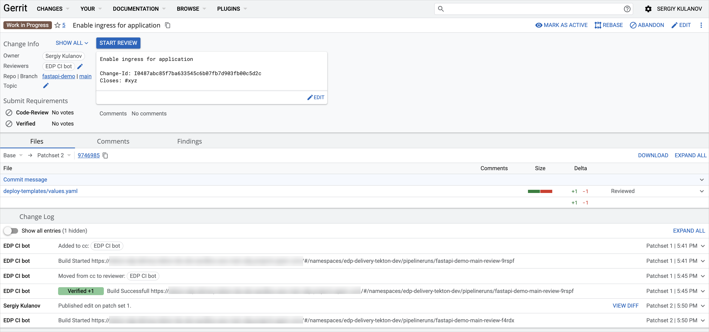

8. You can always check your pipelines status from:

  - Gerrit UI.

  !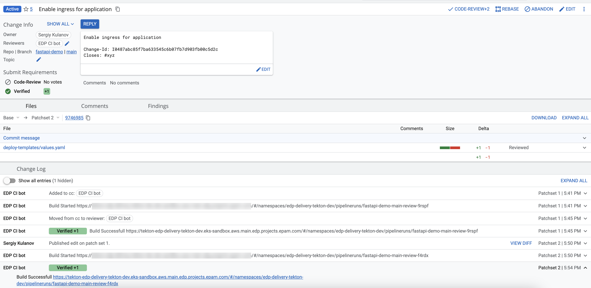

  - EDP Portal.

  !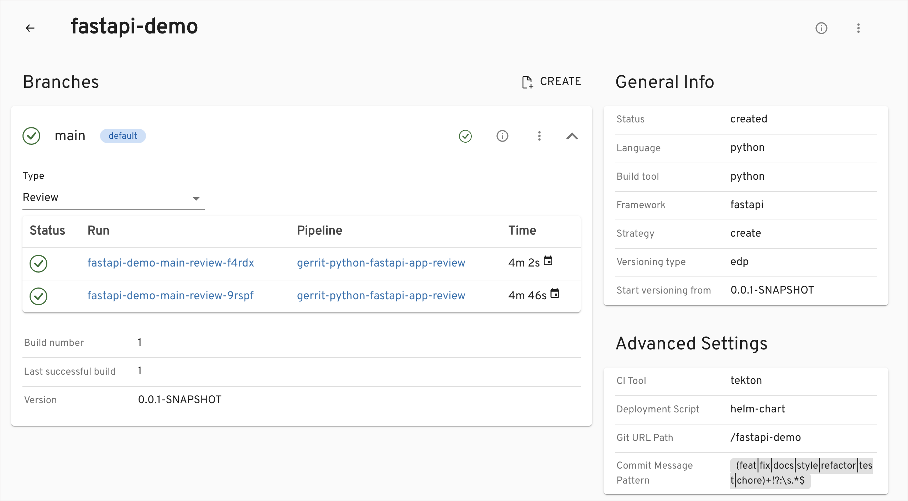

9. With no Code Review Pipeline issues, set `Code-Review +2` for the patchset and push the `Submit` button. Then, your code is merged to the `main` branch, triggering the Build Pipeline. The build Pipeline produces the new version of artifact: `0.0.1-SNAPSHOT.2`, which is available for the deployment.

  !

10. Deliver the New Version to the Environment. Before the new version deployment, check the ingress object in `dev` namespace:

    ```bash
    $ kubectl get ingress -n ${EDP_ENV}-mypipe-dev
    No resources found in ${EDP_ENV}-mypipe-dev namespace.
    ```

  No ingress object exists as expected.

11. Deploy the new version `0.0.1-SNAPSHOT.2` which has the ingress object in place. Since we use `Manual` deployment approach, we perform version upgrade by hand.

  - Go to the `CD Pipelines` section of the `EDP Portal`, select `mypipe` pipeline and choose `dev` stage.
  - In the `Image stream version` select the new version `0.0.1-SNAPSHOT.2` and push the `Update` button.
  - Check that the new version is deployed: application status is `Healthy` and `Synced`, and the `Deployed version` points to `0.0.1-SNAPSHOT.2`.

  !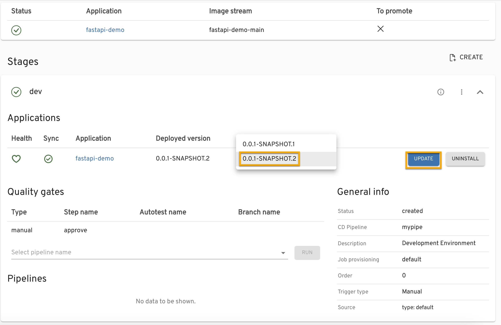

12. Check that the new version with Ingress is deployed:

    ```bash
    # Check the version of the deployed image
    kubectl get pods -o jsonpath="{.items[*].spec.containers[*].image}" -n ${EDP_ENV}-mypipe-dev
    012345678901.dkr.ecr.eu-central-1.amazonaws.com/edp-delivery-tekton-dev/fastapi-demo:0.0.1-SNAPSHOT.2

    # Check Ingress object
    kubectl get ingress -n ${EDP_ENV}-mypipe-dev
    NAME                 CLASS    HOSTS                            ADDRESS          PORTS   AGE
    fastapi-demo-ko1zs   <none>   fastapi-demo-ko1zs-example.com   12.123.123.123   80      115s

    # Check application external URL
    curl https://your-hostname-appeared-in-hosts-column-above.example.com/
    {"Hello":"World"}
    ```

## Related Articles

- [Use Cases](./index.md)
