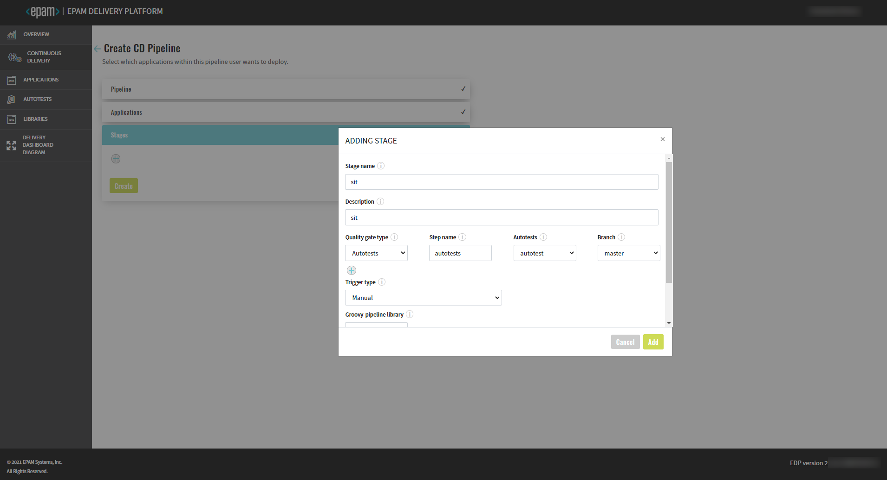

# Autotest as a Quality Gate

This use case describes the flow of adding an autotest as a quality gate to a newly created CD pipeline with a selected build version of an application to be promoted.

1. Make sure an application is created. Please refer to the [Add Application](../user-guide/add-application.md) section for details.

  

2. Create an autotest with the necessary parameters. Please refer to the [Add Autotest](../user-guide/add-autotest.md) section for details.

  

3. Create a CD pipeline where the necessary application build version will be promoted and the autotest will be used as a quality gate. Please refer to the [Add CD Pipeline](../user-guide/add-cd-pipeline.md) section for details.

  

4. In the Application menu, select the application to be promoted in the CD pipeline.

  

5. In the Stages menu, add the necessary stage and indicate the _Autotests_ quality gate.

   

  !!! note
      Please be aware that once created, the CD pipeline remains with the chosen quality gate type without possibility to edit it.

  !!! info
      To trigger the CD pipeline, first, make sure that all applications have passed the Build pipelines and autotests have passed the single Code Review pipelines.

6. Navigate to Jenkins to see the autotest logs and Allure report.

### Related Articles

* [Add Application](../user-guide/add-application.md)
* [Add Autotest](../user-guide/add-autotest.md)
* [Add CD Pipeline](../user-guide/add-cd-pipeline.md)

