---
hide:
- navigation
---

# Autotest as a Quality Gate

This use case describes the flow of adding an autotest as a quality gate to a newly created CD pipeline with a selected build version of an application to be promoted. The purpose of autotests is to check if application meets predefined criteria for stability and functionality, ensuring that only reliable versions are promoted. The promotion feature allows users to implement complicated testing, thus improving application stability.

## __Roles__

This documentation is tailored for the Developers and Quality Assurance specialists.

## __Goals__

- Create several applications and autotests quickly.
- Create a pipeline for Continuous Deployment.
- Perform testing.
- Update delivery by deploying the new version.

## __Preconditions__

- EDP instance is [configured](../operator-guide/prerequisites.md) with Gerrit, Tekton and [Argo CD](../operator-guide/argocd-integration.md).
- Developer has access to the EDP instances using the Single-Sign-On approach.
- Developer has the **Administrator** role (to perform merge in Gerrit).

### Create Applications

To implement autotests as Quality Gates, follow the steps below:

1. Ensure the namespace is specified in the cluster settings. Click the **Settings** icon in the top right corner and select **Cluster settings**:

  !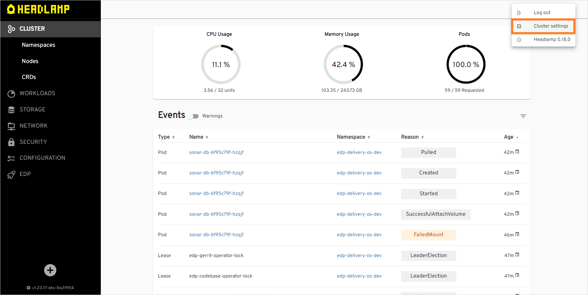

2. Enter the name of the default namespace, then enter your default namespace in the **Allowed namespaces** field and click the **+** button. You can also add other namespaces to the **Allowed namespaces**:

  !

3. Create several applications using the **Create** strategy. Navigate to the **EDP** tab, choose **Components**, click the **+** button:

  !

4. Select **Application** and **Create from template**:

  !

  !!! note
      Please refer to the [Add Application](../headlamp-user-guide/add-application.md) section for details.

5. On the **Codebase info** tab, define the following values and press the **Proceed** button:

  - Git server: `gerrit`
  - Git repo relative path: `js-application`
  - Component name: `js-application`
  - Description: `js application`
  - Application code language: `JavaScript`
  - Language version/Provider: `Vue`
  - Build tool: `NPM`

  !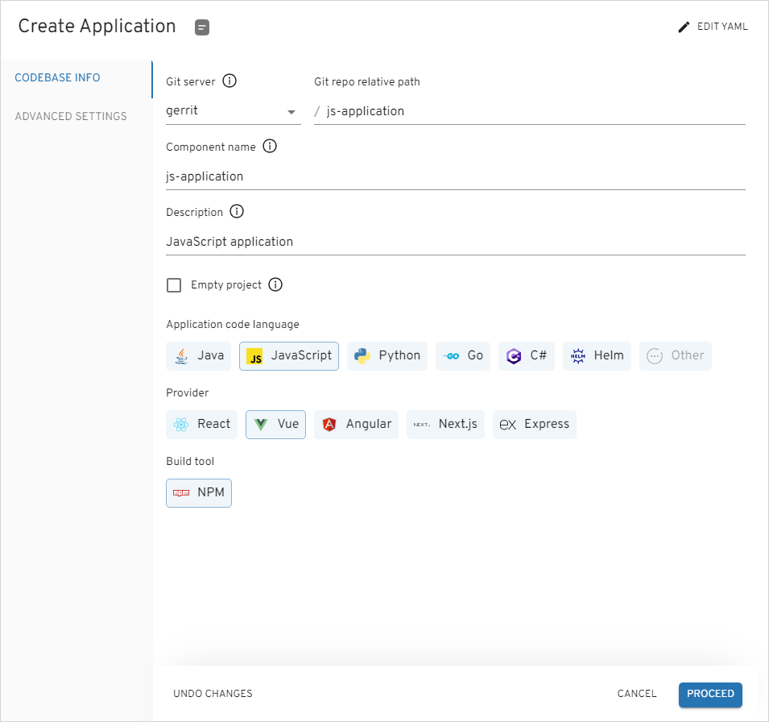

6. On the **Advanced settings** tab, define the below values and push the **Apply** button:

  - Default branch: `main`
  - Codebase versioning type: `default`

  !

7. Repeat the procedure twice to create the **go-application** and **python-application** applications. These applications will have the following parameters:

  go-application:

  - Git server: `gerrit`
  - Git repo relative path: `go-application`
  - Component name: `go-application`
  - Description: `go application`
  - Application code language: `Go`
  - Language version/Provider: `Gin`
  - Build tool: `Go`
  - Default branch: `main`
  - Codebase versioning type: `default`

  python-application:

  - Git server: `gerrit`
  - Git repo relative path: `python-application`
  - Component name: `python-application`
  - Description: `python application`
  - Application code language: `Python`
  - Language version/Provider: `FastAPI`
  - Build tool: `Python`
  - Default branch: `main`
  - Codebase versioning type: `default`

8. In the **Components** tab, click one of the applications name to enter the application menu:

  !

9. Click the three dots (**&vellip;**) button, select **Build**:

  !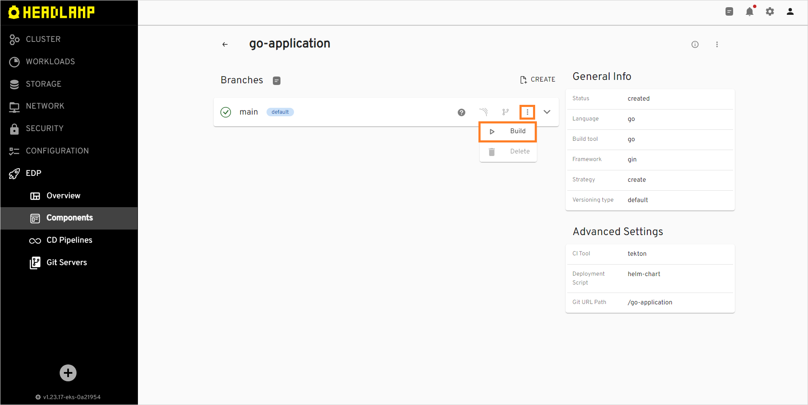

10. Click the down arrow (**v**) to observe and wait for the application to be built:

  !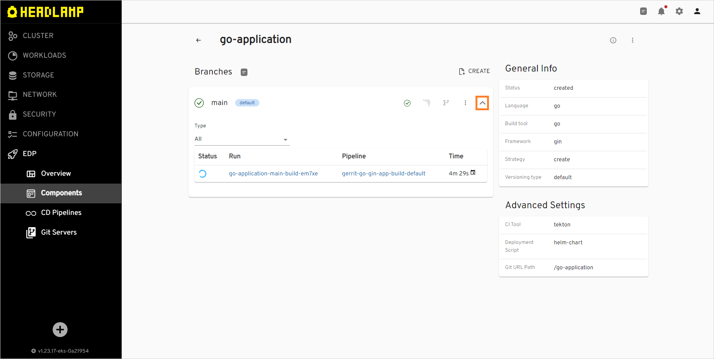

11. Click the application run name to watch the building logs in Tekton:

  !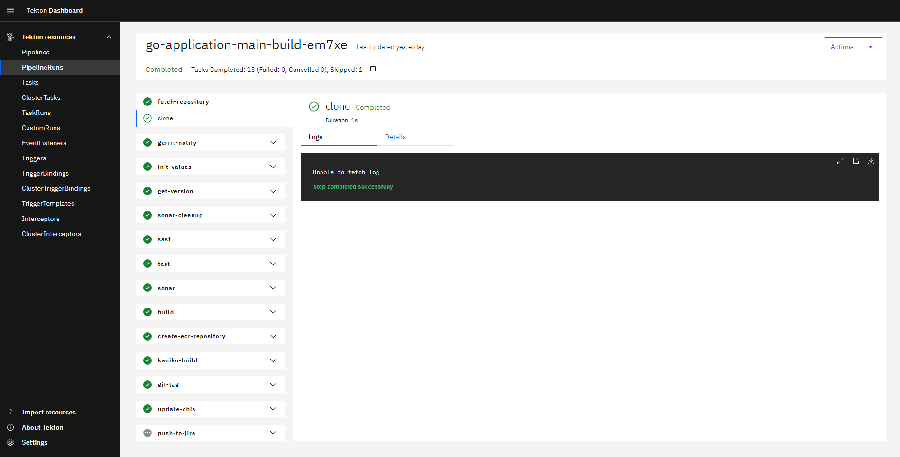

12. Wait till the build is successful:

  !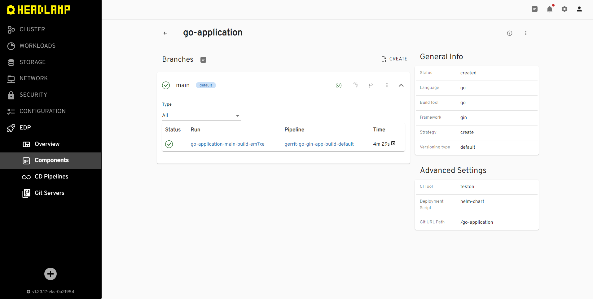

13. Repeat steps 8-12 for the rest of the applications.

### Create Autotests

The steps below instruct how to create autotests in EDP:

1. Create a couple of autotests using the **Create** strategy. Navigate to the **EDP** tab, choose **Components**, click on the **+** button. Select **Autotest** and **Clone project**:

  !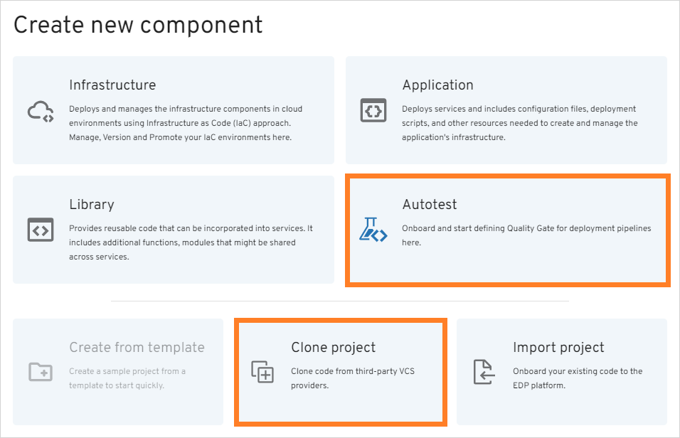

  !!! note
      Please refer to the [Add Autotest](../headlamp-user-guide/add-autotest.md) section for details.

2. On the **Codebase info** tab, define the following values and press the **Proceed** button:

  - Repository URL: `https://github.com/SergK/autotests.git`
  - Git server: `gerrit`
  - Git repo relative path: `demo-autotest-gradle`
  - Component name: `demo-autotest-gradle`
  - Description: `demo-autotest-gradle`
  - Autotest code language: `Java`
  - Language version/framework: `Java11`
  - Build tool: `Gradle`
  - Autotest report framework: `Allure`

  !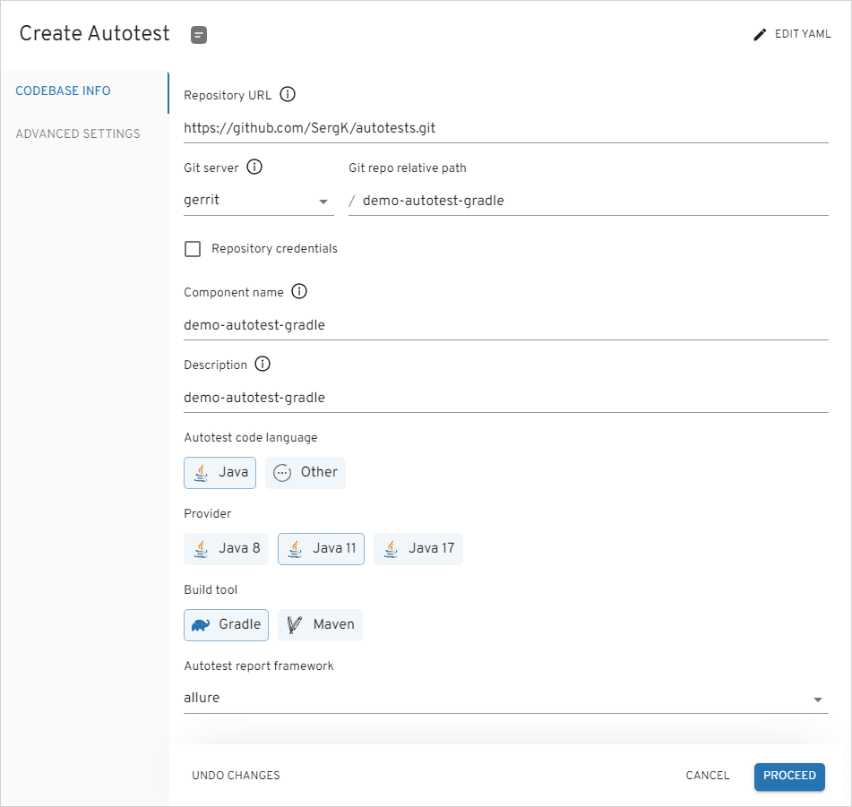

3. On the **Advanced settings** tab, leave the settings as is and click the **Apply** button:

  !

4. Repeat the steps 1-3 to create one more autotest with the parameters below:

  - Repository URL: `https://github.com/Rolika4/autotests.git`
  - Git server: `gerrit`
  - Git repo relative path: `demo-autotest-maven`
  - Component name: `demo-autotest-maven`
  - Description: `demo-autotest-maven`
  - Autotest code language: `Java`
  - Language version/framework: `Java11`
  - Build tool: `Maven`
  - Autotest report framework: `Allure`

### Create CD Pipeline

Now that applications and autotests are created, create pipeline for them by following the steps below:

1. Navigate to the **CD Pipelines** tab and click the **+** button:

  !

2. On the **Pipeline** tab, in the **Pipeline name** field, enter **demo-pipeline**:

  !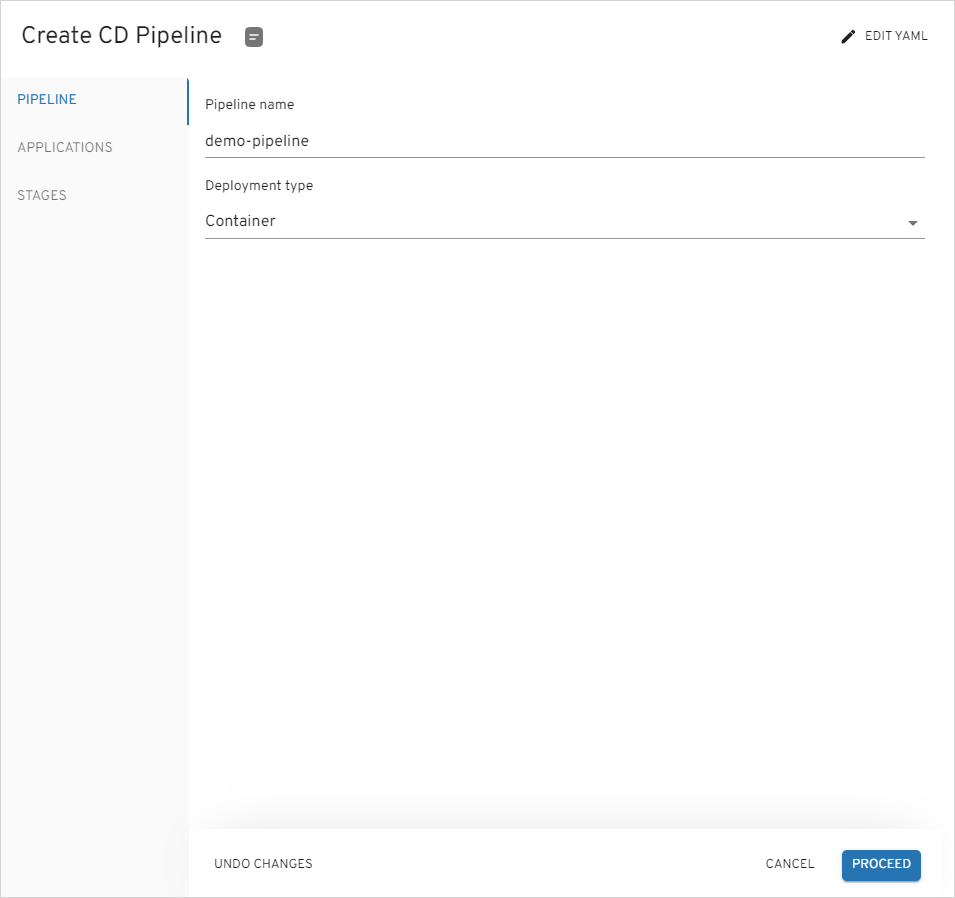

3. On the **Applications** tab, add all the three applications, specify the **main** branch for all for them and check **Promote in pipeline** for Go and JavaScript applications:

  !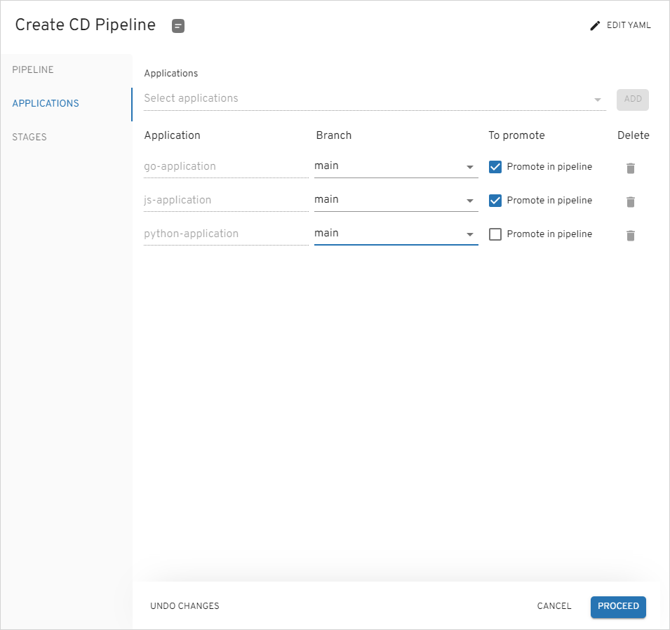

4. On the **Stages** tab, click the **Add stage** button to open the **Create stage** menu:

  !

5. In the **Create stage** menu, specify the following parameters and click **Apply**:

  - Cluster: `In cluster`
  - Stage name: `dev`
  - Description: `dev`
  - Trigger type: `manual`
  - Quality gate type: `Autotests`
  - Step name: `dev`
  - Autotest: `demo-autotest-gradle`
  - Autotest branch: `main`

  !

6. After the **dev** stage is added, click **Apply**:

  !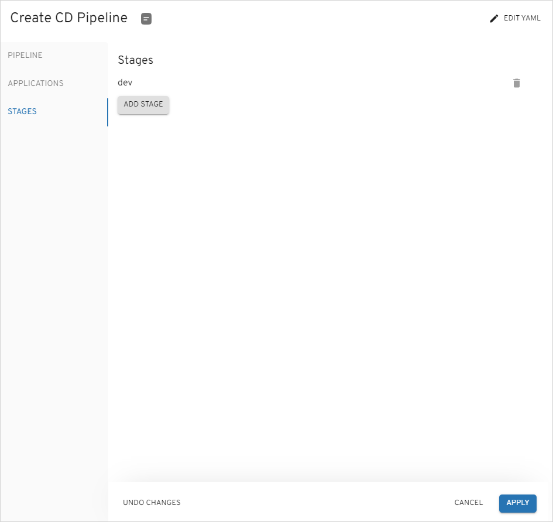

7. After the pipeline is created, click its name to open the pipeline details page:

  !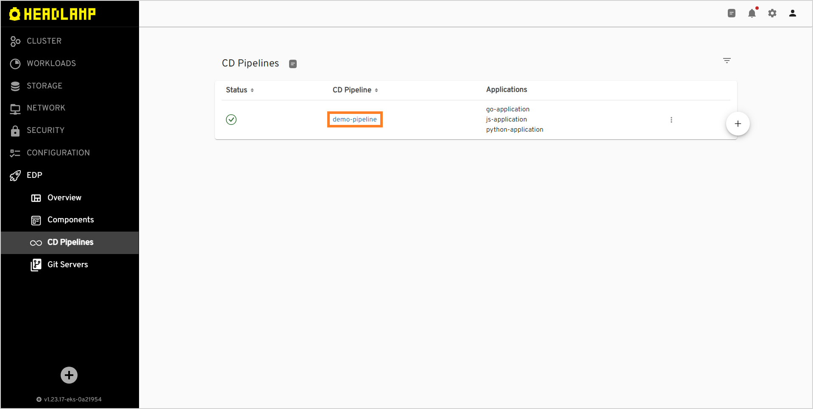

8. In the pipeline details page, click the **Create** button to create a new stage:

  !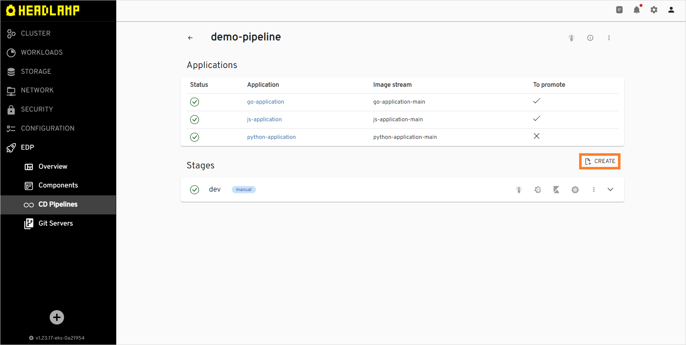

9. In the **Create stage** menu, specify the following parameters:

  - Cluster: `In cluster`
  - Stage name: `sit`
  - Description: `sit`
  - Trigger type: `manual`
  - Quality gate type: `Autotests`
  - Step name: `dev`
  - Autotest: `demo-autotest-maven`
  - Autotest branch: `main`

### Run Autotests

After the CD pipeline is created, deploy applications and run autotests by following the steps below:

1. Click the **dev** stage name to expand its details, specify image versions for each of the applications in the **Image stream version** field and click **Deploy**:

  !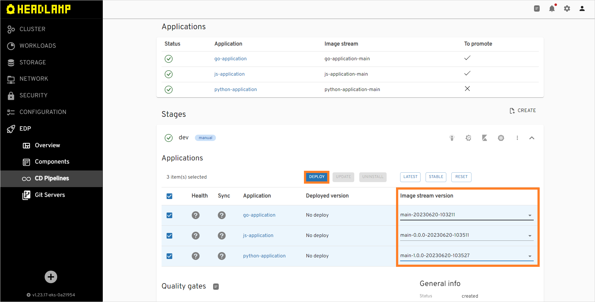

2. Once applications are built, scroll down to **Quality Gates** and click **Promote**:

  !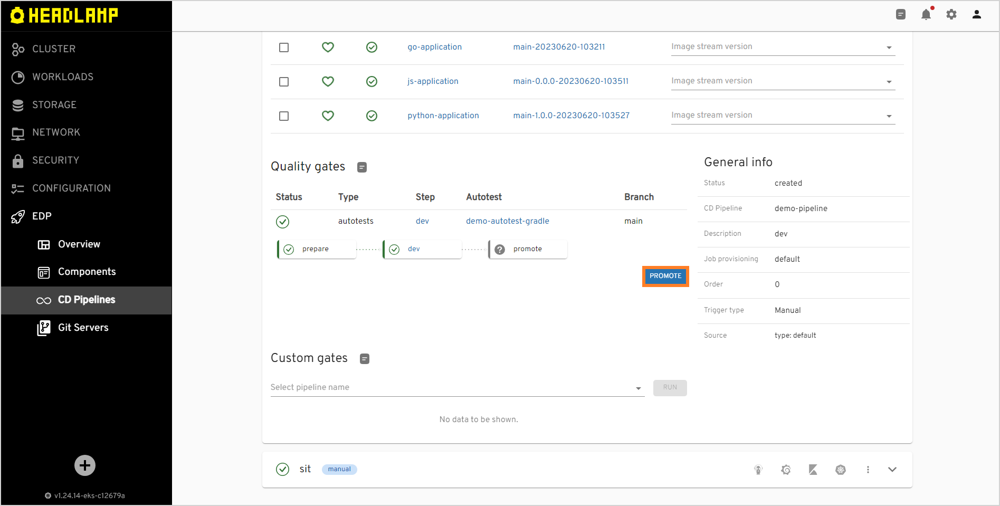

3. Once promotion procedure is finished, the promoted applications will become available in the **Sit** stage. You will be able to select image stream versions for the promoted applications. The non-promoted application will stay grey in the stage and won't be allowed to get deployed:

  !

## Related Articles

* [Add Application](../headlamp-user-guide/add-application.md)
* [Add Autotest](../headlamp-user-guide/add-autotest.md)
* [Add CD Pipeline](../headlamp-user-guide/add-cd-pipeline.md)
* [Add Quality Gate](../headlamp-user-guide/add-quality-gate.md)
