---
hide:
  - navigation
---

# Secured Secrets Management for Application Deployment

This Use Case demonstrates how to securely manage sensitive data, such as passwords, API keys, and other credentials, that are consumed by application during development or runtime in production. The approach involves storing sensitive data in an external secret store that is located in a "vault" namespace (but can be Vault, AWS Secret Store or any other provider). The process implies transmitting confidential information from the vault namespace to the deployed namespace for the purpose of establishing a connection to a database.

### __Roles__

This documentation is tailored for the Developers and Team Leads.

### __Goals__

- Make confidential information usage secure in the deployment environment.

### __Preconditions__

- EDP instance is [configured](../operator-guide/prerequisites.md) with Gerrit, Tekton and [Argo CD](../operator-guide/argocd-integration.md);
- External Secrets is [installed](../operator-guide/install-external-secrets-operator.md);
- Developer has access to the EDP instances using the Single-Sign-On approach;
- Developer has the `Administrator` role (to perform merge in Gerrit);
- Developer has access to manage secrets in demo-vault namespace.

## Scenario

To use External Secret in EDP approach, follow the steps below:

### Add Application

To begin, you will need an application first. Here are the steps to create it:

1. Open EDP Portal URL. Use the `Sign-In` option:

  !

2. In the top right corner, enter the `Cluster settings` and ensure that both `Default namespace` and `Allowed namespace` are set:

  !

3. Create the new `Codebase` with the `Application` type using the `Create` strategy. To do this, click the `EDP` tab:

  !

4. Select the `Components` section under the EDP tab and push the `+` button:

  !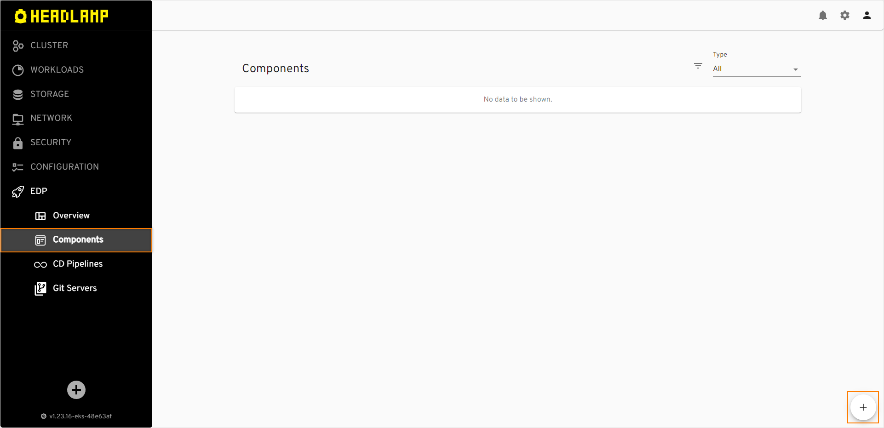

5. Select the `Application` Codebase type because we are going to deliver our application as a container and deploy it inside the Kubernetes cluster. Select the `Create` strategy to use predefined template:

  !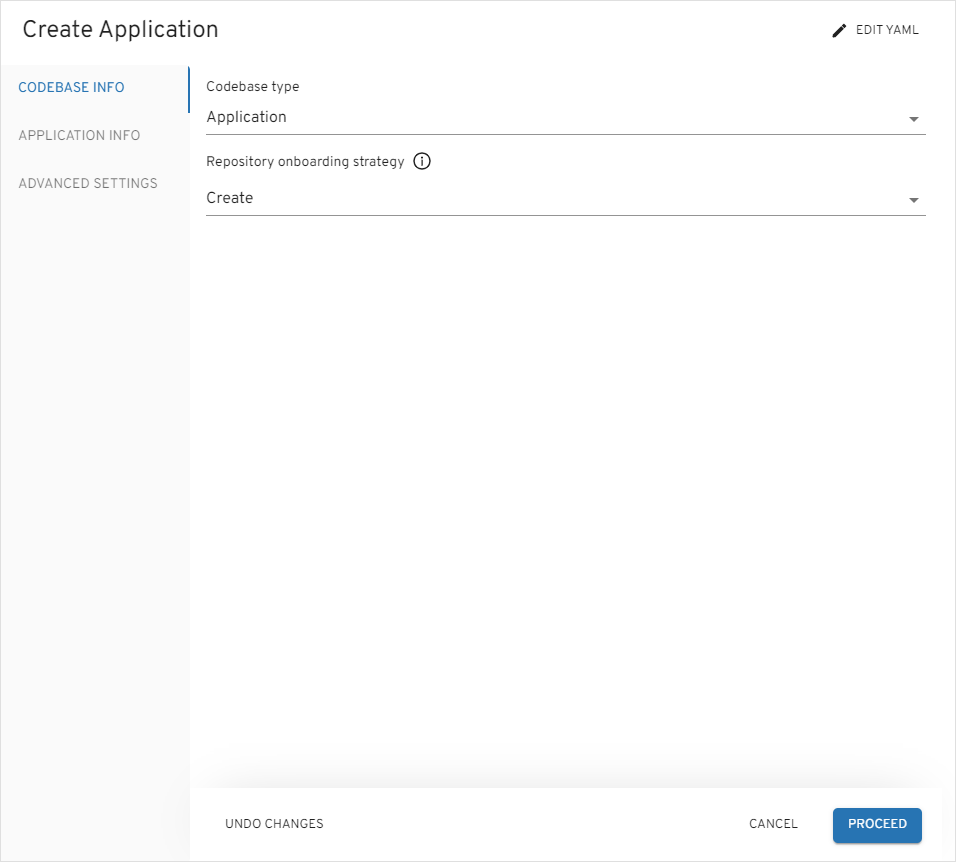

6. On the `Application Info` tab, define the following values and press the `Proceed` button:

  - Application name: `es-usage`
  - Default branch: `master`
  - Application code language: `Java`
  - Language version/framework: `Java 17`
  - Build tool: `Maven`


  !

7. On the `Advanced Settings` tab, define the below values and push the `Apply` button:

  - CI tool: `Tekton`
  - Codebase versioning type: `default`

  !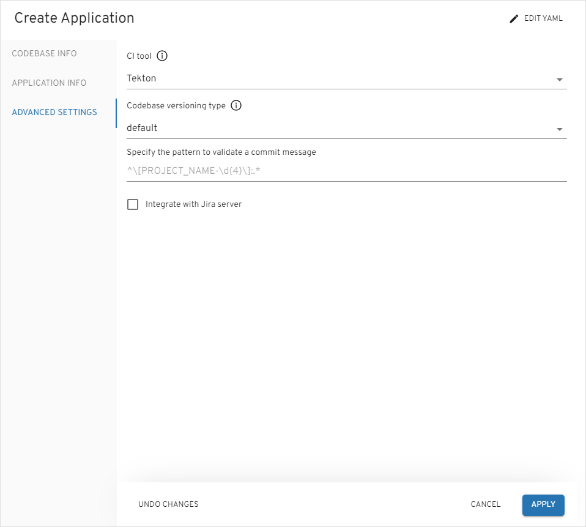

8. Check the application status. It should be green:

  !

### Create CD Pipeline

This section outlines the process of establishing a CD pipeline within EDP Portal. There are two fundamental steps in this procedure:

- Build the application from the last commit of the `master` branch;

- Create a `CD Pipeline` to establish continuous delivery to the SIT environment.

To succeed with the steps above, follow the instructions below:

1. Create CD Pipeline. To enable application deployment, create a CD Pipeline with a single environment - System Integration Testing (SIT for short). Select the `CD Pipelines` section under the `EDP` tab and push the `+` button:

  !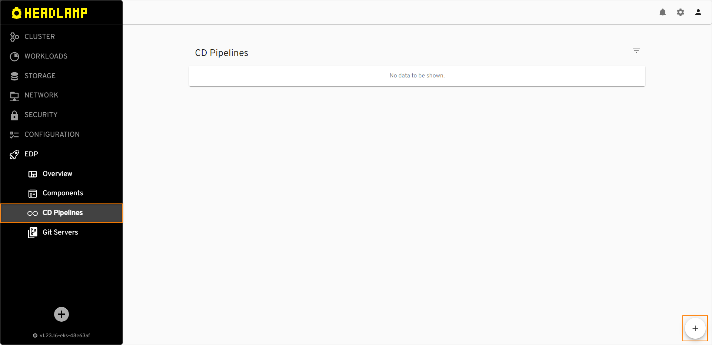

2. On the `Pipeline` tab, define the following values and press the `Proceed` button:

  - Pipeline name: `deploy`
  - Deployment type: `Container`

  !

3. On the `Applications` tab, add `es-usage` application, select `master` branch, leave `Promote in pipeline` unchecked and press the `Proceed` button:

  !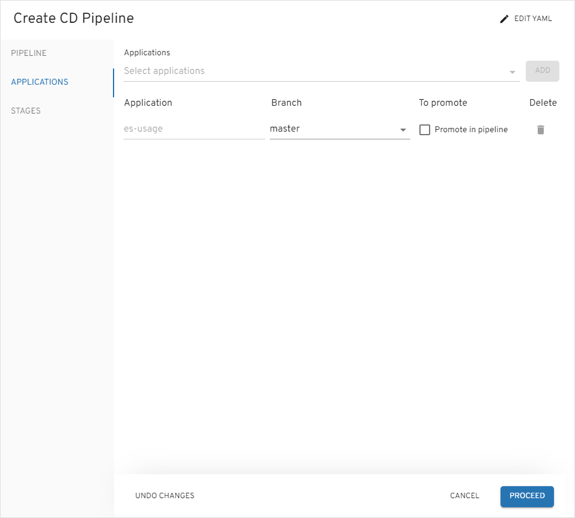

4. On the `Stage` tab, add the `sit` stage with the values below and push the `Apply` button:

  - Stage name: `sit`
  - Description: `System integration testing`
  - Trigger type: `Manual`. We plan to deploy applications to this environment manually
  - Quality gate type: `Manual`
  - Step name: `approve`

    !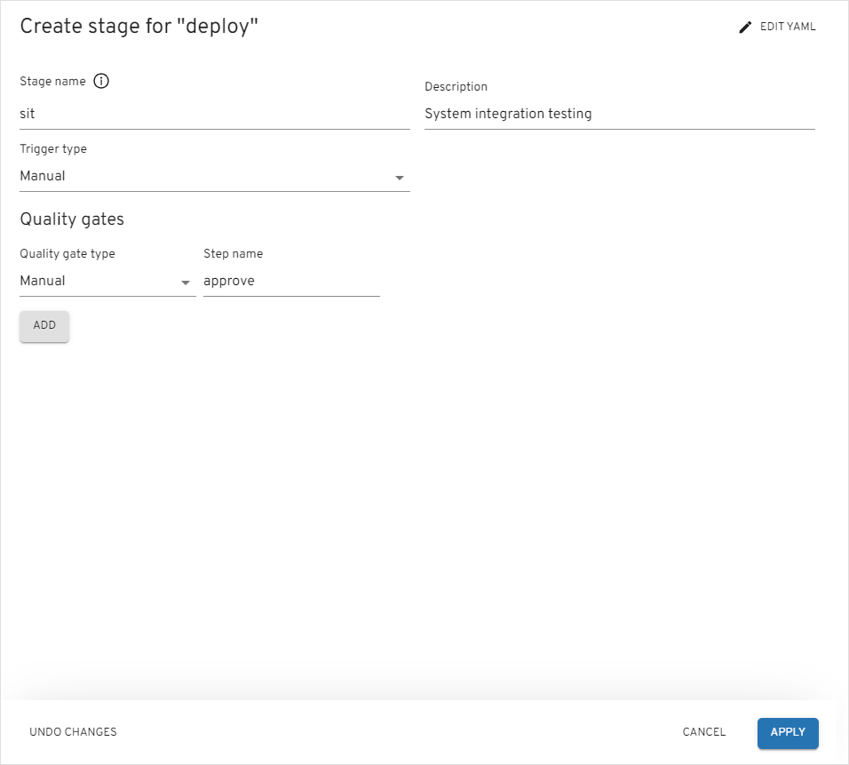

### Configure RBAC for External Secret Store

!!! Note

    In this scenario, three namespaces are used: `demo`, which is the namespace where EDP is deployed, `demo-vault`, which is the vault where developers store secrets, and`demo-deploy-sit`, which is the namespace used for deploying the application. The target namespace name for deploying application is formed with the pattern: `<edp-project>-<cd_pipeline_name>-<stage_name>`.

To make the system to function properly, it is imperative to create the following resources:

1. Create namespace `demo-vault` to store secrets:

  ```bash
   kubectl create namespace demo-vault
  ```

2. Create Secret:

  ```yaml
  apiVersion: v1
  kind: Secret
  metadata:
    name: mongo
    namespace: demo-vault
  stringData:
    password: pass
    username: user
  type: Opaque
  ```

3. Create Role to access the secret:

  ```yaml
  apiVersion: rbac.authorization.k8s.io/v1
  kind: Role
  metadata:
    namespace: demo-vault
    name: external-secret-store
  rules:
  - apiGroups: [""]
    resources:
    - secrets
    verbs:
    - get
    - list
    - watch
  - apiGroups:
    - authorization.k8s.io
    resources:
    - selfsubjectrulesreviews
    verbs:
    - create
  ```

4. Create RoleBinding:

  ```yaml
  apiVersion: rbac.authorization.k8s.io/v1
  kind: RoleBinding
  metadata:
    name: eso-from-edp
    namespace: demo-vault
  subjects:
    - kind: ServiceAccount
      name: secret-manager
      namespace: demo-deploy-sit
  roleRef:
    apiGroup: rbac.authorization.k8s.io
    kind: Role
    name: external-secret-store
  ```

### Add External Secret to Helm Chart

Now that RBAC is configured properly, it is time to add external secrets templates to application Helm chart. Follow the instructions provided below:

1. Navigate to `EDP Portal` -> `EDP` -> `Overview`, and push the Gerrit link:

  !

2. Log in to Gerrit UI, select `Repositories` and select `es-usage` project:

  !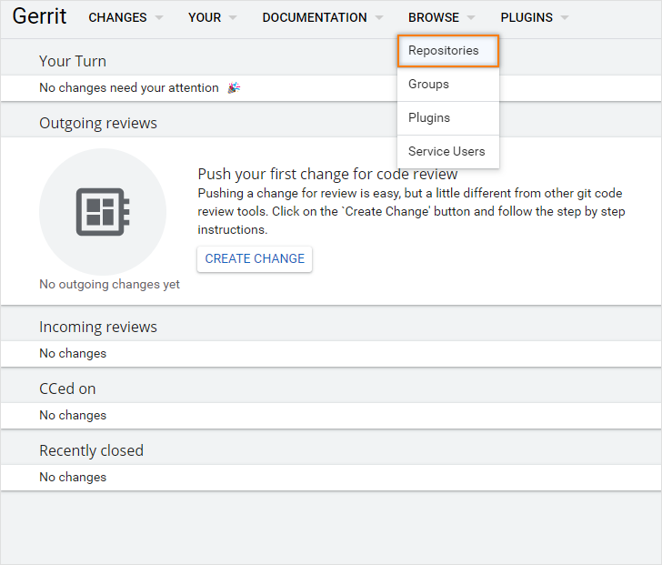

3. In the `Commands` section of the project, push the `Create Change` button:

  !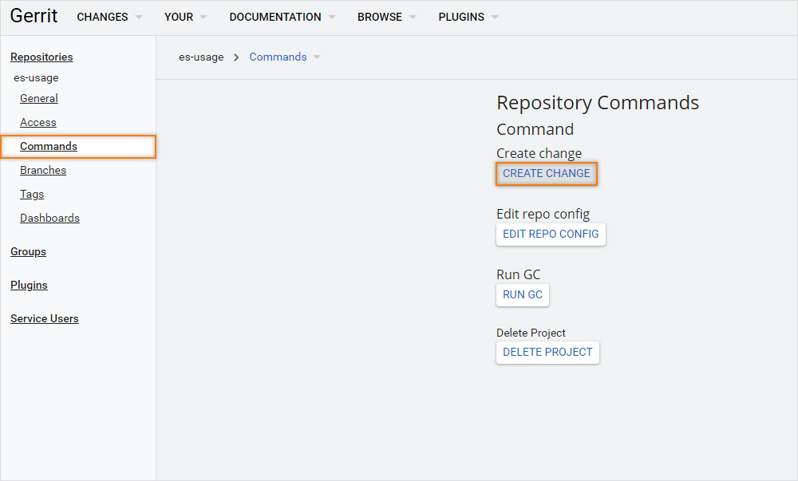

4. In the `Create Change` dialog, provide the branch `master` and fill in the `Description` (commit message) field and push the `Create` button:

  ```txt
  Add external secrets templates

  ```

  !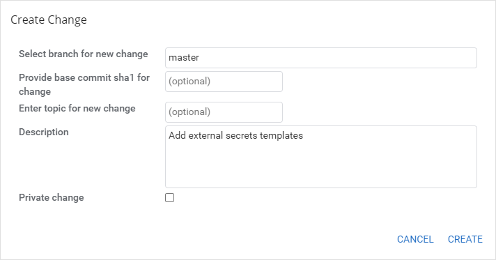

5. Push the `Edit` button of the merge request and then the `ADD/OPEN/UPLOAD` button and add files:

  !

  Once the file menu is opened, and click `SAVE` after editing each of the files:

  1. deploy-templates/templates/sa.yaml:

    ```yaml
    apiVersion: v1
    kind: ServiceAccount
    metadata:
      name: secret-manager
      namespace: demo-deploy-sit
    ```

  2. deploy-templates/templates/secret-store.yaml:

      ```yaml
      apiVersion: external-secrets.io/v1beta1
      kind: SecretStore
      metadata:
        name: demo
        namespace: demo-deploy-sit
      spec:
        provider:
          kubernetes:
            remoteNamespace: demo-vault
            auth:
              serviceAccount:
                name: secret-manager
            server:
              caProvider:
                type: ConfigMap
                name: kube-root-ca.crt
                key: ca.crt
      ```

  3. deploy-templates/templates/external-secret.yaml:

    ```yaml
    apiVersion: external-secrets.io/v1beta1
    kind: ExternalSecret
    metadata:
      name: mongo                            # target secret name
      namespace: demo-deploy-sit    # target namespace
    spec:
      refreshInterval: 1h
      secretStoreRef:
        kind: SecretStore
        name: demo
      data:
      - secretKey: username                   # target value property
        remoteRef:
          key: mongo                          # remote secret key
          property: username                  # value will be fetched from this field
      - secretKey: password                   # target value property
        remoteRef:
          key: mongo                          # remote secret key
          property: password                  # value will be fetched from this field
    ```

  4. deploy-templates/templates/deployment.yaml. Add the environment variable for mongodb to the existing deployment configuration that used the secret:


    ```yaml
              env:
                - name: MONGO_USERNAME
                  valueFrom:
                    secretKeyRef:
                      name: mongo
                      key: username
                - name: MONGO_PASSWORD
                  valueFrom:
                    secretKeyRef:
                      name: mongo
                      key: password
    ```

6. Push the `Publish Edit` button.

7. As soon as review pipeline finished, and you get `Verified +1` from CI, you are ready for review. Click `Mark as Active` -> `Code-Review +2` -> `Submit`:

    !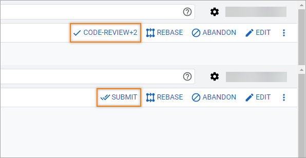

### Deploy Application

Deploy the application by following the steps provided below:

1. When build pipeline is finished, navigate to `EDP Portal` -> `EDP` -> `CD-Pipeline` and select `deploy` pipeline.

2. Deploy the initial version of the application to the SIT environment:

   - Select the `sit` stage from the Stages tab;
   - In the `Image stream version`, select latest version and push the `Deploy` button.

3. Ensure application status is `Healthy` and `Synced`:

  !

### Check Application Status

To ensure the application is deployed successfully, do the following:

1. Check that the resources are deployed:

  ```bash
  kubectl get secretstore -n demo-deploy-sit
  NAME                           AGE     STATUS   READY
  demo                           5m57s   Valid    True
  ```

  ```bash
  kubectl get externalsecret -n demo-deploy-sit
  NAME    STORE                          REFRESH INTERVAL   STATUS         READY
  mongo   demo                           1h                 SecretSynced   True
  ```

2. In the top right corner, enter the `Cluster settings` and add `demo-deploy-sit` to the `Allowed namespace`.

3. Navigate `EDP Portal` -> `Configuration` -> `Secrets` and ensure that secret was created:

  !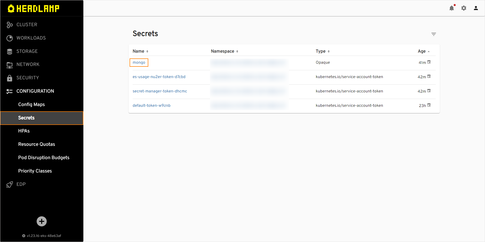

4. Navigate `EDP Portal` -> `Workloads` -> `Pods` and select deployed application:

  !


## Related Articles

- [Use Cases](./index.md)
- [Add Application](../user-guide/add-application.md)
- [CD Pipeline](../user-guide/add-cd-pipeline.md)