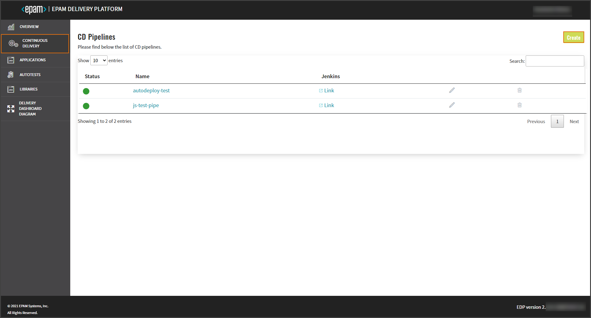
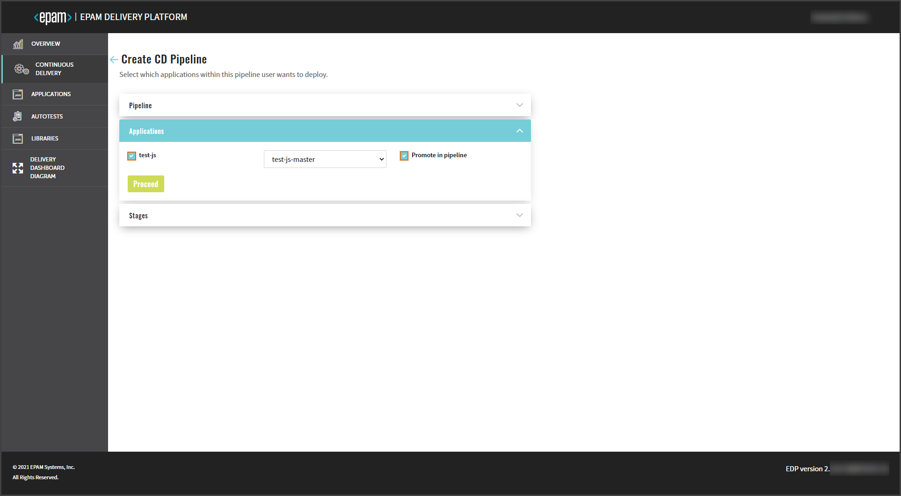
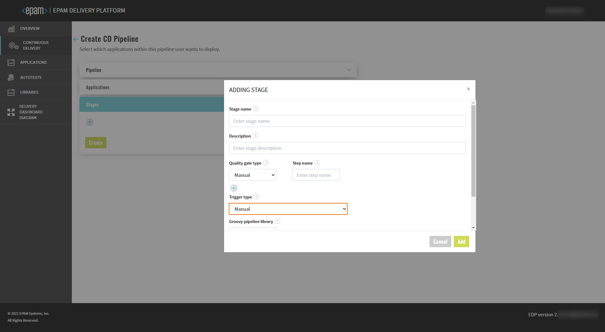

# Promote Application in CD Pipeline

This use case describes the promotion of the selected build versions of an application in the CD pipeline.

1. Before the promotion, make sure the necessary applications are added to the Admin Console. Please refer to the [Add Application](../user-guide/add-application.md) section for the details.

2. Navigate to the **Continuous Delivery** section on the left-side navigation bar and click the Create button. Please refer to the [Add CD Pipeline](../user-guide/add-cd-pipeline.md) section for the details.

  !

3. In the **Application** menu, select the applications to be deployed and promoted in the pipeline.

  * If the application is selected without the promotion option, a new build version will be available for deploy at all the stages of the CD pipeline;

  !

  * If the promotion is selected, the build version will pass through the environments one by one through the quality gates.

  !

  !!! info
      If there are several applications to be promoted, and some changes are made to one of them, only the application with the changes will be promoted to the next environments.

4. In the **Stages** menu, set the _manual_ trigger type to select an application for promotion.

  !

5. Navigate to Jenkins and start the CD pipeline.

6. With the _manual_ quality gate, click the OK button at the quality gate stage to promote the build to the next stage.

### Related Articles

* [Add Application](../user-guide/add-application.md)
* [Add Autotest](../user-guide/add-autotest.md)
* [Add CD Pipeline](../user-guide/add-cd-pipeline.md)
* [Autotest as a Quality Gate](autotest-as-quality-gate.md)