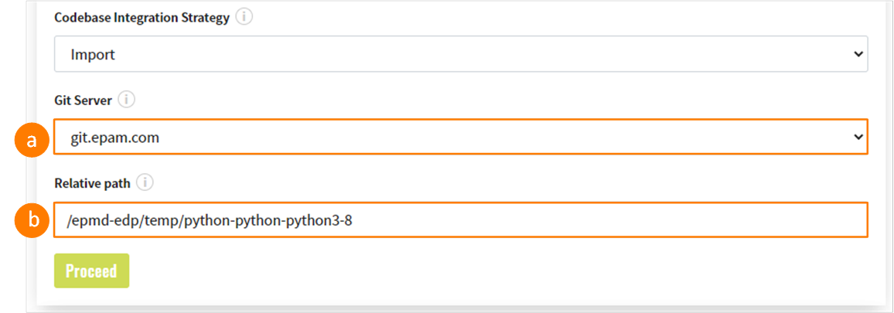
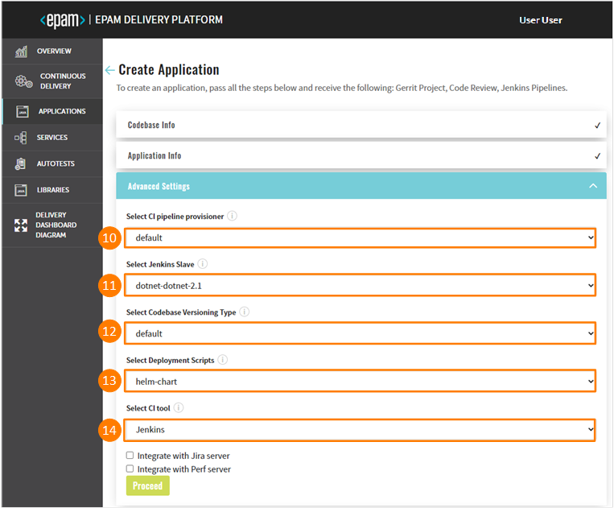
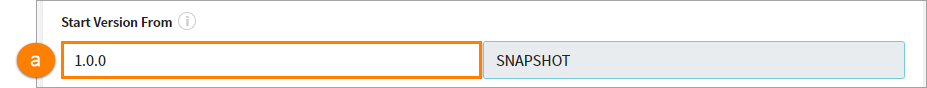
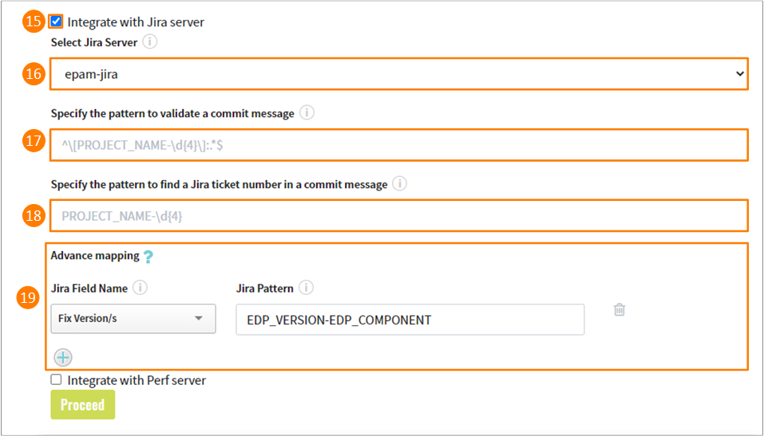
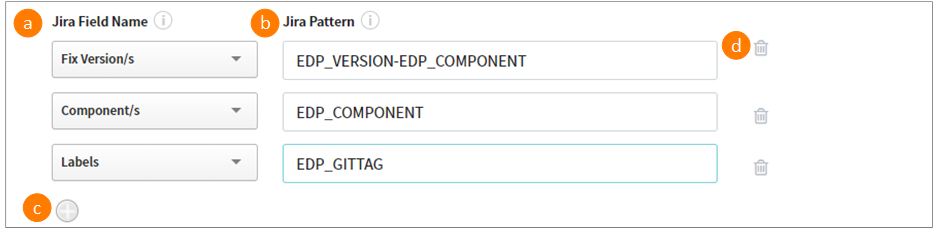
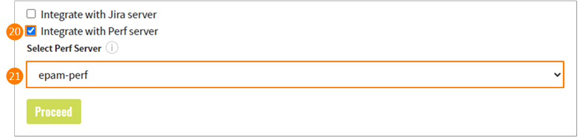
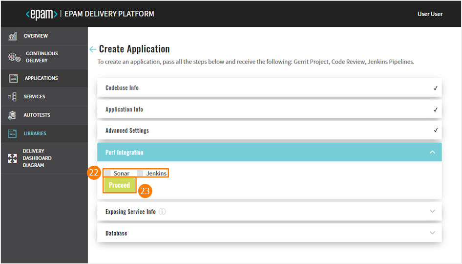
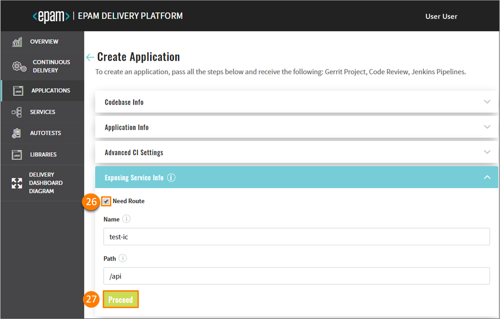

# Add Application

Admin Console allows to create, clone, import an application and add it to the environment with its subsequent deployment in Gerrit and building of the Code Review and Build pipelines in Jenkins.

To add an application, navigate to the **Applications** section on the left-side navigation bar and click the Create button.

Once clicked, the six-step menu will appear:

* The Codebase Info Menu
* The Application Info Menu
* The Advanced Settings Menu
* The Version Control System Info Menu
* The Exposing Service Info Menu
* The Database Menu

!!! note
    The Version Control System Info menu is available in case this option is predefined

## The Codebase Info Menu

1. In the **Codebase Integration Strategy** field, select the necessary option that is the configuration strategy for the replication with Gerrit:

  * Create – creates a project on the pattern in accordance with an application language, a build tool, and a framework.

  * Clone – clones the indicated repository into EPAM Delivery Platform. While cloning the existing repository, you have to fill in the additional fields as well.

  * Import - allows configuring a replication from the Git server. While importing the existing repository, you have to select the Git server and define the respective path to the repository.

  !!! note
      In order to use the import strategy, make sure to adjust it by following the [Adjust Import Strategy](../operator-guide/import-strategy.md) page.

2. In the **Git Repository URL** field, specify the link to the repository that is to be cloned. If the Import strategy is selected, specify the following fields:

  

  a. Git Server where the repository is located.

  b. Relative path to the repository on the server.

3. Select the **Codebase Authentication** check box and fill in the requested fields:

  * Repository Login – enter your login data.

  * Repository password (or API Token) – enter your password or indicate the API Token.

  !!! note
      The Codebase Authentication check box should be selected just in case you clone the private repository. If you define the public one, there is no need to enter credentials.

4. Click the Proceed button to be switched to the next menu.

## The Application Info Menu

5. Type the name of the application in the **Application Name** field by entering at least two characters and by using the lower-case letters, numbers and inner dashes.

  !!! note
      If the Import strategy is used, the Application Name field will not be displayed.

6. Specify the name of the default branch where you want the development to be performed.

  !!! note
      The default branch cannot be deleted.

7. Select any of the supported application languages with its framework in the **Application Code Language/framework** field:

  * Java – selecting Java allows using Java 8 or Java 11.
  * JavaScript - selecting JavaScript allows using the React framework.
  * DotNet - selecting DotNet allows using the DotNet v.2.1 and DotNet v.3.1.
  * Go - selecting Go allows using the Beego and Operator SDK frameworks.
  * Python - selecting Python allows using the Python v.3.8.
  * Other - selecting Other allows extending the default code languages when creating a codebase with the clone/import strategy. To add another code language, inspect the [Add Other Code Language](../operator-guide/add-other-code-language.md) section.

  !!! note
      The Create strategy does not allow to customize the default code language set.

8. Choose the necessary build tool in the Select Build Tool field:

  * Java - selecting Java allows using the Gradle or Maven tool.
  * JavaScript - selecting JavaScript allows using the NPM tool.
  * .Net - selecting .Net allows using the .Net tool.

  !!! note
      The Select Build Tool field disposes of the default tools and can be changed in accordance with the selected code language.

9. Select the **Multi-Module Project** check box that becomes available if the Java code language and the Maven build tool are selected. Click the Proceed button to be switched to the next menu.

  !!! note
      If your project is a multi-modular, add a property to the project root POM-file:

    `<deployable.module> for a Maven project.`

    `<DeployableModule> for a DotNet project.`

## The Advanced Settings Menu

10. Select CI pipeline provisioner that will be handling a codebase. For details, refer to the [Add Job Provision](https://github.com/epam/edp-jenkins-operator/blob/master/documentation/add-job-provision.md#add-job-provision) instruction and become familiar with the main steps to add an additional job provisioner.

11. Select Jenkins slave that will be used to handle a codebase. For details, refer to the [Add Jenkins Slave](https://github.com/epam/edp-jenkins-operator/blob/master/documentation/add-jenkins-slave.md#add-jenkins-slave) instruction and inspect the steps that should be done to add a new Jenkins slave.

12. Select the necessary codebase versioning type:

  * **default** - the previous versioning logic that is realized in EDP Admin Console 2.2.0 and lower versions. Using the default versioning type, in order to specify the version of the current artifacts, images, and tags in the Version Control System, a developer should navigate to the corresponding file and change the version **manually**.

  * **edp** - the new versioning logic that is available in EDP Admin Console 2.3.0 and subsequent versions. Using the edp versioning type, a developer indicates the version number from which all the artifacts will be versioned and, as a result, **automatically** registered in the corresponding file (e.g. pom.xml).

  When selecting the edp versioning type, the extra field will appear:

  

  a. Type the version number from which you want the artifacts to be versioned.

  !!! note
      The Start Version From field should be filled out in compliance with the semantic versioning rules, e.g. 1.2.3 or 10.10.10.

13. In the **Select Deployment Script** field, specify one of the available options: helm-chart / openshift-template that are predefined in case it is OpenShift or EKS.

14. In the **Select CI Tool** field, choose the necessary tool: Jenkins or GitLab CI, where Jenkins is the default tool and
the GitLab CI tool can be additionally adjusted. For details, please refer to the [Adjust GitLab CI Tool](../operator-guide/gitlabci-integration.md) page.

  !!! note
      The GitLab CI tool is available only with the Import strategy and makes the **Jira integration** feature unavailable.

  

15. Select the **Integrate with Jira Server** checkbox in case it is required to connect Jira tickets with the commits and have a respective label in the Fix Version field.

  !!! note
      To adjust the Jira integration functionality, first apply the necessary changes described on the [Adjust Integration With Jira Server](../operator-guide/jira-integration.md) page, and setup the [VCS Integration With Jira Server](../operator-guide/jira-gerrit-integration.md). Pay attention that the Jira integration feature is not available when using the GitLab CI tool.

16. In the **Select Jira Server** field, select the Jira server.

17. Indicate the pattern using any character, which is followed on the project, to validate a commit message.

18. Indicate the pattern using any character, which is followed on the project, to find a Jira ticket number in a commit message.

19. In the **Advanced Mapping** section, specify the names of the Jira fields that should be filled in with attributes from EDP. Upon clicking the question mark icon, observe the tips on how to indicate and combine variables necessary for identifying the format of values to be displayed.

  

  a. Select the name of the field in a Jira ticket. The available fields are the following: **Fix Version/s**, **Component/s** and **Labels**.

  b. Select the pattern of predefined variables, based on which the value from EDP will be displayed in Jira. Combine several variables to obtain the desired value.

  * For the **Fix Version/s** field, select the **EDP_VERSION** variable that represents an EDP upgrade version, as in _2.7.0-SNAPSHOT_. Combine variables to make the value more informative. For example, the pattern **EDP_VERSION-EDP_COMPONENT** will be displayed as _2.7.0-SNAPSHOT-nexus-operator_ in Jira;
  * For the **Component/s** field, select the **EDP_COMPONENT** variable that defines the name of the existing repository. For example, _nexus-operator_;
  * For the **Labels** field, select the **EDP_GITTAG** variable that defines a tag assigned to the commit in GitHub. For example, _build/2.7.0-SNAPSHOT.59_.

  c. Click the plus icon to add more Jira field names.

  d. Click the delete icon to remove the Jira field name.

  

20. Select the **Integrate with Perf Server** checkbox in case it is required to connect to the [PERF Board](https://kb.epam.com/display/EPMDMO/Project+Performance+Board) (_Project Performance Board_).
  Such functionality allows monitoring the overall team performance and setting up necessary metrics.

  !!! note
      To adjust the Perf Server integration functionality, first deploy Perf Operator. To get more information about the Perf Operator installation and architecture, please refer to the [PERF Operator](https://github.com/epam/edp-perf-operator#perf-operator) page.

21. In the **Select Perf Server** field, select the name of the Perf server with which the integration should be performed. Click the Proceed button to be switched to the next menu.

  

22. Select the necessary DataSource (_Jenkins/GitLab, Sonar_) from which the data should be transferred to the Project Performance Board.

23. Click the Proceed button to be switched to the next menu.

## The Version Control System Info Menu

24. Enter the login credentials into the **VCS Login** field.

25. Enter the password into the **VCS Password (or API Token)** field OR add the API Token. Click the Proceed button to be switched to the next menu.

!!! note
    The VCS Info step is skipped in case there is no need to integrate the version control for the application deployment. If the cloned application includes the VCS, this step should be completed as well.

## The Exposing Service Info Menu

26. Select the **Need Route** check box to create a route component in the OpenShift project for the externally reachable host name. As a result, the added application will be accessible in a browser.

  Fill in the necessary fields and proceed to the final menu:

  * Name – type the name by entering at least two characters and by using the lower-case letters, numbers and inner dashes. The mentioned name will be as a prefix for the host name.
  * Path – specify the path starting with the **/api** characters. The mentioned path will be at the end of the URL path.

27. Click the Proceed button. Once clicked, the CONFIRMATION summary will appear displaying all the specified options and settings, click Continue to complete the application addition.

!!! note
    After the complete adding of the application, please refer to the [Application Overview](application.md) page.

## Related Articles

* [Application Overview](application.md)
* [Delivery Dashboard Diagram](d-d-diagram.md)

---

* [Add CD Pipelines](add-cd-pipeline.md)
* [Adjust Integration With Jira Server](../operator-guide/jira-integration.md)
* [Adjust VCS Integration With Jira Server](../operator-guide/jira-gerrit-integration.md)
