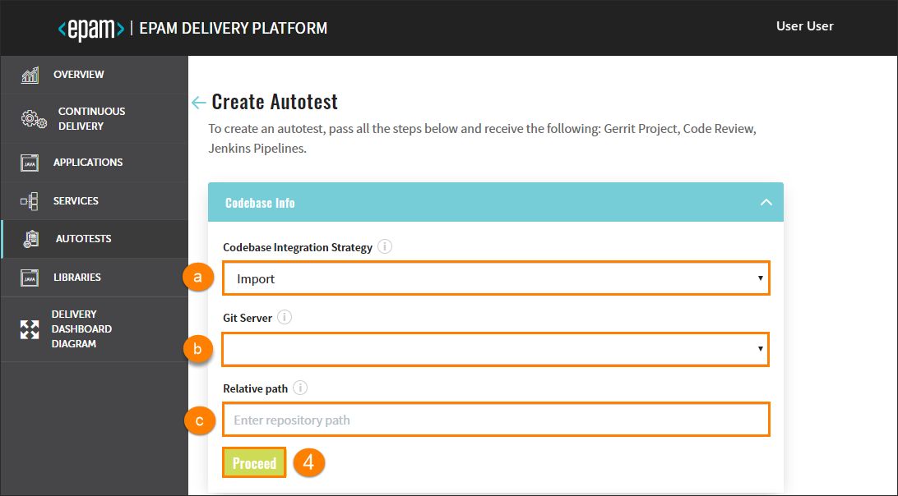
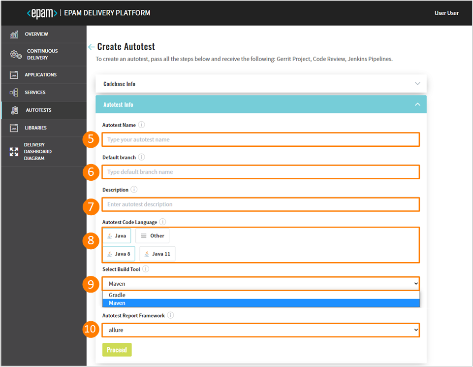
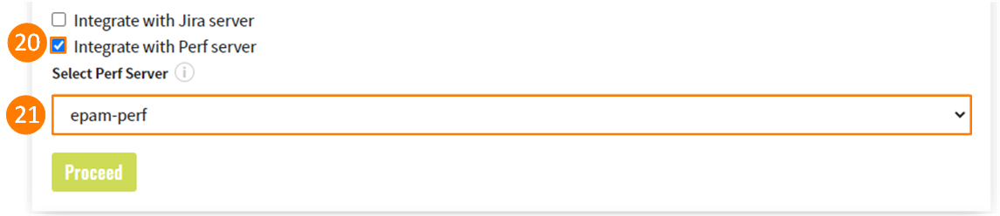

# Add Autotests

Admin Console enables to clone or import an autotest and add it to the environment with its subsequent deployment in Gerrit and building of the Code Review pipeline in Jenkins.

Navigate to the **Autotests** section on the left-side navigation bar and click the Create button.

Once clicked, the four-step menu will appear:

* The Codebase Info Menu
* The Autotest Info Menu
* The Advanced Settings Menu
* The Version Control System Info Menu

## The Codebase Info Menu

There are two available strategies: clone and import. The Clone strategy flow is displayed below:

1. **Clone** - this strategy allows cloning the autotest from the indicated repository into EPAM Delivery Platform. While cloning the existing repository, you have to fill in the additional fields as well.
2. In the **Git Repository URL** field, specify the link to the repository with the autotest.
3. Select the **Codebase Authentication** check box and fill in the requested fields:

  * Repository Login – enter your login data.
  * Repository password (or API Token) – enter your password or indicate the API Token.

  If there is a necessity to use the **Import** strategy that allows configuring a replication from the Git server, explore the steps below:

  

  a. Import - this strategy allows configuring a replication from the Git server.

  !!! note
        In order to use the import strategy, make sure to adjust it by following the [Adjust Import Strategy](../operator-guide/import-strategy.md) page.

    b. In the **Git Server** field, select the necessary Git server from the drop-down list.

    c. In the Relative path field, indicate the respective path to the repository, e.g. **/epmd-edp/examples/basic/edp-auto-tests-simple-example**.

4. After completing the Codebase Info menu step, click the Proceed button to be switched to the next menu.

## The Autotest Info Menu

5. Fill in the **Autotest Name** field by entering at least two characters and by using the lower-case letters, numbers and inner dashes.

  !!! info
      The Import strategy does not have an Autotest Name field.

6. Specify the name of the default branch where you want the development to be performed.

  !!! note
      The default branch cannot be deleted.

7. Type the necessary description in the **Description** field.

8. In the **Autotest Code Language** field, select the Java code language (specify Java 8 or Java 11 to be used) and get the default Maven build tool OR add another code language. Selecting **Other** allows extending the default code languages and get the necessary build tool, for details, inspect the [Add Other Code Language](add_other_code_language.md) section.

9. The **Select Build Tool** field can dispose of the default Maven tool, Gradle or other built tool in accordance with the selected code language.

10. All the autotest reports will be created in the Allure framework that is available In the **Autotest Report Framework** field by default. Click the Proceed button to be switched to the next menu.

## The Advanced Settings Menu

11. Select CI pipeline provisioner that will be used to handle a codebase. For details, refer to the [Add Job Provision](https://github.com/epam/edp-jenkins-operator/blob/master/documentation/add-job-provision.md#add-job-provision) instruction and become familiar with the main steps to add an additional job provisioner.

12. Select Jenkins slave that will be used to handle a codebase. For details, refer to the [Add Jenkins Slave](https://github.com/epam/edp-jenkins-operator/blob/master/documentation/add-jenkins-slave.md#add-jenkins-slave) instruction and inspect the steps that should be done to add a new Jenkins slave.

13. Select the necessary codebase versioning type:

  * **default** - the previous versioning logic that is realized in EDP Admin Console 2.2.0 and lower versions. Using the default versioning type, in order to specify the version of the current artifacts, images, and tags in the Version Control System, a developer should navigate to the corresponding file and change the version **manually**.

  * **edp** - the new versioning logic that is available in EDP Admin Console 2.3.0 and subsequent versions. Using the edp versioning type, a developer indicates the version number from which all the artifacts will be versioned and, as a result, **automatically** registered in the corresponding file (e.g. pom.xml).

  When selecting the edp versioning type, the extra field will appear:

  

  a. Type the version number from which you want the artifacts to be versioned.

  !!! note
      The Start Version From field should be filled out in compliance with the semantic versioning rules, e.g. 1.2.3 or 10.10.10.

14. In the **Select CI Tool** field, choose the necessary tool: Jenkins or GitLab CI, where Jenkins is the default tool and
    the GitLab CI tool can be additionally adjusted. For details, please refer to the [Adjust GitLab CI Tool](../operator-guide/gitlabci-integration.md) page.

  !!! note
      The GitLab CI tool is available only with the Import strategy and makes the **Jira integration** feature unavailable.

  

15. Select the **Integrate with Jira Server** checkbox in case it is required to connect Jira tickets with the commits and have a respective label in the Fix Version field.

  !!! note
      To adjust the Jira integration functionality, first apply the necessary changes described on the [Adjust Integration With Jira Server](../operator-guide/jira-integration.md) page, and setup the [VCS Integration With Jira Server](../operator-guide/jira-gerrit-integration.md). Pay attention that the Jira integration feature is not available when using the GitLab CI tool.

16. As soon as the Jira server is set, select it in the **Select Jira Server** field.

17. Indicate the pattern using any character, which is followed on the project, to validate a commit message.

18. Indicate the pattern using any character, which is followed on the project, to find a Jira ticket number in a commit message.

19. In the **Advanced Mapping** section, specify the names of the Jira fields that should be filled in with attributes from EDP. Upon clicking the question mark icon, observe the tips on how to indicate and combine variables necessary for identifying the format of values to be displayed.

  

  a. Select the name of the field in a Jira ticket. The available fields are the following: **Fix Version/s**, **Component/s** and **Labels**.

  b. Select the pattern of predefined variables, based on which the value from EDP will be displayed in Jira. Combine several variables to obtain the desired value.

  * For the **Fix Version/s** field, select the **EDP_VERSION** variable that represents an EDP upgrade version, as in _2.7.0-SNAPSHOT_. Combine variables to make the value more informative. For example, the pattern **EDP_VERSION-EDP_COMPONENT** will be displayed as _2.7.0-SNAPSHOT-nexus-operator_ in Jira;

  * For the **Component/s** field, select the **EDP_COMPONENT** variable that defines the name of the existing repository. For example, _nexus-operator_;

  * For the **Labels** field, select the **EDP_GITTAG** variable that defines a tag assigned to the commit in GitHub. For example, _build/2.7.0-SNAPSHOT.59_.

  c. Click the plus icon to add more Jira field names.

  d. Click the delete icon to remove the Jira field name.

  

20. Select the **Integrate with Perf Server** checkbox in case it is required to connect to the [PERF Board](https://kb.epam.com/display/EPMDMO/Project+Performance+Board) (_Project Performance Board_).
    Such functionality allows monitoring the overall team performance and setting up necessary metrics.

  !!! note
      To adjust the Perf Server integration functionality, first deploy Perf Operator. To get more information about the Perf Operator installation and architecture, please refer to the [PERF Operator](https://github.com/epam/edp-perf-operator#perf-operator) page.

21. In the **Select Perf Server** field, select the name of the Perf server with which the integration should be performed and click the Proceed button to be switched to the next menu.

  

22. Select the necessary DataSource (_Jenkins/GitLab, Sonar_) from which the data should be transferred to the Project Performance Board.

23. Click the Create button to create an autotest or click the Proceed button to be switched to the next VCS menu that can be predefined.

## The Version Control System Info Menu

Once navigated to the VCS Info menu, perform the following:

24. Enter the login credentials into the **VCS Login** field.

25. Enter the password into the **VCS Password (or API Token)** field OR add the API Token.

26. Click the Create button, check the CONFIRMATION summary, click Continue to add an autotest to the Autotests list.

!!! note
    After the complete adding of the autotest, inspect the [Autotest Overview](autotest.md) part.

### Related Articles

* [Autotest Overview](autotest.md)
* [Delivery Dashboard Diagram](d-d-diagram.md)

---

* [Add CD Pipelines](add-cd-pipeline.md)
* [Adjust Integration With Jira Server](../operator-guide/jira-integration.md)
* [Adjust VCS Integration With Jira Server](../operator-guide/jira-gerrit-integration.md)
