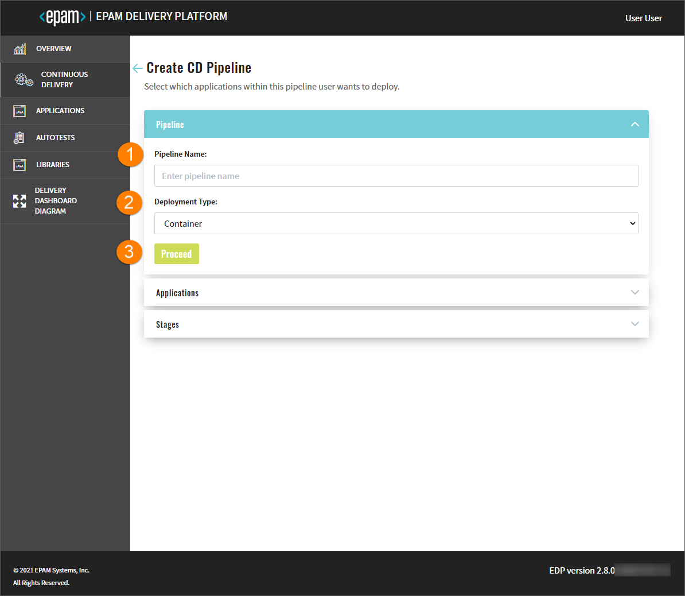
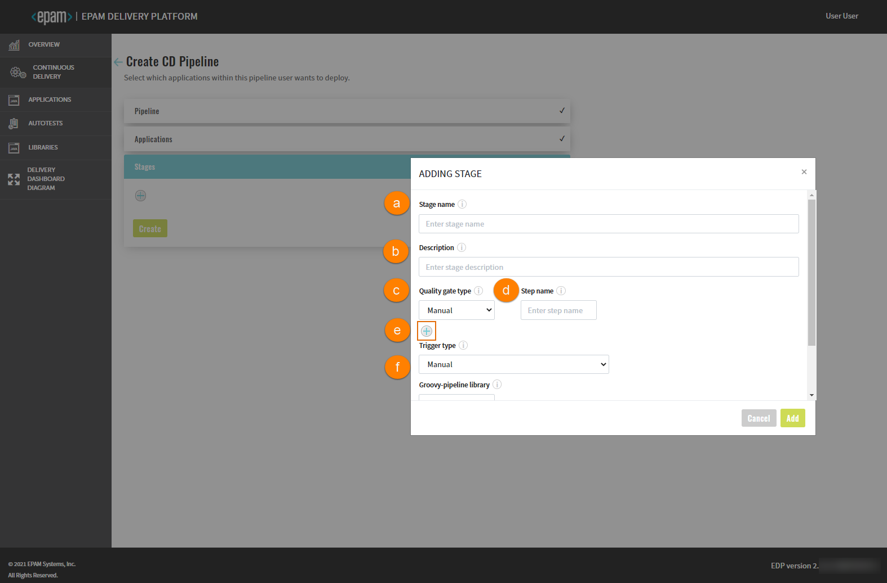
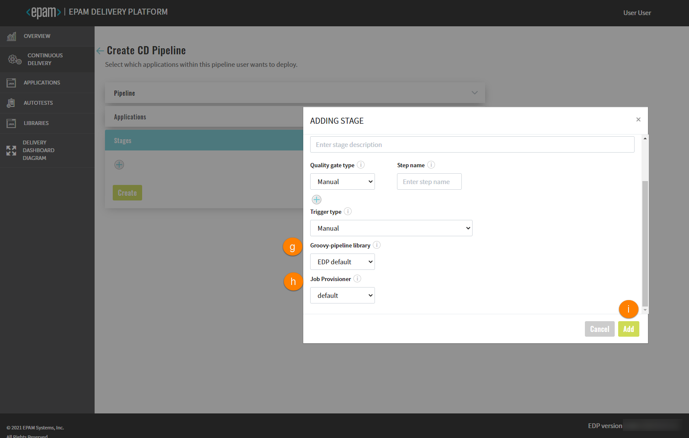
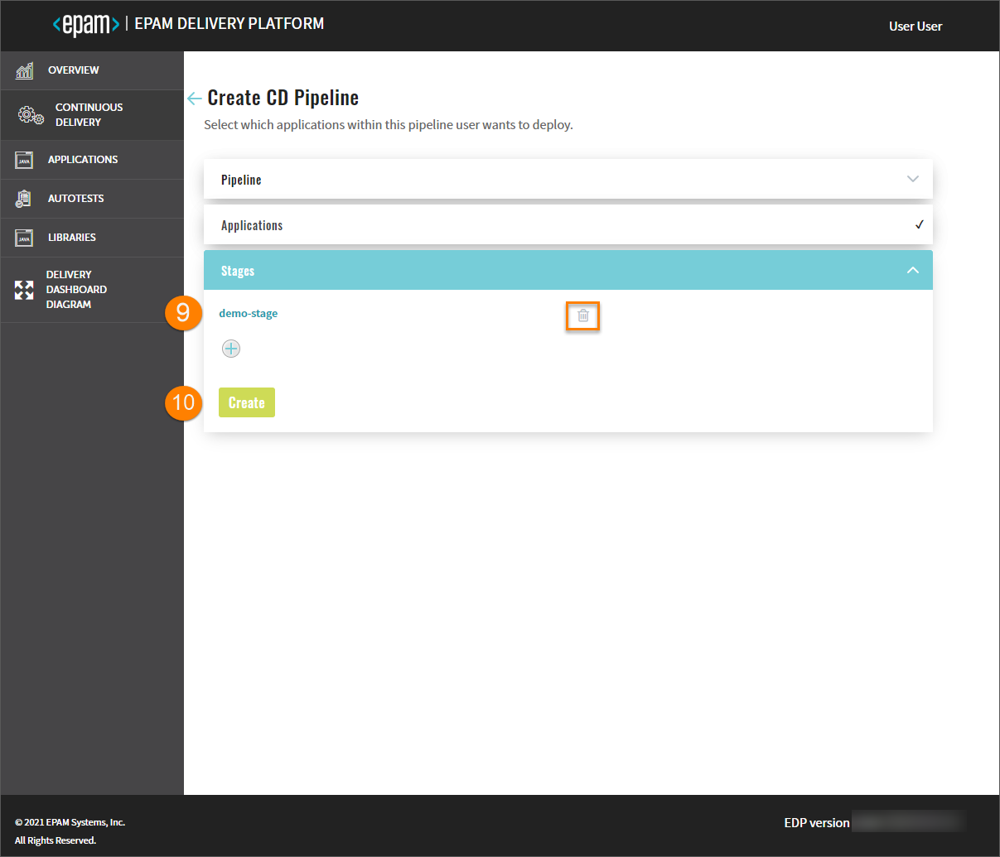
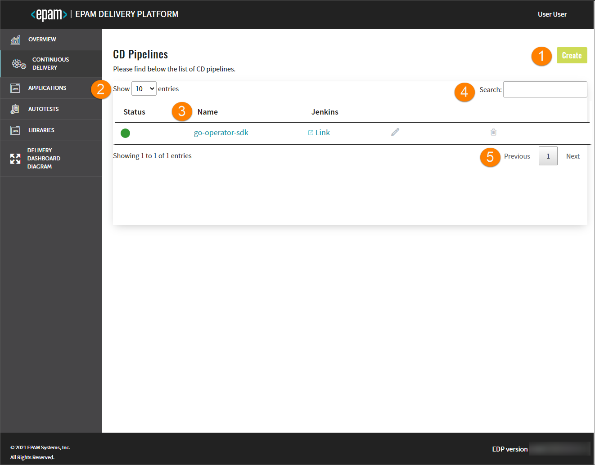
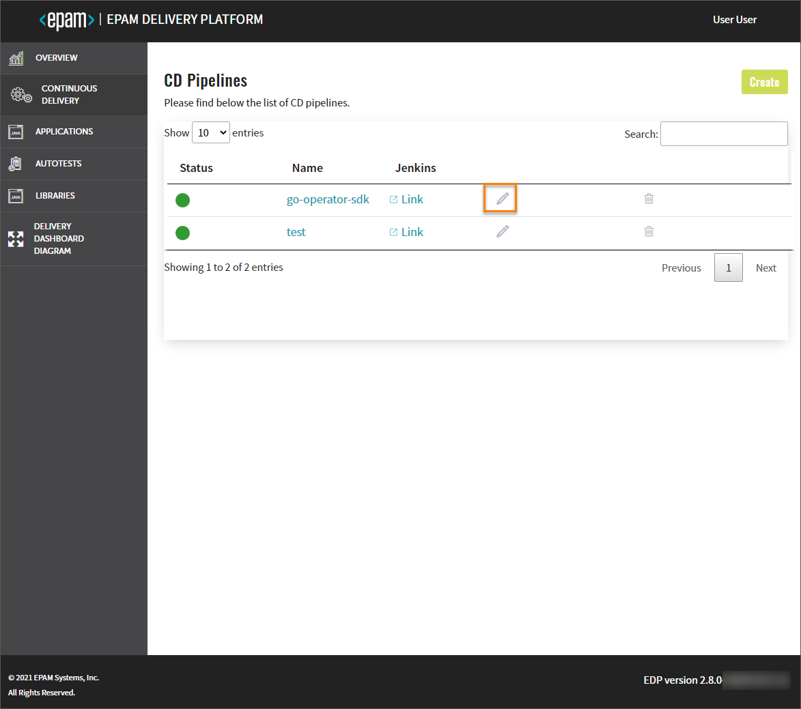
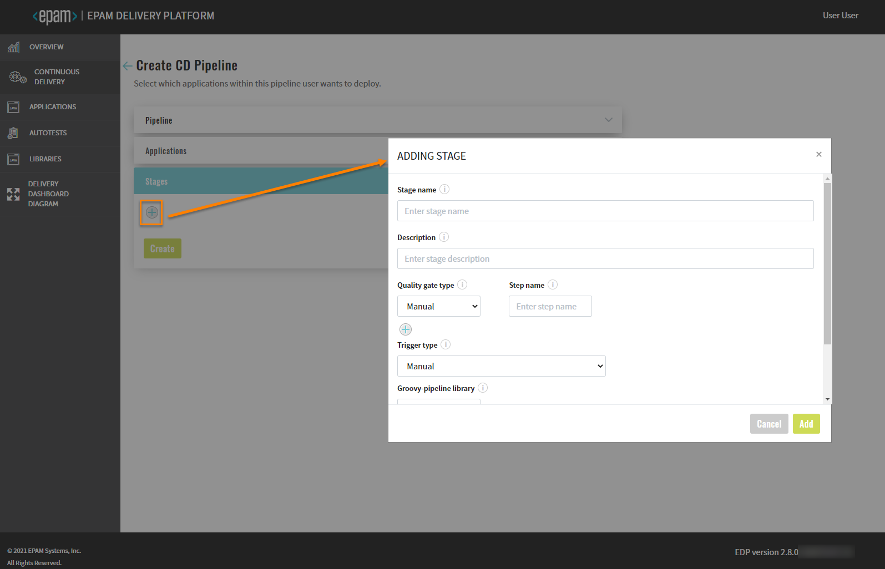
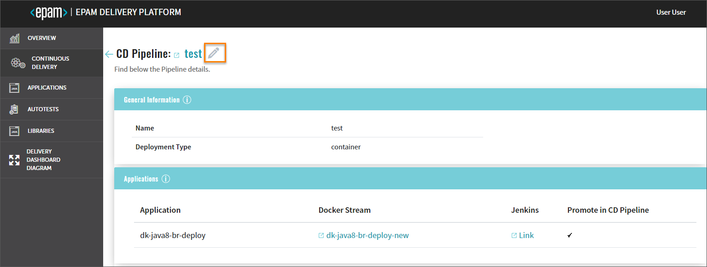
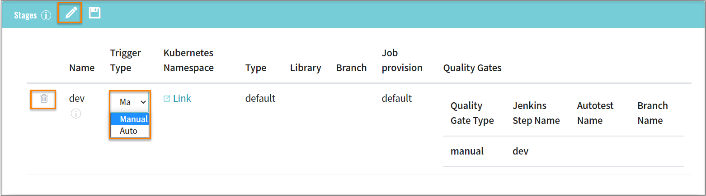
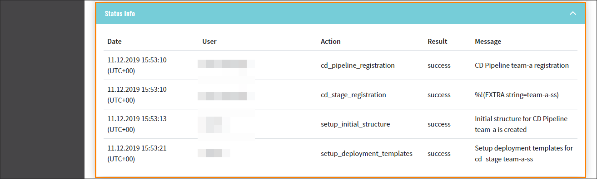

# Add CD pipeline

Admin Console provides the ability to deploy an environment on your own and specify the essential components as well.

Navigate to the **Continuous Delivery** section on the left-side navigation bar and click the Create button.
Once clicked, the four-step menu will appear:

* The Pipeline Menu
* The Applications Menu
* The Stages Menu

The creation of the CD pipeline becomes available as soon as an application is created including its provisioning
in a branch and the necessary entities for the environment.

After the complete adding of the CD pipeline, inspect the [Check CD Pipeline Availability](#check-cd-pipeline-availability)
part.

## The Pipeline Menu

1. Type the name of the pipeline in the **Pipeline Name** field by entering at least two characters and by using
the lower-case letters, numbers and inner dashes.

  !!! note
      The namespace created by the CD pipeline has the following pattern combination: **[cluster name]-[cd pipeline name]-[stage name]**.
      Please be aware that the namespace length should not exceed 63 symbols.
    
2. Select the deployment type from the drop-down list:
  * Container - the pipeline will be deployed in a Docker container;
  * Custom - this mode allows to deploy non-container applications and customize the Init stage of CD pipeline.

3. Click the Proceed button to be switched to the next menu.

  ## The Applications Menu

  

4. Select the check box of the necessary application in the **Applications** menu.
5. Specify the necessary codebase Docker stream (the output for the branch and other stages from other CD pipelines)
from the drop-down menu.
6. Select the **Promote in pipeline** check box in order to transfer the application from one to another stage
by the specified codebase Docker stream. If the Promote in pipeline check box is not selected,
the same codebase Docker stream will be deployed regardless of the stage, i.e. the codebase Docker stream input,
which was selected for the pipeline, will be always used.

  !!! note
      The newly created CD pipeline has the following pattern combination: [pipeline name]-[branch name].
      If there is another deployed CD pipeline stage with the respective codebase Docker stream (= image stream as an OpenShift term),
      the pattern combination will be as follows: [pipeline name]-[stage name]-[application name]-[verified].

7. Click the Proceed button to be switched to the next menu.

  ## The Stages Menu

  

8. Click the plus sign icon in the **Stages** menu and fill in the necessary fields in the Adding Stage window:

  

  a. Type the stage name;

  !!! note
      The namespace created by the CD pipeline has the following pattern combination: **[cluster name]-[cd pipeline name]-[stage name]**.
      Please be aware that the namespace length should not exceed 63 symbols.

  b. Enter the description for this stage;

  c. Select the quality gate type:

  * Manual - means that the promoting process should be confirmed in Jenkins manually;
  * Autotests - means that the promoting process should be confirmed by the successful passing of the autotests.
  In the additional fields, select the previously created autotest name and specify its branch for the autotest
  that will be launched on the current stage.

  d. Type the step name, which will be displayed in Jenkins, for every quality gate type;
  
  e. Add an unlimited number of quality gates by clicking a corresponding plus sign icon and remove them as well
  by clicking the recycle bin icon;

  f. Select the trigger type that allows promoting images to the next environment. The available trigger types are
  _manual_ and _auto_. By selecting the _auto_ trigger type, the CD pipeline will be launched automatically.

  !!! info
      Add an unlimited number of quality gates by clicking a corresponding plus sign icon and remove them as well
      by clicking the recycle bin icon.

  !!! note
      Execution sequence. The image promotion and execution of the pipelines depend on the sequence in which
      the environments are added.

  

  g. Select the groovy-pipeline library;

  h. Select the job provisioner. In case of working with non container-based applications, there is an option to use
   a custom job provisioner. Please refer to the [Add Job Provision](../operator-guide/manage-jenkins-cd-job-provision.md)
   page for details.

  i. Click the Add button to display it in the Stages menu.

  !!! info
      Perform the same steps as described above if there is a necessity to add one more stage.

9. Click the Add button to display it in the Stages menu:

  !!! info
      Perform the same steps as described above if there is a necessity to add one more stage.

  

9. Edit the stage by clicking its name and applying changes, and remove the added stage by clicking the recycle bin icon
next to its name.

10. Click the Create button to start the provisioning of the pipeline. After the CD pipeline is added, the new project
with the stage name will be created in OpenShift.

## Check CD Pipeline Availability

As soon as the CD pipeline is provisioned and added to the CD Pipelines list, there is an ability to:

  

1. Create another application by clicking the Create button and performing the same steps as described
in the [Add CD Pipeline](#add-cd-pipeline) section.

2. Select a number of existing CD pipelines to be displayed on one page in the **Show entries** field.
The filter allows to show 10, 25, 50 or 100 entries per page.

3. Sort the existing CD pipelines in a list by clicking the Name title. The CD pipelines will be displayed
in alphabetical order.

4. Search the necessary CD pipeline by entering the corresponding name, language or the build tool into the **Search** field.

5. Navigate between pages if the number of CD pipelines exceeds the capacity of a single page.

### Edit CD Pipeline

* Edit the CD pipeline by clicking the pen icon next to its name in the CD Pipelines list:

  

  * apply the necessary changes and click the Proceed button to confirm the editions:

   

  * add new extra stages steps by clicking the plus sign icon and filling in the necessary fields
  in the [Adding Stage](#adding_stage_window) window.

   

  !!! note
      The added stage will appear in the Stages menu allowing to review its details or delete.

* Check the CD pipeline data and details by clicking the CD pipeline name in the CD Pipelines list:

  

  * the main link on the top of the details page refers to Jenkins;

  

  * the pen icon refers to the same **Edit CD Pipeline** page as mentioned above and allows to apply the necessary changes;

  * the Applications menu has the main information about the applications with the respective codebase Docker streams
and links to Jenkins and Gerrit as well as the signification of the promotion in CD pipeline;

  * the Stages menu includes the stages data that was previously mentioned, the direct links to the respective to every
stage OpenShift page, and the link to the Autotest details page in case there are added autotests. To enable or disable
auto deployment of a specific stage, click the pen icon and select the necessary trigger type from the drop-down list.

  

  !!! note
      The deletion of stages is performed sequentially, starting from the latest created stage.
      In order to **remove a stage**, click the corresponding delete icon, type the CD pipeline name and confirm
      the deletion by clicking the Delete button. If you remove the last stage, the whole CD pipeline will be removed
      as the CD pipeline does not exist without stages.

  * the Deployed Version menu indicates the applications and stages with the appropriate status. The status will be changed
after stage deployment.

  

  * the Status Info menu displays all the actions that were performed during the deployment process:

  

* Remove the added CD pipeline:

  

  !!! info
      If there is a necessity to create another CD pipeline, navigate to the Continuous Delivery section,
      click the Create button and perform the same steps as described above.

  !!! info
      In OpenShift, if the deployment fails with the ImagePullBackOff error, delete the POD.

## Related Articles

* [EDP Admin Console](https://github.com/epam/edp-admin-console#edp-admin-console)
* [Delivery Dashboard Diagram](d-d-diagram.md)
