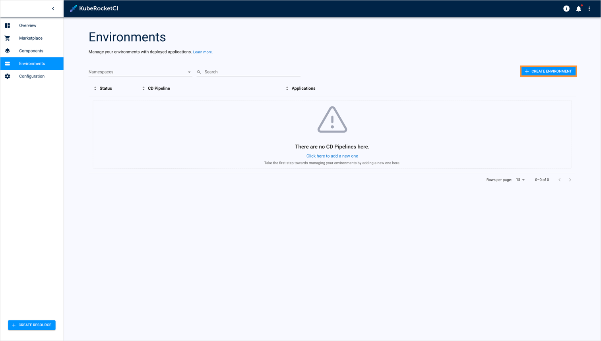

# Add Environment

Portal provides the ability to deploy an environment on your own and specify the essential components.

Navigate to the **Environments** section on the navigation bar and click **Create** (the plus sign icon on the right side of the screen). Once clicked, the **Create CD Pipeline** dialog will appear.

The creation of the environment becomes available as soon as an application is created including its provisioning
in a branch and the necessary entities for the environment. You can create the environment [in YAML](#YAML) or [via the three-step menu](#menu) in the dialog.

[//]: # (After the complete adding of the CD pipeline, inspect the [Check CD Pipeline Availability]&#40;#check-cd-pipeline-availability&#41;)

[//]: # (part.)

## Create Environment in YAML 
Click **Edit YAML** in the upper-right corner of the **Create CD Pipeline** dialog to open the YAML editor and create the environment.

!

To edit YAML in the minimal editor, turn on the **Use minimal editor** toggle in the upper-right corner of the **Create CD Pipeline** dialog.

To save the changes, select the **Save & Apply** button.

## Create Environment in the Dialog 
The **Create CD Pipeline** dialog contains the three steps:

* The Pipeline Menu
* The Applications Menu
* The Stages Menu

### The Pipeline Menu

To create an environment, follow the steps below:

1. Navigate to **EDP** -> **Environments** and click the **+ Create** button:

  !

2. The **Pipeline** tab of the **Create CD Pipeline** menu is presented below:

  !

  1. Enter the Environment name that will be displayed in the Environments list.

  2. Select the Deployment type. It can be either container or custom.

  3. Click the **Proceed** button to move onto the **Applications** tab.

3. Type the name of the pipeline in the **Pipeline Name** field by entering at least two characters and by using
the lower-case letters, numbers and inner dashes.

  !!! note
      The namespace created by the environment has the following pattern combination: **[edp namespace]-[environment name]-[stage name]**.
      Please be aware that the namespace length should not exceed 63 symbols.

4. Select the deployment type from the drop-down list:

  * Container - the pipeline will be deployed in a Docker container;
  * Custom - this mode allows to deploy non-container applications and customize the Init stage of environment.

5. Click the **Proceed** button to switch to the next menu.

### The Applications Menu

The **Pipeline** tab of the **Create CD Pipeline** menu is presented below:

  !

1. Select the necessary application from the **Mapping field name** drop-down menu.
2. Select the plus sign icon near the selected application to specify the necessary codebase Docker branch for the application (the output for the branch and other stages from other environments).
3. Select the application branch from the drop-down menu.
4. Select the **Promote in pipeline** check box in order to transfer the application from one to another stage
  by the specified codebase Docker branch. If the **Promote in pipeline** check box is not selected,
  the same codebase Docker stream will be deployed regardless of the stage, i.e. the codebase Docker stream input,
  which was selected for the pipeline, will always be used.

  !!! note
      If there is another deployed environment stage with the respective codebase Docker stream (= image stream as an OpenShift term),
      the pattern combination will be as follows: [pipeline name]-[stage name]-[application name]-[verified].

5. Click the **Proceed** button to switch to the next menu.

### The Stages Menu

Stages are created the following way:

1. On the **Stages** menu, click the **Add Stage** button and fill in the necessary fields in the Adding Stage window :

  !

  !

  a. Choose the cluster to deploy the stage;

  b. Enter the stage name;

  c. Enter the description for this stage;

  d. Select the trigger type. The key benefit of the automatic deploy feature is to keep environments up-to-date. The available trigger types are _Manual_ and _Auto_. When the _Auto_ trigger type is chosen, the environment will initiate automatically once the image is built. _Manual_ implies that user has to perform deploy manually by clicking the **Deploy** button in the environment menu. Please refer to the [Architecture Scheme of CD Pipeline Operator](https://github.com/epam/edp-cd-pipeline-operator/blob/master/docs/arch.md) page for additional details.

  !!! note
      Automatic deploy will start working only after the first manual deploy.

  e. Select the quality gate type:

  * Manual - means that the promoting process should be confirmed in Tekton manually;
  * Autotests - means that the promoting process should be confirmed by the successful passing of the autotests.

  f. Type the step name, which will be displayed in Tekton, for every quality gate;

  g. Add an unlimited number of quality gates by clicking the **Add** button and remove them as well
  by clicking the recycle bin icon;

  In the additional fields, select the previously created [autotest](add-autotest.md) name (h) and specify its branch for the autotest
  that will be launched on the current stage (i).

  !!! note
      Execution sequence. The image promotion and execution of the pipelines depend on the sequence in which
      the environments are added.

  j. Click the **Apply** button to display the stage in the Stages menu.

  !

2. Edit the stage by clicking its name and applying changes, and remove the added stage by clicking the recycle bin icon
   next to its name.

3. Click the **Apply** button to start the provisioning of the pipeline.

As a result, a new environment will be created in the environments list.

## Related Articles

* [Manage Environments](../user-guide/manage-environments.md)
* [Add Quality Gate](../user-guide/add-quality-gate.md)
