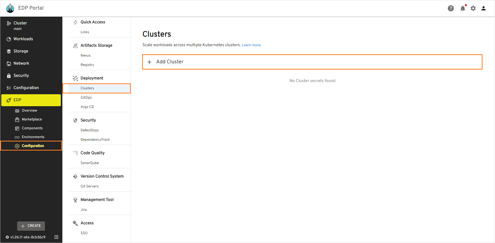
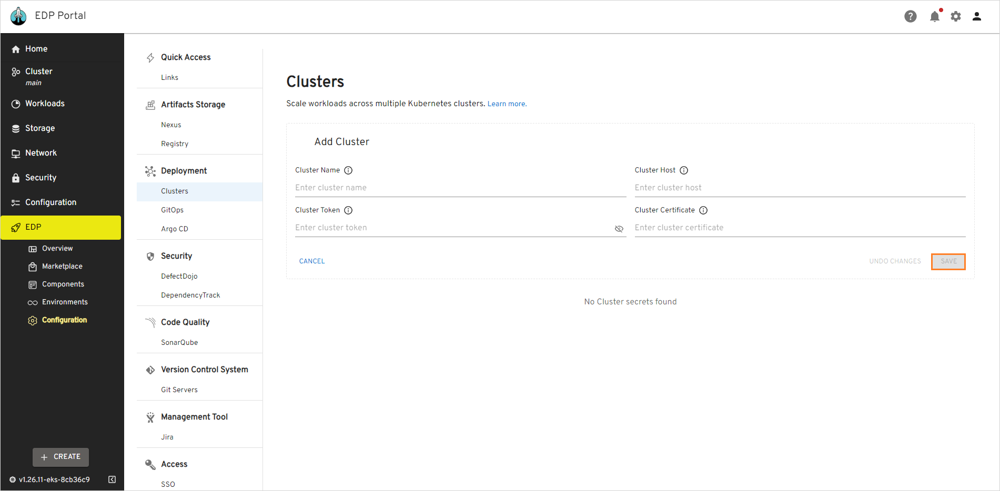

# Add Cluster

Adding other clusters allows deploying applications to several clusters when creating a stage of CD pipeline in EDP Portal.

!!! note
    Before proceeding with the content on this documentation page, it's essential to ensure that Argo CD is integrated into the same cluster with an identical name. At present, EDP operates with the shared Argo CD, necessitating the copying of the secret to the namespace where Argo CD is installed. The command sample is below:
    ```bash
    kubectl get secret <SECRET_NAME> --namespace=edp -o yaml | sed 's/namespace: .*/namespace: argocd/' | kubectl apply -f -
    ```

To add a cluster, follow the steps below:

1. Navigate to the `EDP` -> `Configuration` -> `Clusters` and click the **+ Add cluster** button:

  !

2. In the drop-down window, specify the required fields:

  * **Cluster Name** - a unique and descriptive name for the new cluster;
  * **Cluster Host** - the cluster’s endpoint URL (e.g., example-cluster-domain.com);
  * **Cluster Token** - a Kubernetes token with permissions to access the cluster. This token is required for proper authorization;
  * **Cluster Certificate** - a Kubernetes certificate essential for authentication. Obtain this certificate from the configuration file of the user account you intend to use for accessing the cluster.

    !

3. Click the **Apply** button to add the cluster.

As a result, the [Kubernetes secret](https://argo-cd.readthedocs.io/en/stable/operator-manual/declarative-setup/#clusters) will be created for further integration and you will be able to select the integrated cluster when creating a new stage:

  !

## Related Articles

* [Add Application](add-application.md)
* [Add Library](add-library.md)
* [Add Autotest](add-autotest.md)
* [Add CD Pipeline](add-cd-pipeline.md)
