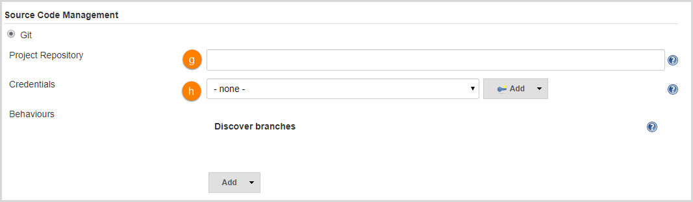

# Add a Custom Global Pipeline Library

In order to add a new custom global pipeline library, perform the steps below:

1. Navigate to Jenkins and go to *Manage Jenkins -> Configure System -> Global Pipeline Libraries*.

  !!! note
      It is possible to configure as many libraries as necessary. Since these libraries will be globally usable, any pipeline in the system can utilize the functionality implemented in these libraries.

2. Specify the following values:

  

  a - The name of a custom library;

  b - The version which can be branched, tagged or hashed of a commit;

  c - Allows pipelines the immediate using of classes or global variables defined by any libraries;

  d - Allows using the default version of the configured shared-library when the **Load implicitly** check box is selected;

  e - Allows using the default version of the configured shared-library if the pipeline references to the library only by the name, for example, `@Library('my-shared-library')`.

  !!! note
      If the **Default version** check box is **not defined**, the pipeline must specify a version, for example, `@Library('my-shared-library@master')`. If the **Allow default version to be overridden** check box is enabled in the Shared Library’s configuration, a @Library annotation may also override the default version defined for the library. This also enables the library with the selected **Load implicitly** check box to be loaded from a different version if necessary.

  

  f - The URL of the repository;

  g - The credentials for the repository.

3. Use the Custom Global Pipeline Libraries on the pipeline, for example:

**Pipeline**

```java
@Library(['edp-library-stages', 'edp-library-pipelines', 'edp-custom-shared-library-name'])_

Build()
```
!!! note
    `edp-custom-shared-library-name` is the name of the Custom Global Pipeline Library that should be added to the Jenkins Global Settings.

### Related Articles

* [Jenkins Official Documentation: Extending with Shared Libraries](https://www.jenkins.io/doc/book/pipeline/shared-libraries/)
