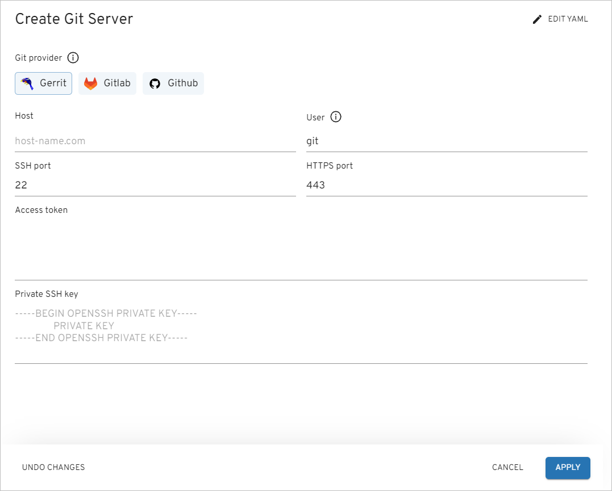

# Add Git Server

To add a Git server, navigate to the **Git servers** section on the navigation bar and click **Create** (the plus sign icon in the lower-right corner of the screen). Once clicked, the **Create Git server** dialog will appear. You can create a Git server [in YAML](#YAML) or [via the three-step menu](#menu) in the dialog.

## Create Git Server in YAML 

Click **Edit YAML** in the upper-right corner of the **Create Git server** dialog to open the YAML editor and create a Git server.

!

To edit YAML in the minimal editor, turn on the **Use minimal editor** toggle in the upper-right corner of the **Create Git server** dialog.

To save the changes, select the **Save & Apply** button.

## Create Git Server in the Dialog 

Fill in the following fields:

!

* *Git provider* - select *Gerrit*, *GitLab* or *GitHub*.
* *Host* - enter a Git server endpoint.
* *User* - enter a user for Git integration.
* *SSH port* - enter a Git SSH port.
* *HTTPS port* - enter a Git HTTPS port.
* *Private SSH key* - enter a private SSH key for Git integration.
* *Access token* - enter an access token for Git integration. To generate this token, go to GitLab/GitHub account -> *Settings* -> *SSH and GPG keys* -> select *New SSH key* and add SSH key.

Click the **Apply** button to add the Git server to the Git servers list. As a result, the Git Server object and the corresponding secret for further integration will be created.

## Related Articles

* [Integrate GitHub/GitLab in Tekton](../operator-guide/import-strategy-tekton.md)
