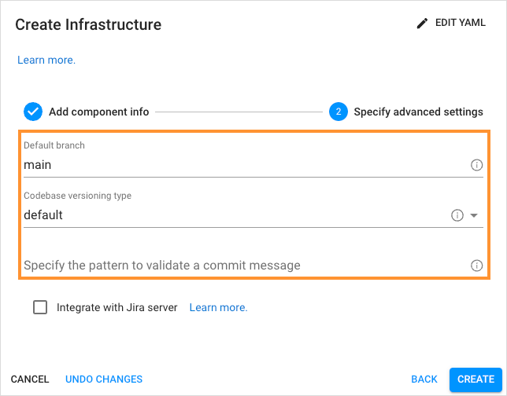
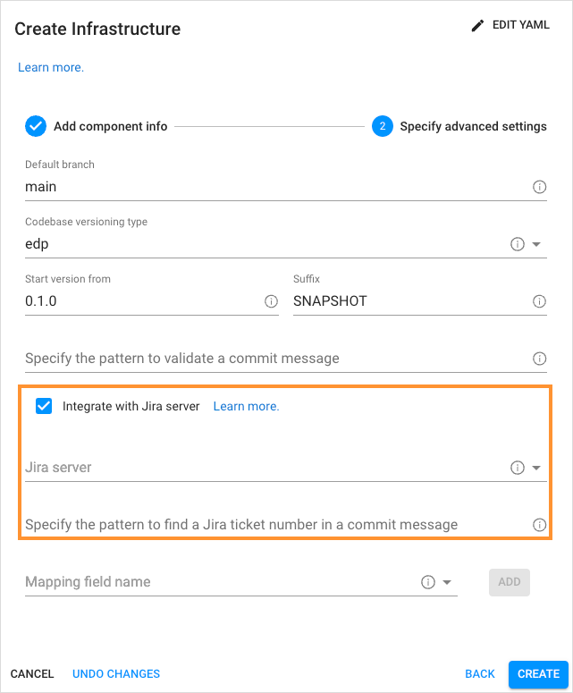

# Add Infrastructure

EDP Portal allows to create, clone and import an infrastructure. Its functionality is to create resources in cloud provider.

To add an application, navigate to the **Components** section on the navigation bar and click **Create** (the plus sign icon in the lower-right corner of the screen). Once clicked, the **Create new component** dialog will appear, then select **Application** and choose one of the strategies which will be described later in this page. You can create an Application [in YAML](#YAML) or [via the two-step menu](#menu) in the dialog.

## Create Infrastructure in YAML 

Click **Edit YAML** in the upper-right corner of the **Create Infrastructure** dialog to open the YAML editor and create the Infrastructure.

!

To edit YAML in the minimal editor, turn on the **Use minimal editor** toggle in the upper-right corner of the **Create Infrastructure** dialog.

To save the changes, select the **Save & Apply** button.

## Create Infrastructure via UI 

The **Create Infrastructure** dialog contains the two steps:

* The Codebase Info Menu
* The Advanced Settings Menu

### Codebase Info Menu

Follow the instructions below to fill in the fields of the **Codebase Info** menu:

1. In the **Create new component** menu, select **Infrastructure**:

   !

2. Select the necessary configuration strategy:

* **Create from template** – creates a project on the pattern in accordance with an infrastructure language, a build tool, and a framework.

* **Import project** - allows configuring a replication from the Git server. While importing the existing repository, select the Git server from the drop-down list and define the relative path to the repository, such as */epmd-edp/examples/basic/edp-auto-tests-simple-example*.

  !!! note
      In order to use the **Import project** strategy, make sure to adjust it with the [Integrate GitLab/GitHub With Jenkins](../operator-guide/import-strategy-jenkins.md) or [Integrate GitLab/GitHub With Tekton](../operator-guide/import-strategy-tekton.md) page.

* **Clone project** – clones the indicated repository into EPAM Delivery Platform. While cloning the existing repository, it is required to fill in the **Repository URL** field as well:

  In our example, we will use the **Create from template** strategy:

  !

  1. Select the **Git server** from the drop-down list and define the **Git repo relative path** to the repository, such as `/epmd-edp/examples/basic/edp-auto-tests-simple-example`.

  2. Type the name of the infrastructure in the **Component name** field by entering at least two characters and by using the lower-case letters, numbers and inner dashes.

  3. Write the description in the **Description** field.

  4. To create an application with an empty repository in Gerrit, select the **Empty project** check box.

  5. Select any of the supported application languages with their providers in the **Infrastructure Code Language** field. So far, only HCL is supported.

    !!! note
        The **Create from template** strategy does not allow to customize the default code language set.

  6. Select necessary **Language version/framework** depending on the **Infrastructure code language** field. So far, only AWS is supported.

  7. Choose the necessary build tool in the **Build Tool** field. So far, only Terraform is supported.\

    !!! note
        The **Select Build Tool** field disposes of the default tools and can be changed in accordance with the selected code language.

  ### Advanced Settings Menu

The **Advanced Settings** menu should look similar to the picture below:

  !

Follow the instructions below to fill in the fields of the **Advanced Setting** menu:

a. Specify the name of the **Default branch** where you want the development to be performed.

!!! note
    The default branch cannot be deleted. For the **Clone project** and **Import project** strategies: if you want to use the existing branch, enter its name into this field.

b. Select the necessary codebase versioning type:

* **default** - using the default versioning type, in order to specify the version of the current artifacts, images,
and tags in the Version Control System, a developer should navigate to the corresponding file
and change the version **manually**.

* **edp** - using the edp versioning type, a developer indicates the version number that will be used for all the artifacts stored
in artifactory: binaries, pom.xml, metadata, etc. The version stored in repository (e.g. pom.xml) will not be affected or used.
Using this versioning overrides any version stored in the repository files without changing actual file.

  When selecting the edp versioning type, the extra field will appear:

  !

Type the version number from which you want the artifacts to be versioned.

!!! note
    The **Start Version From** field should be filled out in compliance with the semantic versioning rules, e.g. 1.2.3 or 10.10.10. Please refer to the [Semantic Versioning](https://semver.org/) page for details.

c. Specify the pattern to validate a commit message. Use regular expression to indicate the pattern that is followed on the project to validate a commit message in the code review pipeline. An example of the pattern: `^[PROJECT_NAME-d{4}]:.*$`.

  !

d. Select the **Integrate with Jira Server** check box in case it is required to connect Jira tickets with the commits and have a respective label in the Fix Version field.

!!! note
    To adjust the Jira integration functionality, first apply the necessary changes described on the [Adjust Jira Integration](../operator-guide/jira-integration.md) page, and setup the [Adjust VCS Integration With Jira](../operator-guide/jira-gerrit-integration.md). Pay attention that the Jira integration feature is not available when using the GitLab CI tool.

e. In the **Jira Server** field, select the Jira server.

f. Specify the pattern to find a Jira ticket number in a commit message. Based on this pattern, the value from EDP will be displayed in Jira. Combine several variables to obtain the desired value.

!!! note
    The GitLab CI tool is available only with the **Import** strategy and makes the **Jira integration** feature unavailable.

  !

g. In the **Mapping field name** section, specify the names of the Jira fields that should be filled in with attributes from EDP:

1. Select the name of the field in a Jira ticket from the **Mapping field name** drop-down menu. The available fields are the following: *Fix Version/s*, *Component/s* and *Labels*.

2. Click the **Add** button to add the mapping field name.

3. Enter Jira pattern for the field name:

  * For the **Fix Version/s** field, select the **EDP_VERSION** variable that represents an EDP upgrade version,
  as in _2.7.0-SNAPSHOT_. Combine variables to make the value more informative. For example, the pattern **EDP_VERSION-EDP_COMPONENT** will be displayed as _2.7.0-SNAPSHOT-nexus-operator_ in Jira.
  * For the **Component/s** field, select the **EDP_COMPONENT** variable that defines the name of the existing repository. For example, _nexus-operator_.
  * For the **Labels** field, select the **EDP_GITTAG** variable that defines a tag assigned to the commit in GitHub. For example, _build/2.7.0-SNAPSHOT.59_.

4. Click the bin icon to remove the Jira field name.

h. Click the **Apply** button to add the application to the Applications list.

!!! note
    After the complete adding of the application, inspect the [Application Overview](application.md) part.

!!! note
    Since EDP v3.3.0, the **CI tool** field has been hidden. Now EDP Portal automatically defines the CI tool depending on which one is deployed with EDP. If both Jenkins and Tekton are deployed, EDP Portal chooses Tekton by default. To define the CI tool manually, operate with the **spec.ciTool** parameters.

## Related Articles

* [Application Overview](application.md)
* [Add CD Pipelines](add-cd-pipeline.md)
* [Add Other Code Language](../operator-guide/add-other-code-language.md)
* [Adjust Jira Integration](../operator-guide/jira-integration.md)
* [Adjust VCS Integration With Jira](../operator-guide/jira-gerrit-integration.md)
* [Enable VCS Import Strategy](../operator-guide/import-strategy.md)
* [Manage Jenkins CI Pipeline Job Provisioner](../operator-guide/manage-jenkins-ci-job-provision.md)
* [Manage Jenkins Agent](../operator-guide/add-jenkins-agent.md)
* [Perf Server Integration](../operator-guide/perf-integration.md)
