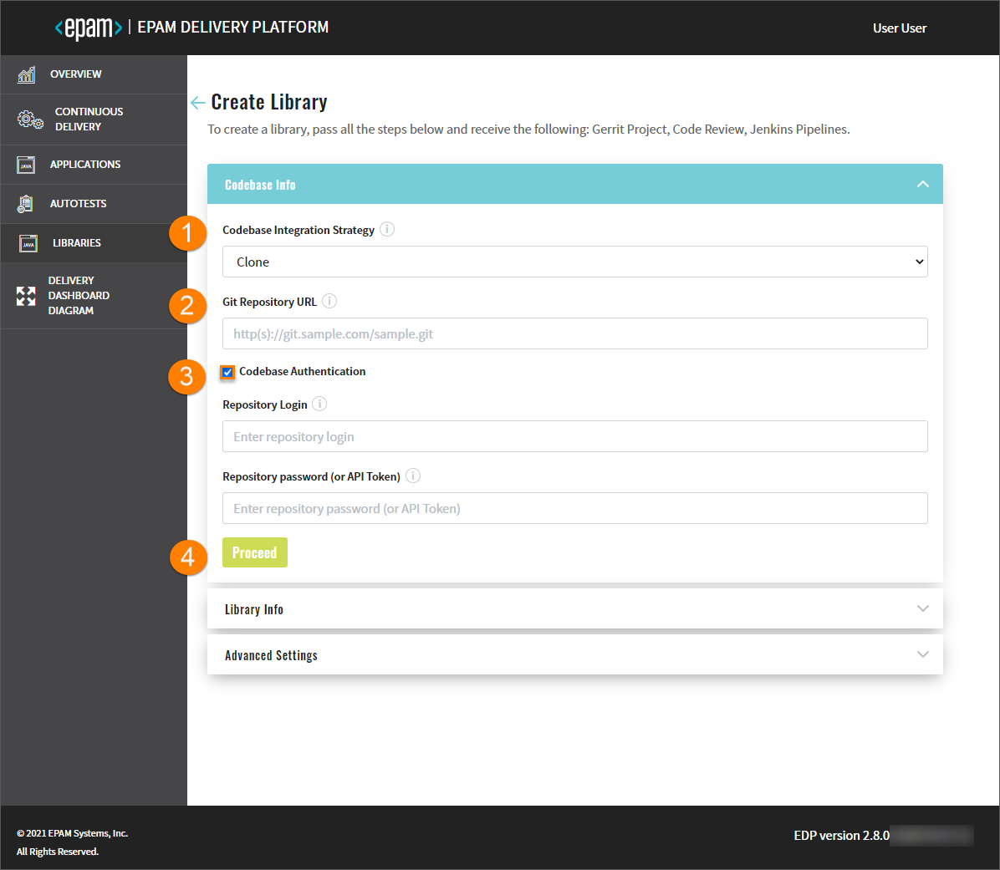
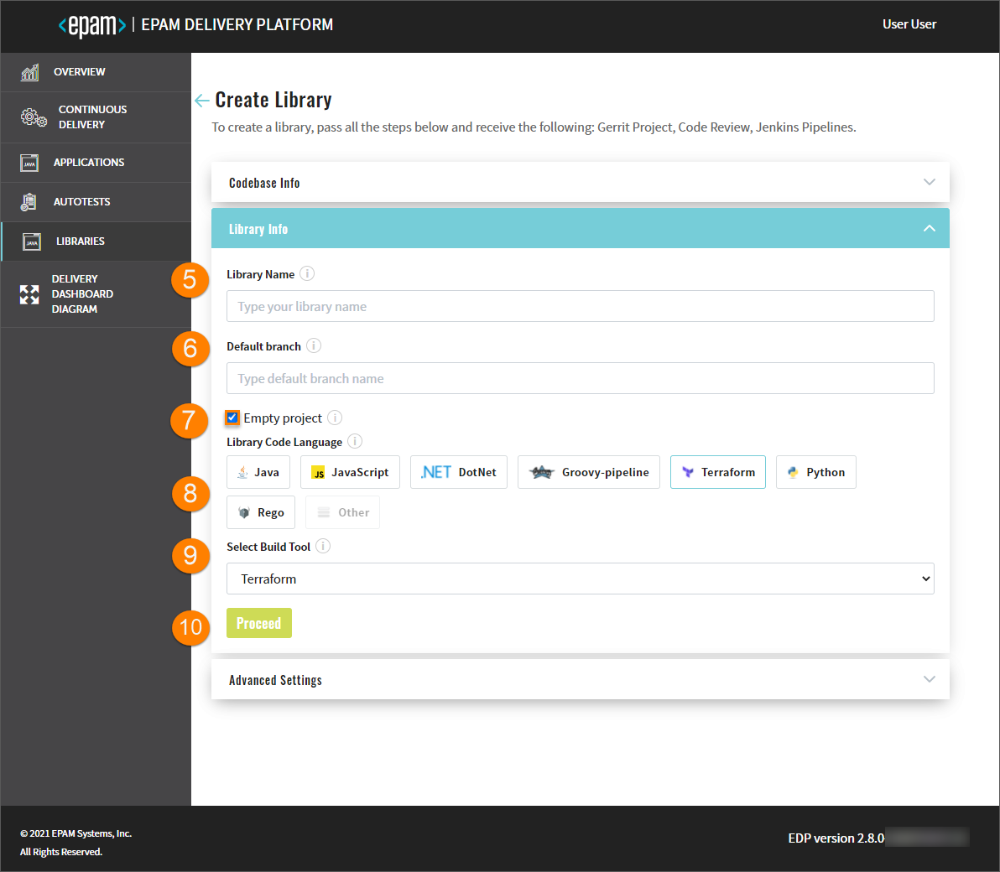
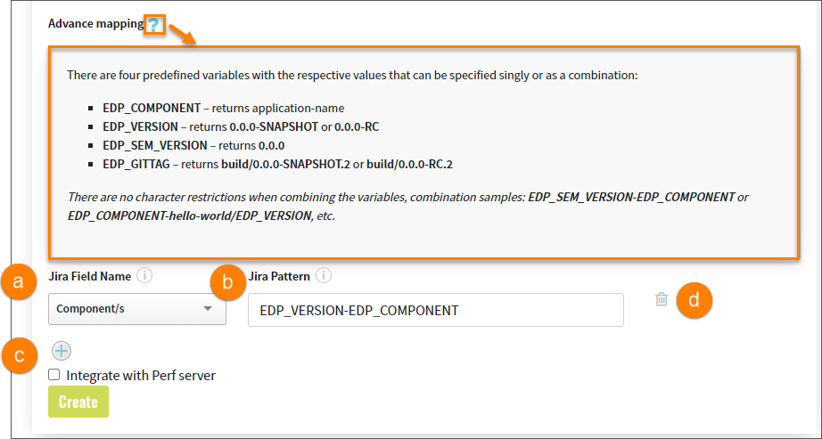
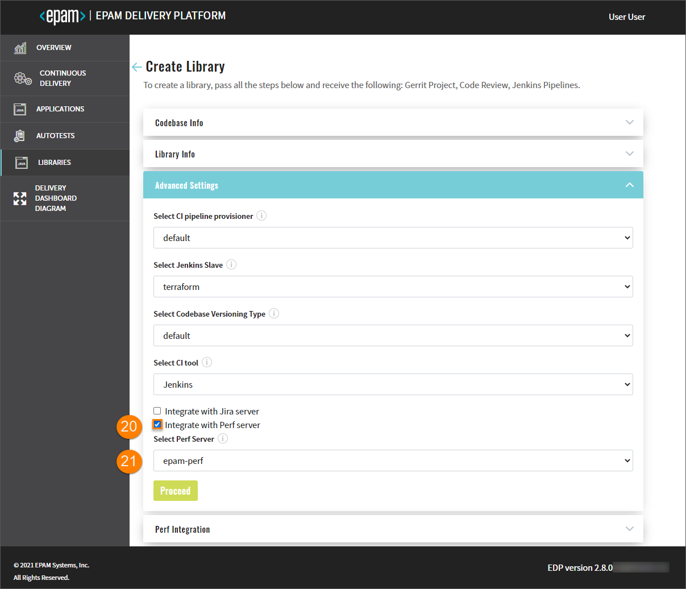
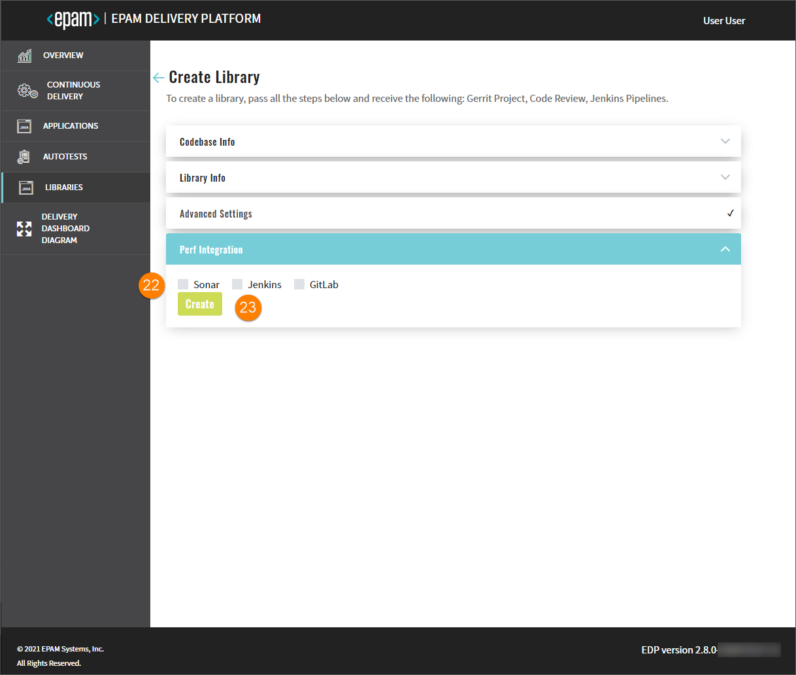

# Add Library

Admin Console helps to create, clone or import a library and add it to the environment. It can also be deployed in Gerrit (if the Clone or Create strategy is used) with the Code Review and Build pipelines built in Jenkins.

Navigate to the **Libraries** section on the left-side navigation bar and click the Create button.

Once clicked, the three-step menu will appear:

* The Codebase Info Menu
* The Library Info Menu
* The Advanced Settings Menu

## The Codebase Info Menu

1. In the **Codebase Integration Strategy** field, select the necessary option that is the configuration strategy for the replication with Gerrit:

  * **Create** – creates a project on the pattern in accordance with a code language, a build tool, and a framework.

  * **Clone** – clones the indicated repository into EPAM Delivery Platform. While cloning the existing repository, it is required to fill in the additional fields as well.

  * **Import** - allows configuring a replication from the Git server. While importing the existing repository, select the Git server and define the respective path to the repository.

  !!! note
      In order to use the **Import** strategy, make sure to adjust it by following the [Enable VCS Import Strategy](../operator-guide/import-strategy.md) page.

2. In the **Git Repository URL** field, specify the link to the repository that is to be cloned.

3. With the **Clone** strategy, select the **Codebase Authentication** check box and fill in the requested fields:

  * Repository Login – enter your login data.
  * Repository password (or API Token) – enter your password or indicate the API Token.

  !!! note
      The **Codebase Authentication** check box should be selected only in case you clone the private repository.
      If you define the public repository, there is no need to enter credentials.

4. Click the Proceed button to switch to the next menu.

  ## The Library Info Menu

  

5. Type the name of the library in the **Library Name** field by entering at least two characters and by using the lower-case letters, numbers and inner dashes.

  !!! info
      If the **Import** strategy is used, the **Library Name** field will not be displayed.

6. Specify the name of the default branch where you want the development to be performed.

  !!! note
      The default branch cannot be deleted.

7. To create a library with an empty repository in Gerrit, select the **Empty project** check box.

  !!! note
      The empty repository option is available only for the **Create** strategy.

8. Select any of the supported code languages in the **Library Code Language** block:

  * Java – selecting Java allows specify Java 8 or Java 11, and further usage of the Gradle or Maven tool.
  * JavaScript - selecting JavaScript allows using the NPM tool.
  * DotNet - selecting DotNet allows using the DotNet v.2.1 and DotNet v.3.1.
  * Groovy-pipeline - selecting Groovy-pipeline allows having the ability to customize a stages logic. For details,
  please refer to the [Customize CD Pipeline](customize-cd-pipeline.md) page.
  * Python - selecting Python allows using the Python v.3.8.
  * Terraform - selecting Terraform allows using the Terraform different versions via the **Terraform version manager** ([tfenv](https://github.com/tfutils/tfenv#usage)).
  EDP supports all actions available in Terraform, thus providing the ability to modify the virtual infrastructure and launch some checks with the help of linters.
  For details, please refer to the [Use Terraform Library in EDP](terraform-stages.md) page.
  * Rego - this option allows using Rego code language with an Open Policy Agent (OPA) Library. For details, please
  refer to the [Use Open Policy Agent](../user-guide/opa-stages.md) page.
  * Other - selecting Other allows extending the default code languages when creating a codebase with the Clone/Import strategy.
  To add another code language, inspect the [Add Other Code Language](../operator-guide/add-other-code-language.md) page.

  !!! note
      The **Create** strategy does not allow to customize the default code language set.

9. The **Select Build Tool** field disposes of the default tools and can be changed in accordance with the selected code language.

10. Click the Proceed button to switch to the next menu.

  ## The Advanced Settings Menu

  

11. Select the CI pipeline provisioner that will be used to handle a codebase. For details, refer to the [Manage Jenkins CI Pipeline Job Provisioner](../operator-guide/manage-jenkins-ci-job-provision.md) instruction
and become familiar with the main steps to add an additional job provisioner.

12. Select Jenkins agent that will be used to handle a codebase. For details, refer to the [Manage Jenkins Agent](../operator-guide/add-jenkins-agent.md) instruction
and inspect the steps that should be done to add a new Jenkins agent.

13. Select the necessary codebase versioning type:

  * **default** - the previous versioning logic that is realized in EDP Admin Console 2.2.0 and lower versions.
  Using the default versioning type, in order to specify the version of the current artifacts, images, and tags in the Version Control System,
  a developer should navigate to the corresponding file and change the version **manually**.

  * **edp** - the new versioning logic that is available in EDP Admin Console 2.3.0 and subsequent versions.
  Using the edp versioning type, a developer indicates the version number from which all the artifacts will be versioned
  and, as a result, **automatically** registered in the corresponding file (e.g. pom.xml).

  When selecting the edp versioning type, the extra field will appear:

  

  a. Type the version number from which you want the artifacts to be versioned.

  !!! note
      The **Start Version From** field should be filled out in compliance with the semantic versioning rules, e.g. 1.2.3 or 10.10.10. Please refer to the [Semantic Versioning](https://semver.org/) page for details.

14. In the **Select CI Tool** field, choose the necessary tool: Jenkins or GitLab CI, where Jenkins is the default tool and
    the GitLab CI tool can be additionally adjusted. For details, please refer to the [Adjust GitLab CI Tool](../operator-guide/gitlabci-integration.md) page.

  !!! note
      The GitLab CI tool is available only with the **Import** strategy and makes the **Jira integration** feature unavailable.

  

15. Select the **Integrate with Jira Server** check box in case it is required to connect Jira tickets with the commits
and have a respective label in the Fix Version field.

  !!! note
      To adjust the Jira integration functionality, first apply the necessary changes described on the [Adjust Jira Integration](../operator-guide/jira-integration.md) page,
      and [Adjust VCS Integration With Jira](../operator-guide/jira-gerrit-integration.md). Pay attention that the Jira integration feature is not available when using the GitLab CI tool.

16. As soon as the Jira server is set, select it in the **Select Jira Server** field.

17. Indicate the pattern using any character, which is followed on the project, to validate a commit message.

18. Indicate the pattern using any character, which is followed on the project, to find a Jira ticket number in a commit message.

19. In the **Advanced Mapping** section, specify the names of the Jira fields that should be filled in with attributes from EDP.
Upon clicking the question mark icon, observe the tips on how to indicate and combine variables necessary for identifying the format of values to be displayed.

  

  a. Select the name of the field in a Jira ticket. The available fields are the following: **Fix Version/s**, **Component/s** and **Labels**.

  b. Select the pattern of predefined variables, based on which the value from EDP will be displayed in Jira. Combine several variables to obtain the desired value.

  * For the **Fix Version/s** field, select the **EDP_VERSION** variable that represents an EDP upgrade version, as in _2.7.0-SNAPSHOT_.
  Combine variables to make the value more informative. For example, the pattern **EDP_VERSION-EDP_COMPONENT** will be displayed as _2.7.0-SNAPSHOT-nexus-operator_ in Jira;
  * For the **Component/s** field select the **EDP_COMPONENT** variable that defines the name of the existing repository. For example, _nexus-operator_;
  * For the **Labels** field select the **EDP_GITTAG**variable that defines a tag assigned to the commit in Git Hub. For example, _build/2.7.0-SNAPSHOT.59_.

  c. Click the plus icon to add more Jira field names.

  d. Click the delete icon to remove the Jira field name.

  

20. Select the **Integrate with Perf Server** check box to enable the integration with the [PERF Board](https://www.epam.com/telescopeai) (_Project Performance Board_) for monitoring the overall team performance and setting up necessary metrics.

  !!! note
      If this option is needed, please refer to the [Perf Server Integration](../operator-guide/perf-integration.md) to adjust the integration. After the integration is adjusted, the **Integrate with Perf Server** check box will appear in the **Advanced Settings** menu.

21. In the **Select Perf Server** field, select the name of the Perf server with which the integration should be performed.
Click the Proceed button to switch to the next menu.

  

22. Select the necessary DataSource (_Jenkins/GitLab, Sonar_) from which the data should be transferred to the Project Performance Board.

23. Click the Create button, check the CONFIRMATION summary, and click Continue to add the library to the Libraries list.

  !!! note
      After the complete adding of the library, inspect the [Library Overview](library.md) part.

### Related Articles

* [Library Overview](library.md)
* [Delivery Dashboard Diagram](d-d-diagram.md)

---

* [Add CD Pipeline](add-cd-pipeline.md)
* [Add Other Code Language](../operator-guide/add-other-code-language.md)
* [Adjust GitLab CI Tool](../operator-guide/gitlabci-integration.md)
* [Adjust Jira Integration](../operator-guide/jira-integration.md)
* [Adjust VCS Integration With Jira](../operator-guide/jira-gerrit-integration.md)
* [Enable VCS Import Strategy](../operator-guide/import-strategy.md)
* [Manage Jenkins CI Pipeline Job Provisioner](../operator-guide/manage-jenkins-ci-job-provision.md)
* [Manage Jenkins Agent](../operator-guide/add-jenkins-agent.md)
* [Perf Server Integration](../operator-guide/perf-integration.md)
* [Use Terraform Library in EDP](terraform-stages.md)
* [Use Open Policy Agent Library in EDP](opa-stages.md)
