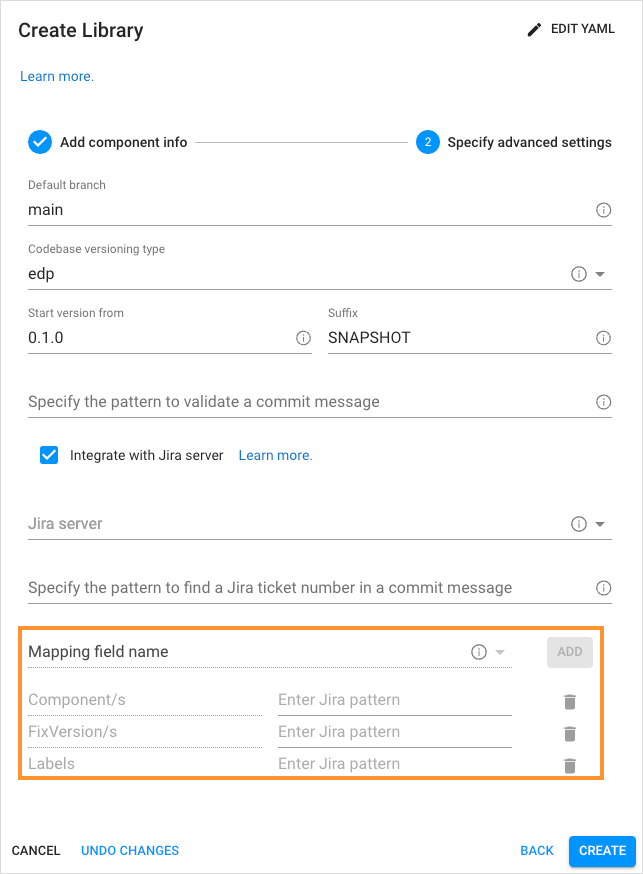

# Add Library

Portal helps to create, clone and import a library and add it to the environment. It can also be deployed in Gerrit (if the Clone or Create strategy is used) with the Code Review and Build pipelines built in Jenkins/Tekton.

To add a library, navigate to the **Components** section on the navigation bar and click **Create** (the plus sign icon in the lower-right corner of the screen). Once clicked, the **Create new component** dialog will appear, then select **Library** and choose one of the strategies which will be described later in this page. You can create a library [in YAML](#YAML) or [via the two-step menu](#menu) in the dialog.

  !

## Create Library in YAML 

Click **Edit YAML** in the upper-right corner of the **Create Library** dialog to open the YAML editor and create the Library.

  !

To edit YAML in the minimal editor, turn on the **Use minimal editor** toggle in the upper-right corner of the **Create Application** dialog.

To save the changes, select the **Save & Apply** button.

## Create Library via UI 

The **Create Library** dialog contains the two steps:

* The Codebase Info Menu
* The Advanced Settings Menu

### The Codebase Info Menu

1. The **Create new component** menu should look like the following:

  !

2. In the **Create new component** menu, select the necessary configuration strategy. The choice will define the parameters you will need to specify:

  * **Create from template** – creates a project on the pattern in accordance with a library language, a build tool, and a framework.

  * **Import project** - allows configuring a replication from the Git server. While importing the existing repository, select the Git server from the drop-down list and define the relative path to the repository, such as */epmd-edp/examples/basic/edp-auto-tests-simple-example*.

    !!! note
        In order to use the **Import project** strategy, make sure to adjust it with the [Integrate GitLab/GitHub With Jenkins](../operator-guide/import-strategy-jenkins.md) or [Integrate GitLab/GitHub With Tekton](../operator-guide/import-strategy-tekton.md) page.

  * **Clone project** – clones the indicated repository into EPAM Delivery Platform. While cloning the existing repository, it is required to fill in the **Repository URL** field as well:

    !

    In our example, we will use the **Create from template** strategy:

    !

    1. While importing the existing repository, select the Git server from the drop-down list and define the relative path to the repository, such as `/epmd-edp/examples/basic/edp-auto-tests-simple-example`
    2. Type the name of the library in the **Component name** field by entering at least two characters and by using the lower-case letters, numbers and inner dashes.
    3. Type the library description.
    4. To create a library with an empty repository in Gerrit, select the **Empty project** check box. The empty repository option is available only for the **Create from template** strategy.
    5. Select any of the supported code languages with its framework in the **Library code language** field:

      * Java – selecting specific Java version available.
      * JavaScript - selecting JavaScript allows using the NPM tool.
      * Python - selecting Python allows using the Python v.3.8, FastAPI, Flask.
      * Groovy-pipeline - selecting Groovy-pipeline allows having the ability to customize a stages logic. For details,
        please refer to the [Customize CD Pipeline](../user-guide/customize-cd-pipeline.md) page.
      * Terraform - selecting Terraform allows using the Terraform different versions via the **Terraform version manager** ([tfenv](https://github.com/tfutils/tfenv#usage)).
        EDP supports all actions available in Terraform, thus providing the ability to modify the virtual infrastructure and launch some checks with the help of linters.
        For details, please refer to the [Use Terraform Library in EDP](../user-guide/terraform-stages.md) page.
      * Rego - this option allows using Rego code language with an Open Policy Agent (OPA) Library. For details, please
        refer to the [Use Open Policy Agent](../user-guide/opa-stages.md) page.
      * Container - this option allows using the Kaniko tool for building the container images from a Dockerfile. For details, please refer to the [CI Pipeline for Container](../user-guide/container-stages.md) page.
      * Helm - this option allows using the [chart testing lint](https://github.com/helm/chart-testing) (Pipeline) for Helm charts or using Helm chart as a set of other Helm charts organized according to the [example](https://github.com/argoproj/argo-helm/tree/main).
      * C# - selecting C# allows using .Net v.3.1 and .Net v.6.0.
      * Other - selecting Other allows extending the default code languages when creating a codebase with the Clone/Import strategy. To add another code language, inspect the [Add Other Code Language](../operator-guide/add-other-code-language.md) page.

      !!! note
          The **Create** strategy does not allow to customize the default code language set.

    6. Select necessary **Language version/framework** depending on the **Library code language** field.

    7. The **Select Build Tool** field disposes of the default tools and can be changed in accordance with the selected code language.

3. Click the **Proceed** button to switch to the next menu.

### The Advanced Settings Menu

The **Advanced Settings** menu should look like the picture below:

  !

a. Specify the name of the default branch where you want the development to be performed.

!!! note
    The default branch cannot be deleted.

b. Select the necessary codebase versioning type:

* **default**: Using the default versioning type, in order to specify the version of the current artifacts, images, and tags in the Version Control System, a developer should navigate to the corresponding file and change the version **manually**.

* **edp**: Using the edp versioning type, a developer indicates the version number from which all the artifacts will be versioned and, as a result, **automatically** registered in the corresponding file (e.g. pom.xml).

When selecting the edp versioning type, the extra field will appear:

  !

Type the version number from which you want the artifacts to be versioned.

!!! note
    The **Start Version From** field should be filled out in compliance with the semantic versioning rules, e.g. 1.2.3 or 10.10.10. Please refer to the [Semantic Versioning](https://semver.org/) page for details.

c. Specify the pattern to validate a commit message. Use regular expression to indicate the pattern that is followed on the project to validate a commit message in the code review pipeline. An example of the pattern: `^[PROJECT_NAME-d{4}]:.*$`

  !

d. Select the **Integrate with Jira server** check box in case it is required to connect Jira tickets with the commits
and have a respective label in the **Fix Version** field.

!!! note
    To adjust the Jira integration functionality, first apply the necessary changes described on the [Adjust Jira Integration](../operator-guide/jira-integration.md) page,
    and [Adjust VCS Integration With Jira](../operator-guide/jira-gerrit-integration.md). Pay attention that the Jira integration feature is not available when using the GitLab CI tool.

e. As soon as the Jira server is set, select it in the **Jira Server** field.

f. Specify the pattern to find a Jira ticket number in a commit message. Based on this pattern, the value from EDP will be displayed in Jira.

  !

g. In the **Advanced Mapping** section, specify the names of the Jira fields that should be filled in with attributes from EDP:

1. Select the name of the field in a Jira ticket. The available fields are the following: *Fix Version/s*, *Component/s* and *Labels*.

2. Click the **Add** button to add the mapping field name.

3. Enter Jira pattern for the field name:

  * For the **Fix Version/s** field, select the **EDP_VERSION** variable that represents an EDP upgrade version, as in _2.7.0-SNAPSHOT_.
  Combine variables to make the value more informative. For example, the pattern **EDP_VERSION-EDP_COMPONENT** will be displayed as _2.7.0-SNAPSHOT-nexus-operator_ in Jira.
  * For the **Component/s** field select the **EDP_COMPONENT** variable that defines the name of the existing repository. For example, _nexus-operator_.
  * For the **Labels** field select the **EDP_GITTAG**variable that defines a tag assigned to the commit in Git Hub. For example, _build/2.7.0-SNAPSHOT.59_.

4. Click the bin icon to remove the Jira field name.

h. Click the **Apply** button to add the library to the Libraries list.

!!! note
    After the complete adding of the library, inspect the [Library Overview](library.md) part.

!!! note
    Since EDP v3.3.0, the **CI tool** field has been hidden. Now EDP Portal automatically defines the CI tool depending on which one is deployed with EDP. If both Jenkins and Tekton are deployed, EDP Portal chooses Tekton by default. To define the CI tool manually, operate with the **spec.ciTool** parameters.

## Related Articles

* [Manage Libraries](library.md)
* [Add CD Pipeline](add-cd-pipeline.md)
* [Add Other Code Language](../operator-guide/add-other-code-language.md)
* [Adjust Jira Integration](../operator-guide/jira-integration.md)
* [Adjust VCS Integration With Jira](../operator-guide/jira-gerrit-integration.md)
* [Integrate GitHub/GitLab in Jenkins](../operator-guide/import-strategy-jenkins.md)
* [Integrate GitHub/GitLab in Tekton](../operator-guide/import-strategy-tekton.md)
* [Manage Jenkins CI Pipeline Job Provisioner](../operator-guide/manage-jenkins-ci-job-provision.md)
* [Manage Jenkins Agent](../operator-guide/add-jenkins-agent.md)
* [Perf Server Integration](../operator-guide/perf-integration.md)

[//]: # (* [Use Terraform Library in EDP]&#40;terraform-stages.md&#41;)

[//]: # (* [Use Open Policy Agent Library in EDP]&#40;opa-stages.md&#41;)
