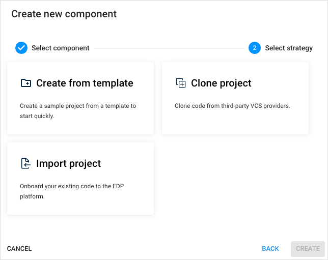
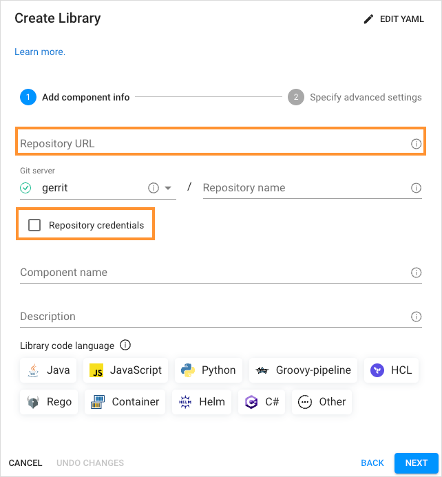
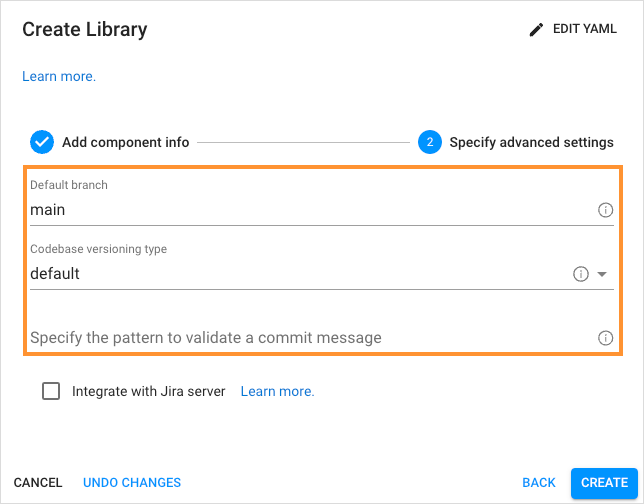
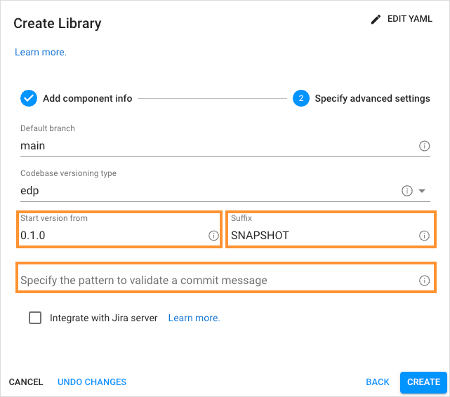

# Add Library

KubeRocketCI portal allows you to create a library, clone an existing repository with the library to your Version Control System (VCS), or using an external repository and importing a library to the environment. When a library is created or cloned, the system automatically generates a corresponding repository within the integrated VCS. You can create a library [in YAML](#YAML) or [via the two-step menu](#menu) in the dialog.

To add a library, navigate to the **Components** section on the navigation bar and click **+ Create component**:

  !

Once clicked, the **Create new component** dialog will appear. Select **Library** and click **Next**:

  !

Choose one of the strategies and click **Create**:

   !

In the **Create new component** menu, select the necessary configuration strategy. The choice will define the parameters you will need to specify:

* **Create from template** – creates a project on the pattern in accordance with a library language, a build tool, and a framework.

* **Import project** - allows using existing VCS repository to integrate with KubeRocketCI. While importing the existing repository, select the Git server from the drop-down list and define the relative path to the repository, such as `epmd-edp/python-python-flask`.

!!! note
    In order to use the **Import project** strategy, make sure to adjust it with the [Integrate GitLab/GitHub With Tekton](../operator-guide/import-strategy-tekton.md) page.

* **Clone project** – clones the indicated repository into KubeRocketCI. While cloning the existing repository, it is required to fill in the **Repository URL** field and specify the **Repository credentials** field if needed:

  !

## Create Library in YAML 

Click **Edit YAML** in the upper-right corner of the **Create Library** dialog to open the YAML editor and create the library:

  !

To edit YAML in the minimal editor, turn on the **Use minimal editor** toggle in the upper-right corner of the **Create Application** dialog.

To save the changes, select the **Save & Apply** button.

## Create Library via UI 

The **Create Library** dialog contains the two steps:

* The Codebase Info Menu
* The Advanced Settings Menu

### The Codebase Info Menu

In our example, we will use the **Create from template** strategy:

  !

1. Select all the settings that define how the library will be added to Git server:

  * **Git server** - the pre-configured server where the component will be hosted. Select one from the from the drop-down list. Please refer to the [Manage Git Servers](git-server-overview.md) page to learn how to create the one.
  * **Repository name** - the relative path to the repository, such as `epmd-edp/python-python-flask`.
  * **Component name** - the name of the library. Must be at least two characters using the lower-case letters, numbers and inner dashes.
  * **Description** - brief and concise description that explains the purpose of the library.
  * **Empty project** - check this box to create a library with an empty repository. The empty repository option is available only for the **Create from template** strategy.

2. Specify the library language properties:

  * **Library code language** - defines the code language with its supported frameworks:

    * Java – selecting specific Java version available.
    * JavaScript - selecting JavaScript allows using the NPM tool.
    * Python - selecting Python allows using the Python v.3.8, FastAPI, Flask.
    * Groovy-pipeline - selecting Groovy-pipeline allows having the ability to customize a stages logic.
    * Terraform - selecting Terraform allows using the Terraform different versions via the **Terraform version manager** ([tfenv](https://github.com/tfutils/tfenv#usage)).
        KubeRocketCI supports all the actions available in Terraform, thus providing the ability to modify the virtual infrastructure and launch some checks with the help of linters.
        For details, please refer to the [Use Terraform Library in KubeRocketCI](../user-guide/terraform-stages.md) page.
    * Rego - this option allows using Rego code language with an Open Policy Agent (OPA) Library. For details, please refer to the [Use Open Policy Agent](../user-guide/opa-stages.md) page.
    * Container - this option allows using the Kaniko tool for building the container images from a Dockerfile.
    * Helm - this option allows using the [chart testing lint](https://github.com/helm/chart-testing) (Pipeline) for Helm charts or using Helm chart as a set of other Helm charts organized according to the [example](https://github.com/argoproj/argo-helm/tree/main).
    * C# - selecting C# allows using .Net v.3.1 and .Net v.6.0.
    * Other - selecting Other allows extending the default code languages when creating a codebase with the Clone/Import strategy.

  !!! note
      The **Create** strategy does not allow to customize the default code language set.

  * **Language version/framework** - defines the specific framework or language version of the library. The field depends on the selected code language.
  * **Build Tool** - allows to choose the build tool to use. A set tools and can be changed in accordance with the selected code language.

Click the **Proceed** button to switch to the next menu.

### The Advanced Settings Menu

In the Advanced Settings menu, specify the branch options and define the Jira settings:

  !

* **Default branch** - the name of the branch where you want the development to be performed.

  !!! note
      The default branch cannot be deleted.

* **Codebase versioning type** - defines how will the library tag be changed once the new image version is built. There are two versioning types:
  * **default**: Using the default versioning type, in order to specify the version of the current artifacts, images, and tags in the Version Control System, a developer should navigate to the corresponding file and change the version **manually**.
  * **edp**: Using the edp versioning type, a developer indicates the version number from which all the artifacts will be versioned and, as a result, **automatically** registered in the corresponding file (e.g. pom.xml). When selecting the edp versioning type, the extra fields will appear, type the version number from which you want the artifacts to be versioned:

      !

    !!! note
        The **Start Version From** field should be filled out in compliance with the semantic versioning rules, e.g. 1.2.3 or 10.10.10. Please refer to the [Semantic Versioning](https://semver.org/) page for details.

* **Specify the pattern to validate a commit message** - the regular expression used to indicate the pattern that is followed on the project to validate a commit message in the code review pipeline. An example of the pattern: `^[PROJECT_NAME-d{4}]:.*$`.

  !

* **Integrate with Jira server** - this check box is used in case it is required to connect Jira tickets with the commits
and have a respective label in the **Fix Version** field.

!!! note
    To adjust the Jira integration functionality, first apply the necessary changes described on the [Adjust Jira Integration](../operator-guide/jira-integration.md) page,
    and [Adjust VCS Integration With Jira](../operator-guide/jira-gerrit-integration.md).

* **Jira Server** - the integrated Jira server with related Jira tasks.

* **Specify the pattern to find a Jira ticket number in a commit message** - based on this pattern, the value from KubeRocketCI will be displayed in Jira.

  !

* **Mapping field name** - the section where the additional Jira fields are specified the names of the Jira fields that should be filled in with attributes from KubeRocketCI:

  * Select the name of the field in a Jira ticket. The available fields are the following: *Fix Version/s*, *Component/s* and *Labels*.

  * Click the **Add** button to add the mapping field name.

  * Enter Jira pattern for the field name:

    * For the **Fix Version/s** field, select the **EDP_VERSION** variable that represents an EDP upgrade version, as in _2.7.0-SNAPSHOT_.Combine variables to make the value more informative. For example, the pattern **EDP_VERSION-EDP_COMPONENT** will be displayed as _2.7.0-SNAPSHOT-nexus-operator_ in Jira.
    * For the **Component/s** field select the **EDP_COMPONENT** variable that defines the name of the existing repository. For example, _nexus-operator_.
    * For the **Labels** field select the **EDP_GITTAG**variable that defines a tag assigned to the commit in Git Hub. For example, _build/2.7.0-SNAPSHOT.59_.

  * Click the bin icon to remove the Jira field name.

Click the **Apply** button to add the library to the Components list.

After the complete adding of the library, inspect the [Library Overview](library.md) page to learn how you can operate applications.

## Related Articles

* [Manage Libraries](library.md)
* [Add CD Pipeline](add-cd-pipeline.md)
* [Adjust Jira Integration](../operator-guide/jira-integration.md)
* [Adjust VCS Integration With Jira](../operator-guide/jira-gerrit-integration.md)
* [Integrate GitHub/GitLab in Tekton](../operator-guide/import-strategy-tekton.md)

[//]: # (* [Use Terraform Library in KubeRocketCI]&#40;terraform-stages.md&#41;)

[//]: # (* [Use Open Policy Agent Library in EDP]&#40;opa-stages.md&#41;)
