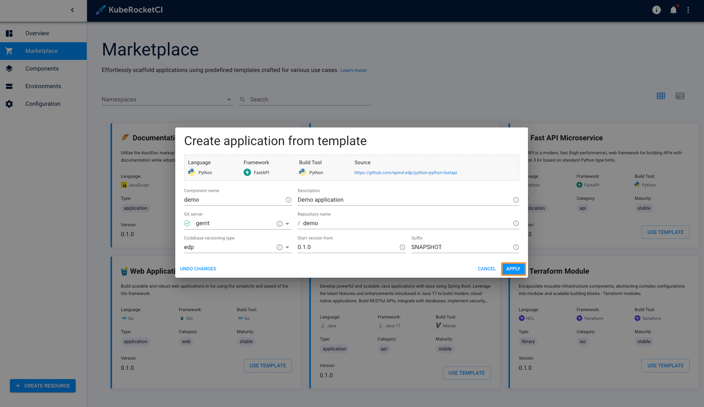
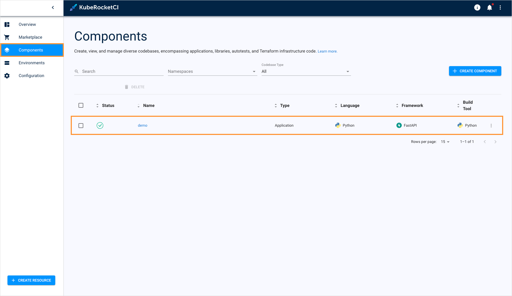

# Add Component via Marketplace

With the built-in Marketplace, users can easily create a new application by clicking several buttons. This page contains detailed guidelines on how to create a new component with the help of the Marketplace feature.

## Add Component

To create a component from template, follow the instructions below:

1. Navigate to the **Marketplace** section on the navigation bar to see the Marketplace overview page.

2. Click the component name to open its details window and click **Create from template**:

  !

3. Fill in the required fields and click **Apply**:

  !

4. As a result, new component will appear in the **Components** section:

  !

## Related Articles

* [Marketplace Overview](marketplace.md)
* [Add Application](add-application.md)
* [Add Library](add-library.md)
* [Add Infrastructure](add-infrastructure.md)
