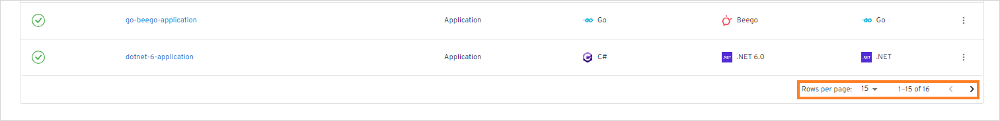
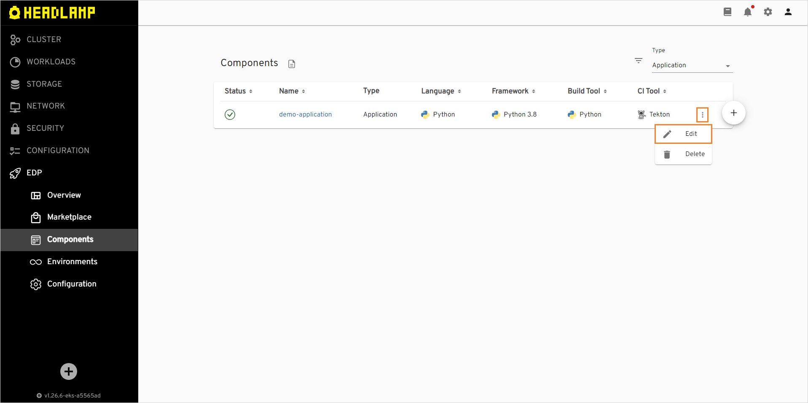
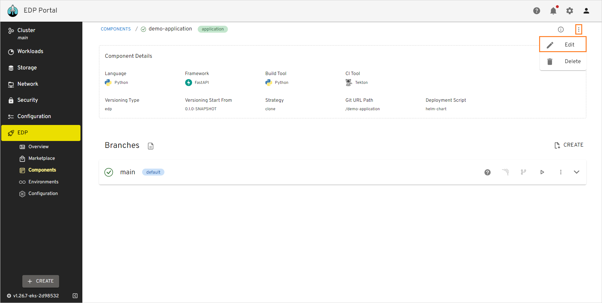
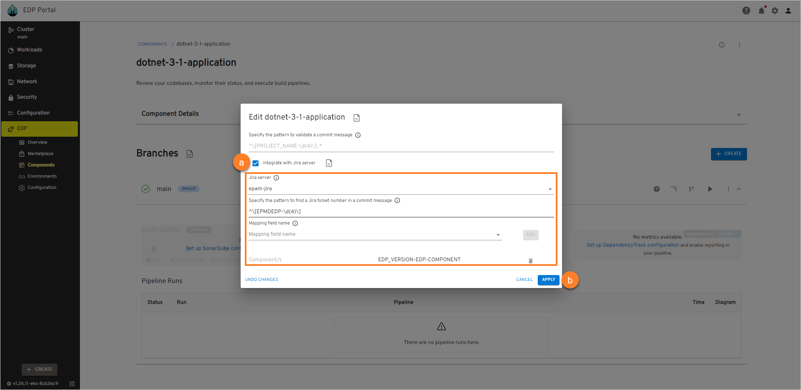

# Manage Applications

This section describes the subsequent possible actions that can be performed with the newly added or existing applications.

## Check and Remove Application

As soon as the application is successfully provisioned, the following will be created:

- Code Review and Build pipelines in Jenkins/Tekton for this application. The Build pipeline will be triggered automatically if at least one environment is already added.
- A new project in Gerrit or another VCS.
- SonarQube integration will be available after the Build pipeline in Jenkins/Tekton is passed.
- Nexus Repository Manager will be available after the Build pipeline in Jenkins/Tekton is passed as well.

The added application will be listed in the Applications list allowing you to do the following:

!

* **Application status** - displays the Git Server status. Can be red or green depending on if the EDP Portal managed to connect to the Git Server with the specified credentials or not.
* **Application name (clickable)** - displays the Git Server name set during the Git Server creation.
* **Open documentation** - opens the documentation that leads to this page.
* **Enable filtering** - enables filtering by Git Server name and namespace where this custom resource is located in.
* **Create new application** - displays the **Create new component** menu.
* **Edit application** - edit the application by selecting the options icon next to its name in the applications list, and then selecting **Edit**. For details see the [Edit Existing Application](#edit-existing-application) section.
* **Delete application** - remove application by selecting the options icon next to its name in the applications list, and then selecting **Delete**.

  !!! note
      The application that is used in a CD pipeline cannot be removed.

There are also options to sort the applications:

* Sort the existing applications in a table by clicking the sorting icons in the table header. Sort the applications alphabetically by their name, language, build tool, framework, and CI tool. You can also sort the applications by their status: Created, Failed, or In progress.

* Select a number of applications displayed per page (15, 25 or 50 rows) and navigate between pages if the number of applications exceeds the capacity of a single page:

  !

## Edit Existing Application

EDP Portal provides the ability to enable, disable or edit the Jira Integration functionality for applications.R

1. To edit an application directly from the Applications overview page or when viewing the application data:

  - Select **Edit** in the options icon menu:

  !

  !

  - The Edit Application dialog opens.

2. To enable Jira integration, in the **Edit Application** dialog do the following:

   !

   a. Mark the **Integrate with Jira server** check box and fill in the necessary fields. Please see steps d-h of the [Add Application](add-application.md#the-advanced-settings-menu) page.

   b. Select the **Apply** button to apply the changes.

   c. (Optional) Enable commit validation mechanism by navigating to Jenkins/Tekton and adding the _commit-validate_ stage in the Code Review pipeline to have your commits reviewed.

3. To disable Jira integration, in the **Edit Application** dialog do the following:

   a. Unmark the **Integrate with Jira server** check box.

   b. Select the **Apply** button to apply the changes.

   c. (Optional) Disable commit validation mechanism by navigating to Jenkins/Tekton and removing the _commit-validate_ stage in the Code Review pipeline to have your commits reviewed.

4. To create, edit and delete application branches, please refer to the [Manage Branches](../user-guide/manage-branches.md) page.

## Related Articles

* [Add Application](add-application.md)
* [Manage Branches](../user-guide/manage-branches.md)