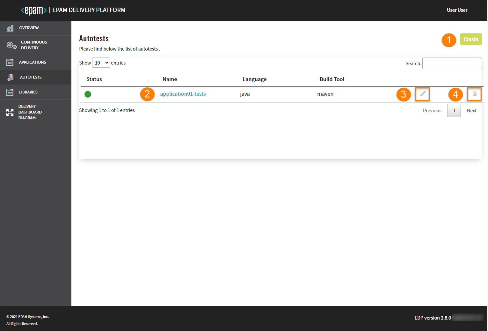
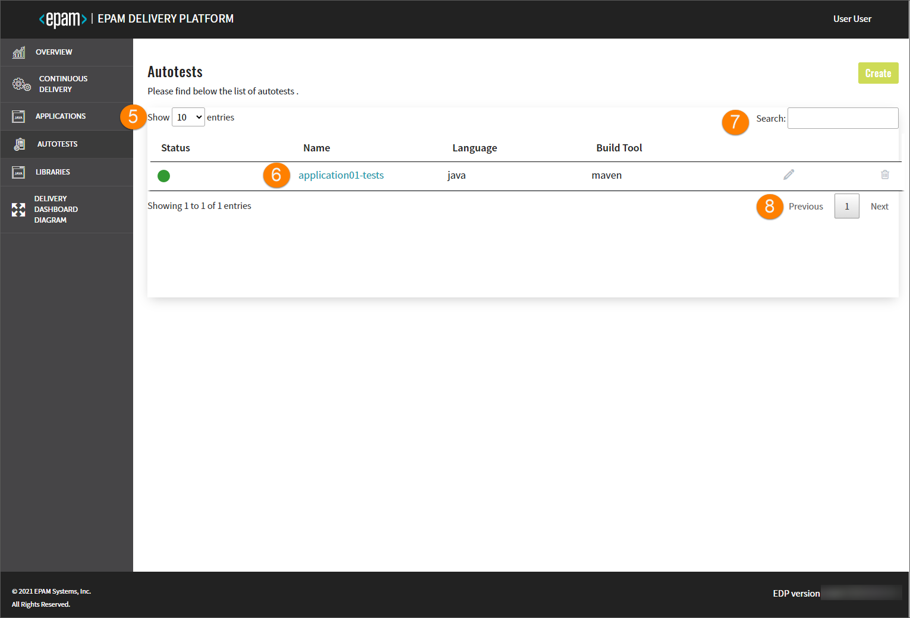
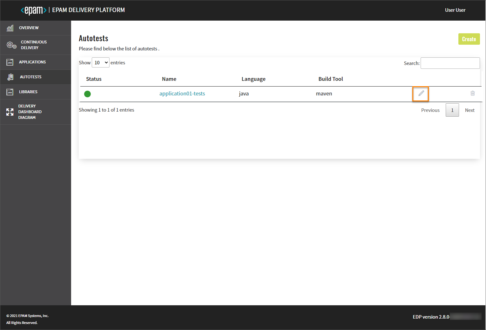

# Autotest

This section describes the subsequent possible actions that can be performed with the newly added or existing autotests.

## Check and Remove Autotest

As soon as the autotest is successfully provisioned, the following will be created:

- Code Review and Build pipelines in Jenkins for this autotest. The Build pipeline will be triggered automatically if at least one environment is already added.
- A new project in Gerrit or another VCS.
- SonarQube integration will be available after the Build pipeline in Jenkins is passed.
- Nexus Repository Manager will be available after the Build pipeline in Jenkins is passed as well.

!!! info
    To navigate quickly to OpenShift, Jenkins, Gerrit, SonarQube, Nexus, and other resources, click the **Overview** section on the navigation bar and hit the necessary link.

The added autotest will be listed in the Autotests list allowing you to do the following:

1. Add another autotest by clicking the Create button and performing the same steps as described at the [Add Autotest](add-autotest.md) page.

2. Open autotest data by clicking its link name. Once clicked, the following blocks will be displayed:

  * **General Info** - displays common information about the cloned/imported autotest.
  * **Advanced Settings** - displays the specified job provisioner, Jenkins agent, deployment script, and the versioning type with the start versioning from number (the latter two fields appear in case of edp versioning type).
  * **Branches** - displays the status and name of the deployment branch, keeps the additional links to Jenkins and Gerrit. In case of edp versioning type, there are two additional fields:
    * **Build Number** - indicates the current build number;
    * **Last Successful Build** - indicates the number of the last successful build.
  * **Status Info** - displays all the actions that were performed during the cloning/importing process.

3. Edit the autotest codebase by clicking the pencil icon. For details see the [Edit Existing Codebase](#edit-existing-codebase) section.

4. Remove autotest with the corresponding database and Jenkins pipelines:

  - Click the delete icon next to the autotest name;
  - Type the required autotest name;
  - Confirm the deletion by clicking the Delete button.

  !!! note
      The autotest that is used in a CD pipeline cannot be removed.

   

5. Select a number of existing autotests to be displayed on one page in the **Show entries** field. The filter allows to show 10, 25, 50 or 100 entries per page.

6. Sort the existing autotests in a list by clicking the Name title. The autotests will be displayed in alphabetical order.

7. Search the necessary autotest by entering the corresponding name, language or the build tool into the **Search** field. The search can be performed by the autotest name, language or a build tool.

8. Navigate between pages, if the number of autotests exceeds the capacity of a single page.

## Edit Existing Codebase

The EDP Admin Console provides the ability to enable, disable or edit the Jira Integration functionality for autotests via the Edit Codebase page.

1. Perform the editing from one of the following sections on the Admin Console interface:

    

  - Navigate to the codebase overview page and click the **pencil** icon, or

    

  - Navigate to the codebase list page and click the **pencil** icon.

    

2. To enable Jira integration, on the **Edit Codebase** page do the following:

  - mark the **Integrate with Jira server** check box and fill in the necessary fields;
  - click the Proceed button to apply the changes;
  - navigate to Jenkins and add the _create-jira-issue-metadata_ stage in the Build pipeline. Also add the _commit-validate_ stage in the Code-Review pipeline.

  !!! note
      Pay attention that the Jira integration feature is not available when using the GitLab CI tool.

  !!! note
      To adjust the Jira integration functionality, first apply the necessary changes described on the [Adjust Jira Integration](../operator-guide/jira-integration.md) and [Adjust VCS Integration With Jira](../operator-guide/jira-gerrit-integration.md) pages.

3. To disable Jira integration, on the **Edit Codebase** page do the following:

  - unmark the **Integrate with Jira server** check box;
  - click the **Proceed** button to apply the changes;
  - navigate to Jenkins and remove the _create-jira-issue-metadata_ stage in the Build pipeline. Also remove the _commit-validate_ stage in the Code Review pipeline.

As a result, the necessary changes will be applied.

## Add a New Branch

When adding an autotest, the default branch is a **master** branch. In order to add a new branch, follow the steps below:

1. Navigate to the **Branches** block and click the Create button:

  

2. Fill in the required fields:

  

  a. Release Branch - select the Release Branch check box if you need to create a release branch;

  b. Branch Name - type the branch name. Pay attention that this field remains static if you create a release branch.

  c. From Commit Hash - paste the commit hash from which the new branch will be created. Note that if the **From Commit Hash** field is empty, the latest commit from the branch name will be used.

  d. Branch Version - enter the necessary branch version for the artifact. The Release Candidate (RC) postfix is concatenated to the branch version number.

  e. Master Branch Version - type the branch version that will be used in a master branch after the release creation. The Snapshot postfix is concatenated to the master branch version number;

  f. Click the Proceed button and wait until the new branch will be added to the list.

!!! info
    Adding of a new branch is indicated in the context of the edp versioning type. To get more detailed information on how to add a branch using the default versioning type, please refer to the [Add Autotest](add-autotest.md) instruction.

The default autotest repository is cloned and changed to the new indicated version before the build, i.e. the new indicated version will not be committed to the repository; thus, the existing repository will keep the default version.

## Remove Branch

In order to remove the added branch with the corresponding  record in the Admin Console database, do the following:

1. Navigate to the Branches block by clicking the autotest name link in the Autotests list;

2. Click the delete icon related to the necessary branch:

  

3. Enter the branch name and click the Delete button;

  !!! note
      The default **master** branch cannot be removed.

## Add Autotest as a Quality Gate

In order to add an autotest as a quality gate to a newly added CD pipeline, do the following:

1. Create a CD pipeline with the necessary parameters. Please refer to the [Add CD Pipeline](add-cd-pipeline.md) section for the details.

2. In the **Stages** menu, select the **Autotest** quality gate type. It means the promoting process should be confirmed by the successful passing of the autotests.

3. In the additional fields, select the previously created autotest name and specify its branch.

4. After filling in all the necessary fields, click the Create button to start the provisioning of the pipeline. After the CD pipeline is added, the new namespace containing the stage name will be created in Kubernetes (in OpenShift, a new project will be created) with the following name pattern: _[cluster name]-[cd pipeline name]-[stage name]_

## Configure Autotest Launch at Specific Stage

In order to configure the added autotest launch at the specific stage with necessary parameters, do the following:

1. Add the necessary stage to the CD pipeline. Please refer to the [Add CD Pipeline](add-cd-pipeline.md) documentation for the details.

2. Navigate to the **run.json** file and add the stage name and the specific parameters.

## Launch Autotest Locally

There is an ability to run the autotests locally using the IDEA (Integrated Development Environment Application, such as IntelliJ, NetBeans etc.). To launch the autotest project for the local verification, perform the following steps:

1. Clone the project to the local machine.

2. Open the project in IDEA and find the **run.json** file to copy out the necessary command value.

3. Paste the copied command value into the Command line field and run it with the necessary values and namespace.

4. As a result, all launched tests will be executed.

### Related Articles

- [Add Application](add-application.md)
- [Add Autotests](add-autotest.md)
- [Add CD Pipeline](add-cd-pipeline.md)
* [Adjust Jira Integration](../operator-guide/jira-integration.md)
* [Adjust VCS Integration With Jira](../operator-guide/jira-gerrit-integration.md)
