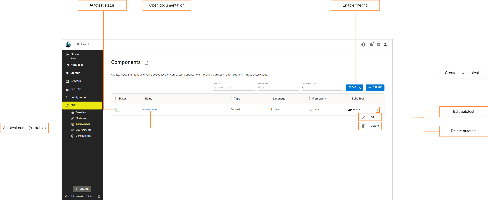
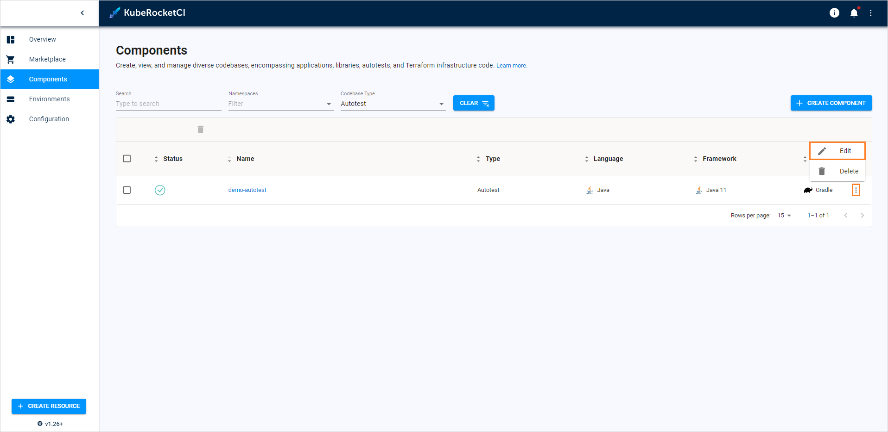
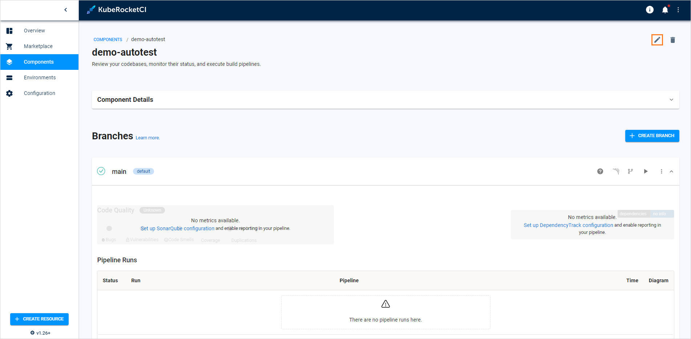
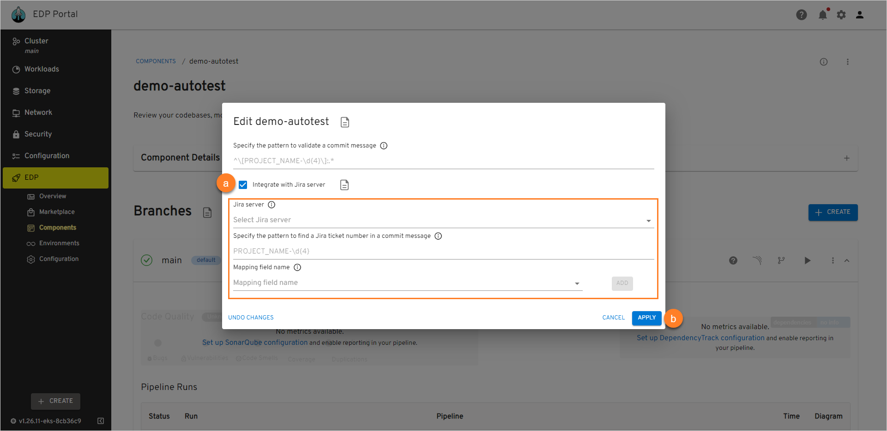

# Manage Autotests

This section describes the subsequent possible actions that can be performed with the newly added or existing autotests.

## Check and Remove Autotest

As soon as the autotest is successfully provisioned, the following will be created:

- Code Review and Build pipelines in Jenkins/Tekton for this autotest. The Build pipeline will be triggered automatically if at least one environment is already added.
- A new project in Gerrit or another VCS.
- SonarQube integration will be available after the Build pipeline in Jenkins/Tekton is passed.
- Nexus Repository Manager will be available after the Build pipeline in Jenkins/Tekton is passed as well.

!!! info
    To navigate quickly to OpenShift, Jenkins/Tekton, Gerrit, SonarQube, Nexus, and other resources, click the **Overview** section on the navigation bar and hit the necessary link.

The added autotest will be listed in the Autotests list allowing you to do the following:

!

* **Autotest status** - displays the Git Server status. Can be red or green depending on EDP Portal managed to connect to the Git Server with the specified credentials or not.

* **Autotest name (clickable)** - displays the Git Server name set during the Git Server creation.

* **Open documentation** - opens the documentation that leads to this page.

* **Enable filtering** - enables filtering by Git Server name and namespace where this custom resource is located in.

* **Create new autotest** - displays the **Create new component** menu.

* **Edit autotest** - edit the autotest by selecting the options icon next to its name in the autotests list, and then selecting **Edit**. For details see the [Edit Existing Autotest](#edit-existing-autotest) section.

* **Delete autotest** - remove autotest with the corresponding database and Jenkins/Tekton pipelines by selecting the options icon next to its name in the Autotests list, and then selecting **Delete**:

  !!! note
      The autotest that is used in a CD pipeline cannot be removed.

There are also options to sort the applications:

* Sort the existing autotests in a table by clicking the sorting icons in the table header. Sort the autotests alphabetically by their name, language, build tool, framework, and CI tool. You can also sort the autotests by their status: Created, Failed, or In progress.

* Select a number of autotests displayed per page (15, 25 or 50 rows)  and navigate between pages if the number of autotests exceeds the capacity of a single page.

## Edit Existing Autotest

EDP Portal provides the ability to enable, disable or edit the Jira Integration functionality for autotests.

1. To edit an autotest directly from the Autotests overview page or when viewing the autotest data:

  - Select **Edit** in the options icon menu:

    !

    !

  - The Edit Autotest dialog opens.

2. To enable Jira integration, on the **Edit Autotest** page do the following:

   !

   a. Mark the **Integrate with Jira server** check box and fill in the necessary fields. Please see steps d-h on the [Add Autotests](add-autotest.md#the-advanced-settings-menu) page.

   b. Select the **Apply** button to apply the changes.

   c. Navigate to Jenkins/Tekton and add the _create-jira-issue-metadata_ stage in the Build pipeline. Also add the _commit-validate_ stage in the Code Review pipeline.

  !!! note
      Pay attention that the Jira integration feature is not available when using the GitLab CI tool.

  !!! note
      To adjust the Jira integration functionality, first apply the necessary changes described on the [Adjust Jira Integration](../operator-guide/jira-integration.md) and [Adjust VCS Integration With Jira](../operator-guide/jira-gerrit-integration.md) pages.

3. To disable Jira integration, in the **Edit Autotest** dialog do the following:

   a. Unmark the **Integrate with Jira server** check box.

   b. Select the **Apply** button to apply the changes.

   c. Navigate to Jenkins/Tekton and remove the _create-jira-issue-metadata_ stage in the Build pipeline. Also remove the _commit-validate_ stage in the Code Review pipeline.

  As a result, the necessary changes will be applied.

4. To create, edit and delete application branches, please refer to the [Manage Branches](../user-guide/manage-branches.md) page.

## Add Autotest as a Quality Gate

In order to add an autotest as a quality gate to a newly added CD pipeline, do the following:

1. Create a CD pipeline with the necessary parameters. Please refer to the [Add CD Pipeline](add-cd-pipeline.md) section for the details.

2. In the **Stages** menu, select the **Autotest** quality gate type. It means the promoting process should be confirmed by the successful passing of the autotests.

3. In the additional fields, select the previously created autotest name and specify its branch.

4. After filling in all the necessary fields, click the Create button to start the provisioning of the pipeline. After the CD pipeline is added, the new namespace containing the stage name will be created in Kubernetes (in OpenShift, a new project will be created) with the following name pattern: _[cluster name]-[cd pipeline name]-[stage name]_.

## Configure Autotest Launch at Specific Stage

In order to configure the added autotest launch at the specific stage with necessary parameters, do the following:

1. Add the necessary stage to the CD pipeline. Please refer to the [Add CD Pipeline](add-cd-pipeline.md) documentation for the details.

2. Navigate to the **run.json** file and add the stage name and the specific parameters.

## Launch Autotest Locally

There is an ability to run the autotests locally using the IDEA (Integrated Development Environment Application, such as IntelliJ, NetBeans etc.). To launch the autotest project for the local verification, perform the following steps:

1. Clone the project to the local machine.

2. Open the project in IDEA and find the **run.json** file to copy out the necessary command value.

3. Paste the copied command value into the Command line field and run it with the necessary values and namespace.

4. As a result, all the launched tests will be executed.

## Related Articles

* [Add Application](add-application.md)
* [Add Autotests](add-autotest.md)
* [Add CD Pipeline](add-cd-pipeline.md)
* [Adjust Jira Integration](../operator-guide/jira-integration.md)
* [Adjust VCS Integration With Jira](../operator-guide/jira-gerrit-integration.md)
* [Manage Branches](../user-guide/manage-branches.md)
