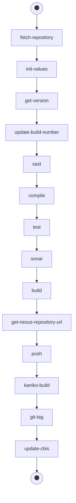

# Build Pipeline

This section provides details on the Build pipeline of the EDP CI/CD pipeline framework. Explore below the pipeline purpose, stages and possible actions to perform.

## Build Pipeline Purpose

The purpose of the Build pipeline contains the following points:

* Check out, test, tag and build an image from the mainstream branch after a patch set is submitted in order to inspect whether the integrated with the mainstream code fits all quality gates, can be built and tested;
* Be triggered if any new patch set is submitted;
* Tag a specific commit in Gerrit in case the build is successful;
* Build a Docker image with an application that can be afterward deployed using the Jenkins Deploy pipeline.

Find below the functional diagram of the Build pipeline with the default stages:

## Build Pipeline for Application and Library

The Build pipeline is triggered automatically after the Code Review pipeline is completed and the changes are submitted.

To review the Build pipeline, take the following steps:

1. Open Jenkins via the created link in Gerrit or via the Admin Console Overview page.

2. Click the Build pipeline link to open its stages for the application and library codebases:

  - Init - initialization of the Code Review pipeline inputs;

  - Checkout - checkout of the application code;

  - Get-version - get the version from the pom.XML file and add the build number;

  - Compile - code compilation;

  - Tests - tests execution;

  - Sonar - Sonar launch that checks the whole code;

  - Build - artifact building and adding to Nexus;

  - Build-image - docker image building and adding to Docker Registry. The Build pipeline for the library has the same stages as the application except the **Build-image** stage, i.e. the Docker image is not building.

  - Push - artifact docker image pushing to Nexus and Docker Registry;

  - Ecr-to-docker - the docker image, after being built, is copied from the ECR project registry to DockerHub via the Crane tool. The stage is not the default and can be set for the application codebase type.
    To set this stage, please refer to the [EcrToDocker.groovy](https://github.com/epam/edp-library-stages/blob/master/src/com/epam/edp/stages/impl/ci/impl/ecrtodocker/EcrToDocker.groovy) file and to the [Promote Docker Images From ECR to Docker Hub](ecr-to-docker-stages.md) page.

  - Git-tag - adding of the corresponding Git tag of the current commit to relate with the image, artifact, and build version.

!!! note
    For more details on stages, please refer to the [Pipeline Stages](pipeline-stages.md) documentation.

After the Build pipeline runs all the stages successfully, the corresponding tag numbers will be created in Kubernetes/OpenShift and Nexus.

## Check the Tag in Kubernetes/OpenShift and Nexus

1. After the Build pipeline is completed, check the tag name and the same with the commit revision. Simply navigate to Gerrit → Projects → List → select the project → Tags.

  !!! note
      For the Import strategy, navigate to the repository from which a codebase is imported → Tags. It is actual both for GitHub and GitLab.

2. Open the Kubernetes/OpenShift Overview page and click the link to Nexus and check the build of a new version.

3. Switch to Kubernetes → CodebaseImageStream (or OpenShift → Builds → Images) → click the image stream that will be used for deployment.

4. Check the corresponding tag.

## Configure and Start Pipeline Manually

The Build pipeline can be started manually. To set the necessary stages and trigger the pipeline manually, take the following steps:

1. Open the Build pipeline for the created library.

2. Click the **Build with parameters** option from the left-side menu. Modify the stages by removing the whole objects massive:**{"name". "tests"}** where _name_ is a key and _tests_ is a stage name that should be executed.

3. Open Jenkins and check the successful execution of all stages.

### Related Articles

* [Add Application](add-application.md)
* [Add Autotest](add-autotest.md)
* [Add Library](add-library.md)
* [Adjust Jira Integration](../operator-guide/jira-integration.md)
* [Adjust VCS Integration With Jira](../operator-guide/jira-gerrit-integration.md)
* [Autotest as Quality Gate](../use-cases/autotest-as-quality-gate.md)
* [Pipeline Stages](pipeline-stages.md)
