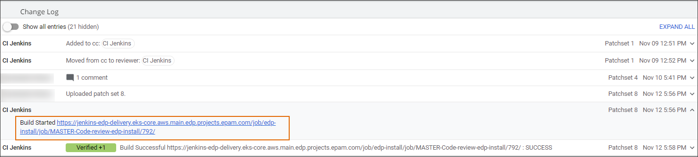

# Code Review Pipeline

This section provides details on the Code Review pipeline of the EDP CI/CD framework. Explore below the pipeline purpose, stages and possible actions to perform.

## Code Review Pipeline Purpose

The purpose of the Code Review pipeline contains the following points:

* Check out and test a particular developer's change (Patch Set) in order to inspect whether the code fits all the quality gates and can be built and tested;
* Be triggered if any new Patch Set appears in Gerrit;
* Send feedback about the build process in Jenkins to review the card in Gerrit;
* Send feedback about Sonar violations that have been found during the Sonar stage.

Find below the functional diagram of the Code Review pipeline with the default stages:

!

## Code Review Pipeline for Applications and Libraries

!!! note
    Make sure the necessary applications or libraries are added to the Admin Console. For the details on how to add a codebase, please refer to the [Add Application](add-application.md) or [Add Library](add-library.md) pages accordingly.

To discover the Code Review pipeline, apply changes that will trigger the Code Review pipeline automatically and take the following steps:

1. Navigate to Jenkins. In Admin Console, go to the **Overview** section on the left-side navigation bar and click the link to Jenkins.

  !

  or

  In Gerrit, go to the Patch Set page and click the CI Jenkins link in the Change Log section

  !

  !!! Note
      The Code Review pipeline starts automatically for every codebase type (Application, Autotests, Library).

2. Check the Code Review pipeline for the **application** of for the **library**. Click the application name in Jenkins and switch to the additional **release-01** branch that is created with the respective Code Review and Build pipelines.

3. Click the Code Review pipeline link to open the Code Review pipeline stages for the application:
  * Init - initialization of the codebase information and loading of the common libraries
  * gerrit-checkout / checkout - the checkout of patch sets from Gerrit. The stage is called _gerrit-checkout_ for the Create and Clone strategies of adding a codebase and _checkout_ for the Import strategy.
  * compile - the source code compilation
  * tests - the launch of the tests
  * sonar - the launch of the static code analyzer that checks the whole code
  * helm-lint - the launch of the linting tests for deployment charts
  * dockerfile-lint - the launch of the linting tests for Dockerfile
  * commit-validate - the stage is optional and appears under enabled integration with Jira. Please refer to the [Adjust Jira Integration](../operator-guide/jira-integration.md) and [Adjust VCS Integration With Jira](../operator-guide/jira-gerrit-integration.md) sections for the details.

!!! note
    For more details on EDP pipeline stages, please refer to the [Pipeline Stages](pipeline-stages.md) section.

## Code Review Pipeline for Autotests

To discover the Code Review pipeline for autotests, first, apply changes to a codebase that will trigger the Code Review pipeline automatically. The flow for the autotest is similar for that for applications and libraries, however, there are some differences. Explore them below.

1. Open the run.json file for the created autotest.

  !!! note
      Please refer to the [Add Autotest](add-autotest.md) page for the details on how to create an autotest.

  The run.json file keeps a command that is executed on this stage.

2. Open the Code Review pipeline in Jenkins (via the link in Gerrit or via the Admin Console Overview page) and click the **Configure** option from the left side. There are only four stages available:
Initialization - Gerrit-checkout - tests - sonar (the launch of the static code analyzer that checks the whole code).

3. Open the Code Review pipeline in Jenkins with the successfully passed stages.

## Retrigger Code Review Pipeline

The Code Review pipeline can be retriggered manually, especially if the pipeline failed before. To retrigger it, take the following steps:

1. In Jenkins, click the **Retrigger** option from the drop-down menu for the specific Code Review pipeline version number. Alternatively, click the Jenkins main page and select the **Query and Trigger Gerrit Patches** option.

2. Click Search and select the check box of the necessary change and patch set and then click **Trigger Selected**.

 As a result, the Code Review pipeline will be retriggered.

## Configure Code Review Pipeline

The **Configure** option allows adding/removing the stage from the Code Review pipeline if needed. To configure the Code Review pipeline, take the following steps:

1. Being in Jenkins, click the **Configure** option from the left-side menu.

2. Define the stages set that will be executed for the current pipeline. 
  * To remove a stage, select and remove the whole objects massive: **{"name"."tests"**}, where _name_ is a key and _tests_ is a stage name that should be executed. 
  * To add a stage, define the objects massive: **{"name"."tests"**}, where _name_ is a key and _tests_ is a stage name that should be added.

  !!! note
      All stages are launched from the shared library on GitHub. The list of libraries is located in the [edp-library-stages](https://github.com/epam/edp-library-stages) repository.

3. To apply the new stage process, retrigger the Code Review pipeline. For details, please refer to the [Retrigger Code Review Pipeline](#retrigger-code-review-pipeline) section.

4. Open Jenkins and check that there is no removed stage in the Code Review pipeline.

### Related Articles

* [Add Application](add-application.md)
* [Add Autotest](add-autotest.md)
* [Add Library](add-library.md)
* [Adjust Jira Integration](../operator-guide/jira-integration.md)
* [Adjust VCS Integration With Jira](../operator-guide/jira-gerrit-integration.md)
* [Autotest as Quality Gate](../use-cases/autotest-as-quality-gate.md)
* [Pipeline Stages](pipeline-stages.md)
