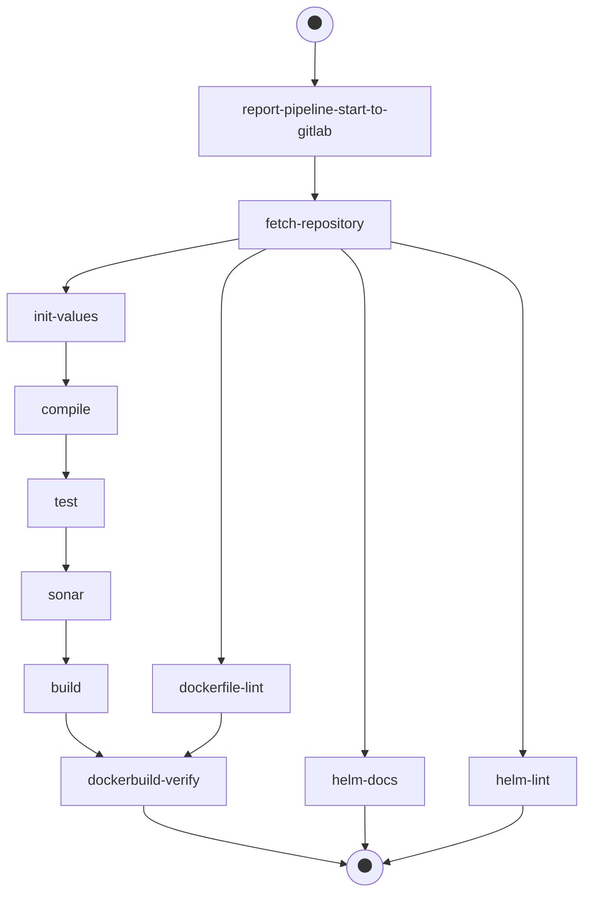

# Code Review Pipeline

This section provides details on the Code Review pipeline of the EDP CI/CD framework. Explore below the pipeline purpose, stages and possible actions to perform.

## Code Review Pipeline Purpose

The purpose of the Code Review pipeline contains the following points:

* Check out and test a particular developer's change (Patch Set) in order to inspect whether the code fits all the quality gates and can be built and tested;
* Be triggered if any new Patch Set appears in GitHub/GitLab/Gerrit;
* Send feedback about the build process in Tekton to review the card in Gerrit;
* Send feedback about Sonar violations that have been found during the Sonar stage.

Find below the functional diagram of the Code Review pipeline with the default stages:

