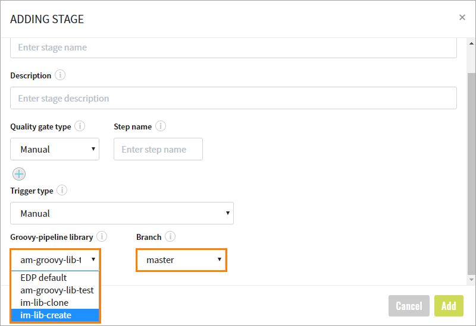

# Customize CD Pipeline

Apart from running CD pipeline stages with the default logic, there is the ability to perform the following:

* Create your own logic for stages;
* Redefine the default EDP stages of a CD pipeline.

In order to have the ability to customize a stage logic, create a CD pipeline stage source as a Library:

1. Navigate to the **Libraries** section of the Admin Console and create a library with the **Groovy-pipeline** code language:

  !!! note
      If you clone the library, make sure that the correct source branch is selected.

  

   Select the required fields to build your library:

  

2. Go to the **Continuous Delivery** section of the Admin Console and create a CD pipeline with the library stage source and its branch:

  

## Add New Stage

Follow the steps below to add a new stage:

* Clone the repository with the added library;
* Create a "stages" directory in the root;
* Create a **Jenkinsfile** with default content:

      @Library(['edp-library-stages', 'edp-library-pipelines']) _

      Deploy()

* Create a groovy file with a meaningful name, e.g. NotificationStage.groovy;
* Put the required construction and your own logic into the file:

      import com.epam.edp.stages.impl.cd.Stage

      @Stage(name = "notify")
      class Notify {
          Script script
          void run(context) {
          --------------- Put your own logic here ------------------
                  script.println("Send notification logic")
          --------------- Put your own logic here ------------------
          }
      }
      return Notify

* Add a new stage to the STAGES parameter of the Jenkins job of your CD pipeline:

  

  !!! warning
      To make this stage permanently present, please modify the [job provisioner](../operator-guide/manage-jenkins-cd-job-provision.md).

* Run the job to check that your new stage has been run during the execution.

## Redefine Existing Stage

By default, the following stages are implemented in EDP pipeline framework:

* deploy,
* deploy-helm,
* autotests,
* manual (Manual approve),
* promote-images.

Using one of these names for annotation in your own class will lead to redefining the default logic with your own.

Find below a sample of the possible flow of the redefining deploy stage:

* Clone the repository with the added library;
* Create a "stages" directory in the root;
* Create a **Jenkinsfile** with default content:

      @Library(['edp-library-stages', 'edp-library-pipelines']) _

      Deploy()

* Create a groovy file with a meaningful name, e.g. CustomDeployStage.groovy;
* Put the required construction and your own logic into the file:

      import com.epam.edp.stages.impl.cd.Stage

      @Stage(name = "deploy")
      class CustomDeployStage {
          Script script

          void run(context) {
          --------------- Put your own logic here ------------------
                  script.println("Custom deploy stage logic")
          --------------- Put your own logic here ------------------
          }
      }
      return CustomDeployStage

## Add a New Stage Using Shared Library via Custom Global Pipeline Libraries

!!! note
    To add a new Custom Global Pipeline Library, please refer to the [Add a New Custom Global Pipeline Library](add-custom-global-pipeline-lib.md) page.

To redefine any stage and add custom logic using global pipeline libraries, perform the steps below:

* Navigate to the **Libraries** section of the Admin Console and create a library with the **Groovy-pipeline** code language:

  

   Select the required fields to build your library:

  

* Clone the repository with the added library;
* Create a directory with the name `src/com/epam/edp/customStages/impl/cd/impl/` in the library repository, for instance: `src/com/epam/edp/customStages/impl/cd/impl/EmailNotify.groovy`;
* Add a Groovy file with another name to the same stages catalog, for instance – `EmailNotify.groovy`:

      package com.epam.edp.customStages.impl.cd.impl

      import com.epam.edp.stages.impl.cd.Stage

      @Stage(name = "notify")
      class Notify {
          Script script
          void run(context) {
          --------------- Put your own logic here ------------------
          script.println("Send notification logic")
          --------------- Put your own logic here ------------------
         }
      }

* Create a **Jenkinsfile** with default content and the added custom library to Jenkins:

      @Library(['edp-library-stages', 'edp-library-pipelines', 'edp-custom-shared-library-name']) _

      Deploy()

  !!! note
      `edp-custom-shared-library-name` is the name of your Custom Global Pipeline Library that should be added to the Jenkins Global Settings.

* Add a new stage to the STAGES parameter of the Jenkins job of your CD pipeline:

  

  !!! warning
      To make this stage permanently present, please modify the [job provisioner](../operator-guide/manage-jenkins-cd-job-provision.md).

  !!! note
      Pay attention to the appropriate annotation (EDP versions of all stages can be found on [GitHub](https://github.com/epam/edp-library-stages/tree/master/src/com/epam/edp/stages/impl/ci/impl)).

* Run the job to check that the new stage has been running during the execution.

## Redefine a Default Stage Logic via Custom Global Pipeline Libraries

!!! note
    To add a new Custom Global Pipeline Library, please refer to the [Add a New Custom Global Pipeline Library](add-custom-global-pipeline-lib.md) page.

By default, the following stages are implemented in EDP pipeline framework:

* deploy,
* deploy-helm,
* autotests,
* manual (Manual approve),
* promote-images.

Using one of these names for annotation in your own class will lead to redefining the default logic with your own.

To redefine any stage and add custom logic using global pipeline libraries, perform the steps below:

* Navigate to the **Libraries** section of the Admin Console and create a library with the **Groovy-pipeline** code language:

  

   Select the required fields to build your library:

  

* Clone the repository with the added library;
* Create a directory with the name `src/com/epam/edp/customStages/impl/cd/impl/` in the library repository, for instance: `src/com/epam/edp/customStages/impl/cd/impl/CustomDeployStage.groovy;`;
* Add a Groovy file with another name to the same stages catalog, for instance – `CustomDeployStage.groovy`:

      package com.epam.edp.customStages.impl.cd.impl

      import com.epam.edp.stages.impl.cd.Stage

      @Stage(name = "deploy")
      class CustomDeployStage {
          Script script

          void run(context) {
          --------------- Put your own logic here ------------------
                  script.println("Custom deploy stage logic")
          --------------- Put your own logic here ------------------
          }
      }

* Create a **Jenkinsfile** with default content and the added custom library to Jenkins:

      @Library(['edp-library-stages', 'edp-library-pipelines', 'edp-custom-shared-library-name']) _

      Deploy()

  !!! note
      `edp-custom-shared-library-name` is the name of your Custom Global Pipeline Library that should be added to the Jenkins Global Settings.

  !!! note
      Pay attention to the appropriate annotation (EDP versions of all stages can be found on [GitHub](https://github.com/epam/edp-library-stages/tree/master/src/com/epam/edp/stages/impl/ci/impl)).

### Related Articles

* [Add a New Custom Global Pipeline Library](add-custom-global-pipeline-lib.md)
* [Manage Jenkins CD Pipeline Job Provisioner](../operator-guide/manage-jenkins-cd-job-provision.md)