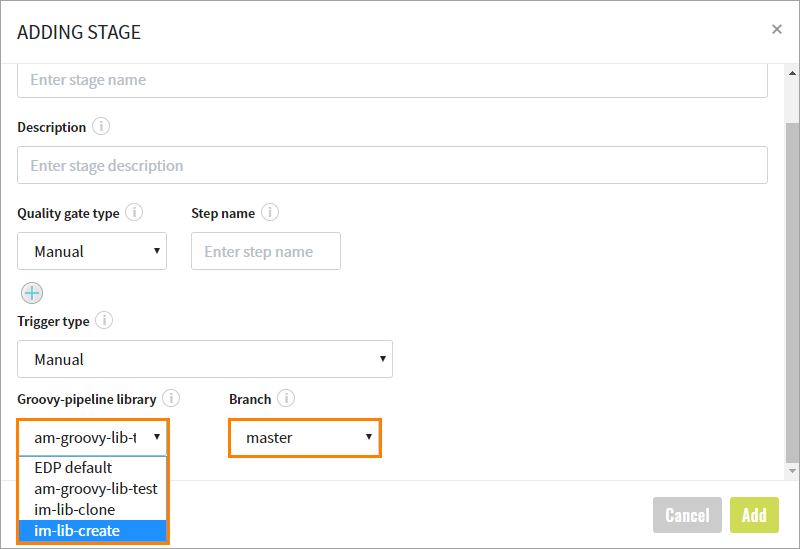

# Customize CD Pipeline

Apart from running CD pipeline stages with the default logic, there is the ability to perform the following:

* Create your own logic for stages;
* Redefine the default EDP stages of a CD pipeline.

In order to have the ability to customize a stage`s logic, create a CD pipeline stage source as a Library:

1. Create a library in Admin Console with the `Groovy-pipeline` code language:
  
2. Create a CD pipeline with the library stage`s source and its branch:
  

## Add New Stage

Follow the steps below to add a new stage:

* Clone the repository with the added library;
* Create a "stages" directory in the root;
* Create a groovy file with a meaningful name, e.g. NotificationStage.groovy;
* Put the required construction and your own logic into the file:

      import com.epam.edp.stages.impl.cd.Stage

      @Stage(name = "notify")
      class Notify {
          Script script
          void run(context) {
          --------------- Put your own logic here ------------------
                  script.println("Send notification logic")
          --------------- Put your own logic here ------------------
          }
      }
      return Notify

* Add a new stage to the STAGES parameter of the Jenkins job of your CD pipeline:

* Run the job to check that your new stage has been run during the execution.

## Redefine Existing Stage

By default, the following stages are implemented in EDP pipeline framework:

* deploy,
* deploy-helm,
* autotests,
* manual (Manual approve),
* promote-images,
* promote-images-ecr.

If you use one of these names for annotation in your own class, it will lead to redefining the default logic with your own.

Find below a sample of the possible flow of the redefining deploy stage:

* Clone the repository with the added library;
* Create a "stages" directory in the root;
* Create a Jenkinsfile with default content:

      @Library(['edp-library-stages', 'edp-library-pipelines']) _

      Deploy()

* Create a groovy file with a meaningful name, e.g. CustomDeployStage.groovy;
* Put the required construction and your own logic into the file:

      import com.epam.edp.stages.impl.cd.Stage

      @Stage(name = "deploy")
      class CustomDeployStage {
          Script script

          void run(context) {
          --------------- Put your own logic here ------------------
                  script.println("Custom deploy stage logic")
          --------------- Put your own logic here ------------------
          }
      }
      return CustomDeployStage
