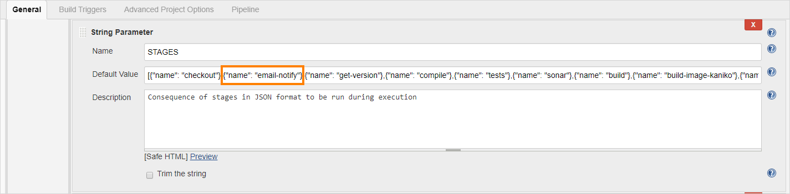

# Customize CI Pipeline

This chapter describes the main steps that should be followed when customizing a CI pipeline.

## Redefine a Default Stage Logic for a Particular Application

To redefine any stage and add custom logic, perform the steps below:

1. Open the GitHub repository:
  * Create a directory with the name “stages” in the application repository;
  * Create a Groovy file with a meaningful name for a custom stage description, for instance: _CustomSonar.groovy_.

2. Paste the copied skeleton from the reference stage and insert the necessary logic.

  !!! note
      Pay attention to the appropriate annotation (EDP versions of all stages can be found on [GitHub](https://github.com/epam/edp-library-stages/tree/master/src/com/epam/edp/stages/impl/ci/impl)).

  The stage logic structure is the following:

  **CustomSonar.groovy**

      import com.epam.edp.stages.impl.ci.ProjectType
      import com.epam.edp.stages.impl.ci.Stage

      @Stage(name = "sonar", buildTool = ["maven"], type = [ProjectType.APPLICATION, ProjectType.AUTOTESTS, ProjectType.LIBRARY])
      class CustomSonar {
          Script script
          void run(context) {
              script.sh "echo 'Your custom logic of the stage'"
          }
      }
      return CustomSonar

  !!! info
      There is the ability to redefine the predefined EDP stage as well as to create it from scratch, it depends on the name that is used in the _@Stage_ annotation. For example, using **name = "sonar"** will redefine an existing **sonar** stage with the same name, but using **name="new-sonar"** will create a new stage.

  By default, the following stages are implemented in EDP:

  * build
  * build-image-from-dockerfile
  * build-image
  * build-image-kaniko
  * checkout
  * compile
  * create-branch
  * gerrit-checkout
  * get-version
  * git-tag
  * push
  * sonar
  * sonar-cleanup
  * tests
  * trigger-job

  Mandatory points:

  * Importing classes com.epam.edp.stages.impl.ci.ProjectType and com.epam.edp.stages.impl.ci.Stage;
  * Annotating "Stage" for class - @Stage(name = "sonar", buildTool = ["maven"], type = [ProjectType.APPLICATION, ProjectType.AUTOTESTS, ProjectType.LIBRARY]);
  * Property with the type "Script";
  * Void the "run" method with the "context input parameter" value;
  * Bring the custom class back to the end of the file: return CustomSonar.

3. Open Jenkins and make sure that all your changes are correct after the completion of the customized pipeline.

## Add a New Stage for a Particular Application

To add a new stage for a particular application, perform the steps below:

1. In GitHub repository, add a Groovy file with another name to the same **stages** catalog.
2. Copy the part of a pipeline framework logic that cannot be predefined;

    The stage logic structure is the following:

    **EmailNotify.groovy**

      import com.epam.edp.stages.impl.ci.ProjectType
      import com.epam.edp.stages.impl.ci.Stage

      @Stage(name = "email-notify", buildTool = "maven", type = ProjectType.APPLICATION)
      class EmailNotify {
          Script script
          void run(context) {
              -------------------'Your custom logic here'
          }
      }
      return EmailNotify

3. Open the default set of stages and add a new one into the _Default Value_ field by saving the respective type {"name": "email-notify"}, save the changes:
  

4. Open Jenkins to check the pipeline; as soon as the checkout stage is passed, the new stage will appear in the pipeline:
  

  !!! warning
      To make this stage permanently present, please modify the [job provisioner](../operator-guide/manage-jenkins-ci-job-provision.md).

## Redefine a Default Stage Logic via Custom Global Pipeline Libraries

!!! note
    To add a new Custom Global Pipeline Library, please refer to the [Add a New Custom Global Pipeline Library](add-custom-global-pipeline-lib.md) page.

To redefine any stage and add custom logic using global pipeline libraries, perform the steps below:

1. Open the GitHub repository:

  * Create a directory with the name `/src/com/epam/edp/customStages/impl/ci/impl/stageName/` in the library repository, for instance: `/src/com/epam/edp/customStages/impl/ci/impl/sonar/`;
  * Create a Groovy file with a meaningful name for a custom stage description, for instance – `CustomSonar.groovy`.

2. Paste the copied skeleton from the reference stage and insert the necessary logic.

  !!! note
      Pay attention to the appropriate annotation (EDP versions of all stages can be found on [GitHub](https://github.com/epam/edp-library-stages/tree/master/src/com/epam/edp/stages/impl/ci/impl)).

  The stage logic structure is the following:

  **CustomSonar.groovy**

      package com.epam.edp.customStages.impl.ci.impl.sonar

      import com.epam.edp.stages.impl.ci.ProjectType
      import com.epam.edp.stages.impl.ci.Stage

      @Stage(name = "sonar", buildTool = ["maven"], type = [ProjectType.APPLICATION, ProjectType.AUTOTESTS, ProjectType.LIBRARY])
      class CustomSonar {
          Script script
          void run(context) {
              script.sh "echo 'Your custom logic of the stage'"
          }
      }
      return CustomSonar

  !!! info
      There is the ability to redefine the predefined EDP stage as well as to create it from scratch, it depends on the name that is used in the _@Stage_ annotation. For example, using **name = "sonar"** will redefine an existing **sonar** stage with the same name, but using **name="new-sonar"** will create a new stage.

  By default, the following stages are implemented in EDP:

  * build
  * build-image-from-dockerfile
  * build-image
  * build-image-kaniko
  * checkout
  * compile
  * create-branch
  * gerrit-checkout
  * get-version
  * git-tag
  * push
  * sonar
  * sonar-cleanup
  * tests
  * trigger-job

  Mandatory points:

  * Defining a package com.epam.edp.customStages.impl.ci.impl.stageName;
  * Importing classes com.epam.edp.stages.impl.ci.ProjectType and com.epam.edp.stages.impl.ci.Stage;
  * Annotating "Stage" for class - @Stage(name = "sonar", buildTool = ["maven"], type = [ProjectType.APPLICATION, ProjectType.AUTOTESTS, ProjectType.LIBRARY]);
  * Property with the type "Script";
  * Void the "run" method with the "context input parameter" value;
  * Bring the custom class back to the end of the file: return CustomSonar.

3.Open Jenkins and make sure that all your changes are correct after the completion of the customized pipeline.

## Add a New Stage Using Shared Library via Custom Global Pipeline Libraries

!!! note
    To add a new Custom Global Pipeline Library, please refer to the [Add a New Custom Global Pipeline Library](add-custom-global-pipeline-lib.md) page.

To redefine any stage and add custom logic using global pipeline libraries, perform the steps below:

1. Open the GitHub repository:

  * Create a directory with the name `/src/com/epam/edp/customStages/impl/ci/impl/stageName/` in the library repository, for instance: `/src/com/epam/edp/customStages/impl/ci/impl/email-notify/`;
  * Add a Groovy file with another name to the same stages catalog, for instance – `EmailNotify.groovy`.

2. Copy the part of a pipeline framework logic that cannot be predefined;

  !!! note
      Pay attention to the appropriate annotation (EDP versions of all stages can be found on [GitHub](https://github.com/epam/edp-library-stages/tree/master/src/com/epam/edp/stages/impl/ci/impl)).

  The stage logic structure is the following:

  **EmailNotify.groovy**

      package com.epam.edp.customStages.impl.ci.impl.emailNotify

      import com.epam.edp.stages.impl.ci.ProjectType
      import com.epam.edp.stages.impl.ci.Stage

      @Stage(name = "email-notify", buildTool = "maven", type = ProjectType.APPLICATION)
      class EmailNotify {
          Script script
          void run(context) {
              -------------------'Your custom logic here'
          }
      }
      return EmailNotify

3. Open the default set of stages and add a new one into the _Default Value_ field by saving the respective type {"name": "email-notify"}, save the changes:
  

4. Open Jenkins to check the pipeline; as soon as the checkout stage is passed, the new stage will appear in the pipeline:
  

  !!! warning
      To make this stage permanently present, please modify the [job provisioner](../operator-guide/manage-jenkins-ci-job-provision.md).
