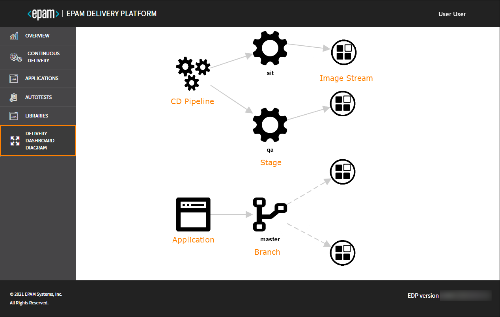

# Delivery Dashboard Diagram

Admin Console allows getting the general visualization of all the relations between CD pipeline, stages, codebases,
branches, and image streams that are elements with the specific icon.
To open the current project diagram, navigate to the **Delivery Dashboard Diagram** section on the navigation
bar:

!

!!! info
    All the requested changes (deletion, creation, adding) are displayed immediately on the Delivery Dashboard Diagram.

Possible actions when using dashboard:

- To zoom in or zoom out the diagram scale, scroll up / down.
- To move the diagram, click and drag.
- To move an element, click it and drag to the necessary place.
- To see the relations for one element, click this element.
- To see the whole diagram, click the empty space.

### Related Articles

- [EDP Admin Console](index.md)
