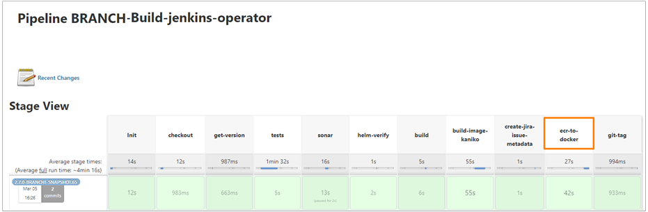

# Promote Docker Images From ECR to Docker Hub

This section contains the description of the **ecr-to-docker** stage, available in the **Build** pipeline.

The **ecr-to-docker** stage is intended to perform the push of Docker images collected from the Amazon ECR cluster storage to Docker Hub repositories, where the image becomes accessible to everyone who wants to use it.
This stage is optional and is designed for working with various EDP components.

!!! note
    When pushing the image from ECR to Docker Hub using [crane](https://michaelsauter.github.io/crane/docs.html), the **SHA-256** value remains unchanged.

To run the **ecr-to-docker** stage just for once, navigate to the **Build with Parameters** option, add this stage to the stages list, and click Build. 
To add the **ecr-to-docker** stage to the pipeline, modify the [job provisioner](../operator-guide/manage-jenkins-ci-job-provision.md).

!!! note
    To push properly the Docker image from the ECR storage, the **ecr-to-docker** stage should follow the **build-image-kaniko** stage.
    !

The **ecr-to-docker** stage contains a specific script that launches the following actions:

1. Performs authorization in AWS ECR in the EDP private storage via [awsv2](https://docs.aws.amazon.com/cli/latest/userguide/cli-chap-welcome.html).
2. Performs authorization in the Docker Hub.
3. Checks whether a similar image exists in the Docker Hub in order to avoid its overwriting.

  - If a similar image exists in the Docker Hub, the script will return the message about it and stop the execution. The **ecr-to-docker** stage in the Build pipeline will be marked in red.
  - If there is no similar image, the script will proceed to promote the image using [crane](https://michaelsauter.github.io/crane/docs.html).

## Create Secret for ECR-to-Docker Stage

The **ecr-to-docker** stage expects the authorization credentials to be added as Kubernetes secret into EDP-installed namespace. To create the **dockerhub-credentials** secret, run the following command:

      kubectl -n <edp-project> create secret generic dockerhub-credentials \
      --from-literal=accesstoken=<dockerhub_access_token> \
      --from-literal=account=<dockerhub_account_name> \
      --from-literal=username=<dockerhub_user_name>

!!! note
    - The &#8249;**dockerhub_access_token**&#8250; should be created beforehand and in accordance with the [official Docker Hub instruction](https://docs.docker.com/docker-hub/access-tokens/).
    - The &#8249;**dockerhub_account_name**&#8250; and &#8249;**dockerhub_user_name**&#8250; for the organization account repository will differ and be identical for the personal account repository.
    - Pay attention that the Docker Hub repository for images uploading should be created beforehand and named by the following pattern: *&#8249;dockerhub_account_name&#8250;/&#8249;Application Name&#8250;*, where the &#8249;Application Name&#8250; should match the application name in the EDP Admin Console.

### Related Articles

- [EDP Pipeline Framework](pipeline-framework.md)
- [Manage Access Token](https://docs.docker.com/docker-hub/access-tokens/)
- [Manage Jenkins CI Pipeline Job Provisioner](../operator-guide/manage-jenkins-ci-job-provision.md)