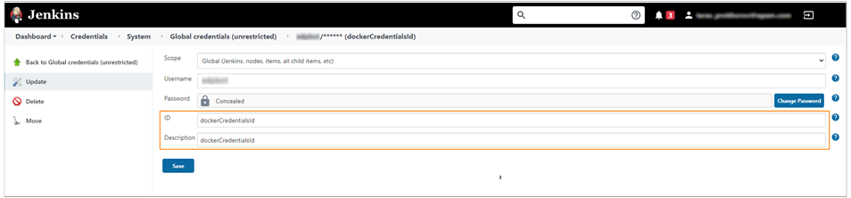
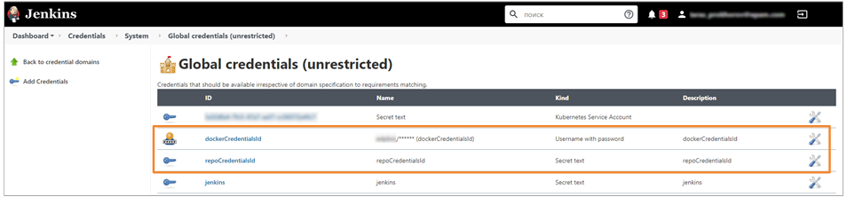

# Promote Docker Images From ECR to Docker Hub

This section contains the description of the **ecr-to-docker** stage, available in the **Build** pipeline.

The **ecr-to-docker** stage is intended to perform the push of Docker images collected from the Amazon ECR cluster storage to Docker Hub repositories, where the image becomes accessible to everyone who wants to use it.

This stage is optional and is designed for working with various EDP components.

!!! note
    When pushing the image from ECR to Docker Hub using [crane](https://michaelsauter.github.io/crane/docs.html), the **SHA-256** value remains unchanged.

The **ecr-to-docker** stage contains a specific script that launches the following actions:

1. Performs authorization in AWS ECR in the EDP private storage via [awsv2](https://docs.aws.amazon.com/cli/latest/userguide/cli-chap-welcome.html).
2. Performs authorization in the Docker Hub.
3. Checks whether a similar image exists in the Docker Hub in order to avoid its overwriting.

  - If a similar image exists in the Docker Hub, the script will return the message about it and stop the execution. The **ecr-to-docker** stage in the Build pipeline will be marked in red.
  - If there is no similar image, the script will proceed to promote the image using [crane](https://michaelsauter.github.io/crane/docs.html).

EDP expects authorization credentials to be added in Jenkins under the following names **dockerCredentialsId** and **repoCredentialsID**. To get more information on how to create credentials, see the section **Create Credentials for ECR-to-Docker Stage** below.

## Create Credentials for ECR-to-Docker Stage

The **dockerCredentialsId** and **repoCredentialsID** credentials are expected to be set in Jenkins in order to use the **ecr-to-docker** stage. Inspect below the instructions on how to create the required credentials.

### dockerCredentialsId

In order to create the **dockerCredentialsId** value, perform the following steps:

1. Go to **Jenkins** -> **Manage Jenkins** –> **Manage Credentials** section.
2. Click the Add Credentials button and select **Username with password** in the **Kind** field.
3. In the **Username** field, enter the login of the account from which the push will be made and add the password field.
4. Specify the **ID** and **description** fields. Pay attention to add the **dockerCredentialsId** value in both fields.
5. Click the Save button.
  

### repoCredentialsId

The **repoCredentialsId** value is created in order to indicate the name of the repository that does not match the login of the Docker account.
Due to the fact that the repository can be an Enterprise solution and, accordingly, users can push images to the repository from other accounts connected within the Docker Hub Organization.

To create the **repoCredentialsID** value, follow the steps below:

1. Go to **Jenkins** -> **Manage Jenkins** –> **Manage Credentials** section.
2. Click the Add Credentials button and select **Secret text** in the **Kind** field.
3. Enter the text that will be encrypted by Jenkins, in the **Secret** field.
4. Specify the **ID** and **description** fields. Pay attention to add the **repoCredentialsID** value in both fields.
5. Click the Save button.
  

As a result, the created credentials will appear in Jenkins in the **Global credentials** section.

### Related Articles

- [EDP Pipeline Framework](pipeline-framework.md)
