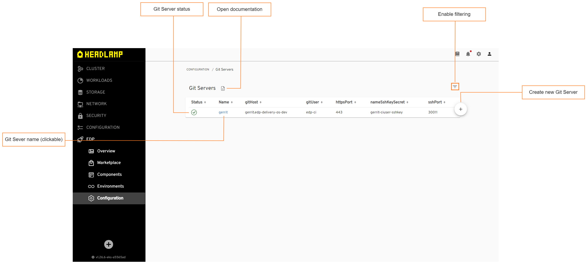

# Manage Git Servers

Git Server is responsible for integration with Version Control System, whether it is GitHub, GitLab or Gerrit.


The Git Server is set via the **global.gitProvider** parameter of the [values.yaml](https://github.com/epam/edp-install/blob/release/3.5/deploy-templates/values.yaml#L14) file.

To view the current Git Server, you can open `EDP` -> `Configuration` -> `Git Servers` and inspect the following properties:

!

* **Git Server status and name** - displays the Git Server status, which depends on the Git Server integration status (Success/Failed).

* **Git Server properties** - displays the Git Server type, its host address, username, SSH/HTTPS port, and name of the secret that contains SSH key.

* **Open documentation** - opens the "Manage Git Servers" documentation page.

## View Authentication Data

To view authentication data that is used to connect to the Git server, use `kubectl describe` command as follows:

  ```bash
  kubectl describe GitServer git_server_name -n edp
  ```

## Delete Git Server

To remove a Git Server from the Git Servers list, utilize the `kubectl delete` command as follows:

  ```bash
  kubectl delete GitServer git_server_name -n edp
  ```

## Related Articles

* [Add Git Server](../user-guide/add-git-server.md)
* [Integrate GitHub/GitLab in Tekton](../operator-guide/import-strategy-tekton.md)