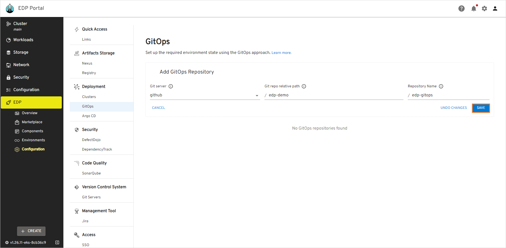
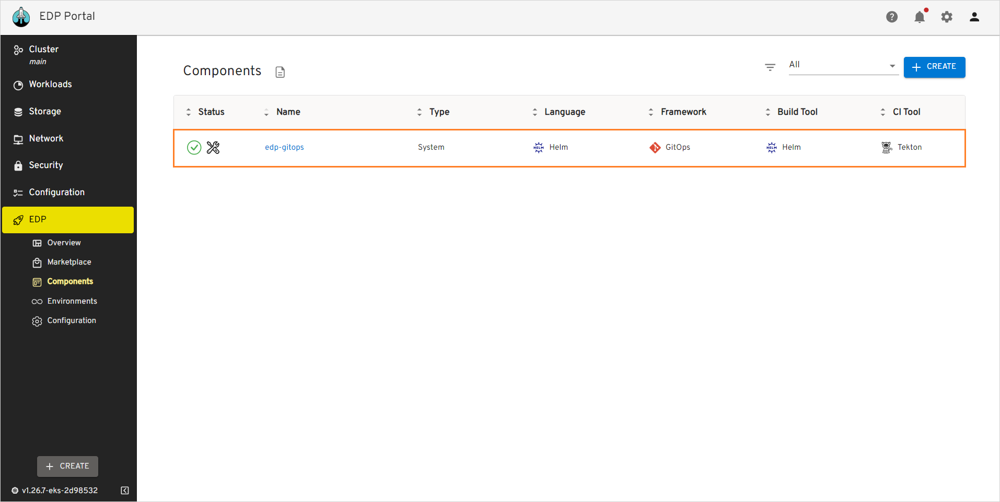
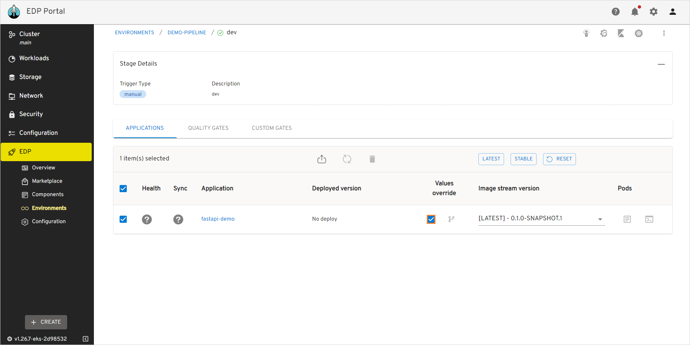

# Manage GitOps

This page is dedicated to the GitOps section of the Configuration tab, the process of establishing the GitOps repository, outline benefits it extends to users within the platform capabilities. GitOps, short for "Git Operations", is a modern approach to managing and automating infrastructure and application deployments. In GitOps, the desired state of your environment is declared and stored in a Git repository. With GitOps, you can ensure that your infrastructure and applications are always in sync with your intended configurations and readily adapt to changing requirements.

## Overview

The purpose of the GitOps section is to provide users with the ability to customize the state of their environments with the help of GitOps approach that enables you to store your entire deployment configuration in a Git repository, providing version control for changes, consistent collaboration, and automated deployments. Enforcing GitOps allows you to declaratively define and automate your configurations, ensuring consistency, version control, and collaboration within your team.

## Add GitOps Repository

GitOps repository is added in two steps:

1. Navigate to **KubeRocketCI** -> **Components** -> **GitOps**. Fill in the required fields (in case VCS supports nesting) and click **Save**:

  !

2. Check the GitOps repository connected to the platform:

  !

In addition to it, the system Codebase is called the same as the GitOps repository will be added to the Codebase list of the Components section:

  !

!!! note
    The platform allows only one GitOps repository at a time.

## GitOps Usage

Once the GitOps repository is added to the platform, you can set custom parameters for the deployed Helm Chart. To redefine the parameters, follow the steps below:

1. In the GitOps repository, create the values.yaml file according to the `<pipeline-name>/<stage-name>/<application-name>-values.yaml` pattern.

2. In the created values.yaml file, enter the parameters with their custom values.

3. Navigate to the Environments section. Open the created environment, open its stage and deploy it with the **Values override** checkbox selected as it is shown below:

  !

## Delete GitOps Repository

In case you need to delete the GitOps repository, do the following:

1. Delete the GitOps repository in the Git provider.

2. Delete the Codebase custom resource using the `kubectl delete` command:

    ```bash
    kubectl delete Codebase edp-gitops -n edp
    ```

## Related Articles

* [Add CD Pipeline](../user-guide/add-cd-pipeline.md)
* [Cluster Add-Ons Overview](../operator-guide/add-ons-overview.md)
* [Manage Clusters](cluster.md)
