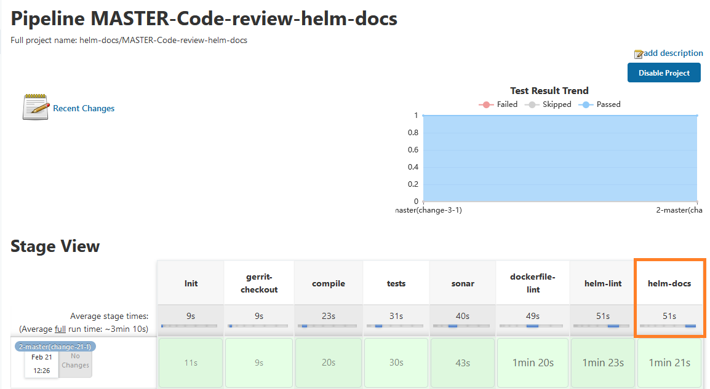

# Helm Chart Testing and Documentation Tools

This section contains the description of the **helm-lint** and **helm-docs** stages that can be used in the Code Review pipeline.

The stages help to obtain a quick response on the validity of the helm chart code and documentation in the Code Review pipeline.

Inspect the functions performed by the following stages:

1. [**helm-lint**](https://github.com/helm/chart-testing#chart-testing) stage launches the _ct lint --charts-deploy-templates/_ command in order to validate the chart.

  !

   * [chart_schema.yaml](https://github.com/helm/chart-testing/blob/main/etc/chart_schema.yaml) - this file contains some rules by which the chart validity is checked. These rules are necessary for the YAML scheme validation.

   See the current scheme:

  <details>
  <summary><b>View: chart_schema.yaml</b></summary>

```yaml

name: str()
home: str()
version: str()
type: str()
apiVersion: str()
appVersion: any(str(), num())
description: str()
keywords: list(str(), required=False)
sources: list(str(), required=True)
maintainers: list(include('maintainer'), required=True)
dependencies: list(include('dependency'), required=False)
icon: str(required=False)
engine: str(required=False)
condition: str(required=False)
tags: str(required=False)
deprecated: bool(required=False)
kubeVersion: str(required=False)
annotations: map(str(), str(), required=False)
---
maintainer:
  name: str(required=True)
  email: str(required=False)
  url: str(required=False)
---
dependency:
  name: str()
  version: str()
  repository: str()
  condition: str(required=False)
  tags: list(str(), required=False)
  enabled: bool(required=False)
  import-values: any(list(str()), list(include('import-value')), required=False)
  alias: str(required=False)


```

  </details>

   * **ct.yaml** - this file contains rules that will skip the validation of certain rules.

   To get more information about the chart testing lint, please refer to the [ct_lint](https://github.com/helm/chart-testing/blob/main/doc/ct_lint.md) documentation.

2. [**helm-docs**](https://github.com/norwoodj/helm-docs#helm-docs) stage helps to validate the generated documentation for the Helm deployment templates in the Code Review pipeline for all types of applications supported by EDP. This stage launches the _helm-docs_ command in order to validate the chart documentation file existence and verify its relevance.

  **Requirements**: [helm-docs v1.10.0](https://github.com/norwoodj/helm-docs/releases/tag/v1.10.0)

  !!! Note
      The **helm-docs** stage is optional. To extend the pipeline with an additional stage, please refer to the [Configure Code Review Pipeline](../code-review-pipeline/#configure-code-review-pipeline) page.

  !

  !!! Note
      The example of the generated [documentation](https://github.com/epam/edp-install/blob/master/deploy-templates/README.md).

### Related Articles

* [EDP Pipeline Framework](pipeline-framework.md)
