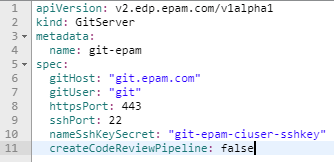
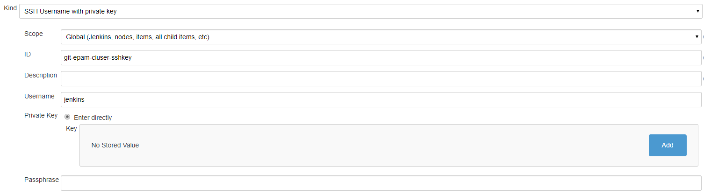

# Adjust Import Strategy

In order to use the import strategy, it is required to add Secret with SSH key, GitServer CR, and Jenkins credentials by following the steps below:

1. Create Secret in the OpenShift/K8S namespace for the Git account with the **id_rsa**, **id_rsa.pub**, and **username** fields:
  

  As a sample, it is possible to use the following command:

      kubectl create secret generic gitlab -n edp \
        --from-file=id_rsa=id_rsa \
        --from-file id_rsa.pub=id_rsa.pub \
        --from-literal=username=user@gitlab.com

1. Create GitServer CR in the OpenShift/K8S namespace with the **gitHost**, **gitUser**, **httpsPort**, **sshPort**, **nameSshKeySecret**, and **createCodeReviewPipeline** fields:

  

  As a sample, it is possible to use the following template:

      apiVersion: v2.edp.epam.com/v1alpha1
      kind: GitServer
      metadata:
        name: git-example
      spec:
        createCodeReviewPipeline: false
        gitHost: git.example.com
        gitUser: git
        httpsPort: 443
        nameSshKeySecret: gitlab-sshkey
        sshPort: 22

  !!! note
    The value of the **nameSshKeySecret** property is the name of the Secret that is indicated in the first point above.

1. Create a Credential in Jenkins with the same ID as in the **nameSshKeySecret** property, and with the private key. Navigate to **Jenkins -> Credentials -> System -> Global credentials -> Add Credentials**:

  

1. Change the Deployment Config of the Admin Console by adding the **Import** strategy to the **INTEGRATION_STRATEGIES** variable:

  

1. As soon as the Admin Console is redeployed, the **Import** strategy will be added to the Create Application page. For details, please refer to the [Add Applications](add-application.md) page.
