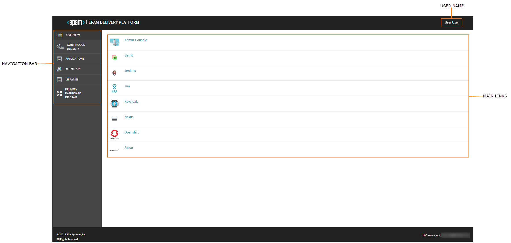

# Overview

The EDP User guide is intended for developers and provides details on working with EDP Admin Console, different codebase types and EDP CI/CD flow.

## Admin Console

Admin Console is a central management tool in the EDP ecosystem that provides the ability to define pipelines, project resources and new technologies in a simple way. Using Admin Console enables to manage business entities:

- Create such codebase types as Applications, Libraries and Autotests;
- Create/Update CD Pipelines;

!!! note
    To interact with Admin Console via REST API, explore the [Create Codebase Entity](../developer-guide/rest-api.md) page.

- **Navigation bar** – consists of six sections: Overview, Continuous Delivery, Applications, Autotests, Libraries, and Delivery Dashboard Diagram. Click the necessary section to add an entity, open a home page or check the diagram.
- **User name** – displays the registered user name.
- **Main links** – displays the corresponding links to the major adjusted toolset, to the management tool and to the OpenShift cluster.

Admin Console is a complete tool allowing to manage and control added to the environment codebases (applications, autotests, libraries) as well as to create a CD pipeline and check the visualization diagram.
Inspect the main features available in Admin Console by following the corresponding link:

- [Add Application](add-application.md)
- [Add Autotest](add-autotest.md)
- [Add Library](add-library.md)
- [Add CD Pipeline](add-cd-pipeline.md)
- [Delivery Dashboard Diagram](d-d-diagram.md)
