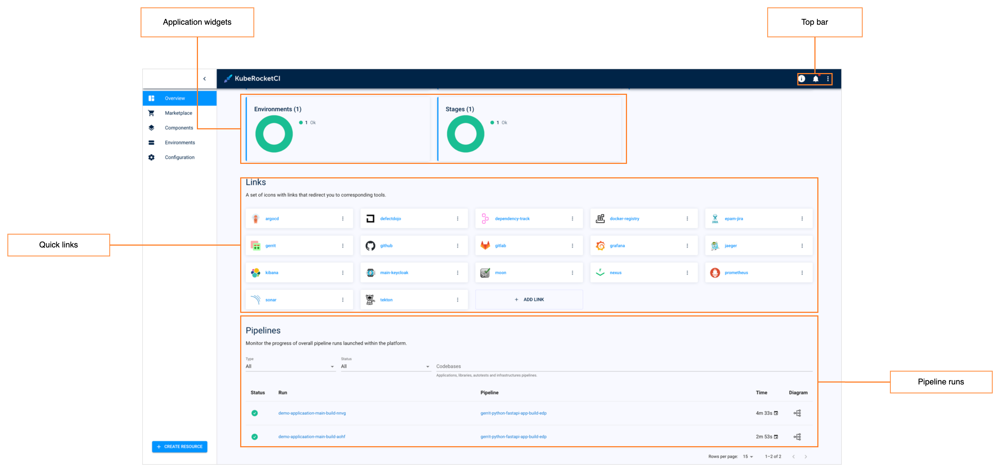

# Overview

The KubeRocketCI (a.k.a. EPAM Delivery Platform) portal user guide is intended for developers and provides details on working with the KubeRocketCI portal, different codebase types, and the KubeRocketCI CI/CD flow.

## KubeRocketCI Portal

The KubeRocketCI portal is a central management tool in the KubeRocketCI ecosystem that provides the ability to define pipelines, project resources and new technologies in a simple way. Using the KubeRocketCI portal enables to manage business entities:

- Create such codebase types as Applications, Libraries, Autotests and Infrastructures;
- Create/Update CD Pipelines;
- Add external Git servers and Clusters.

Below is the Overview page of the KubeRocketCI portal:

!

* **Application widgets** – shows the information on codebases created in the default and allowed namespaces, reflecting the overall amount of entities and their statuses.
* **Top bar panel** – contains documentation link, notifications, KubeRocketCI portal settings, and cluster settings, such as default and allowed namespaces.
* **Quick links** – displays the corresponding links to the major adjusted toolset.
* **Pipeline runs** – displays all the pipeline runs initiated in both the default and allowed namespaces.

KubeRocketCI portal is a complete tool allowing to manage and control the codebases (applications, autotests, libraries and infrastructures) added to the environment as well as to create a CD pipeline.

Inspect the main features available in the KubeRocketCI portal by following the corresponding link:

- [Add Application](add-application.md)
- [Add Autotest](add-autotest.md)
- [Add Library](add-library.md)
- [Add Git Server](add-git-server.md)
- [Add CD Pipeline](add-cd-pipeline.md)
- [Add Quality Gate](add-quality-gate.md)
