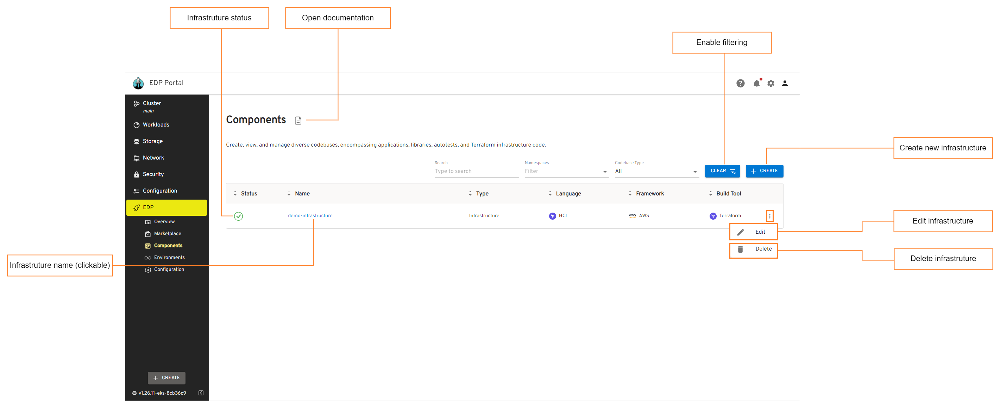
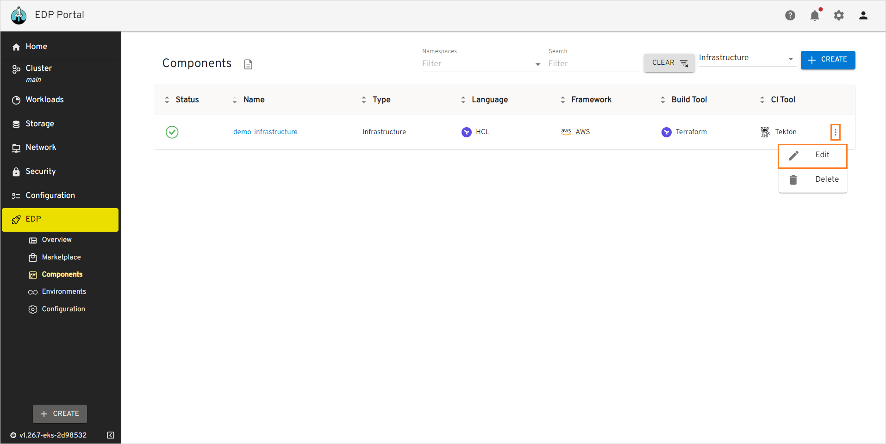
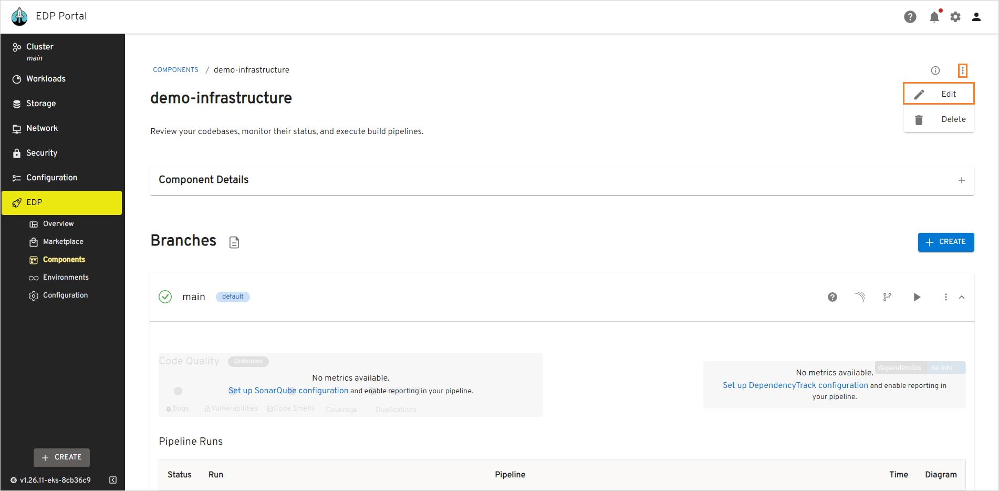
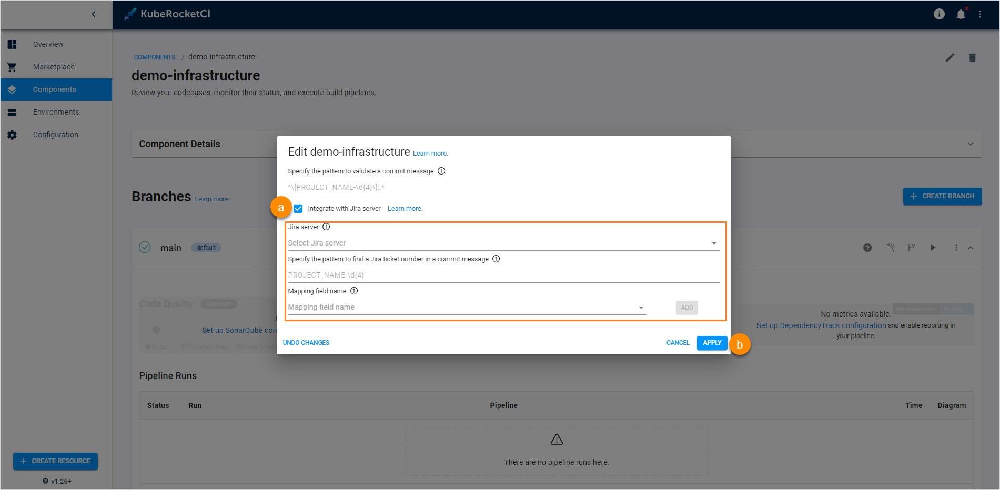

# Manage Infrastructures

This section describes the subsequent possible actions that can be performed with the newly added or existing infrastructures.

## Check and Remove Inrastructure

As soon as the infrastructure is successfully provisioned, the following will be created:

- An Infrastructure Codebase type will appear in the Codebase list of the Components section.
- With the **Create** strategy, a new project will be generated on GitHub or another integrated VCS. When **Clone** is chosen, the repository will be forked from the original and copied to the KubeRocketCI-integrated repository. If **Import** is selected, the platform connects to the chosen repository.

The added infrastructure will be listed in the infrastructure list allowing you to do the following:

!

* **Infrastructure status** - displays the infrastructure status. Can be red or green depending on if the KubeRocketCI portal managed to connect to the Git Server with the specified credentials or not.
* **Infrastructure name (clickable)** - displays the infrastructure name set during the library creation.
* **Open documentation** - opens the infrastructure related documentation page.
* **Enable filtering** - enables filtering by library name and namespace where this custom resource is located in.
* **Create new infrastructure** - displays the **Create new component** menu.
* **Edit infrastructure** - edit the infrastructure by selecting the options icon next to its name in the infrastructures list, and then selecting **Edit**. For details see the [Edit Existing Infrastructure](#edit-existing-infrastructure) section.
* **Delete infrastructure** - remove infrastructure by clicking the vertical ellipsis button and then selecting **Delete**.

There are also options to sort the infrastructures:

* Sort the existing infrastructures in a table by clicking the sorting icons in the table header. Sort the infrastructures alphabetically by their name, language, build tool, framework, and CI tool. You can also sort the infrastructures by their status: Created, Failed, or In progress.

* Select a number of infrastructures displayed per page (15, 25 or 50 rows)  and navigate between pages if the number of items exceeds the capacity of a single page.

## Edit Existing Infrastructure

KubeRocketCI portal provides the ability to enable, disable or edit the Jira Integration functionality for infrastructures.

1. To edit an infrastructure directly from the infrastructures overview page or when viewing the infrastructure data:

  - Select **Edit** in the options icon menu:

  !

  !

  - The **Edit Infrastructure** dialog opens.

2. To enable Jira integration, in the **Edit Infrastructure** dialog do the following:

   !

   a. Mark the **Integrate with Jira server** check box and fill in the necessary fields. Please see steps d-h on the [Add Infrastructure page](add-infrastructure.md#the-advanced-settings-menu).

   b. Select the **Apply** button to apply the changes.

3. To disable Jira integration, in the **Edit Infrastructure** dialog do the following:

   a. Clear the **Integrate with Jira server** check box.

   b. Select the **Apply** button to apply the changes.

4. To create, edit and delete infrastructure branches, please refer to the [Manage Branches](../user-guide/manage-branches.md) page.

## Related Articles

* [Add Infrastructure](add-infrastructure.md)
* [Manage Branches](../user-guide/manage-branches.md)
