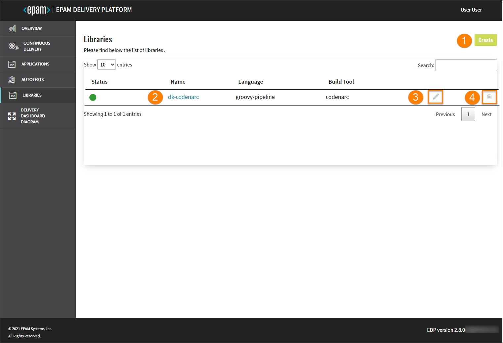
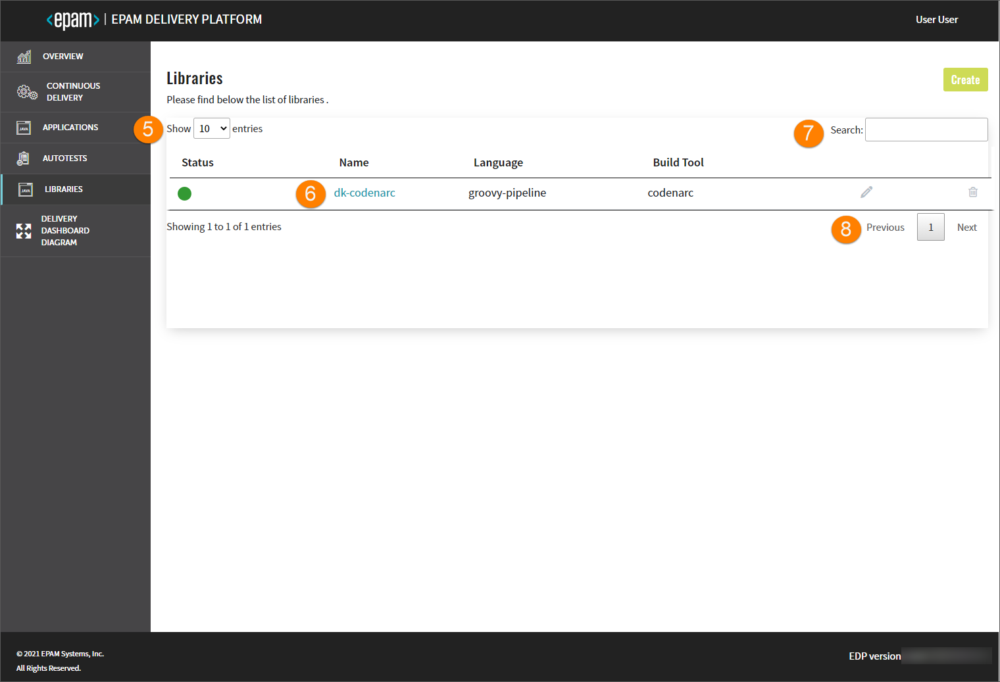
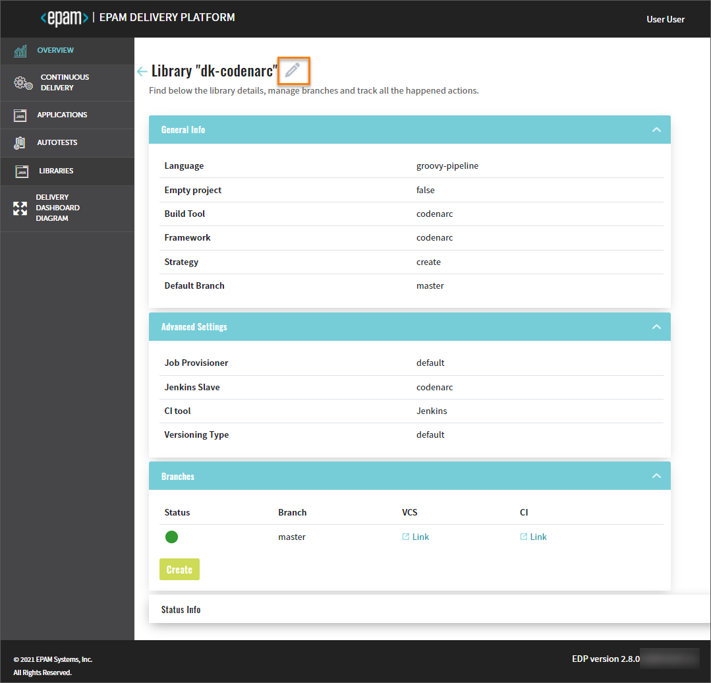
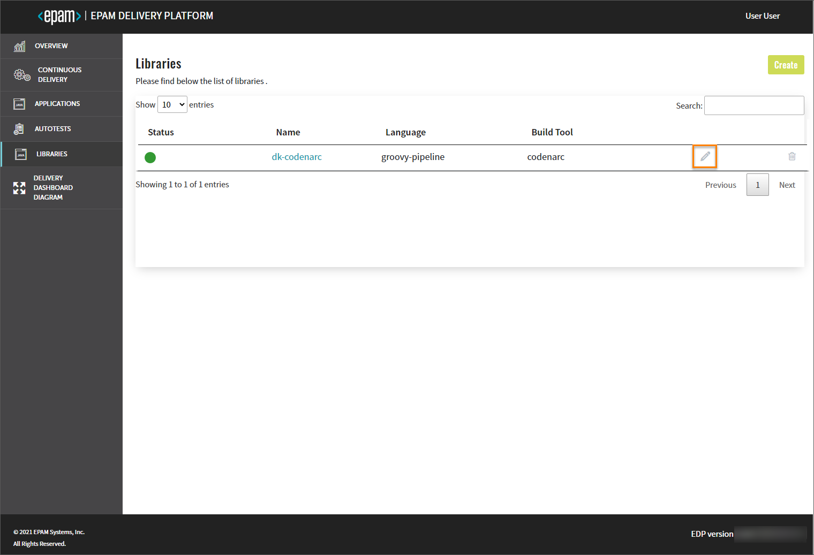
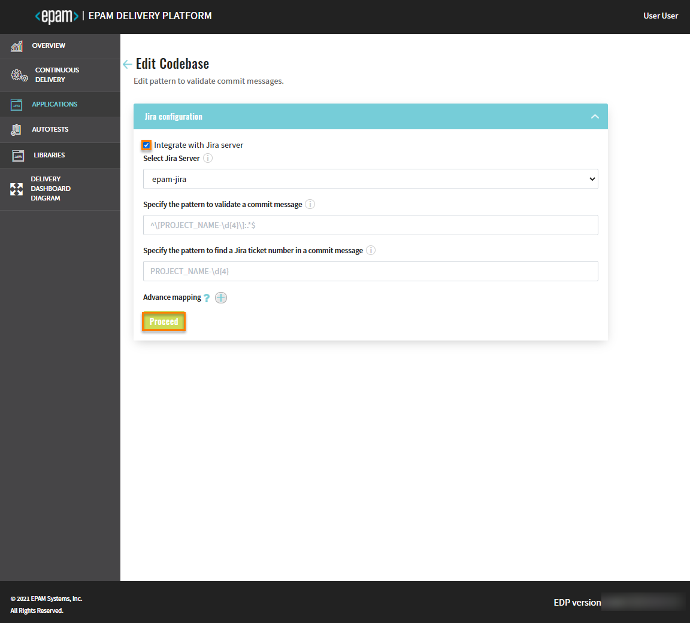
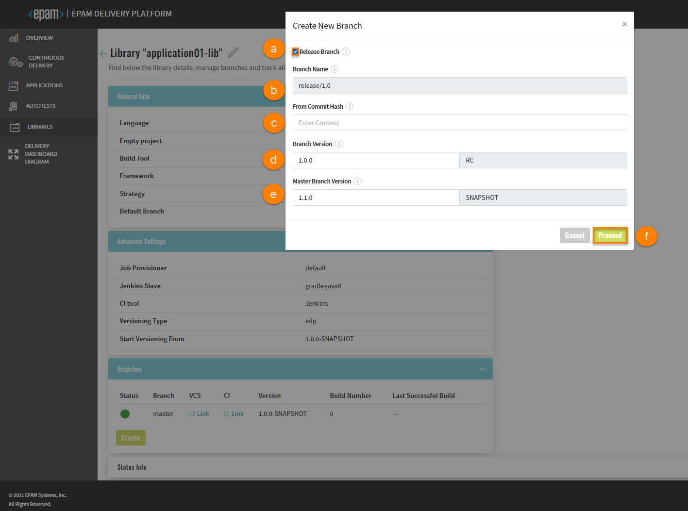

# Library

This section describes the subsequent possible actions that can be performed with the newly added or existing libraries.

## Check and Remove Library

As soon as the library is successfully provisioned, the following will be created:

- Code Review and Build pipelines in Jenkins for this library. The Build pipeline will be triggered automatically if at least one environment is already added.
- A new project in Gerrit or another VCS.
- SonarQube integration will be available after the Build pipeline in Jenkins is passed.
- Nexus Repository Manager will be available after the Build pipeline in Jenkins is passed as well.

!!! info
    To navigate quickly to OpenShift, Jenkins, Gerrit, SonarQube, Nexus, and other resources, click the Overview section on the navigation bar and hit the necessary link.

The added library will be listed in the Libraries list allowing you to do the following:

1. Create another library by clicking the Create button and performing the same steps as described on the [Add Library](add-library.md) page;

2. Open library data by clicking its link name. Once clicked, the following blocks will be displayed:

  * **General Info** - displays common information about the created/cloned/imported library.
  * **Advanced Settings** - displays the specified job provisioner, Jenkins agent, deployment script, and the versioning type with the start versioning from number (the latter two fields appear in case of edp versioning type).
  * **Branches** - displays the status and name of the deployment branch, keeps the additional links to Jenkins and Gerrit. In case of edp versioning type, there are two additional fields:

    * **Build Number** - indicates the current build number;
    * **Last Successful Build** - indicates the last successful build number.

  * **Status Info** - displays all the actions that were performed during the creation/cloning/importing process.

3. Edit the library codebase by clicking the pencil icon. For details see the [Edit Existing Codebase](#edit-existing-codebase) section.

4. Remove library with the corresponding database and Jenkins pipelines:

  - Click the delete icon next to the library name;
  - Type the required library name;
  - Confirm the deletion by clicking the Delete button.

  !!! note
      The library that is used in a CD pipeline cannot be removed.

  

5. Select a number of existing libraries to be displayed on one page in the **Show entries** field. The filter allows to show 10, 25, 50 or 100 entries per page.

6. Sort the existing libraries in a list by clicking the Name title. The libraries will be displayed in an alphabetical order.

7. Search the necessary application by entering the corresponding name, language or the build tool into the **Search** field. The search can be performed by the library name, language or a build tool.

8. Navigate between pages, if the number of libraries exceeds the capacity of a single page.

## Edit Existing Codebase

The EDP Admin Console provides the ability to enable, disable or edit the Jira Integration functionality for applications via the Edit Codebase page.

1. Perform the editing from one of the following sections on the Admin Console interface:

    

  - Navigate to the codebase overview page and click the **pencil** icon, or

    

  - Navigate to the codebase list page and click the **pencil** icon.

    

2. To enable Jira integration, on the **Edit Codebase** page do the following:

  - mark the **Integrate with Jira server** checkbox and fill in the necessary fields;
  - click the **Proceed** button to apply the changes;
  - navigate to Jenkins and add the _create-jira-issue-metadata_ stage in the Build pipeline. Also add the _commit-validate_ stage in the Code-Review pipeline.

3. To disable Jira integration, on the **Edit Codebase** page do the following:

  - unmark the **Integrate with Jira server** checkbox;
  - click the **Proceed** button to apply the changes;
  - navigate to Jenkins and remove the _create-jira-issue-metadata_ stage in the Build pipeline. Also remove the _commit-validate_ stage in the Code-Review pipeline.

As a result, the necessary changes will be applied.

## Add a New Branch

When adding a library, the default branch is a **master** branch. In order to add a new branch, follow the steps below:

1. Navigate to the **Branches** block and click the Create button:

  

2. Fill in the required fields:

  

  a. Release Branch - select the Release Branch check box if you need to create a release branch;

  b. Branch Name - type the branch name. Pay attention that this field remain static if you create a release branch.

  c. From Commit Hash - paste the commit hash from which the new branch will be created. Note that if the From Commit Hash field is empty, the latest commit from the branch name will be used.

  d. Branch Version - enter the necessary branch version for the artifact. The Release Candidate (RC) postfix is concatenated to the branch version number.

  e. Master Branch Version - type the branch version that will be used in a master branch after the release creation. The Snapshot postfix is concatenated to the master branch version number;

  f. Click the Proceed button and wait until the new branch will be added to the list.

!!! info
    Adding of a new branch is indicated in the context of the edp versioning type. To get more detailed information on
    how to add a branch using the default versioning type, please refer to [Advanced Settings Menu](https://epam.github.io/edp-install/user-guide/add-library/#the-advanced-settings-menu) section of the Admin Console user guide.

The default library repository is cloned and changed to the new indicated version before the build, i.e. the new indicated version will not be committed to the repository; thus, the existing repository will keep the default version.

## Remove Branch

In order to remove the added branch with the corresponding  record in the Admin Console database, do the following:

1. Navigate to the Branches block by clicking the library name link in the Libraries list;

2. Click the delete icon related to the necessary branch:

  

3. Enter the branch name and click the Delete button;

!!! note
    The default **master** branch cannot be removed.

## Related Articles

* [Add Library](add-library.md)
