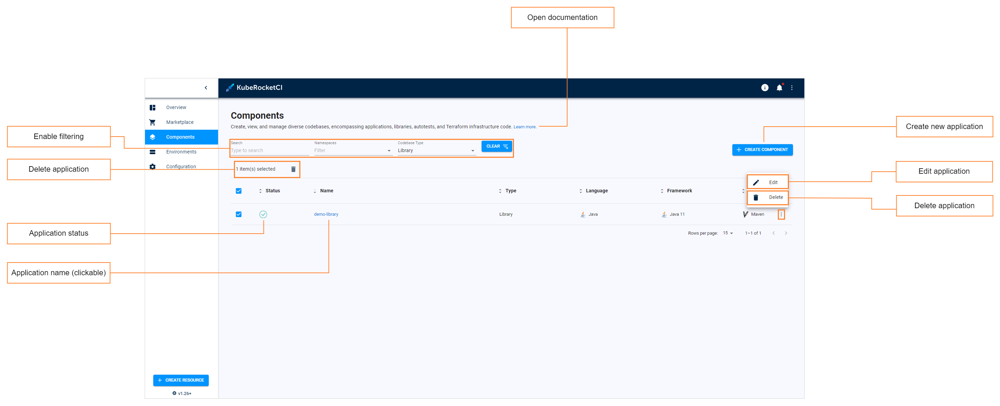
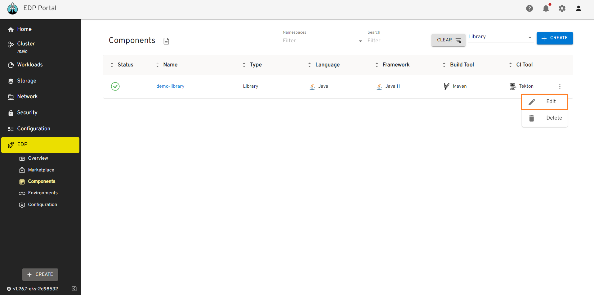
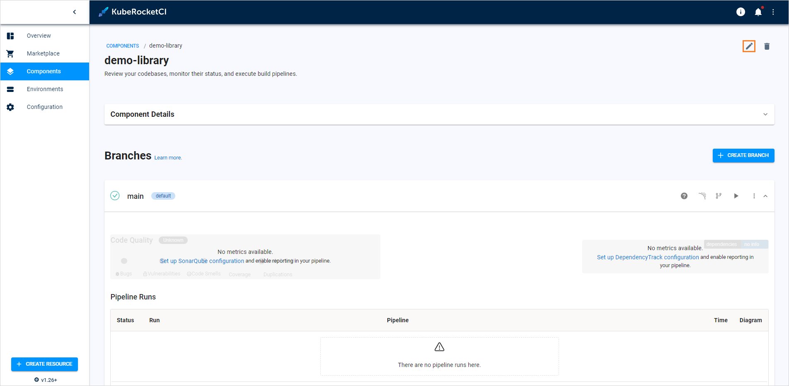
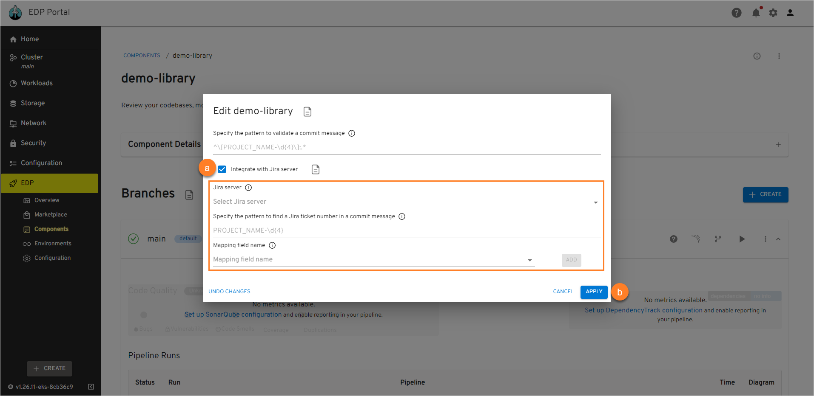

# Manage Libraries

This section describes the subsequent possible actions that can be performed with the newly added or existing libraries.

## Check and Remove Library

As soon as the library is successfully provisioned, the following will be created:

- A Library Codebase type will appear in the Codebase list of the Components section.
- With the **Create** strategy, a new project will be generated on GitHub or another integrated VCS. When **Clone** is chosen, the repository will be forked from the original and copied to the EDP-integrated repository. If **Import** is selected, the platform connects to the chosen repository.

!!! info
    To navigate quickly to OpenShift, Tekton, Gerrit, SonarQube, Nexus, and other resources, click the **Overview** section on the navigation bar and hit the necessary link.

The added library will be listed in the Libraries list allowing to do the following:

!

1. Create another library by clicking the plus sign icon on the right side of the screen and performing the same steps as described on the [Add Library](add-library.md) page.

2. Open library data by clicking its link name. Once clicked, the following blocks will be displayed:

* **Library status** - displays the Git Server status. Can be red or green depending on if the EDP Portal managed to connect to the Git Server with the specified credentials or not.
* **Library name (clickable)** - displays the Git Server name set during the Git Server creation.
* **Open documentation** - opens the documentation that leads to this page.
* **Enable filtering** - enables filtering by Git Server name and namespace where this custom resource is located in.
* **Create new library** - displays the **Create new component** menu.
* **Edit library** - edit the library by selecting the options icon next to its name in the libraries list, and then selecting **Edit**. For details see the [Edit Existing Library](#edit-existing-library) section.
* **Delete Library** - remove library by clicking the vertical ellipsis button and then selecting **Delete**.

  !!! note
      The library that is used in a CD pipeline cannot be removed.

There are also options to sort the libraries:

* Sort the existing libraries in a table by clicking the sorting icons in the table header. Sort the libraries alphabetically by their name, language, build tool, framework, and CI tool. You can also sort the libraries by their status: Created, Failed, or In progress.
* Select a number of libraries displayed per page (15, 25 or 50 rows) and navigate between pages if the number of libraries exceeds the capacity of a single page.

## Edit Existing Library

EDP Portal provides the ability to enable, disable or edit the Jira Integration functionality for libraries.

1. To edit a library directly from the Libraries overview page or when viewing the library data:

  - Select **Edit** in the options icon menu:

    !

    !

  - The Edit Library dialog opens.

2. To enable Jira integration, in the **Edit Library** dialog do the following:

   !

   a. Mark the **Integrate with Jira server** check box and fill in the necessary fields. Please see the steps d-h of the [Add Library](add-library.md#the-advanced-settings-menu) page.

   b. Select the **Apply** button to apply the changes.

3. To disable Jira integration, in the **Edit Library** dialog do the following:

   a. Uncheck the **Integrate with Jira server** check box.

   b. Select the **Apply** button to apply the changes.

  As a result, the necessary changes will be applied.

4. To create, edit and delete library branches, please refer to the [Manage Branches](../user-guide/manage-branches.md) page.

## Related Articles

* [Add Library](add-library.md)
* [Manage Branches](../user-guide/manage-branches.md)
