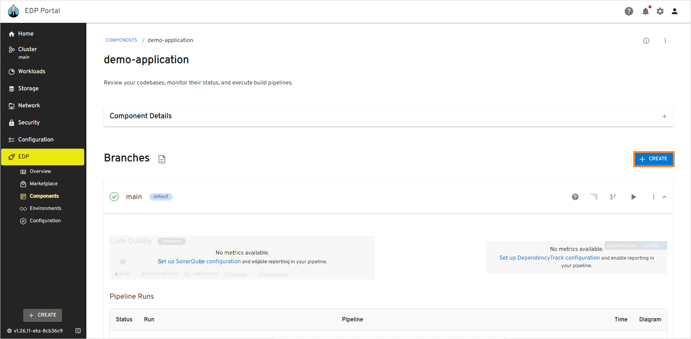
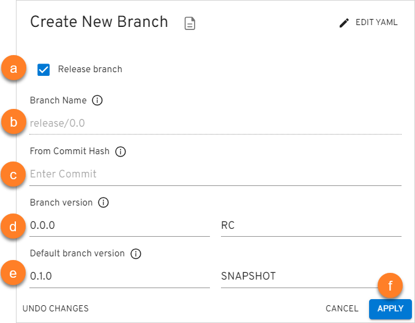
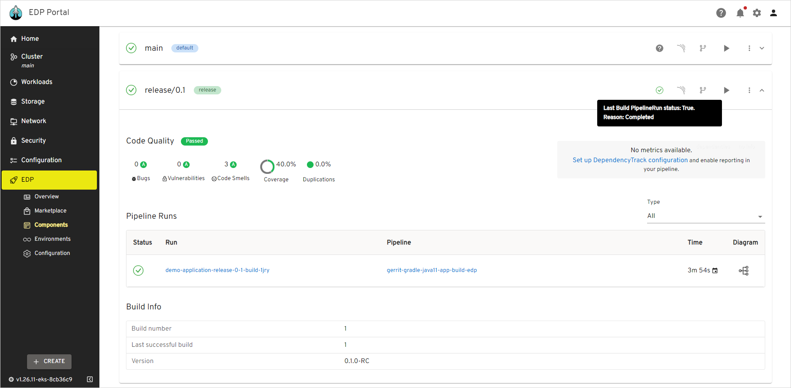
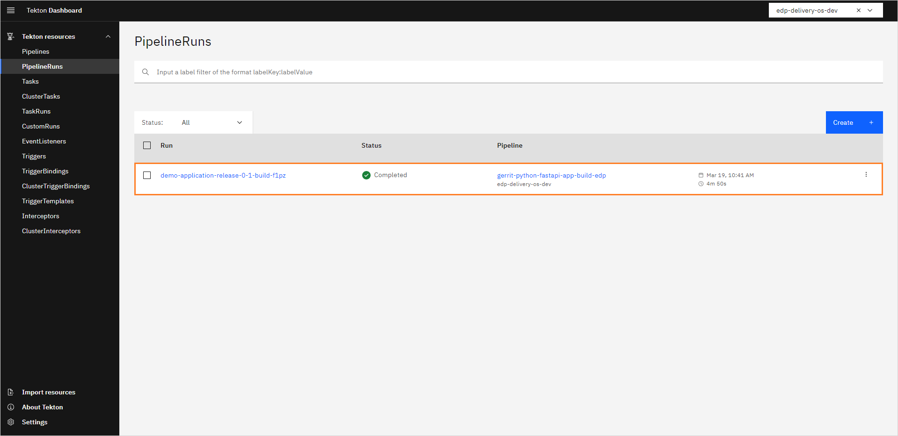
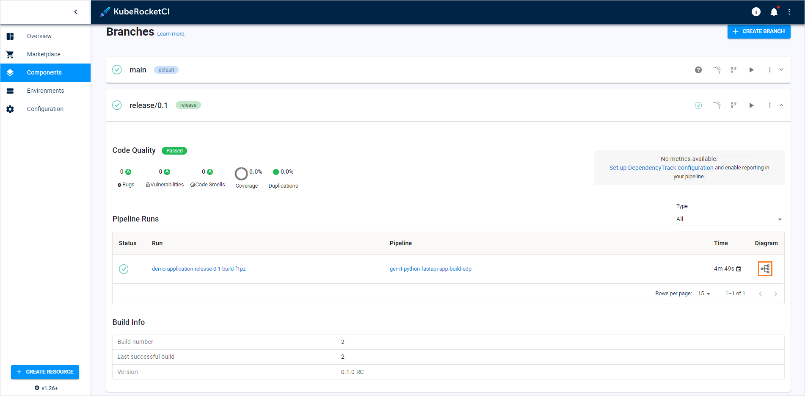
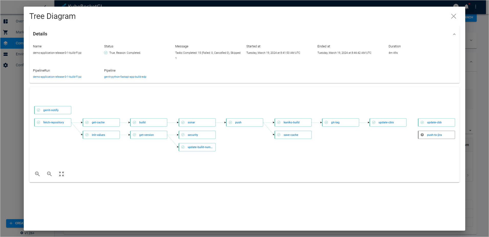

# Manage Branches

This page describes how to manage branches in the created component, whether it is an application, library, autotest or infrastructure.

## Add New Branch

!!! note
    When working with libraries, pay attention when specifying the branch name: the branch name is involved in the formation of the library version, so it must comply with the [Semantic Versioning](https://semver.org/) rules for the library.

When adding a component, the default branch is a **master** branch. In order to add a new branch, follow the steps below:

1. Navigate to the **Branches** block by clicking the component name link in the Components list.

2. Click the **+ Create** button:

  !

3. Click **Edit YAML** in the upper-right corner of the dialog to open the YAML editor and add a branch. Otherwise, fill in the required fields in the dialog:

  !

  a. **Release Branch** - select the **Release Branch** check box if you need to create a release branch.

  b. **Branch name** - type the branch name. Pay attention that this field remains static if you create a release branch. For the **Clone** and **Import** strategies: if you want to use the existing branch, enter its name into this field.

  c. **From Commit Hash** - paste the commit hash from which the branch will be created. For the **Clone** and **Import** strategies: Note that if the **From Commit Hash** field is empty, the latest commit from the branch name will be used.

  d. **Branch version** - enter the necessary branch version for the artifact. The Release Candidate (RC) postfix is concatenated to the branch version number.

  e. **Default branch version** - type the branch version that will be used in a master branch after the release creation. The Snapshot postfix is concatenated to the master branch version number.

  f. Click the **Apply** button and wait until the new branch will be added to the list.

  !!! info
      Adding of a new branch is indicated in the context of the EDP versioning type.

The default component repository is cloned and changed to the new indicated version before the build, i.e. the new indicated version will not be committed to the repository; thus, the existing repository will keep the default version.

## Build Branch

In order to build branch from the latest commit, do the following:

1. Navigate to the **Branches** block by clicking the library name link in the Libraries list.

2. Click the **Build** button:

  !

The pipeline run status is displayed near the branch name in the **Branches** block:

  !

The corresponding item appears on the **Tekton Dashboard** in the **PipelineRuns** section:

  !

As an alternative way, click the tree diagram icon to observe the real-time status of the pipeline run:

  !

The tree diagram window is presented below:

  !

## Delete Branch

!!! note
    The default **master/main** branch cannot be removed.

In order to delete the added branch with the corresponding record in the KubeRocketCI portal database, do the following:

1. Navigate to the **Branches** block by clicking the component name link in the components list.
2. Select the **Actions** icon related to the necessary branch and then click **Delete**:

  !

## Related Articles

* [Add Application](../user-guide/add-application.md)
* [Add Library](../user-guide/add-library.md)
* [Add Autotest](../user-guide/add-autotest.md)
