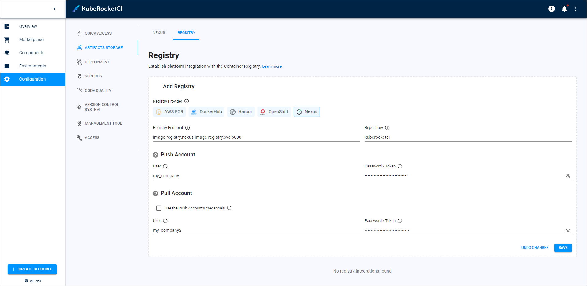
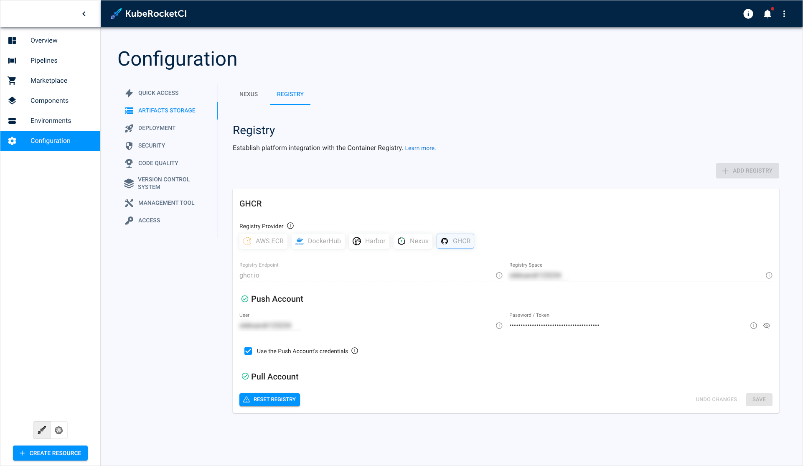

# Manage Container Registries

This guide provides instructions on integrating the container registry with the KubeRocketCI.

## Supported Registry Providers

The following table displays the registry services supported for both OpenShift and Kubernetes clusters.

|Container Registry|OpenShift|Kubernetes|
|:-:|:-:|:-:|
|AWS ECR|+|+|
|DockerHub|+|+|
|Harbor|+|+|
|OpenShift (OCR)|+|-|
|Nexus|+|+|
|GitHub (GHCR)|+|+|

## Add Container Registry

Follow a three-step process to integrate a container registry in KubeRocketCI:

1. In the **KubeRocketCI** -> **Configuration** -> **Registry**:

  !

2. Select `Registry Provider` and enter the required details.

3. Confirm settings by clicking the `Save` button.

The required fields vary depending on which container registry is chosen:

=== "AWS ECR"

      !

      |Fields|Description|
      |:-|:-|
      |Registry Endpoint|Format for the (AWS) Elastic Container Registry endpoint: xxxxxxxxxxxx.dkr.ecr.<region>.amazonaws.com. Where `xxxxxxxxxxxx` is your AWS account ID and `<region>` is where your ECR is hosted.|
      |Registry Space|The suffix project name in registry.|
      |AWS Region| The geographic area where the (AWS) Elastic Container Registry repository is hosted.|
      |Authentication/IRSA Role ARN|Specify the [IAM role](https://docs.aws.amazon.com/AmazonECR/latest/userguide/repository-policies.html) with a policy for interacting with ECR with your Kubernetes cluster.

=== "DockerHub"

      !

      |Fields|Description|
      |:-|:-|
      |Registry Space|The unique identifier/name of the user or company linked to your DockerHub account.|
      |User|The user account ID or community user account ID with push permission.|
      |Password/Token|Provide the [Password/Token](https://docs.docker.com/security/for-developers/access-tokens/) corresponding to your DockerHub account. It is recommended to use Token for security purposes.|
      |Checkbox/Use the Push Account's credentials|Check this to use the same account for pulling and pushing operations. If unchecked, please enter the user account ID and Password/Token for your DockerHub account or community user account ID with pull permission.|

=== "Harbor"

      !

      |Fields|Description|
      |:-|:-|
      |Registry Endpoint|Enter Harbor registry endpoint URL, for example, registry.example.com.|
      |Registry Space|The project name in registry.|
      |User|Provide the [robot account](../operator-guide/container-registry-harbor-integration-tekton-ci.md#set-up-robot-account) name with push permissions.|
      |Password/Token|Provide the [secret](../operator-guide/container-registry-harbor-integration-tekton-ci.md#set-up-robot-account) corresponding to your harbor account.|
      |Checkbox/Use the Push Account's credentials|Check this to use the same account for pulling and pushing operations. Provide the account name with pull permissions.|

=== "OpenShift"

      !

      |Fields|Description|
      |:-|:-|
      |Registry Endpoint|OpenShift service registry endpoint URL (e.g., image-registry.openshift-image-registry.svc:5000).|
      |Project|The project name in registry.|
      |Password/Token|Supply the [password](https://docs.openshift.com/container-platform/4.2/authentication/identity_providers/configuring-htpasswd-identity-provider.html#identity-provider-htpasswd-update-users_configuring-htpasswd-identity-provider) for the user who has pull authorization privileges in your OpenShift container image registry.|

=== "Nexus"

      !

      |Fields|Description|
      |:-|:-|
      |Registry Endpoint|Nexus service registry endpoint URL (e.g., image-registry.nexus-image-registry.svc:5000).|
      |Repository|Specify the Nexus repository that corresponds to your project.|
      |User|Provide the username with push permissions.|
      |Password/Token|Enter the confidential combination used for authenticating your access to the container registry.|

=== "GitHub"

      !

      |Fields|Description|
      |:-|:-|
      |Registry Space|The unique identifier/name of the user or company linked to your GitHub account.|
      |User|The user account ID or community user account ID with push permission.|
      |Password/Token|Provide the [Token](https://docs.github.com/en/enterprise-server@3.9/authentication/keeping-your-account-and-data-secure/managing-your-personal-access-tokens) corresponding to your  GitHub account. The minimal set of permissions required for the token is described in the [Integrate GitHub/GitLab in Tekton](../operator-guide/import-strategy-tekton.md).|
      |Checkbox/Use the Push Account's credentials|Check this to use the same account for pulling and pushing operations. If unchecked, please enter the user account ID and Token for your GitHub account or community user account ID with pull permission.|

## Remove Container Registry

To remove container registry integration from KubeRocketCI, follow the steps below:

!!! warning
    Proceed with caution, removing registry settings might disrupt your CI/CD process. All new components created after changing the registry such as Components and Environments will start working out of the box. To work with existing codebases and pipelines familiarize with the [change container registry guide](../operator-guide/container-registries.md).

  1. In the **KubeRocketCI** -> **Configuration** -> **Registry**.

  2. Click the `Reset registry` button, type the `confirm` word and then click `Confirm`:

  !

## Related Articles

* [Install EDP](../operator-guide/install-edp.md)
* [Install Harbor](../operator-guide/install-harbor.md)
* [Change Container Registry](../operator-guide/container-registries.md)
