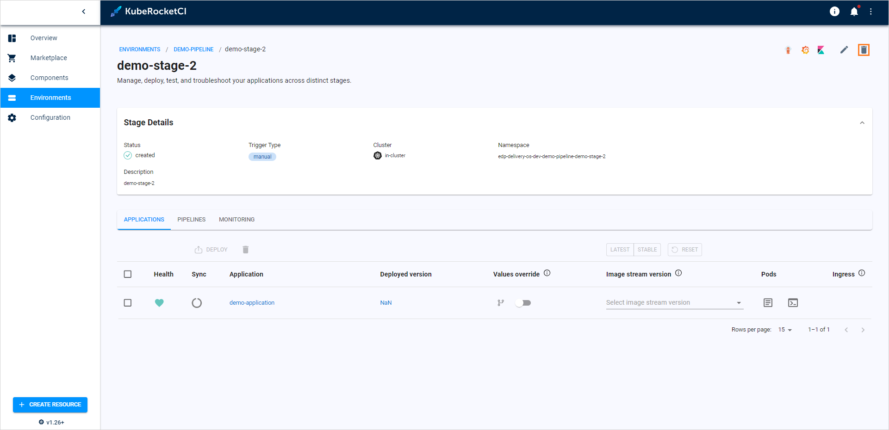
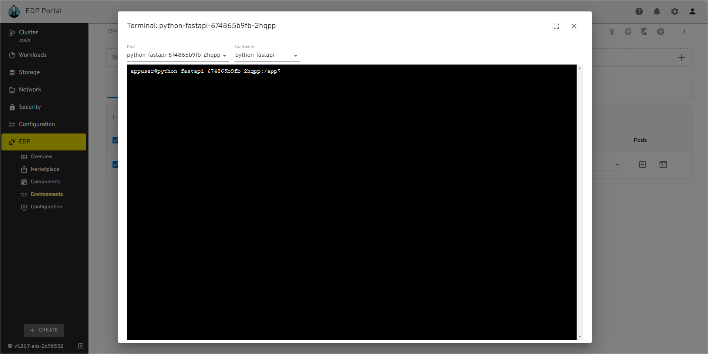

# Manage Environments

This page describes actions that can be performed to an already created environment. If no environments are created yet, navigate to the [Add Environment](add-cd-pipeline.md) page:

  !

* **Environment status** - displays the environment status. Can be red or green depending on if the KubeRocketCI portal managed to connect to the Git Server with the specified credentials or not.
* **Environment name** (clickable) - displays the Git Server name set during the Git Server creation.
* **Open documentation** - opens the documentation that leads to this page.
* **Enable filtering** - enables filtering by Git Server name and namespace where this environment is located in.
* **Create new environment** - displays the Create new component menu.
* **Edit environment** - edit the environment by selecting the options icon next to its name in the environment list, and then selecting Edit. For details see the [Edit Existing Environment](#edit-existing-environment) section.
* **Delete environment** - remove environment by clicking the vertical ellipsis button and then selecting Delete.

  !!! note
      Please keep in mind that after deleting the environment, all the created resources within the environment will be deleted.

### View Environment Details

To view environment details, click the environment name in the environments list. Once clicked, the following data will be displayed:

  !

* **Filters** - enables filtering by stage name, stage applications and stage health status.
* **Open environment in Argo CD** - opens the corresponding resource in Argo CD.
* **Edit environment** - allows to edit some parameters of the environment.
* **Delete environment** - allows to remove the environment.
* **Create new stage** - displays the **Create stage** menu.
* **Stage name (clickable)** - opens the stage details page.
* **Stage status** - displays the status of the created stage.
* **Create new stage** - displays the **Create stage** menu.
* **Application name (clickable)** - opens the details of the application that is deployed within the stage.
* **Application deployment status** - displays the deployed application.
* **Open application logs** - opens the the application container logs.
* **Open application terminal** - opens the container terminal window.
* **Open application resource in Argo CD** - opens a new tab with Argo CD resources related to the application.
* **Open stage in Argo CD / Grafana / Kibana** - allows to view the stage in Argo CD, Grafana or Kibana.

### Edit Existing Environment

Edit the environment directly from the environment overview page or when viewing the environment data:

1. Select **Edit** in the options icon menu next to the environment name:

  !

2. Apply the necessary changes (edit the list of applications for deploy, application branches, and promotion in the pipeline). Add new extra stages by clicking the plus sign icon and filling in the application branch and promotion in the pipeline.

   !

3. Click the **Apply** button to confirm the changes.

### Add a New Stage

In order to create a new stage for the existing environment, follow the steps below:

1. Navigate to the **Stages** block by clicking the environment name link in the environments list.

2. Click the **Create stage** button:

  !

3. Fill in the required fields in the dialog. Alternatively, click **Edit YAML** in the upper-right corner of the **Create stage** dialog to open the YAML editor and add a stage. Please see the [Stages Menu](../user-guide/add-cd-pipeline.md#the-stages-menu) section for details.

4. Click the **Apply** button.

### Edit Stage

In order to edit a stage for the existing environment, follow the steps below:

1. Navigate to the **Stages** block by clicking the environment name link in the environments list.

  !

2. Select the options icon related to the necessary stage and then select **Edit**.

  !

3. In the **Edit Stage** dialog, change the stage trigger type. See more about this field in the [Stages Menu](#the-stages-menu) section.

4. Click the **Apply** button.

### Delete Stage

!!! note
    You cannot remove the last stage, as the environment does not exist without at least one.

In order to delete a stage for the existing environment, follow the steps below:

1. Navigate to the **Stages** block by clicking the environment name link in the environments list.

2. Click the name of the stage that needs to be deleted:

  !

3. Click the recycle bin button to open the stage deletion menu:

  !

### View Stage Data

To view the environment stage data for the existing environment, follow the steps below:

1. Navigate to the **Stages** block by clicking the environment name link in the environments list.

  !

2. Click stage name. The following blocks will be displayed:

  !

  a. **Applications** - displays the status of the applications related to the stage and allows [deploying the applications](#deploy-application). Applications health and sync statuses are returned from the Argo CD tool. 
  b. **Pipelines** - displays all the deploy pipeline runs launched for this stage. 
  c. **Monitoring** - opens the grafana window that allows for watching various metrics.

### Deploy Application

To deploy an application, follow the steps below:

!

1. Navigate to the **Applications** block of the stage and select an application.

2. Select the image stream version from the drop-down list.

3. (Optional) Enable setting custom values for Helm Charts. For more details, please refer to the [Manage GitOps](gitops.md) page.

4. Click **Deploy**. The application will be deployed in the Argo CD tool as well.

!!! info
    In case of using OpenShift internal registry, if the deployment fails with the ImagePullBackOff error, delete the pod that was created for this application.

To update application, use the **Deploy** button:

!

To uninstall the application, click the **Uninstall** button:

!

As a result, the application will be updated or uninstalled in the Argo CD tool as well.

!!! note
    In a nutshell, the **Update** button updates your image version in the Helm chart, whereas the **Uninstall** button deletes the Helm chart from the namespace where the Argo CD application is deployed.

### Troubleshoot Application

There is a couple of KubeRocketCI portal capabilities that will help in monitoring and troubleshooting deployed applications, namely, terminal and logs.

To inspect the deployed application in KubeRocketCI portal, take the following steps:

1. Open the application logs by clicking the `Show Logs` button:

  !

2. Inspect the shown logs:

  !

3. Open the application terminal by clicking the `Show Terminal` button:

  !

4. Operate the terminal to fix the problem if any:

  !

### Related Articles

* [Add Environment](add-cd-pipeline.md)
* [Add Quality Gate](../user-guide/add-quality-gate.md)
