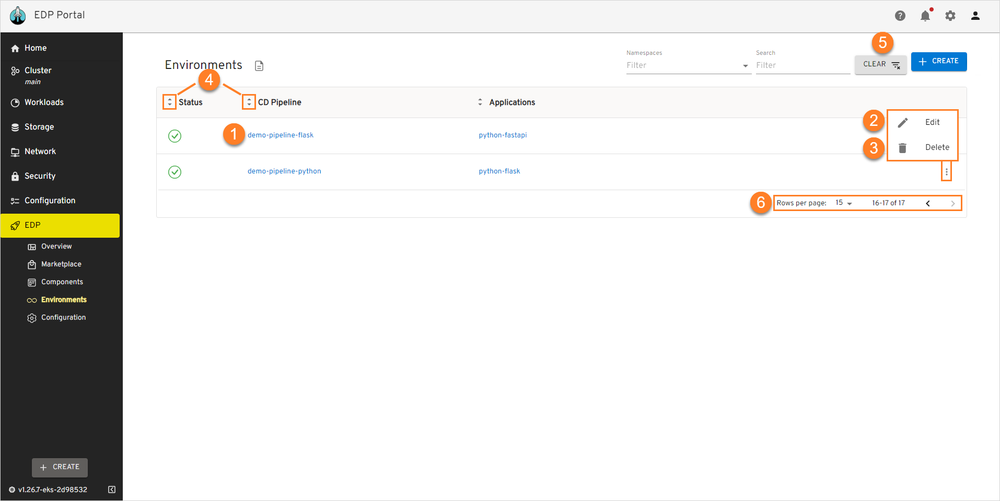
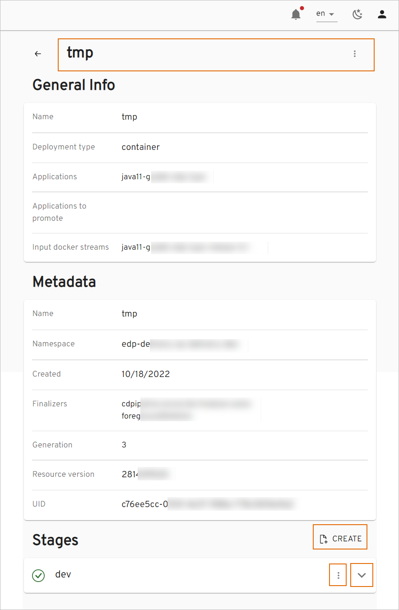
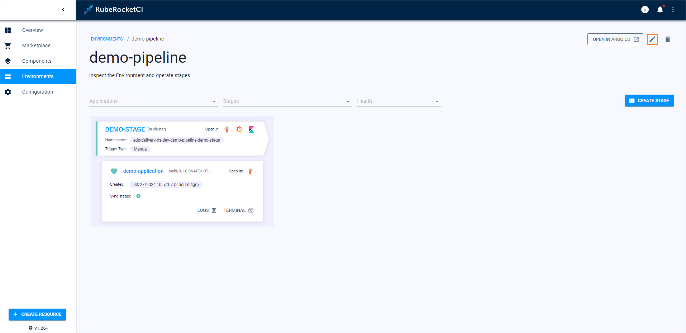
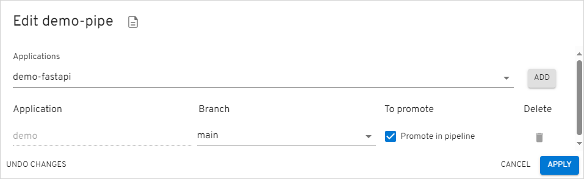
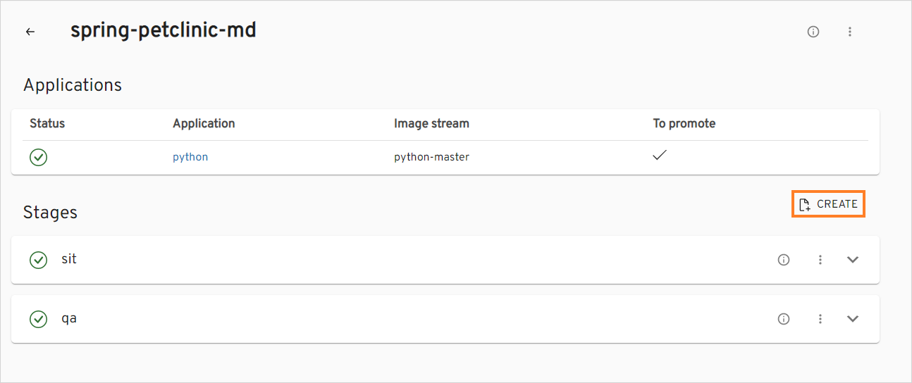
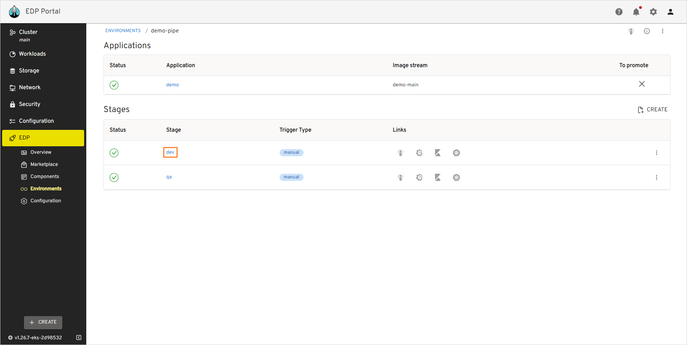
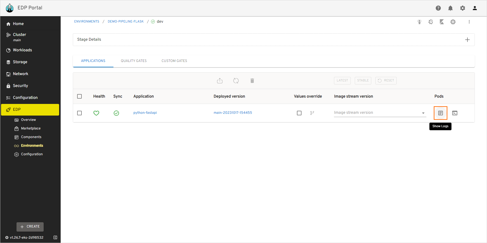
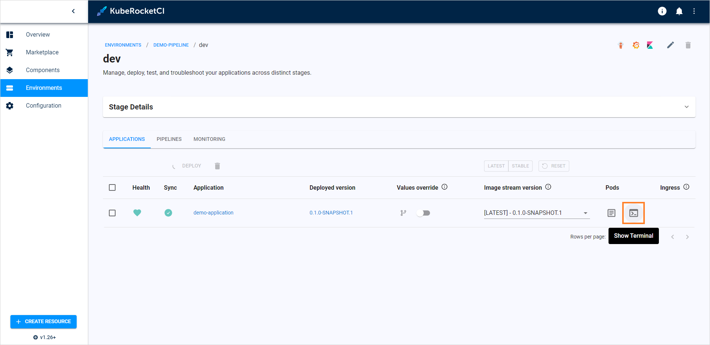

# Manage Environments

This page describes actions that can be performed to an already created environment. If no environments are created yet, navigate to the [Add Environment](add-cd-pipeline.md) page.

  !

1. Open environment data by clicking its link name.

2. Edit the environment by selecting the options icon next to its name in the environments list, and then selecting **Edit**. For details see the [Edit Existing Environment](#edit-existing-environment) section.

3. Delete the added environment by selecting the options icon next to its name in the environment list, and then selecting **Delete**.

  !!! note
      Please keep in mind that after deleting the environment, all the created resources within the environment will be deleted.

4. Sort the existing environments in a table by clicking the sorting icons in the table header. When sorting by name, the environments will be displayed in alphabetical order. You can also sort the environments by their status.

5. Search the necessary environment by the namespace or by entering the corresponding name, language or the build tool into the **Filter** tool.

6. Select a number of environment displayed per page (15, 25 or 50 rows) and navigate between pages if the number of environments exceeds the capacity of a single page.

### View Environment Details

To view environment details, click the environment name in the environments list. Once clicked, the following data will be displayed:

  !

  a. Allows to view environment in Argo CD, view its metadata (generation, finalizers, namespace, etc.). 

  b. Shows application/stage status. 

  c. Shows application/stage names. Once clicked, navigates you to the [application data](../user-guide/application.md) or [stage details](#view-stage-data). 

  d. Allows to create a new stage. 

  e. Allows to view environment data in Argo CD, Grafana, Kibana and shows in which cluster the environment is deployed in. 

  f. Allows to edit or delete a stage.

### Edit Existing Environment

Edit the environment directly from the environment overview page or when viewing the environment data:

1. Select **Edit** in the options icon menu next to the environment name:

  !

  !

2. Apply the necessary changes (edit the list of applications for deploy, application branches, and promotion in the pipeline). Add new extra stages by clicking the plus sign icon and filling in the application branch and promotion in the pipeline.

   !

3. Select the **Apply** button to confirm the changes.

### Add a New Stage

In order to create a new stage for the existing environment, follow the steps below:

1. Navigate to the **Stages** block by clicking the environment name link in the environments list.

  !

2. Select **Create** to open the **Create stage** dialog.

3. Fill in the required fields in the dialog. Alternatively, click **Edit YAML** in the upper-right corner of the **Create stage** dialog to open the YAML editor and add a stage. Please see the [Stages Menu](../user-guide/add-cd-pipeline.md#the-stages-menu) section for details.

4. Click the **Apply** button.

### Edit Stage

In order to edit a stage for the existing environment, follow the steps below:

1. Navigate to the **Stages** block by clicking the environment name link in the environments list.

  !

2. Select the options icon related to the necessary stage and then select **Edit**.

  !

3. In the **Edit Stage** dialog, change the stage trigger type. See more about this field in the [Stages Menu](#the-stages-menu) section.

4. Click the **Apply** button.

### Delete Stage

!!! note
    You cannot remove the last stage, as the environment does not exist without at least one.

In order to delete a stage for the existing environment, follow the steps below:

1. Navigate to the **Stages** block by clicking the environment name link in the environments list.

  !

2. Select the options icon related to the necessary stage and then select **Delete**. After the confirmation, the CD stage is deleted with all its components: database record, Tekton pipeline, and cluster namespace.

### View Stage Data

To view the environment stage data for the existing environment, follow the steps below:

1. Navigate to the **Stages** block by clicking the environment name link in the environments list.

  !

2. Click stage name. The following blocks will be displayed:

  !

* **Applications** - displays the status of the applications related to the stage and allows [deploying the applications](#deploy-application). Applications health and sync statuses are returned from the Argo CD tool.
* **Quality Gates** - displays the autotests and quality gates applied to the pipeline.
* **Custom Gates** - displays the custom Tekton pipelines applied to the pipeline.

### Deploy Application

To deploy an application, follow the steps below:

!

1. Navigate to the **Applications** block of the stage and select an application.

2. Select the image stream version from the drop-down list.

3. (Optional) Enable setting custom values for Helm Charts. For more details, please refer to the [Manage GitOps](gitops.md) page.

4. Click **Deploy**. The application will be deployed in the Argo CD tool as well.

!!! info
    In case of using OpenShift internal registry, if the deployment fails with the ImagePullBackOff error, delete the pod that was created for this application.

To update or uninstall the application, select **Update** or **Uninstall**.

!

As a result, the application will be updated or uninstalled in the Argo CD tool as well.

!!! note
    In a nutshell, the **Update** button updates your image version in the Helm chart, whereas the **Uninstall** button deletes the Helm chart from the namespace where the Argo CD application is deployed.

### Troubleshoot Application

There is a couple of EDP Portal capabilities that will help in monitoring and troubleshooting deployed applications, namely, terminal and logs.

To inspect the deployed application in EDP Portal, take the following steps:

1. Open the application logs by clicking the `Show Logs` button:

  !

2. Inspect the shown logs:

  !

3. Open the application terminal by clicking the `Show Terminal` button:

  !

4. Operate the terminal to fix the problem if any:

  !

### Related Articles

* [Add Environment](add-cd-pipeline.md)
* [Add Quality Gate](../user-guide/add-quality-gate.md)