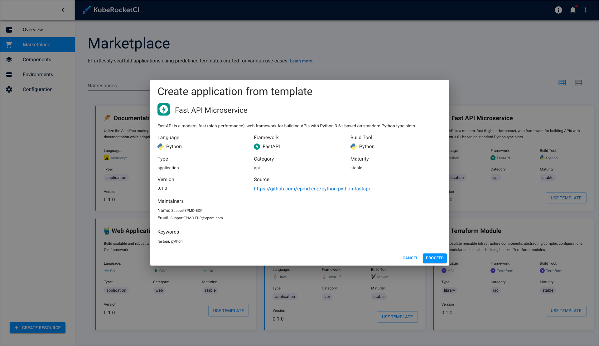

# Marketplace Overview

The EDP Marketplace offers a range of Templates, predefined tools and settings for creating software. These Templates speed up development, minimize errors, and ensure consistency.
A key EDP Marketplace feature is customization. Organizations can create and share their own Templates, finely tuned to their needs. Each Template serves as a tailored blueprint of tools and settings.

These tailored Templates include preset CI/CD pipelines, automating your development workflows. From initial integration to final deployment, these processes are efficiently managed. Whether for new applications or existing ones, these Templates enhance processes, save time, and ensure consistency.

To see the Marketplace section, navigate to the **Main menu** -> **EDP** -> **Marketplace**. General look of the Marketplace section is described below:

!")

* **Marketplace templates** - all the components marketplace can offer;
* **Template properties** - the item summary that shows the type, category, language, framework, build tool and maturity;
* **Enable/disable filters** - enables users to enable/disable searching by the item name or namespace it is available in;
* **Change view** - allows switching from the listed view to the tiled one and vice versa. See the screenshot below for details.

There is also a possibility to switch into the tiled view instead of the listed one:

!")

To view the details of a marketplace item, simply click on its name:

!

The details window shows supplemental information, such as item's author, keywords, release version and the link to the repository it is located in. The window also contains the **Create from template** button that allows users to create the component by the chosen template. The procedure of creating new components is described in the [Add Component via Marketplace](add-marketplace.md) page.

## Related Articles

* [Add Component via Marketplace](add-marketplace.md)
* [Add Application](add-application.md)
* [Add Library](add-library.md)
* [Add Infrastructure](add-infrastructure.md)
