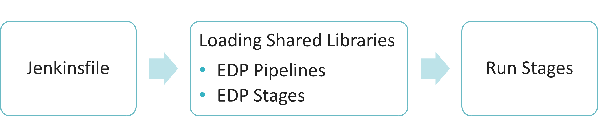

# EDP Pipeline Framework

This chapter provides detailed information about the EDP pipeline framework concepts and parts, as well as the accurate data about the `Code Review`, `Build` and `Deploy` pipelines with the respective stages.

## EDP Pipeline Framework Overview

!!! note
    The whole logic is applied to **Jenkins** as it is the main tool for the CI/CD processes organization.



The general EDP Pipeline Framework consists of several parts:

* **Jenkinsfile** - a text file that keeps the definition of a Jenkins Pipeline and is checked into source control. Every Job has its Jenkinsfile stored in the specific application repository and in Jenkins as the plain text.
The behavior logic of the pipelines can be customized easily by modifying a source code which is always copied to the EDP repository after the EDP installation.


* **Loading Shared Libraries** - a part where every job loads libraries with the help of the shared libraries mechanism for Jenkins that allows to create reproducible pipelines, write them uniformly, and manage the update process.
There are two main libraries: [EDP Pipelines](https://github.com/epam/edp-library-pipelines/blob/master/README.md#edp-library-pipelines) with the common logic described for the main pipelines Code Review, Build, Deploy pipelines and [EDP Stages](https://github.com/epam/edp-library-stages#edp-library-stages) library that keeps the description of the stages for every pipeline.

* **Run Stages** - a part where the predefined default stages are launched.


## CI/CD Jobs Comparison

Explore the CI and CD job comparison. Please note that the dynamic stages order can be changed, meanwhile, the predefined stages order in the reference pipeline cannot be changed, i.e. only the predefined stages set can be run.


## Context

**Context** - a variable that stores and transfers all necessary parameters between stages that are used by pipeline during performing.

1. The context type is "Map".
2. Each stage has input and output context.
3. Each stage has a mandatory input context.

!!! note
    If the input context isn't transferred, the stage will be failed.

## Annotations for CI/CD Stages

Annotation for CI Stages:

* The annotation type is "Map";
* The annotation consists of the name, buildTool, and codebaseType.

Annotation for CD Stages:

* The annotation type is "Map";
* The annotation consists of a name.

## Code Review Pipeline

**CodeReview()** – a function that allows using the EDP implementation for the Code Review pipeline.

!!! note
    All values of different parameters that are used during the pipeline execution are stored in the "Map" context.

The Code Review pipeline consists of several steps:

On the master:

* Initialization of all objects (Platform, Job, Gerrit, Nexus, Sonar, Application, StageFactory) and loading of the default implementations of EDP stages.

On a particular Jenkins agent that depends on the build tool:

* Creating workdir for application sources;
* Loading build tool implementation for a particular application;
* Run in a loop all stages (From) and run them either in parallel or one by one.

### Code Review Pipeline Overview

_Using in pipelines - @Library(['edp-library-pipelines@version'])_

The corresponding enums, interfaces, classes, and their methods can be used separately from the EDP Pipelines library function
(please refer to [Table 1](#table1) and [Table 2](#table2)).

Table 1. <a name="table1"></a> Enums and Interfaces with the respective properties, methods, and examples.

<center>

|Enums | Interfaces|
|-------|-------|
|_PlatformType:_ <br /><br /> - OPENSHIFT <br /> - KUBERNETES <br /> <br />_JobType:_ <br /><br /> - CODEREVIEW <br /> - BUILD <br /> - DEPLOY <br /><br />_BuildToolType:_ <br /><br /> - MAVEN <br /> - GRADLE <br /> - NPM <br /> - DOTNET| <br /><br />_**Platform()**_ - contains methods for working with platform CLI. <br />At the moment only OpenShift is supported. <br /><br />**Properties**:<br /><br /> Script script - Object with type script, in most cases if class <br />created from Jenkins pipelines it is "this". <br /> <br />**Methods**:<br /><br /> getJsonPathValue(String k8s_kind, String k8s_kind_name, <br />String jsonPath): return String value of specific parameter <br />of particular object using jsonPath utility. <br /><br />**Example**: <br /><br />`context.platform.getJsonPathValue(''cm'', `<br />`''project-settings'', ''.data.username'')`. <br /><br />_**BuildTool()**_ - contains methods for working with different <br />buildTool from ENUM BuildToolType. <br />Should be invoked on Jenkins build agents. <br /><br />**Properties**: <br /><br />Script script - Object with type script, in most cases if class <br />created from Jenkins pipelines it is "this". <br />Nexus object - Object of class Nexus. <br /><br />**Methods**:<br /><br /> init: return parameters of buildTool that are needed <br />for running stages. <br /><br />**Example**: <br /><br /> `context.buildTool = new BuildToolFactory().`<br />`getBuildToolImpl`<br />`(context.application.config.build_tool, this, `<br />`context.nexus) context.buildTool.init()`.|

</center>

Table 2. <a name="table2"></a> Classes with the respective properties, methods, and examples.

|Classes | Description (properties, methods, and examples)|
|-------|-------|
|**PlatformFactory()** - Class that contains methods getting an implementation of CLI of the platform. At the moment OpenShift and Kubernetes are supported.| **Methods**: <br /><br />`getPlatformImpl(PlatformType platform, Script script): return Class Platform`. <br /><br />**Example**:  <br /><br />`context.platform = new PlatformFactory().getPlatformImpl(PlatformType.OPENSHIFT, this)`.|
|**Application(String name, Platform platform, Script script)** - Class that describes the application object.| **Properties**: <br /><br />Script script - Object with type script, in most cases if class created from Jenkins pipelines it is "this". <br /><br />Platform platform - Object of a class Platform(). <br /><br />String name - Name for the application for creating an object. <br /><br />Map config - Map of configuration settings for the particular application that is loaded from config map project-settings. <br /><br />String version - Application version, initially empty. Is set on the get-version step. <br /><br />String deployableModule - The name of the deployable module for multi-module applications, initially empty. <br /><br />String buildVersion - Version of the built artifact, contains build number of Job initially empty. <br /><br />String deployableModuleDir - The name of deployable module directory for multi-module applications, initially empty. <br /><br />Array imageBuildArgs - List of arguments for building an application Docker image. <br /><br />**Methods**:<br /><br /> setConfig(String gerrit_autouser, String gerrit_host, String gerrit_sshPort, String gerrit_project): set the config property with values from config map. <br /><br />**Example**:<br /><br /> `context.application = new Application(context.job, context.gerrit.project, context.platform, this) context.application.setConfig(context.gerrit.autouser, context.gerrit.host, context.gerrit.sshPort, context.gerrit.project)`|
|**Job(type: JobType.value, platform: Platform, script: Script)** - Class that describes the Gerrit tool.| **Properties**:<br /><br /> Script script - Object with type script, in most cases if class created from Jenkins pipelines it is "this". <br /><br />Platform platform - Object of a class Platform(). <br /><br />JobType.value type. <br /><br />String deployTemplatesDirectory - The name of the directory in application repository where deploy templates are located. It can be set for a particular Job through DEPLOY_TEMPLATES_DIRECTORY parameter. <br /><br />String edpName - The name of the EDP Project. <br /><br />Map stages - Contains all stages in JSON format that is retrieved from Jenkins job env variable. <br /><br />String envToPromote - The name of the environment for promoting images. <br /><br />Boolean promoteImages - Defines whether images should be promoted or not. <br /><br />**Methods**:<br /><br /> getParameterValue(String parameter, String defaultValue = null): return parameter of ENV variable of Jenkins job. <br /><br />init(): set all the properties of the Job object. <br /><br />setDisplayName(String displayName): set display name of the Jenkins job. <br /><br />setDescription(String description, Boolean addDescription = false): set new or add to the existing description of the Jenkins job. <br /><br />printDebugInfo(Map context): print context info to the log of Jenkins' job. <br /><br />runStage(String stage_name, Map context): run the particular stage according to its name. <br /><br />**Example**:<br /><br /> `context.job = new Job(JobType.CODEREVIEW.value,` <br /> `context.platform, this)` <br />`context.job.init()` <br />`context.job.printDebugInfo(context)` <br />`context.job.setDisplayName("test")`<br />  `context.job.setDescription("Name: ${context.application.config.name}")`|
|**Gerrit(Job job, Platform platform, Script script)** - Class that describes the Gerrit tool.| **Properties**: <br /><br />Script script - Object with type script, in most cases if class created from Jenkins pipelines it is "this".<br /><br />Platform platform - Object of a class Platform().<br /><br />Job job - Object of a class Job().<br /><br />String credentialsId - Credential Id in Jenkins for Gerrit.<br /><br />String autouser - Username of an auto user in Gerrit for integration with Jenkins.<br /><br />String host - Gerrit host.<br /><br />String project - the project name of the built application.<br /><br />String branch - branch to build the application from.<br /><br />String changeNumber - change number of Gerrit commit.<br /><br />String changeName - change name of Gerrit commit.<br /><br />String refspecName - refspecName of Gerrit commit.<br /><br />String sshPort - Gerrit ssh port number.<br /><br />String patchsetNumber - patchsetNumber of Gerrit commit.<br /><br />**Methods**:<br /><br /> init(): set all the properties of Gerrit object. <br /><br />**Example**:<br /><br /> `context.gerrit = new Gerrit(context.job, context.platform, this)` <br />`context.gerrit.init()`|
|**Nexus(Job job, Platform platform, Script script)** - Class that describes the Nexus tool.| **Properties**:<br /><br /><br /><br />Script script - Object with type script, in most cases if class created from Jenkins pipelines it is "this".<br /><br />Platform platform - Object of a class Platform().<br /><br />Job job - Object of a class Job().<br /><br />String autouser - Username of an auto user in Nexus for integration with Jenkins.<br /><br />String credentialsId - Credential Id in Jenkins for Nexus.<br /><br />String host - Nexus host.<br /><br />String port - Nexus http(s) port.<br /><br />String repositoriesUrl - Base URL of repositories in Nexus.<br /><br />String restUrl - URL of Rest API.<br /><br />**Methods**:<br /><br />init(): set all the properties of Nexus object<br /><br />**Example**:<br /><br /> ` context.nexus = new Nexus(context.job, context.platform, this)` <br />`context.nexus.init()`|
|**Sonar(Job job, Platform platform, Script script)** - Class that describes the Sonar tool.| **Properties**:<br /><br /><br /><br />Script script - Object with type script, in most cases if class created from Jenkins pipelines it is "this".<br /><br />Platform platform - Object of a class Platform().<br /><br />Job job - Object of a class Job().<br /><br />String route - External route of the sonar application.<br /><br />**Methods**:<br /><br />init(): set all the properties of Sonar object<br /><br />**Example**:<br /><br />  `context.sonar = new Sonar(context.job, context.platform, this)` <br />`context.sonar.init()`|

### Code Review Pipeline Stages

Each EDP stage implementation has run method that is as input parameter required to pass the "Map" context with different keys. Some stages can implement the logic for several build tools and application types, some of them are specific.

The Code Review pipeline includes the following default stages: **Checkout → Gerrit Checkout → Compile → Tests → Sonar**.

!!! info
    To get the full description of every stage, please refer to the [EDP Stages Framework](#4-edp-stages-framework) section.

### How to Redefine or Extend the EDP Pipeline Stages Library

Inspect the points below to redefine or extend the EDP Pipeline Stages Library:

* Create “stage” folder in your App repository.
* Create a Groovy file with a meaningful name for the custom stage description. For instance – CustomBuildMavenApplication.groovy.
* Describe the stage logic.

Redefinition:

```java
import com.epam.edp.stages.ProjectType
import com.epam.edp.stages.Stage
@Stage(name = "compile", buildTool = "maven", type = ProjectType.APPLICATION)
class CustomBuildMavenApplication {
    Script script
    void run(context) {
        script.sh "echo 'Your custom logic of the stage'"
    }
}
return CustomBuildMavenApplication
```

Extension:

```java
import com.epam.edp.stages.ProjectType
import com.epam.edp.stages.Stage
@Stage(name = "new-stage", buildTool = "maven", type = ProjectType.APPLICATION)
class NewStageMavenApplication {
    Script script
    void run(context) {
        script.sh "echo 'Your custom logic of the stage'"
    }
}
return NewStageMavenApplication
```

### Using EDP Stages Library in the Pipeline

In order to use the EDP stages, the created pipeline should fit some requirements, that`s why a developer has to do the following:

* import library - @Library(['edp-library-stages'])
* import StageFactory class - import com.epam.edp.stages.StageFactory
* define context Map – context = [:]
* define stagesFactory instance and load EDP stages:

```java
  context.factory = new StageFactory(script: this)
  context.factory.loadEdpStages().each() { context.factory.add(it) }
```

After that, there is the ability to run any EDP stage beforehand by defining a necessary context:
`context.factory.getStage("checkout","maven","application").run(context)`

**For instance, the pipeline can look like**:

```java
@Library(['edp-library-stages']) _

import com.epam.edp.stages.StageFactory
import org.apache.commons.lang.RandomStringUtils

context = [:]

node('maven') {
    context.workDir = new File("/tmp/${RandomStringUtils.random(10, true, true)}")
    context.workDir.deleteDir()

    context.factory = new StageFactory(script: this)
    context.factory.loadEdpStages().each() { context.factory.add(it) }

    context.gerrit = [:]
    context.application = [:]
    context.application.config = [:]
    context.buildTool = [:]
    context.nexus = [:]


    stage("checkout") {
        context.gerrit.branch = "master"
        context.gerrit.credentialsId = "jenkins"
        context.application.config.cloneUrl = "ssh://jenkins@gerrit:32092/sit-718-cloned-java-maven-project"
        context.factory.getStage("checkout","maven","application").run(context)
    }


    stage("compile") {
        context.buildTool.command = "mvn"
        context.nexus.credentialsId = "nexus"
        context.factory.getStage("compile","maven","application").run(context)
    }
}
```

**Or in a declarative way**:

```java
@Library(['edp-library-stages']) _

import com.epam.edp.stages.StageFactory
import org.apache.commons.lang.RandomStringUtils

context = [:]

pipeline {
    agent { label 'maven' }
    stages {
        stage('Init'){
            steps {
                script {
                    context.workDir = new File("/tmp/${RandomStringUtils.random(10, true, true)}")
                    context.workDir.deleteDir()
                    context.factory = new StageFactory(script: this)
                    context.factory.loadEdpStages().each() { context.factory.add(it) }

                    context.gerrit = [:]
                    context.application = [:]
                    context.application.config = [:]
                    context.buildTool = [:]
                    context.nexus = [:]
                }
            }
        }

        stage("Checkout") {
            steps {
                 script {
                    context.gerrit.branch = "master"
                    context.gerrit.credentialsId = "jenkins"
                    context.application.config.cloneUrl = "ssh://jenkins@gerrit:32092/sit-718-cloned-java-maven-project"
                    context.factory.getStage("checkout","maven","application").run(context)
                    }
            }
        }

        stage('Compile') {
            steps {
                 script {
                    context.buildTool.command = "mvn"
                    context.nexus.credentialsId = "nexus"
                    context.factory.getStage("compile","maven","application").run(context)
                    }
            }
        }
    }
}
```

## Build Pipeline

**Build()** – a function that allows using the EDP implementation for the Build pipeline.
All values of different parameters that are used during the pipeline execution are stored in the "Map" context.

The Build pipeline consists of several steps:

On the master:

* Initialization of all objects (Platform, Job, Gerrit, Nexus, Sonar, Application, StageFactory) and loading default implementations of EDP stages.

On a particular Jenkins agent that depends on the build tool:

* Creating workdir for application sources;
* Loading build tool implementation for a particular application;
* Run in a loop all stages (From) and run them either in parallel or one by one.

### Build Pipeline Overview

_Using in pipelines - @Library(['edp-library-pipelines@version'])_

The corresponding enums, interfaces, classes, and their methods can be used separately from the EDP Pipelines library
function (please refer to [Table 3](#table3) and [Table 4](#table4)).

Table 3. <a name="table3"></a> Enums and Interfaces with the respective properties, methods, and examples.
<center>

|Enums| Interfaces|
|---|---|
|_PlatformType:_<br /><br />- OPENSHIFT<br />- KUBERNETES<br /><br />_JobType:_<br /><br />- CODEREVIEW<br />- BUILD<br />- DEPLOY<br /><br />_BuildToolType_:<br /><br />- MAVEN<br />- GRADLE<br />- NPM<br />- DOTNET<br />| _**Platform()**_ -  contains methods for working with platform CLI. <br />At the moment only OpenShift is supported.<br /><br />**Properties**:<br /><br />Script script - Object with type script, in most cases if class <br />created from Jenkins pipelines it is "this".<br /><br />**Methods**:<br /><br />getJsonPathValue(String k8s_kind, String k8s_kind_name,<br /> String jsonPath): return String value of specific parameter <br />of particular object using jsonPath utility.<br /><br />**Example**:<br /><br />`context.platform.getJsonPathValue("cm","project-settings",`<br />`".data.username")`<br /><br />_**BuildTool()**_ - contains methods for working with different <br />buildTool from ENUM BuildToolType. <br />Should be invoked on Jenkins build agents.<br /><br />**Properties**:<br /><br />Script script - Object with type script, in most cases if class <br />created from Jenkins pipelines it is "this".<br />Nexus object - Object of class Nexus. See description below:<br /><br />**Methods**:<br /><br />init: return parameters of buildTool that are needed for <br />running stages.<br /><br />**Example**:<br /><br />`context.buildTool = new BuildToolFactory().getBuildToolImpl`<br />`(context.application.config.build_tool, this, `<br />`context.nexus)context.buildTool.init()`|

</center>
Table 4. <a name="table4"></a> Classes with the respective properties, methods, and examples.

|Classes| Description (properties, methods, and examples)|
|---|---|
|**PlatformFactory()** - Class that contains methods getting an implementation of CLI of the platform. At the moment OpenShift and Kubernetes are supported.| **Methods**:<br /><br />getPlatformImpl(PlatformType platform, Script script): return Class Platform<br /><br />**Example**:<br /><br />`context.platform = new PlatformFactory().getPlatformImpl(PlatformType.OPENSHIFT, this)`|
|**Application(String name, Platform platform, Script script)** - Class that describes the application object.| **Properties**:<br /><br />Script script - Object with type script, in most cases if class created from Jenkins pipelines it is "this".<br /><br />Platform platform - Object of a class Platform().<br /><br />String name - Name for the application for creating an object.<br /><br />Map config - Map of configuration settings for the particular application that is loaded from config map project-settings.<br /><br />String version - Application version, initially empty. Is set on the get-version step.<br /><br />String deployableModule - The name of the deployable module for multi-module applications, initially empty.<br /><br />String buildVersion - Version of the built artifact, contains build number of Job initially empty.<br /><br />String deployableModuleDir - The name of deployable module directory for multi-module applications, initially empty.<br /><br />Array imageBuildArgs - List of arguments for building the application Docker image.<br /><br />**Methods**:<br /><br />setConfig(String gerrit_autouser, String gerrit_host, String gerrit_sshPort, String gerrit_project): set the config property with values from config map.<br /><br />**Example**:<br /><br />`context.application = new Application(context.job, context.gerrit.project, context.platform, this) context.application.setConfig(context.gerrit.autouser, context.gerrit.host, context.gerrit.sshPort, context.gerrit.project)`|
|**Job(type: JobType.value, platform: Platform, script: Script)** - Class that describes the Gerrit tool.| **Properties**:<br /><br />Script script - Object with type script, in most cases if class created from Jenkins pipelines it is "this".<br /><br />Platform platform - Object of a class Platform().<br /><br />JobType.value type.<br /><br />String deployTemplatesDirectory - The name of the directory in application repository, where deploy templates are located. It can be set for a particular Job through DEPLOY_TEMPLATES_DIRECTORY parameter.<br /><br />String edpName - The name of the EDP Project.<br /><br />Map stages - Contains all stages in JSON format that is retrieved from Jenkins job env variable.<br /><br />String envToPromote - The name of the environment for promoting images.<br /><br />Boolean promoteImages - Defines whether images should be promoted or not.<br /><br />**Methods**:<br /><br />getParameterValue(String parameter, String defaultValue = null): return parameter of ENV variable of Jenkins job.<br /><br />init(): set all the properties of the Job object.<br /><br />setDisplayName(String displayName): set display name of the Jenkins job.<br /><br />setDescription(String description, Boolean addDescription = false): set new or add to the existing description of the Jenkins job.<br /><br />printDebugInfo(Map context): print context info to the log of Jenkins' job.<br /><br />runStage(String stage_name, Map context): run the particular stage according to its name.<br /><br />**Example**:<br /><br />`context.job = new Job(JobType.CODEREVIEW.value, context.platform, this) context.job.init() context.job.printDebugInfo(context) context.job.setDisplayName("test") context.job.setDescription("Name: ${context.application.config.name}")`|
|**Gerrit(Job job, Platform platform, Script script)** - Class that describes the Gerrit tool.| **Properties**:<br /><br />Script script - Object with type script, in most cases if class created from Jenkins pipelines it is "this".<br /><br />Platform platform - Object of a class Platform().<br /><br />Job job - Object of a class Job().<br /><br />String credentialsId - Credentials Id in Jenkins for Gerrit.<br /><br />String autouser - Username of an auto user in Gerrit for integration with Jenkins.<br /><br />String host - Gerrit host.<br /><br />String project - the project name of the built application.<br /><br />String branch - branch to build an application from.<br /><br />String changeNumber - change number of Gerrit commit.<br /><br />String changeName - change name of Gerrit commit.<br /><br />String refspecName - refspecName of Gerrit commit.<br /><br />String sshPort - Gerrit ssh port number.<br /><br />String patchsetNumber - patchsetNumber of Gerrit commit.<br /><br />**Methods**:<br /><br />init(): set all the properties of Gerrit object<br /><br />**Example**:<br /><br />  `context.gerrit = new Gerrit(context.job, context.platform, this) context.gerrit.init()`|
|**Nexus(Job job, Platform platform, Script script)** - Class that describes the Nexus tool.| **Properties**:<br /><br />Script script - Object with type script, in most cases if class created from Jenkins pipelines it is "this".<br /><br />Platform platform - Object of a class Platform().<br /><br />Job job - Object of a class Job().<br /><br />String autouser - Username of an auto user in Nexus for integration with Jenkins.<br /><br />String credentialsId - Credentials Id in Jenkins for Nexus.<br /><br />String host - Nexus host.<br /><br />String port - Nexus http(s) port.<br /><br />String repositoriesUrl - Base URL of repositories in Nexus.<br /><br />String restUrl - URL of Rest API.<br /><br />**Methods**:<br /><br />init(): set all the properties of the Nexus object.<br /><br />**Example**:<br /><br />`context.nexus = new Nexus(context.job, context.platform, this) context.nexus.init()`|
|**Sonar(Job job, Platform platform, Script script)** - Class that describes the Sonar tool.| **Properties**:<br /><br />Script script - Object with type script, in most cases if class created from Jenkins pipelines it is "this".<br /><br />Platform platform - Object of a class Platform().<br /><br />Job job - Object of a class Job().<br /><br />String route - External route of the sonar application.<br /><br />**Methods**:<br /><br />init(): set all the properties of Sonar object.<br /><br />**Example**:<br /><br />`context.sonar = new Sonar(context.job, context.platform, this) context.sonar.init()`|

### Build Pipeline Stages

Each EDP stage implementation has run method that is as input parameter required to pass a context map with different keys.
Some stages can implement the logic for several build tools and application types, some of them are specific.

The Build pipeline includes the following default stages: **Checkout → Gerrit Checkout → Compile → Get version → Tests → Sonar → Build → Build Docker Image → Push → Git tag**.

!!! info
    To get the full description of every stage, please refer to the [EDP Stages Framework](#4-edp-stages-framework) section.

### How to Redefine or Extend EDP Pipeline Stages Library

Inspect the points below to redefine or extend the EDP Pipeline Stages Library:

* Create a “stage” folder in the App repository.
* Create a Groovy file with a meaningful name for the custom stage description. For instance – CustomBuildMavenApplication.groovy
* Describe stage logic.

Redefinition:

```java
import com.epam.edp.stages.ProjectType
import com.epam.edp.stages.Stage
@Stage(name = "compile", buildTool = "maven", type = ProjectType.APPLICATION)
class CustomBuildMavenApplication {
    Script script
    void run(context) {
        script.sh "echo 'Your custom logic of the stage'"
    }
}
return CustomBuildMavenApplication
```

Extension:

```java
import com.epam.edp.stages.ProjectType
import com.epam.edp.stages.Stage
@Stage(name = "new-stage", buildTool = "maven", type = ProjectType.APPLICATION)
class NewStageMavenApplication {
    Script script
    void run(context) {
        script.sh "echo 'Your custom logic of the stage'"
    }
}
return NewStageMavenApplication
```

### Using EDP Stages Library in the Pipeline

In order to use the EDP stages, the created pipeline should fit some requirements, that`s why a developer has to do the following:

* import library - @Library(['edp-library-stages'])
* import StageFactory class - import com.epam.edp.stages.StageFactory
* define context Map – context = [:]
* define stagesFactory instance and load EDP stages:

```java
context.factory = new StageFactory(script: this)
context.factory.loadEdpStages().each() { context.factory.add(it) }
```

After that, there is the ability to run any EDP stage beforehand by defining a requirement context
`context.factory.getStage("checkout","maven","application").run(context)`

**For instance, the pipeline can look like**:

```java
@Library(['edp-library-stages']) _

import com.epam.edp.stages.StageFactory
import org.apache.commons.lang.RandomStringUtils

context = [:]

node('maven') {
    context.workDir = new File("/tmp/${RandomStringUtils.random(10, true, true)}")
    context.workDir.deleteDir()

    context.factory = new StageFactory(script: this)
    context.factory.loadEdpStages().each() { context.factory.add(it) }

    context.gerrit = [:]
    context.application = [:]
    context.application.config = [:]
    context.buildTool = [:]
    context.nexus = [:]


    stage("checkout") {
        context.gerrit.branch = "master"
                context.gerrit.credentialsId = "jenkins"
                context.application.config.cloneUrl = "ssh://jenkins@gerrit:32092/sit-718-cloned-java-maven-project"
                context.factory.getStage("checkout","maven","application").run(context)
    }


    stage("compile") {
        context.buildTool.command = "mvn"
                context.nexus.credentialsId = "nexus"
                context.factory.getStage("compile","maven","application").run(context)
    }
}
```

**Or in a declarative way**:

```java
@Library(['edp-library-stages']) _

import com.epam.edp.stages.StageFactory
import org.apache.commons.lang.RandomStringUtils

context = [:]

pipeline {
    agent { label 'maven' }
    stages {
        stage('Init'){
            steps {
                script {
                    context.workDir = new File("/tmp/${RandomStringUtils.random(10, true, true)}")
                    context.workDir.deleteDir()
                    context.factory = new StageFactory(script: this)
                    context.factory.loadEdpStages().each() { context.factory.add(it) }

                    context.gerrit = [:]
                    context.application = [:]
                    context.application.config = [:]
                    context.buildTool = [:]
                    context.nexus = [:]
                }
            }
        }

        stage("Checkout") {
            steps {
                 script {
                    context.gerrit.branch = "master"
                    context.gerrit.credentialsId = "jenkins"
                    context.application.config.cloneUrl = "ssh://jenkins@gerrit:32092/sit-718-cloned-java-maven-project"
                    context.factory.getStage("checkout","maven","application").run(context)
                    }
            }
        }

        stage('Compile') {
            steps {
                 script {
                    context.buildTool.command = "mvn"
                    context.nexus.credentialsId = "nexus"
                    context.factory.getStage("compile","maven","application").run(context)
                    }
            }
        }
    }
}
```

## EDP Library Stages Description

_Using in pipelines - @Library(['edp-library-stages@version'])_

The corresponding enums, classes, interfaces and their methods can be used separately from the EDP Stages library function (please refer to [Table 5](#table5)).

Table 5. <a name="table5"></a> Enums and Classes with the respective properties, methods, and examples.

|Enums| Classes|
|---|---|
|_ProjectType_:<br /><br /> - APPLICATION<br />  - AUTOTESTS<br />  - LIBRARY| _**StageFactory()**_ - Class that contains methods getting an implementation of the particular stage either EDP <br />from shared library or custom from application repository.<br /><br />**Properties**:<br /><br />Script script - Object with type script, in most cases if class created from Jenkins pipelines it is "this".<br /><br />Map stages - Map of stages implementations.<br /><br />**Methods**:<br /><br />loadEdpStages(): return a list of Classes that describes EDP stages implementations.<br /><br />loadCustomStages(String directory): return a list of Classes that describes EDP custom stages from application <br />repository from "directory". The "directory" should have an absolute path to files with classes of custom stages<br /> implementations. Should be run from a Jenkins agent.<br /><br />add(Class clazz): register class for some particular stage in stages map of StageFactory class.<br /><br />getStage(String name, String buildTool, String type): return an object of the class for a particular stage <br />from stages property based on stage name and buildTool, type of application.<br /><br />**Example**:<br /><br />`context.factory = new StageFactory(script: this)`<br />`context.factory.loadEdpStages().each() { context.factory.add(it) }`<br />`context.factory.loadCustomStages("${context.workDir}/stages").each() { context.factory.add(it) }`<br />`context.factory.getStage(stageName.toLowerCase(),context.application.config.build_tool.toLowerCase(),`<br />`context.application.config.type).run(context)`|


## EDP Stages Framework

Each EDP stage implementation has run method that is as input parameter required to pass a context map with different keys.
Some stages can implement the logic for several build tools and application types, some of them are specific.

Inspect the [Table 6](#table6) and [Table 7](#table7) that contain the full description of every stage that can be included in Code Review and Build pipelines:
**Checkout → Gerrit Checkout → Compile → Get version → Tests → Sonar → Build → Build Docker Image → Push → Git tag**.

Table 6. <a name="table6"></a> The Checkout, Gerrit Checkout, Compile, Get version, and Tests stages description.

|Checkout|Gerrit Checkout|Compile|Get version|Tests|
|---|---|---|---|---|
|name = "checkout",<br />buildTool = ["maven", "npm", "dotnet","gradle"]<br />type = [ProjectType.APPLICATION]<br />context required:<br />- String context.workDir<br />- StageFactory context.factory<br />- String context.gerrit.branch<br />- String context.gerrit.credentialsId<br />- String context.application.config.cloneUrl|name = "gerrit-checkout",<br />buildTool = ["maven", "npm", "dotnet","gradle"]<br />type = [ProjectType.APPLICATION, ProjectType.AUTOTESTS, ProjectType.LIBRARY]<br />context required:<br />- String context.workDir<br />- StageFactory context.factory<br />- String context.gerrit.changeName<br />- String context.gerrit.refspecName<br />- String context.gerrit.credentialsId<br />- String context.application.config.cloneUrl|name = "compile"<br />buildTool = ["dotnet"]<br />type = [ProjectType.APPLICATION]<br />context required:<br />- String context.workDir<br />- String context.buildTool.sln_filename<br />output:<br />- String context.buildTool.sln_filename<br /><br />buildTool = ["gradle"]<br />type = [ProjectType.APPLICATION]<br />context required:<br />- String context.workDir<br />- String context.buildTool.command<br />- String context.nexus.credentialsId<br /><br />buildTool = ["maven"]<br />type = [ProjectType.APPLICATION]<br />context required:<br />- String context.workDir<br />- String context.buildTool.command<br />- String context.nexus.credentialsId<br /><br />buildTool = ["npm"]<br />type = [ProjectType.APPLICATION]<br />context required:<br />- String context.workDir<br />- String context.nexus.credentialsId<br />- String context.buildTool.groupRepository|name = "get-version"<br />buildTool = ["dotnet"]<br />type = [ProjectType.APPLICATION]<br />context required:<br />- String context.workDir<br />- Map(empty) context.application<br />- String context.gerrit.branch<br />- Job context.job<br />output:<br />-String context.application.deplyableModule<br />- String context.application.deplyableModuleDir<br />- String context.application.version<br />- String context.application.buildVersion<br /><br />buildTool = ["gradle"]<br />type = [ProjectType.APPLICATION]<br />context required:<br />- String context.workDir<br />- String context.nexus.credentialsId<br />- String context.buildTool.command<br />- Job context.job<br />- String context.gerrit.branch<br />output:<br />- String context.application.deplyableModuleDir<br />- String context.application.version<br />- String context.application.buildVersion<br /><br />buildTool = ["maven"]<br />type = [ProjectType.APPLICATION]<br />context required:<br />- String context.workDir<br />- String context.nexus.credentialsId<br />- String context.buildTool.command<br />- Job context.job<br />- String context.gerrit.branch<br />output:<br />- String context.application.deplyableModule<br />- String context.application.deplyableModuleDir<br />- String context.application.version<br />- String context.application.buildVersion<br /><br />buildTool = ["npm"]<br />type = [ProjectType.APPLICATION]<br />context required:<br />- String context.workDir<br />- Job context.job<br />- String context.gerrit.branch<br />output:<br />- String context.application.deplyableModuleDir<br />- String context.application.version<br />- String context.application.buildVersion|name = "tests"<br />buildTool = ["dotnet"]<br />type = [ProjectType.APPLICATION]<br />context required:<br />- String context.workDir<br /><br />buildTool = ["gradle"]<br />type = [ProjectType.APPLICATION]<br />context required:<br />- String context.workDir<br />- String context.nexus.credentialsId<br />- String context.buildTool.command<br /><br />buildTool = ["maven"]<br />type = [ProjectType.APPLICATION]<br />context required:<br />- String context.workDir<br />- String context.buildTool.command<br /><br />type = [ProjectType.AUTOTESTS]<br />context required:<br />- String context.workDir<br />- String context.buildTool.command<br />- String context.application.config.report_framework<br /><br />buildTool = ["npm"]<br />type = [ProjectType.APPLICATION]<br />context required:<br />- String context.workDir|

Table 7. <a name="table7"></a> The Sonar, Build, Build Docker Image, Push, and Git tag stages description.

|Sonar|Build|Build Docker Image|Push|Git tag|
|---|---|---|---|---|
|name = "sonar"<br />buildTool = ["dotnet"]<br />type = [ProjectType.APPLICATION]<br />context required:<br />- String context.workDir<br />- String context.job.type<br />- String context.application.name<br />- String context.buildTool.sln_filename<br />- String context.sonar.route<br />- String context.gerrit.changeName(Only for codereview pipeline)<br />- String context.gerrit.branch(Only for build pipeline)<br /><br />buildTool = ["gradle"]<br />type = [ProjectType.APPLICATION]<br />context required:<br />- String context.workDir<br />- String context.job.type<br />- String context.nexus.credentialsId<br />- String context.buildTool.command<br />- String context.application.name<br />- String context.sonarRoute<br />- String context.gerrit.changeName(Only for codereview pipeline)<br />- String context.gerrit.branch(Only for build pipeline)<br /><br />buildTool = ["maven"]<br />type = [ProjectType.APPLICATION, ProjectType.AUTOTESTS, ProjectType.LIBRARY]<br />context required:<br />- String context.workDir<br />- String context.job.type<br />- String context.nexus.credentialsId<br />- String context.application.name<br />- String context.buildTool.command<br />- String context.sonar.route<br />- String context.gerrit.changeName(Only for codereview pipeline)<br />- String context.gerrit.branch(Only for build pipeline)<br />buildTool = ["npm"]<br /><br />type = [ProjectType.APPLICATION]<br />context required:<br />- String context.workDir<br />- String context.job.type<br />- String context.sonar.route<br />- String context.application.name<br />- String context.gerrit.changeName(Only for codereview pipeline)<br />- String context.gerrit.branch(Only for build pipeline)|name = "build"<br />buildTool = ["gradle"]<br />type = [ProjectType.APPLICATION]<br />context required:<br />- String context.workDir<br />- String context.buildTool.command<br />- String context.nexus.credentialsId<br /><br />buildTool = ["maven"]<br />type = [ProjectType.APPLICATION]<br />context required:<br />- String context.workDir<br />- String context.buildTool.command<br />- String context.nexus.credentialsId<br /><br />buildTool = ["npm"]<br />type = [ProjectType.APPLICATION]<br />context required:<br />- String context.workDir<br />- String context.nexus.credentialsId<br />- String context.buildTool.groupRepository|name = "build-image"<br />buildTool = ["dotnet"]<br />type = [ProjectType.APPLICATION]<br />context required:<br />- String context.workDir<br />- String context.application.deployableModule<br />- String context.application.deployableModuleDir<br />- String context.application.name<br />- String context.application.config.language<br />- String context.application.buildVersion<br />- Boolean context.job.promoteImages<br />- String context.job.envToPromote<br /><br />buildTool = ["gradle"]<br />type = [ProjectType.APPLICATION]<br />context required:<br />- String context.workDir<br />- String context.application.deployableModule<br />- String context.application.deployableModuleDir<br />- String context.application.name<br />- String context.application.config.language<br />- String context.application.buildVersion<br />- Boolean context.job.promoteImages<br />- String context.job.envToPromote<br /><br />buildTool = ["maven"]<br />type = [ProjectType.APPLICATION]<br />context required:<br />- String context.workDir<br />- String context.application.deployableModule<br />- String context.application.deployableModuleDir<br />- String context.application.name<br />- String context.application.config.language<br />- String context.application.buildVersion<br />- Boolean context.job.promoteImages<br />- String context.job.envToPromote<br /><br />buildTool = ["npm"]<br />type = [ProjectType.APPLICATION]<br />context required:<br />- String context.workDir<br />- String context.application.deployableModule<br />- String context.application.deployableModuleDir<br />- String context.application.name<br />- String context.application.config.language<br />- String context.application.buildVersion<br />- Boolean context.job.promoteImages<br />- String context.job.envToPromote|name = "push"<br />buildTool = ["dotnet"]<br />type = [ProjectType.APPLICATION]<br />context required:<br />- String context.workDir<br />- String context.gerrit.project<br />- String context.buildTool.sln_filename<br />- String context.buildTool.snugetApiKey<br />- String context.buildTool.hostedRepository<br /><br />buildTool = ["gradle"]<br />type = [ProjectType.APPLICATION]<br />context required:<br />- String context.workDir<br />- String context.nexus.credentialsId<br />- String context.application.version<br />- String context.buildTool.hostedRepository<br />- String context. buildTool.settings<br /><br />buildTool = ["maven"]<br />type = [ProjectType.APPLICATION]<br />context required:<br />- String context.workDir<br />- String context.nexus.credentialsId<br />- String context.application.version<br />- String context.buildTool.hostedRepository<br />- String context.buildTool.command<br /><br />buildTool = ["npm"]<br />type = [ProjectType.APPLICATION]<br />context required:<br />- String context.workDir<br />- String context.nexus.credentialsId<br />- String context.buildTool.hostedRepository<br />- String context.gerrit.autouser|name = "git-tag"<br />buildTool = ["maven", "npm", "dotnet","gradle"]<br />type = [ProjectType.APPLICATION]<br />context required:<br />- String context.workDir<br />- String context.gerrit.credentialsId<br />- String context.gerrit.sshPort<br />- String context.gerrit.host<br />- String context.gerrit.autouser<br />- String context.application.buildVersion|

## Deploy Pipeline

**Deploy()** – a function that allows using the EDP implementation for the deploy pipeline.
All values of different parameters that are used during the pipeline execution are stored in the "Map" context.

The deploy pipeline consists of several steps:

On the master:

* Initialization of all objects (Platform, Job, Gerrit, Nexus, StageFactory) and loading the default implementations of EDP stages;
* Creating an environment if it doesn`t exist;
* Deploying the last versions of the applications;
* Run predefined manual gates.

On a particular autotest Jenkins agent that depends on the build tool:

* Creating workdir for autotest sources;
* Run predefined autotests.

### EDP Library Pipelines Description

_Using in pipelines - @Library(['edp-library-pipelines@version']) _

The corresponding enums and interfaces with their methods can be used separately from the EDP Pipelines library function
(please refer to [Table 8](#table8) and [Table 9](#table9)).

Table 8. <a name="table8"></a> Enums and Interfaces with the respective properties, methods, and examples.

<center>

|Enums|Interfaces|
|---|---|
|_PlatformType_:<br /><br />- OPENSHIFT<br />- KUBERNETES<br /><br />_JobType_:<br />- CODEREVIEW<br />- BUILD<br />- DEPLOY<br /><br />_BuildToolType_:<br />- MAVEN<br />- GRADLE<br />- NPM<br />- DOTNET | **Platform()** - contains methods for working with platform CLI. <br />At the moment only OpenShift is supported.<br /><br />**Properties**:<br /><br />Script script - Object with type script, in most cases if class <br />created from Jenkins pipelines it is "this". <br /><br />**Methods**:<br /><br />getJsonPathValue(String k8s_kind, String k8s_kind_name, <br />String jsonPath): return String value of specific parameter <br />of particular object using jsonPath utility. <br /><br />**Example**:<br /><br /> `context.platform.getJsonPathValue("cm","project-settings",`<br />`".data.username")` <br /><br />BuildTool() - contains methods for working with different buildTool <br />from ENUM BuildToolType. <br />(Should be invoked on Jenkins build agents)<br /><br />**Properties**:<br /><br />Script script - Object with type script, in most cases if class <br />created from Jenkins pipelines it is "this". <br /><br />Nexus object - Object of class Nexus.<br /><br />**Methods**:<br /><br />init: return parameters of buildTool that are needed for <br />running stages. <br /><br />**Example**:<br /><br />`context.buildTool = new BuildToolFactory().getBuildToolImpl`<br />`(context.application.config.build_tool, this, context.nexus)`<br />`context.buildTool.init()` |

</center>
Table 9. <a name="table9"></a> Classes with the respective properties, methods, and examples.

|Classes|Description (properties, methods, and examples)|
|---|---|
|**PlatformFactory()** - Class that contains methods getting implementation of CLI of platform. At the moment OpenShift and Kubernetes are supported.|**Methods**:<br /><br />getPlatformImpl(PlatformType platform, Script script): return Class Platform<br /><br />**Example**:<br /><br /> `context.platform = new PlatformFactory().getPlatformImpl(PlatformType.OPENSHIFT, this)`|
|**Application(String name, Platform platform, Script script)** - Class that describe the application object. |**Properties**:<br /><br />Script script - Object with type script, in most cases if class created from Jenkins pipelines it is "this". <br /><br />Platform platform - Object of a class Platform()<br /><br />String name - Name for the application for creating object<br /><br />Map config - Map of configuration settings for particular application that is loaded from config map project-settings<br /><br />String version - Application version, initially empty. Is set on get-version step.<br /><br />String deployableModule - The name of deployable module for multi module applications, initially empty.<br /><br />String buildVersion - Version of built artifact, contains build number of Job initially empty<br /><br />String deployableModuleDir - The name of deployable module directory for multi module applications, initially empty.<br /><br />Array imageBuildArgs - List of arguments for building application Docker image<br /><br />**Methods**:<br /><br /> setConfig(String gerrit_autouser, String gerrit_host, String gerrit_sshPort, String gerrit_project): set the config property with values from config map<br /><br />**Example**:<br /><br />  `context.application = new Application(context.job, context.gerrit.project, context.platform, this)`<br /><br />  `context.application.setConfig(context.gerrit.autouser, context.gerrit.host, context.gerrit.sshPort, context.gerrit.project)`|
|**Job(type: JobType.value, platform: Platform, script: Script)** - Class that describe the Gerrit tool. |**Properties**:<br /><br />Script script - Object with type script, in most cases if class created from Jenkins pipelines it is "this"<br /><br />Platform platform - Object of a class Platform().<br /><br />JobType.value type.<br /><br />String deployTemplatesDirectory - The name of the directory in application repository, where deploy templates are located. Can be set for particular Job through DEPLOY_TEMPLATES_DIRECTORY parameter.<br /><br />String edpName - The name of the EDP Project.<br /><br />Map stages - Contains all stages in JSON format that is retrieved from Jenkins job env variable.<br /><br />String envToPromote - The name of the environment for promoting images.<br /><br />Boolean promoteImages - Defines whether images should be promoted or not.<br /><br /> **Methods**:<br /><br />getParameterValue(String parameter, String defaultValue = null): return parameter of ENV variable of Jenkins job. <br /><br />init(): set all the properties of Job object. <br /><br />setDisplayName(String displayName): set display name of the Jenkins job. <br /><br />setDescription(String description, Boolean addDescription = false): set new or add to existing description of the Jenkins job. <br /><br />printDebugInfo(Map context): print context info to log of Jenkins job. <br /><br />runStage(String stage_name, Map context): run the particular stage according to its name. <br /><br />**Example**:<br /><br />  `context.job = new Job(JobType.DEPLOY.value, context.platform, this)`  `context.job.init()`  `context.job.printDebugInfo(context)` `context.job.setDisplayName("test")`  `context.job.setDescription("Name: ${context.application.config.name}")`|
|**Gerrit(Job job, Platform platform, Script script)** - Class that describe the Gerrit tool.| **Properties**:<br /><br />Script script - Object with type script, in most cases if class created from Jenkins pipelines it is "this".<br /><br />Platform platform - Object of a class Platform(). <br /><br />Job job - Object of a class Job().<br /><br />String credentialsId - Credential Id in Jenkins for Gerrit. <br /><br />String autouser - Username of autouser in Gerrit for integration with Jenkins. <br /><br />String host - Gerrit host. <br /><br />String project - project name of built application. <br /><br />String branch - branch to build application from. <br /><br />String changeNumber - change number of Gerrit commit. <br /><br />String changeName - change name of Gerrit commit. <br /><br />String refspecName - refspecName of Gerrit commit. <br /><br />String sshPort - gerrit ssh port number. <br /><br />String patchsetNumber - patchsetNumber of Gerrit commit.<br /><br />**Methods**:<br /><br />init(): set all the properties of Gerrit object. <br /><br />**Example**:<br /><br />`context.gerrit = new Gerrit(context.job, context.platform, this)`<br />`context.gerrit.init()`.
|**Nexus(Job job, Platform platform, Script script)** - Class that describe the Nexus tool. | **Properties**:<br /><br />Script script - Object with type script, in most cases if class created from Jenkins pipelines it is "this". <br /><br />Platform platform - Object of a class Platform(). <br /><br />Job job - Object of a class Job(). <br /><br />String autouser - Username of autouser in Nexus for integration with Jenkins. <br /><br />String credentialsId - Credential Id in Jenkins for Nexus. <br /><br />String host - Nexus host. <br /><br />String port - Nexus http(s) port. <br /><br />String repositoriesUrl - Base URL of repositories in Nexus. <br /><br />String restUrl - URL of Rest API. <br /><br />**Methods**:<br /><br />init(): set all the properties of Nexus object. <br /><br />**Example**:<br /><br />  `context.nexus = new Nexus(context.job, context.platform, this)`  `context.nexus.init()`.|

### EDP Library Stages Description

_Using in pipelines - @Library(['edp-library-stages@version'])_ _

The corresponding classes with methods can be used separately from the EDP Pipelines library function (please refer to [Table 10](#table10)).

Table 10. <a name="table10"></a> Classes with the respective properties, methods, and examples.

|Classes|Description (properties, methods, and examples)|
|---|---|
|**StageFactory()** - Class that contains methods getting implementation of particular stage either EDP from shared library or custom from application repository.|**Properties**:<br /><br />Script script - Object with type script, in most cases if class created from Jenkins pipelines it is "this"<br /><br />Map stages - Map of stages implementations<br /><br />**Methods**:<br /><br />loadEdpStages(): return list of Classes that describes EDP stages implementations<br /><br />loadCustomStages(String directory): return list of Classes that describes EDP custom stages from <br />application repository from "directory". The "directory" should be absolute path to files <br />with classes of custom stages implementations. Should be run from Jenkins agent.<br /><br />add(Class clazz): register class for some particular stage in stages map of StageFactory class<br /><br />getStage(String name, String buildTool, String type): return object of the class for particular stage <br />from stages property based on stage name and buildTool, type of application<br /><br /><br />**Example**:<br /><br />`context.factory = new StageFactory(script: this)`<br />`context.factory.loadEdpStages().each() { context.factory.add(it) }`<br />`context.factory.loadCustomStages("${context.workDir}/stages").each() { context.factory.add(it) }`<br />`context.factory.getStage(stageName.toLowerCase(),context.application.config.build_tool.toLowerCase(),`<br />`context.application.config.type).run(context)`.|

### Deploy Pipeline Stages

Each EDP stage implementation has run method that is as input parameter required to pass a context map with different keys.
Some stages can implement the logic for several build tools and application types, some of them are specific.

The stages for the deploy pipeline are independent of the build tool and application type.
Find below (see [Table 11](#table11) ) the full description of every stage: **Deploy → Automated tests → Promote Images**.

Table 11. <a name="table11"></a> The Deploy, Automated tests, and Promote Images stages description.

|Deploy|Automated tests|Promote Images|
|---|---|---|
|name = "deploy"<br />buildTool = null<br />type = null<br /><br />context required:<br /><br />•	String context.workDir<br />•	StageFactory context.factory<br />•	String context.gerrit.autouser<br />•	String context.gerrit.host<br />•	String context.application.config.cloneUrl<br />•	String context.jenkins.token<br />•	String context.job.edpName<br />•	String context.job.buildUrl<br />•	String context.job.jenkinsUrl<br />•	String context.job.metaProject<br />•	List context.job.applicationsList [['name':'application1_name','version':'application1_version],...]<br />•	String context.job.deployTemplatesDirectory<br />output:<br /><br />•	List context.job.updatedApplicaions [['name':'application1_name','version':'application1_version],...]	<br />|name = "automation-tests", buildTool = null, type = null<br /><br />context required:<br /><br />- String context.workDir<br />- StageFactory context.factory<br />- String context.gerrit.credentialsId<br />- String context.autotest.config.cloneUrl<br />- String context.autotest.name<br />- String context.job.stageWithoutPrefixName<br />- String context.buildTool.settings<br />- String context.autotest.config.report_framework|name = "promote-images"<br />buildTool = null<br />type = null<br /><br />context required:<br /><br />- String context.workDir<br />- String context.buildTool.sln_filename<br />- List context.job.updatedApplicaions [['name':'application1_name','version':'application1_version],...]|

### How to Redefine or Extend EDP Pipeline Stages Library

!!! info
    Currently, the redefinition of Deploy pipeline stages is prohibited.

### Using EDP Library Stages in the Pipeline

In order to use the EDP stages, the created pipeline should fit some requirements, that`s why a developer has to do the following:

* import libraries - @Library(['edp-library-stages', 'edp-library-pipelines']) _
* import reference EDP classes(See example below)
* define context Map – context = [:]
* define reference "init" stage

After that, there is the ability to run any EDP stage beforehand by defining requirement context `context.job.runStage("Deploy", context)`.

**For instance, the pipeline can look like**:

```java
@Library(['edp-library-stages', 'edp-library-pipelines']) _

import com.epam.edp.stages.StageFactory
import com.epam.edp.platform.PlatformFactory
import com.epam.edp.platform.PlatformType
import com.epam.edp.JobType

context = [:]

node('master') {
	stage("Init") {
		context.platform = new PlatformFactory().getPlatformImpl(PlatformType.OPENSHIFT, this)
		context.job = new com.epam.edp.Job(JobType.DEPLOY.value, context.platform, this)
		context.job.init()
		context.job.initDeployJob()
		println("[JENKINS][DEBUG] Created object job with type - ${context.job.type}")

		context.nexus = new com.epam.edp.Nexus(context.job, context.platform, this)
		context.nexus.init()

		context.jenkins = new com.epam.edp.Jenkins(context.job, context.platform, this)
		context.jenkins.init()

		context.gerrit = new com.epam.edp.Gerrit(context.job, context.platform, this)
		context.gerrit.init()

		context.factory = new StageFactory(script: this)
		context.factory.loadEdpStages().each() { context.factory.add(it) }

		context.environment = new com.epam.edp.Environment(context.job.deployProject, context.platform, this)
		context.job.printDebugInfo(context)
		context.job.setDisplayName("${currentBuild.displayName}-${context.job.deployProject}")

		context.job.generateInputDataForDeployJob()
	}

	stage("Pre Deploy Custom stage") {
		println("Some custom pre deploy logic")
	}

	context.job.runStage("Deploy", context)

	stage("Post Deploy Custom stage") {
		println("Some custom post deploy logic")
	}
}
```

**Or in a declarative way**:

```java
@Library(['edp-library-stages', 'edp-library-pipelines']) _

import com.epam.edp.stages.StageFactory
import com.epam.edp.platform.PlatformFactory
import com.epam.edp.platform.PlatformType
import com.epam.edp.JobType

context = [:]

pipeline {
	agent { label 'master'}
	stages {
		stage('Init') {
			steps {
				script {
					context.platform = new PlatformFactory().getPlatformImpl(PlatformType.OPENSHIFT, this)
					context.job = new com.epam.edp.Job(JobType.DEPLOY.value, context.platform, this)
					context.job.init()
					context.job.initDeployJob()
					println("[JENKINS][DEBUG] Created object job with type - ${context.job.type}")

					context.nexus = new com.epam.edp.Nexus(context.job, context.platform, this)
					context.nexus.init()

					context.jenkins = new com.epam.edp.Jenkins(context.job, context.platform, this)
					context.jenkins.init()

					context.gerrit = new com.epam.edp.Gerrit(context.job, context.platform, this)
					context.gerrit.init()

					context.factory = new StageFactory(script: this)
					context.factory.loadEdpStages().each() { context.factory.add(it) }

					context.environment = new com.epam.edp.Environment(context.job.deployProject, context.platform, this)
					context.job.printDebugInfo(context)
					context.job.setDisplayName("${currentBuild.displayName}-${context.job.deployProject}")

					context.job.generateInputDataForDeployJob()
				}
			}
		}
		stage('Deploy') {
			steps {
				script {
					context.factory.getStage("deploy").run(context)
				}
			}
		}

		stage('Custom stage') {
			steps {
				println("Some custom logic")
			}
		}
	}
}
```


### Related Articles

* [Add Application](add-application.md)
* [Add Library](add-library.md)
* [Add CD Pipeline](add-cd-pipeline.md)
* [CI Pipeline Details](ci-pipeline-details.md)
* [CD Pipeline Details](cd-pipeline-details.md)
* [Customize CI Pipeline](customize-ci-pipeline.md)
* [Customize CD Pipeline](customize-cd-pipeline.md)
* [EDP Stages](pipeline-stages.md)
* [Glossary](../glossary.md)
* [Use Terraform Library in EDP](terraform-stages.md)
