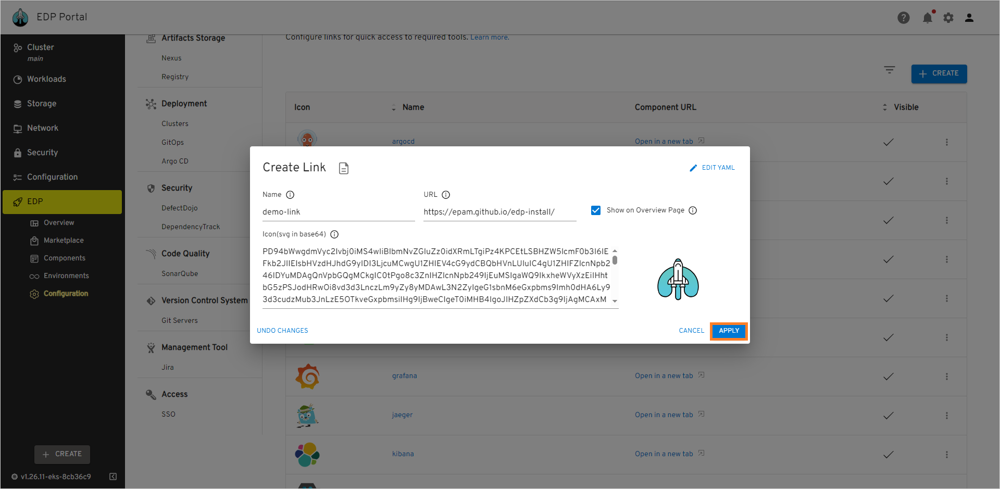
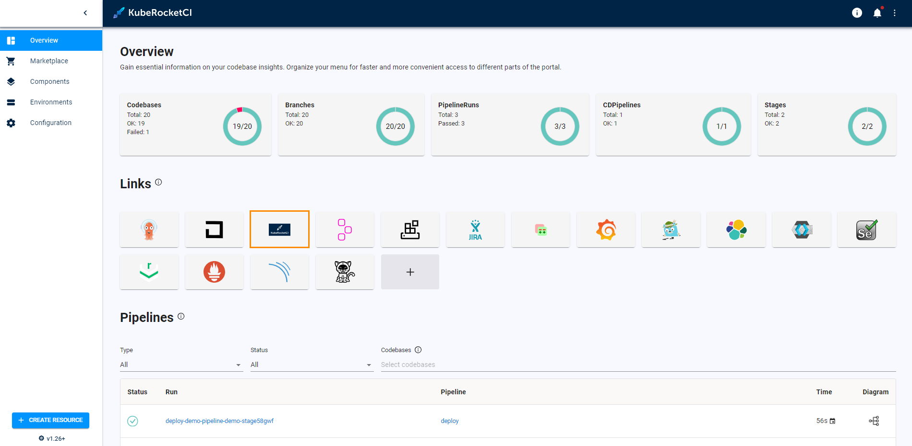
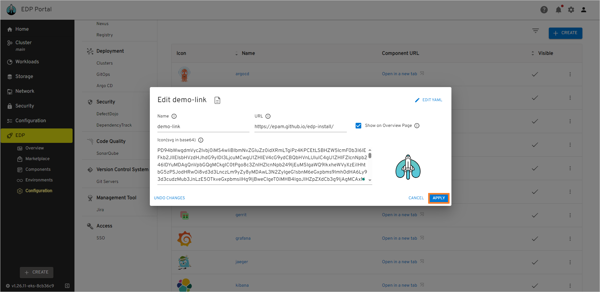
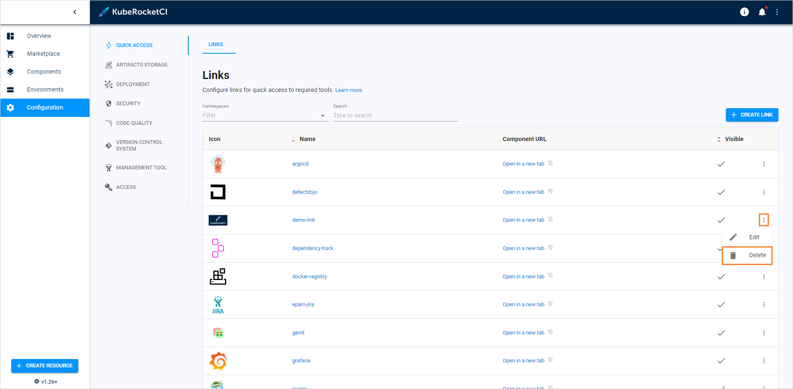
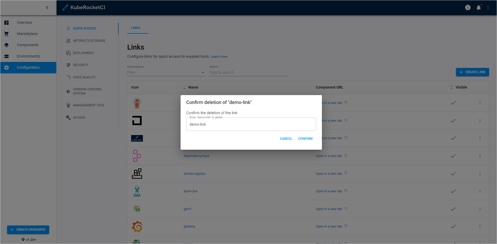

# Manage Quick Links

The Links section is designed to store all the component references in one place. Additional feature is to display these references directly in the [Overview](index.md) page of the EDP Portal. Some of the links are also located in the application details and stage details pages. Integrating some of the tools will also make these links clickable.

## Add Quick Link

To create a Quick Link, follow the steps below:

1. Navigate to `EDP Portal` -> `EDP` -> `Configuration` -> `Links` and click the **+ Create** button:

  !

2. In the appeared window, insert the link name, URL, and SVG icon in base 64 format. Click the checkbox if you want your link to be displayed on the overview page and click **Apply**:

  !

3. If the **Show on Overview Page** option is selected, the image will be displayed on the Overview page among the other links:

  !

## Edit Quick Link

To edit a Quick Link, follow the steps below:

1. Navigate to `EDP Portal` -> `EDP` -> `Configuration` -> `Links`. Click the three-dot menu and select **Edit**:

  !

2. Edit the parameters set for the link:

  !

## Delete Quick Link

Quick Links are deleted the following way:

1. Navigate to `EDP Portal` -> `EDP` -> `Configuration` -> `Links`. Click the three-dot menu and select **Delete**:

  !

2. In the **Confirm deletion** window, enter the name of the link and click **Confirm**:

  !

## Related Articles

* [Add Git Server](add-git-server.md)
* [Add Cluster](add-cluster.md)
* [Manage GitOps](gitops.md)
* [Manage Registries](manage-container-registries.md)