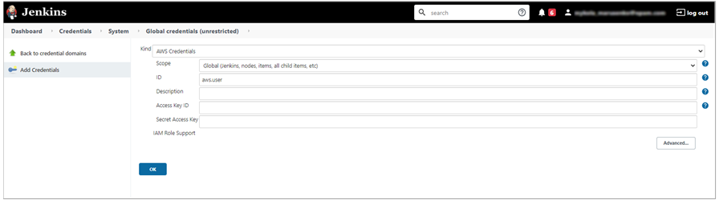
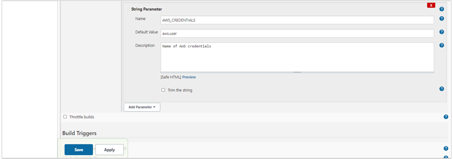

# CI Pipeline for Terraform

EPAM Delivery Platform ensures the implemented Terraform support allowing to work with Terraform code that is processed by means of stages in the **Code-Review** and **Build** pipelines. These pipelines are expected to be created after the Terraform Library is added.

## Code Review Pipeline Stages

In the **Code Review** pipeline, the following stages are available:

1. **checkout** stage, a standard step during which all files are checked out from a selected branch of the Git repository.

2. **terraform-lint** stage containing a script that performs the following actions:

  2.1. Checks whether the repository contains the _.terraform-version_ file, where the information about the Terraform version is stored. If there is no _.terraform-version_ file, the default Terraform version (0.14.5) will be used on this stage. In order to install different versions of Terraform, use the [Terraform version manager](https://github.com/tfutils/tfenv#tfenv).

  2.2. Launches the [_terraform init_](https://www.terraform.io/docs/cli/commands/init.html) command that initializes backend.

  2.3. Launches the linters described below. Pay attention that if at least one of these checks is not true (returns with an error), the Code Review pipeline will fail on this step and will be displayed in red.

    * [_terraform fmt_](https://www.terraform.io/docs/cli/commands/fmt.html) linter checks the formatting of the Terraform code;

    * [_tflint_](https://github.com/terraform-linters/tflint#tflint) linter checks Terraform linters for possible errors and deprecated syntax;

    * [_terraform validate_](https://www.terraform.io/docs/cli/commands/validate.html) linter validates the Terraform code.

## Build Pipeline Stages

In the **Build** pipeline, the following stages are available:

1. **checkout** stage is a standard step during which all files are checked out from a master branch of Git repository.

  !!! note
      With the default versioning, in the base directory of the project, create a file named 'VERSION' with a proper Terraform version (e.g.1.0.0).

2. **terraform-lint** stage containing a script that performs the same actions as in the Code Review pipeline, namely:

  2.1. Checks whether the repository contains the _.terraform-version_ file, where the information about the Terraform version is stored. If there is no _.terraform-version_ file, the default Terraform version (0.14.5) will be used on this stage. In order to install different versions of Terraform, use the [Terraform version manager](https://github.com/tfutils/tfenv#tfenv).

  2.2. Launches the [_terraform init_](https://www.terraform.io/docs/cli/commands/init.html) stage that initializes backend.

  2.3. Launches the linters described below. Pay attention that if at least one of these checks is not true (returns with an error), the Build pipeline will fail on this step and will be displayed in red.

    - [_terraform fmt_](https://www.terraform.io/docs/cli/commands/fmt.html) linter checks the formatting of the Terraform code;

    - [_tflint_](https://github.com/terraform-linters/tflint#tflint) linter checks Terraform linters for possible errors and deprecated syntax;

    - [_terraform validate_](https://www.terraform.io/docs/cli/commands/validate.html) linter validates the Terraform code.

3. **terraform-plan** stage containing a script that performs the following actions:

  3.1. Checks whether the repository contains the _.terraform-version_ file, where the information about the Terraform version is stored. If there is no _.terraform-version_ file, the default Terraform version (0.14.5) will be used on this stage. In order to install different versions of Terraform, use the [Terraform version manager](https://github.com/tfutils/tfenv#tfenv).

  3.2. Launches the [_terraform init_](https://www.terraform.io/docs/cli/commands/init.html) command that initializes backend.

  3.3. Returns the name of the user, on behalf of whom the actions will be performed, with the help of [_aws_](https://docs.aws.amazon.com/cli/latest/reference/index.html).

  3.4. Launches the _terraform-plan_ command saving the results in the _.tfplan_ file.

  !!! note
      EDP expects **AWS credentials** to be added in Jenkins under the name _aws.user_. To learn how to create credentials for the **terraform-plan** and **terraform-apply** stages, see the section [**Create AWS Credentials**](#create-aws-credentials).

4. **terraform-apply** stage containing a script that performs the following actions:

  4.1. Checks whether the repository contains the _.terraform-version_ file, where the information about the Terraform version is stored. If there is no _.terraform-version_ file, the default Terraform version (0.14.5) will be used on this stage. In order to install different versions of Terraform, use the [Terraform version manager](https://github.com/tfutils/tfenv#tfenv).

  4.2. Launches the _terraform init_ command that initializes backend.

  4.3. Launches the _terraform-plan_ command saving the results in the _tfplan_ file.

  4.4. Approves the application of Terraform code in your project by manually clicking the **Proceed** button. To decline the Terraform code, click the **Abort** button. If none of the buttons is selected within 30 minutes, by default the _terraform-plan_ command will not be applied.

  4.5. Launches the [_terraform-apply_](https://www.terraform.io/docs/cli/commands/apply.html) command.

## Create AWS Credentials

To create credentials that will be used in _terraform-plan_ and _terraform-apply_ stages, perform the following steps:

  1. Go to **Jenkins** -> **Manage Jenkins** -> **Manage Credentials**. In the **Store scoped to Jenkins** section select _global_ as **Domains**.
    !

  2. Click the **Add Credentials** tab and select _AWS Credentials_ in the **Kind** dropdown.
    !

  3. Enter the ID name. By default, EDP expects AWS credentials to be under the ID _aws.user_.

  4. Enter values into the **Access Key ID** and **Secret Access Key** fields (credentials should belong to a user in AWS).

  5. Click **OK** to save these credentials. Now the ID of the credentials is visible in the **Global credentials** table in Jenkins.

## Use Existing AWS Credentials

To use other existing credentials (e.g. from other accounts) instead of the expected ones in the Build pipeline and in the _terraform-plan_ and _terraform-apply_ stages, perform the following steps:

1. Navigate to the Build pipeline and select the **Configure** tab.

2. Click the **Add Parameter** button and select the **String Parameter** option.
  !

3. Fill in the respective fields with the variable name _AWS_CREDENTIALS_, description, and the default value (e.g.,_aws.user_, used previously in pipelines).
  !

Now during the launch of the Build pipeline, it is possible to select the desired credentials, added in Jenkins, in the _AWS_CREDENTIALS_ field of the Build pipeline settings.

### Related Articles

* [EDP Pipeline Framework](pipeline-framework.md)
* [Associate IAM Roles With Service Accounts](../operator-guide/enable-irsa.md)
