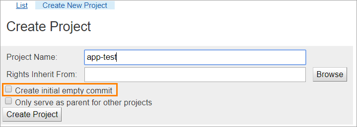
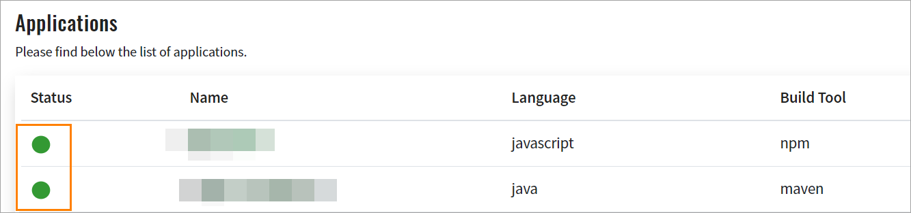
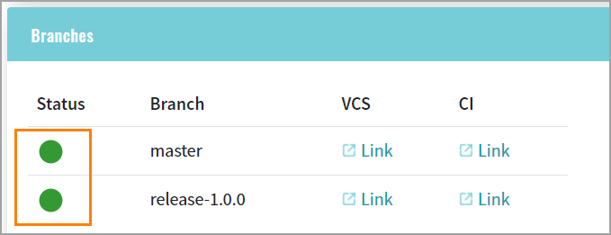
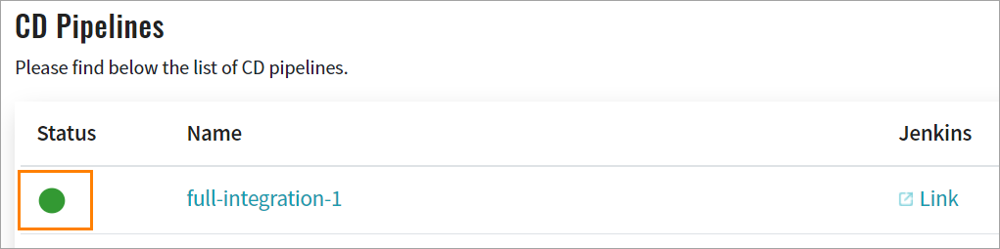
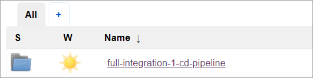
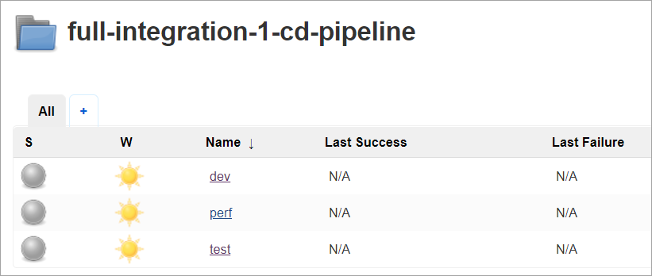

# Replication of Gerrit Development to Gerrit Production

Get acquainted with the detailed information that allows setting up the replication of the Gerrit development to the Gerrit production repositories using Jenkins.

* [Replication of Repositories From Gerrit Development to Gerrit Production](#repositories_dev_to_prod)
* [Replication of Image Streams From Gerrit Development to Gerrit Production](#image_streams_dev_to_prod)

## Replication of Repositories From Gerrit Development to Gerrit Production <a name="repositories_dev_to_prod"></a>

In order to replicate repositories from Gerrit development to Gerrit production using Jenkins, follow the steps described below.

### General Considerations

* Direct commits and pushes to Gerrit Prod are prohibited;
* Codebase Operator should be stopped (i.e. scaled to 0 pods) in a Prod environment.

### Add Jenkins SSH User Key From Prod to Dev Repository

* Jenkins user SSH key is stored in the "gerrit-ciuser-sshkey" secret in CICD Prod namespace, and can be obtained with the following command:

```bash
oc get secret -n <edp-cicd namespacename> gerrit-ciuser-sshkey -o jsonpath='{.data.id_rsa\.pub}' | base64 -d
```

* To set this key to Jenkins user in Dev, you should get the Gerrit service SSH port number, connect to Jenkins master Pod terminal, and run the following command:

```bash
ssh -p <gerrit_ssh_ port> jenkins@gerrit.<CICD_namespace>.svc gerrit set-account jenkins --add-ssh-key "'<Prod_jenkins_ssh_key>'"
```

### Create Projects in Gerrit
In order to create a project, create empty repositories (without initial commit) in Gerrit before the launch of the GerritSync pipeline:



### Copy Custom Resources
The codebase, codebasebranch, cdpipelines and stages custom resources (CRs) should be copied from Dev to Prod environment. The status property value should be set to 'initialized' for all CRs. 

_**NOTE**: If EDP versions in Dev and Prod environments differ, CR definitions should be modified appropriately._

Find below a sample of the codebase CR from the EDP v.2.0.1:

```yaml
apiVersion: edp.epam.com/v1alpha1
kind: Codebase
metadata:
  generation: 1
  name: app1
spec:
  buildTool: NPM
  database: null
  description: null
  framework: React
  lang: JavaScript
  repository: null
  route:
    path: /
    site: app1
  strategy: create
  testReportFramework: null
  type: application
status:
  action: ""
  available: true
  detailed_message: ""
  last_time_updated: 2019-07-01T13:47:42.877590068Z
  result: ""
  status: created
  username: ""
  value: ""
```

Explore the modified codebase CR from the EDP v.2.2.0: 

```yaml
apiVersion: v2.edp.epam.com/v1alpha1   <---
kind: Codebase
metadata:
  generation: 1
  name: app1
spec:
  buildTool: NPM
  database: null
  deploymentScript: openshift-template  <---
  description: null
  framework: React
  gitServer: gerrit   <---
  gitUrlPath: null   <---
  jenkinsSlave: npm  <---
  jobProvisioning: default  <---
  lang: JavaScript
  repository: null
  route:
    path: /
    site: app1
  strategy: create
  testReportFramework: null
  type: application
status:
  action: setup_deployment_templates   <---
  available: true   <---
  detailedMessage: ""
  lastTimeUpdated: 2019-11-22T06:01:11.787630714Z
  result: success  <---
  status: initialized    <---
  username: system  <---
  value: active  <---
```
As a result, after all the CRs have been copied, the corresponding resources (applications, branches, pipelines, stages) will be created in Admin Console with the respective "green" status:







The CD pipelines folders and stages jobs will be created in Jenkins as well, see the screenshots below:






### Copy Repositories Content

To copy repositories content, follow the steps below:

* Create a separate pipeline in Jenkins with the following string parameters:

    * DEV_GIT_SERVER - URL or IP address of the Dev Gerrit server;
    * DEV_GIT_PORT - SSH port number of the Dev Gerrit server.
    
* Check out the job script from the pipeline script for job: https://github.com/epmd-edp/edp-library-pipelines.git with the EDP version tag as a branch selector;
* Set the script path to "vars/GitSync.groovy";
* Run this job to copy the Gerrit repositories from Dev to Prod environment. Each launch of the job will be updating the repositories content. 

_**NOTE**: Pay attention that the job updates only the existing in Admin Console codebase repositories. If there is a necessity to apply scheduled updates, configure the Cron of this Jenkins job._

## Replication of Image Streams From Gerrit Development to Gerrit Production <a name="image_streams_dev_to_prod"></a>

In order to replicate image streams from Gerrit development to Gerrit production using Jenkins, follow the steps described below.

### Create Secret for Registry Access

To access the Dev OpenShift registry from Prod, the corresponding credentials should be obtained. By default, every service account in OpenShift has the dockercfg secret with registry access credentials. 

By creating a secret, you will be able to:
* Get credentials from SA on a Dev environment and add them to SA in a Prod environment;
* Use any SA with registry access from a Dev environment. 

_**NOTE**: The default SA in Prod environment will be applied because the "oc import-image" command uses it by default._

In order to create a secret for the registry access, follow the steps below:

* Run the following command in the Dev environment to get SA registry access secret name:
```bash
oc get sa <SA name> -n <CICD namespace> -o jsonpath='{.imagePullSecrets[*].name}'
```

* Run the following command to get registry credentials:
```bash
oc get secret -n <CICD namespace> <secret name> -o jsonpath='{.data.\.dockercfg}' | base64 -d
```

* Copy the "docker-registry.default.svc:5000" section with its content:

* Run the following command in the Prod environment to get default SA registry access secret name:
```bash
oc get sa default -n <CICD namespace> -o jsonpath='{.imagePullSecrets[*].name}'
```

* Run the following command to get registry credentials:
```bash
oc get secret -n <CICD namespace> <secret name> -o jsonpath='{.data.\.dockercfg}' | base64 -d
```

* Create an empty directory (e.g. /tmp/cfg) and put secret content in the .dockercfg file inside this directory;

* Add the "docker-registry.default.svc:5000" section from Dev to the end of the .dockercfg file;

* Replace the "docker-registry.default.svc:5000" section in the last section of the file with a Dev registry URL or IP address accessible from Prod;

* Create a new secret with the following command:
```bash
oc create secret generic default-dockercfg-dev --from-file=.dockercfg=/tmp/cfg/.dockercfg --type=kubernetes.io/dockercfg -n <CICD namespace>
```

* Edit the default SA in Prod:
```yaml
apiVersion: v1
imagePullSecrets:
  - name: default-dockercfg-dev   <----- Replace secret name here
kind: ServiceAccount
metadata:
  name: default
  namespace: xxxxxxxxxxxxxxx
secrets:
  - name: default-dockercfg-sf4wl
  - name: default-token-wftpt
  - name: default-dockercfg-dev   <----- Add new secret here
```

### Copy Image Streams

By default, OpenShift is configured to import only five latest images during the image-import process. If there is a necessity to modify this behaviour, set the "MaxImagesBulkImportedPerRepository" parameter in the "imagePolicyConfig" section of the master-config.yaml file.

To import _Imagestreams_ from Dev to Prod environment, follow the steps below: 
* Create a separate pipeline job in Jenkins with the following string parameter:
    * DEV_REGISTRY_URL - URL or ip address of Dev docker registry

* Check out the job script from the pipeline script for job: https://github.com/epmd-edp/edp-library-pipelines.git with the EDP version tag as a branch selector;
* Set the script path to"vars/ImageSync.groovy";
* Run this job to import images from Dev to Prod registry. Each launch of the job will be updating _Imagestream_ tags.

_**NOTE**: Pay attention that the job updates only the existing in Admin Console codebase _Imagestreams_. If there is a necessity to apply scheduled updates, configure the Cron of this Jenkins job._

## Deploy in Prod

It is possible to deploy your projects by running CD pipelines in Prod Jenkins as in Dev environment.

