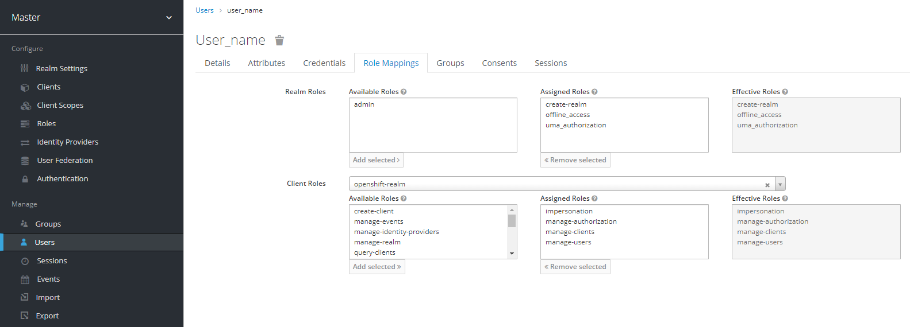

# Keycloak Installation on Kubernetes

Inspect the prerequisites and the main steps to perform with the aim to install Keycloak on Kubernetes.

## Prerequisites

* Keycloak v.[13.0.1](https://www.keycloak.org/docs/latest/release_notes/index.html#keycloak-13-0-0) should 
be used with EDP installation.
* [Helm](https://helm.sh) is installed. For details, to getting started, please refer to the [Helm Documentation](https://helm.sh/docs/).

>_**NOTE**: EDP team is using a helm chart from the [codecentric](https://github.com/codecentric/helm-charts/tree/master/charts/keycloak) 
repository, but other repositories can be used as well (e.g. [bitnami](https://github.com/bitnami/charts/tree/master/bitnami/keycloak/))._

## Installation

Follow the steps below to install Keycloak:

1. Create a namespace to be used for the Keycloak deployment, e.g. security:

    ```bash
    kubectl create namespace security
    ```
2. Add a chart repository:

    ```bash
    helm repo add codecentric https://codecentric.github.io/helm-charts
    helm repo update
    ```
3. Install Keycloak v.13.0.1:

    ```bash
    helm install keycloak codecentric/keycloak \
    --version 11.0.1 \
    --set image.tag=13.0.1 \
    --namespace security
    ```
4. Wait for the Keycloak URL to become accessible.

>**INFO**: The Keycloak can be deployed in a production ready mode (e.g. it can include multiple replicas, persistent storage, 
autoscaling, monitoring, etc.), for details, please refer to the [Official Chart Documentation](https://github.com/codecentric/helm-charts/tree/master/charts/keycloak). 

Check out the *value.yaml* file sample of the Keycloak customization:

```yaml
replicas: 1

# start: create OpenShift realm which is required by edp
extraInitContainers: |
  - name: realm-provider
    image: busybox
    imagePullPolicy: IfNotPresent
    command:
      - sh
    args:
      - -c
      - |
        echo '{"realm": "openshift","enabled": true}' > /realm/openshift.json
    volumeMounts:
      - name: realm
        mountPath: /realm

extraVolumeMounts: |
  - name: realm
    mountPath: /realm

extraVolumes: |
  - name: realm
    emptyDir: {}

args: -Dkeycloak.import=/realm/openshift.json
# end
extraEnv: |
  - name: PROXY_ADDRESS_FORWARDING
    value: "true"
  - name: KEYCLOAK_USER
    valueFrom:
      secretKeyRef:
        name: keycloak-admin-creds
        key: username
  - name: KEYCLOAK_PASSWORD
    valueFrom:
      secretKeyRef:
        name: keycloak-admin-creds
        key: password
  - name: KEYCLOAK_IMPORT
    value: /realm/openshift.json

ingress:
  enabled: true
  annotations:
    kubernetes.io/ingress.class: nginx
    ingress.kubernetes.io/affinity: cookie
  rules:
    - host: keycloak-security.example.com
      paths:
        - /

resources:
  limits:
    cpu: "1000m"
    memory: "1024Mi"
  requests:
    cpu: "50m"
    memory: "512Mi"

# Use PostgreSQL deployed in a container
persistence:
  deployPostgres: true
  dbVendor: postgres

postgresql:
  postgresqlUsername: username
  postgresqlPassword: passwords
  postgresqlDatabase: keycloak
  persistence:
    enabled: true
    size: "3Gi"
    storageClass: "gp2"
```

## Configuration

Follow the steps below to configure Keycloak:

1. Ensure the "openshift" realm is created in Keycloak;


2. Create a user in your Keycloak in "Master" realm;


3. In the "Role Mappings" tab, assign the proper roles to user:

* for realm:
  - create-realm,
   
  - offline_access,
   
  - uma_authorization
   
* for openshift-realm client:
  - impersonation,
   
  - manage-authorization,
   
  - manage-clients,
    
  - manage-users


