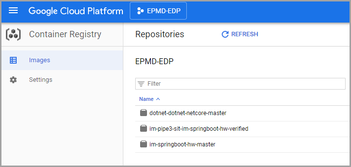

# Google Container Registry Integration

This chapter contains an accurate description of how to use the Google container registry (GCR) for further keeping of the produced by EDP containers.

## Prerequisites
Assuming that cluster is running under the GCP service account, for instance, **712239771395-compute@developer.gserviceaccount.com**
(**cluster_sa**)

## GCR Integration Flow
Discover the steps below to apply the GCR integration correctly:

1. Create a custom role, for instance, **Storage_C1714468**, for the **cluster_sa** with the following permissions:

    * storage.buckets.create
    * storage.buckets.delete
    * storage.buckets.get
    * storage.buckets.list
    * storage.buckets.update
    * storage.objects.create
    * storage.objects.delete
    * storage.objects.get
    * storage.objects.list
    * storage.objects.update
    
    _**NOTE**: Probably, such permissions should be requested from a support team._

2. Grant this role your service account which will be used to push images (e.g. cluster_sa) and check that it is assigned:


_**NOTE**: Probably, it is necessary to request this assignment via a support team as well._

3.Create a key file in JSON format and save it with the **kaniko-secret.json** name. To do this, follow the steps below:
    
    * Navigate to "IAM & Admin -> Service Accounts":
    
    * Find your service account, click the Actions menu and select the Create key option:   
    
    * Select the JSON key type and click CREATE:      

_**NOTE**: Keep it secure in order to be authorized to Kaniko while accessing a Google Container Registry*._

4.Go to the cluster console and create a Secret with the **kaniko-secret** name in your EDP namespace from the previous file:
   ```bash
   kubectl -n <edp_namespace> create secret generic kaniko-secret --from-file kaniko-secret.json
   ```
5.Create a ConfigMap object with the **kaniko-template** name in the **demo-edp-cicd** namespace by applying the following template:
   
   ```yaml
   apiVersion: v1
   data:
     kaniko.json: |-
       {
         "apiVersion": "v1",
         "kind": "Pod",
         "metadata": {
           "name": "kaniko"
         },
         "spec": {
           "initContainers": [
             {
               "name": "init-kaniko",
               "image": "busybox",
               "command": [
                 "/bin/sh",
                 "-c",
                 "while ! [[ -f /tmp/workspace/Dockerfile ]]; do echo \"Waiting for Dockerfile in workspace...\"; sleep 10;done"
               ],
               "volumeMounts": [
                 {
                   "name": "shared-volume",
                   "mountPath": "/tmp/workspace"
                 }
               ]
             },
           ],
           "containers": [
             {
               "name": "kaniko",
               "image": "gcr.io/kaniko-project/executor:v0.13.0",
               "env": [
                 {
                   "name": "GOOGLE_APPLICATION_CREDENTIALS",
                   "value": "/secret/kaniko-secret.json"
                 }
               ],
               "args": [
                 "--destination=REPLACE_DESTINATION_IMAGE"
               ],
               "volumeMounts": [
                 {
                   "name": "shared-volume",
                   "mountPath": "/workspace"
                 },
                 {
                   "name": "kaniko-secret",
                   "mountPath": "/secret"
                 }
               ]
             }
           ],
           "restartPolicy": "Never",
           "volumes": [
             {
               "name": "shared-volume",
               "emptyDir": {}
             },
             {
               "name": "kaniko-secret",
               "secret": {
                 "secretName": "kaniko-secret"
               }
             }
           ]
         }
       }
   kind: ConfigMap
   metadata:  
     name: kaniko-template 
   ```
6.Before running pipelines, create EDP component CR that points to the Google Container Registry URL, which will be **gcr.io/<GCP_Project_ID>**. For instance, **gcr.io/or2-msq-epmd-edp-t1iylu**. Use the following template to create EDP component:

   ```yaml
   apiVersion: v1.edp.epam.com/v1alpha1
   kind: EDPComponent
   metadata:
     name: docker-registry
   spec:
     icon: PHN2ZyBpZD0ic3ZnIiB2ZXJzaW9uPSIxLjEiIHhtbG5zPSJodHRwOi8vd3d3LnczLm9yZy8yMDAwL3N2ZyIgeG1sbnM6eGxpbms9Imh0dHA6Ly93d3cudzMub3JnLzE5OTkveGxpbmsiIHdpZHRoPSI0MDAiIGhlaWdodD0iNDAwIiB2aWV3Qm94PSIwLCAwLCA0MDAsNDAwIj48ZyBpZD0ic3ZnZyI+PHBhdGggaWQ9InBhdGgwIiBkPSJNOTIuMDYzIDQ0LjQwNiBDIDkxLjEwOCA0NC44MzksODYuMDY4IDQ3LjY1NSw4MC44NjMgNTAuNjYzIEMgNzUuNjU5IDUzLjY3MSw2NS4xOTAgNTkuNzE3LDU3LjYwMCA2NC4xMDAgQyAxNC4yODMgODkuMTEzLDE1LjMwOSA4OC40NTcsMTMuNzY3IDkyLjEwMSBDIDExLjY2NiA5Ny4wNjMsMTEuNjA3IDMxMC45NzgsMTMuNzA1IDMxNS43MjMgQyAxNS40NjYgMzE5LjcwNSwxNS4wNTMgMzE5LjQzMiw0OC4wMDAgMzM4LjM4MCBDIDczLjI4MyAzNTIuOTIwLDgwLjI1NyAzNTYuOTUxLDg1LjQ2OCAzNjAuMDQwIEMgOTkuMTYwIDM2OC4xNTYsOTkuNzA1IDM2Ny41NDIsOTkuNTIyIDM0NC4xODUgQyA5OS4zNTYgMzIzLjAwNSwxMDAuOTQxIDMyNS42NTEsODEuODc1IDMxNC43MjMgQyA1MC4yODQgMjk2LjYxNiw1MS41ODAgMjk3LjcyNSw1MC42NzAgMjg4LjAxNyBDIDUwLjAxMCAyODAuOTc2LDUwLjAwMyAxMzEuMDA3LDUwLjY2MiAxMjEuNjAwIEMgNTEuNDExIDExMC45MDQsNTEuMjk0IDExMS4wNDMsNjcuNjAwIDEwMS42MjMgQyA3MS44OTAgOTkuMTQ0LDc3LjAyMCA5Ni4xNjksNzkuMDAwIDk1LjAxMSBDIDgwLjk4MCA5My44NTMsODUuMjEwIDkxLjQwNSw4OC40MDAgODkuNTcwIEMgOTkuNzQ4IDgzLjA0NSw5OS42MDEgODMuMzg5LDk5LjU5OCA2My40MjkgQyA5OS41OTUgNDMuNDU4LDk4Ljc2NSA0MS4zNjQsOTIuMDYzIDQ0LjQwNiBNMzAyLjIxNSA0NC41NDkgQyAzMDAuNTU5IDQ2LjIwNSwzMDAuNDA1IDQ3Ljc5MiwzMDAuNDAyIDYzLjIyNyBDIDMwMC4zOTkgODMuNDE0LDMwMC4yMjcgODMuMDA4LDMxMS42MDEgODkuNTcxIEMgMzUxLjE0NiAxMTIuMzg4LDM0OC41ODkgMTEwLjMxNCwzNDkuMjk0IDEyMC4xNDggQyAzNDkuODgyIDEyOC4zNDgsMzUwLjE2NCAyNjguOTAyLDM0OS42MTggMjgxLjIwMCBDIDM0OC44NTUgMjk4LjM2NSwzNTEuMjMyIDI5NS43NDYsMzIwLjQwMCAzMTMuMzkxIEMgMjk4Ljc4NCAzMjUuNzYxLDMwMC4zOTkgMzIzLjIyOCwzMDAuNDAyIDM0NC43NzMgQyAzMDAuNDA2IDM2OC4wODYsMzAwLjYzMCAzNjguMjc2LDMxNi44NjIgMzU4LjY5NiBDIDMyMC4wMTggMzU2LjgzNCwzMjkuMjYwIDM1MS40NzgsMzM3LjQwMCAzNDYuNzk0IEMgMzg1Ljk0NSAzMTguODYxLDM4NC4zNjkgMzE5Ljg1NiwzODYuMTQ4IDMxNi4wMDAgQyAzODcuMzg1IDMxMy4zMTcsMzg3LjczNCAyODguNTQwLDM4Ny43MjcgMjA0LjAwMCBDIDM4Ny43MTcgOTEuODI2LDM4Ny43MzcgOTIuMzM4LDM4My4yMjIgODguMzA5IEMgMzgxLjIxNiA4Ni41MTksMzc5LjU4MiA4NS41MzksMzU0LjAwMCA3MC43OTAgQyAzNDUuMzEwIDY1Ljc4MCwzMzIuNTMwIDU4LjM5MiwzMjUuNjAwIDU0LjM3MiBDIDMwNS4xODcgNDIuNTMwLDMwNC41MTYgNDIuMjQ4LDMwMi4yMTUgNDQuNTQ5IE0xOTYuODAwIDY3LjgxOSBDIDE5NC43NzUgNjguNDUyLDE5MC43MTAgNzAuNzA1LDE3MC41MTcgODIuMzg5IEMgMTU0LjM4MyA5MS43MjMsMTUzLjEzOSA5Mi41ODQsMTUxLjQ0MCA5NS42MDAgTCAxNTAuMjAwIDk3LjgwMCAxNTAuMDg4IDEyMi4xNTYgQyAxNDkuOTYwIDE1MC4xMTYsMTQ5Ljg3NyAxNDkuMjk0LDE1My4xNTkgMTUyLjg3MSBDIDE1NS4yMTAgMTU1LjEwNSwxNTguOTUwIDE1Ny40MDgsMTgzLjQwMCAxNzEuNDk2IEMgMjAxLjQ4MCAxODEuOTEzLDE5OS40NDkgMTgxLjk2MiwyMTkuMjAwIDE3MC42MzcgQyAyNDUuMTcyIDE1NS43NDQsMjQ4LjA0OCAxNTMuNzk4LDI1MC4wMjEgMTQ5Ljc5MCBMIDI1MS4wMDAgMTQ3LjgwMCAyNTEuMTE1IDEyNC40MzcgQyAyNTEuMjc3IDkxLjc2NCwyNTMuMjE3IDk2LjAxNywyMzIuODAwIDg0LjI5MCBDIDIyNi4wOTAgODAuNDM2LDIxNy4zMDEgNzUuMzgyLDIxMy4yNjggNzMuMDU5IEMgMjAyLjk3MiA2Ny4xMjYsMjAxLjAxMSA2Ni41MDIsMTk2LjgwMCA2Ny44MTkgTTEzMy44MDAgMTg2LjcyOCBDIDEzMS42NjggMTg3LjUyNywxMjcuMTIzIDE5MC4wNjgsMTA5LjYwMCAyMDAuMjU4IEMgMTAzLjU1MCAyMDMuNzc2LDk3LjQ1NCAyMDcuMjYzLDk2LjA1NCAyMDguMDA4IEMgOTIuNzA2IDIwOS43ODcsODkuOTE3IDIxMi4zMzksODguNzQ2IDIxNC42OTYgTCA4Ny44MDAgMjE2LjYwMCA4Ny44MDAgMjQyLjAwMCBMIDg3LjgwMCAyNjcuNDAwIDg4Ljk4NyAyNjkuNTQyIEMgOTAuOTE1IDI3My4wMjMsOTMuNjcyIDI3NC43NTksMTMxLjQwMiAyOTYuMjQ3IEMgMTM3LjMxNyAyOTkuNjE1LDEzOS40NzMgMjk5LjE0OCwxNTIuNjAwIDI5MS42NTUgQyAxODIuNTg3IDI3NC41MzksMTg1LjE2MiAyNzIuODgzLDE4Ny4wMzMgMjY5LjUwNyBMIDE4OC4yMDAgMjY3LjQwMCAxODguMzMyIDI0NC4wMDAgQyAxODguNTA3IDIxMi45MjEsMTg4LjUyMyAyMTIuOTg5LDE4MC4wNjQgMjA4LjU4MCBDIDE3OS4yNTkgMjA4LjE2MCwxNzUuOTAwIDIwNi4yNTksMTcyLjYwMCAyMDQuMzU2IEMgMTM3LjE1OCAxODMuOTEwLDEzOS4wNDIgMTg0Ljc2NiwxMzMuODAwIDE4Ni43MjggTTI1OC4yODggMTg2Ljk3MCBDIDI1NS45MDUgMTg3Ljk1MCwyNTQuNTA3IDE4OC43MjksMjM2LjIwMCAxOTkuMjc5IEMgMjE4Ljg2NCAyMDkuMjcwLDIxOC4xMTIgMjA5LjcyMywyMTYuMTYwIDIxMS4zNjIgQyAyMTQuOTk3IDIxMi4zMzgsMjEzLjkwNSAyMTMuNzY0LDIxMy4yNDkgMjE1LjE2MiBMIDIxMi4yMDAgMjE3LjQwMCAyMTIuMjAwIDI0Mi4wMDAgTCAyMTIuMjAwIDI2Ni42MDAgMjEzLjMxMCAyNjguODYwIEMgMjE0Ljk3MCAyNzIuMjQwLDIxNi4xNDAgMjczLjA1NSwyMzQuNjAwIDI4My42OTIgQyAyNjQuOTY5IDMwMS4xOTIsMjYyLjI2MCAzMDAuNDcwLDI3My40NjMgMjk0LjA0MiBDIDI3Ni4wNjggMjkyLjU0NywyODMuMTUwIDI4OC40ODYsMjg5LjIwMCAyODUuMDE4IEMgMzA4LjAxOSAyNzQuMjI5LDMwOS42NTMgMjczLjExNywzMTEuNDUyIDI2OS44NzIgTCAzMTIuNjAwIDI2Ny44MDAgMzEyLjYwMCAyNDIuMjAwIEwgMzEyLjYwMCAyMTYuNjAwIDMxMS41MjYgMjE0LjU2NCBDIDMxMC4yMjIgMjEyLjA5NCwzMDguNTE4IDIxMC41NDUsMzA0LjkyMyAyMDguNTY1IEMgMzAzLjQyNSAyMDcuNzQwLDI5Ni43MTAgMjAzLjg4MywyOTAuMDAwIDE5OS45OTQgQyAyNjMuMjgzIDE4NC41MTEsMjYzLjc3NiAxODQuNzEzLDI1OC4yODggMTg2Ljk3MCAiIHN0cm9rZT0ibm9uZSIgZmlsbD0iIzFhN2FkNiIgZmlsbC1ydWxlPSJldmVub2RkIj48L3BhdGg+PHBhdGggaWQ9InBhdGgxIiBkPSJNMC4wMDAgMjAwLjAwMCBMIDAuMDAwIDQwMC4wMDAgMjAwLjAwMCA0MDAuMDAwIEwgNDAwLjAwMCA0MDAuMDAwIDQwMC4wMDAgMjAwLjAwMCBMIDQwMC4wMDAgMC4wMDAgMjAwLjAwMCAwLjAwMCBMIDAuMDAwIDAuMDAwIDAuMDAwIDIwMC4wMDAgTTk3LjcwOSA0NC41NTEgQyA5OS40NDggNDYuMTYyLDk5LjU5NSA0Ny42MzUsOTkuNTk4IDYzLjQyOSBDIDk5LjYwMSA4My4zODksOTkuNzQ4IDgzLjA0NSw4OC40MDAgODkuNTcwIEMgODUuMjEwIDkxLjQwNSw4MC45ODAgOTMuODUzLDc5LjAwMCA5NS4wMTEgQyA3Ny4wMjAgOTYuMTY5LDcxLjg5MCA5OS4xNDQsNjcuNjAwIDEwMS42MjMgQyA1MS4yOTQgMTExLjA0Myw1MS40MTEgMTEwLjkwNCw1MC42NjIgMTIxLjYwMCBDIDUwLjAwMyAxMzEuMDA3LDUwLjAxMCAyODAuOTc2LDUwLjY3MCAyODguMDE3IEMgNTEuNTgwIDI5Ny43MjUsNTAuMjg0IDI5Ni42MTYsODEuODc1IDMxNC43MjMgQyAxMDAuOTQxIDMyNS42NTEsOTkuMzU2IDMyMy4wMDUsOTkuNTIyIDM0NC4xODUgQyA5OS43MDUgMzY3LjU0Miw5OS4xNjAgMzY4LjE1Niw4NS40NjggMzYwLjA0MCBDIDgwLjI1NyAzNTYuOTUxLDczLjI4MyAzNTIuOTIwLDQ4LjAwMCAzMzguMzgwIEMgMTUuMDUzIDMxOS40MzIsMTUuNDY2IDMxOS43MDUsMTMuNzA1IDMxNS43MjMgQyAxMS42MDcgMzEwLjk3OCwxMS42NjYgOTcuMDYzLDEzLjc2NyA5Mi4xMDEgQyAxNS4wMDQgODkuMTc5LDE4LjAwMSA4Ni45ODksMzEuMjM3IDc5LjMzNCBDIDM4LjE0NyA3NS4zMzgsNTAuMDEwIDY4LjQ4Myw1Ny42MDAgNjQuMTAwIEMgNjUuMTkwIDU5LjcxNyw3NS42NTkgNTMuNjcxLDgwLjg2MyA1MC42NjMgQyA5NC4yMTggNDIuOTQ1LDk1LjQ4MiA0Mi40ODYsOTcuNzA5IDQ0LjU1MSBNMzA5LjgwMCA0NS4zNDMgQyAzMTEuNTYwIDQ2LjI4OSwzMTguNjcwIDUwLjM1MiwzMjUuNjAwIDU0LjM3MiBDIDMzMi41MzAgNTguMzkyLDM0NS4zMTAgNjUuNzgwLDM1NC4wMDAgNzAuNzkwIEMgMzc5LjU4MiA4NS41MzksMzgxLjIxNiA4Ni41MTksMzgzLjIyMiA4OC4zMDkgQyAzODcuNzM3IDkyLjMzOCwzODcuNzE3IDkxLjgyNiwzODcuNzI3IDIwNC4wMDAgQyAzODcuNzM0IDI4OC41NDAsMzg3LjM4NSAzMTMuMzE3LDM4Ni4xNDggMzE2LjAwMCBDIDM4NC4zNjkgMzE5Ljg1NiwzODUuOTQ1IDMxOC44NjEsMzM3LjQwMCAzNDYuNzk0IEMgMzI5LjI2MCAzNTEuNDc4LDMyMC4wMTggMzU2LjgzNCwzMTYuODYyIDM1OC42OTYgQyAzMDYuMjI2IDM2NC45NzMsMzA0LjM0NyAzNjUuNTgzLDMwMi4yMTUgMzYzLjQ1MSBDIDMwMC41NTkgMzYxLjc5NSwzMDAuNDA1IDM2MC4yMDgsMzAwLjQwMiAzNDQuNzczIEMgMzAwLjM5OSAzMjMuMjI4LDI5OC43ODQgMzI1Ljc2MSwzMjAuNDAwIDMxMy4zOTEgQyAzNTEuMjMyIDI5NS43NDYsMzQ4Ljg1NSAyOTguMzY1LDM0OS42MTggMjgxLjIwMCBDIDM1MC4xNjQgMjY4LjkwMiwzNDkuODgyIDEyOC4zNDgsMzQ5LjI5NCAxMjAuMTQ4IEMgMzQ4LjU4OSAxMTAuMzE0LDM1MS4xNDYgMTEyLjM4OCwzMTEuNjAxIDg5LjU3MSBDIDMwMC4yMjcgODMuMDA4LDMwMC4zOTkgODMuNDE0LDMwMC40MDIgNjMuMjI3IEMgMzAwLjQwNSA0Mi40MDMsMzAxLjI2OSA0MC43NTksMzA5LjgwMCA0NS4zNDMgTTIwMy43NTMgNjguMDE3IEMgMjA0Ljk1NCA2OC40NjYsMjA5LjIzNiA3MC43MzUsMjEzLjI2OCA3My4wNTkgQyAyMTcuMzAxIDc1LjM4MiwyMjYuMDkwIDgwLjQzNiwyMzIuODAwIDg0LjI5MCBDIDI1My4yMTcgOTYuMDE3LDI1MS4yNzcgOTEuNzY0LDI1MS4xMTUgMTI0LjQzNyBMIDI1MS4wMDAgMTQ3LjgwMCAyNTAuMDIxIDE0OS43OTAgQyAyNDguMDQ4IDE1My43OTgsMjQ1LjE3MiAxNTUuNzQ0LDIxOS4yMDAgMTcwLjYzNyBDIDE5OS40NDkgMTgxLjk2MiwyMDEuNDgwIDE4MS45MTMsMTgzLjQwMCAxNzEuNDk2IEMgMTU4Ljk1MCAxNTcuNDA4LDE1NS4yMTAgMTU1LjEwNSwxNTMuMTU5IDE1Mi44NzEgQyAxNDkuODc3IDE0OS4yOTQsMTQ5Ljk2MCAxNTAuMTE2LDE1MC4wODggMTIyLjE1NiBMIDE1MC4yMDAgOTcuODAwIDE1MS40NDAgOTUuNjAwIEMgMTUzLjEzOSA5Mi41ODQsMTU0LjM4MyA5MS43MjMsMTcwLjUxNyA4Mi4zODkgQyAxOTkuMjEwIDY1Ljc4OCwxOTguNTU0IDY2LjA3MiwyMDMuNzUzIDY4LjAxNyBNMTQzLjIwNSAxODcuNTk1IEMgMTQ0LjYzMiAxODguMzEyLDE1MC40ODAgMTkxLjU5NywxNTYuMjAwIDE5NC44OTYgQyAxNjEuOTIwIDE5OC4xOTUsMTY5LjMwMCAyMDIuNDUyLDE3Mi42MDAgMjA0LjM1NiBDIDE3NS45MDAgMjA2LjI1OSwxNzkuMjU5IDIwOC4xNjAsMTgwLjA2NCAyMDguNTgwIEMgMTg4LjUyMyAyMTIuOTg5LDE4OC41MDcgMjEyLjkyMSwxODguMzMyIDI0NC4wMDAgTCAxODguMjAwIDI2Ny40MDAgMTg3LjAzMyAyNjkuNTA3IEMgMTg1LjE2MiAyNzIuODgzLDE4Mi41ODcgMjc0LjUzOSwxNTIuNjAwIDI5MS42NTUgQyAxMzkuNDczIDI5OS4xNDgsMTM3LjMxNyAyOTkuNjE1LDEzMS40MDIgMjk2LjI0NyBDIDkzLjY3MiAyNzQuNzU5LDkwLjkxNSAyNzMuMDIzLDg4Ljk4NyAyNjkuNTQyIEwgODcuODAwIDI2Ny40MDAgODcuODAwIDI0Mi4wMDAgTCA4Ny44MDAgMjE2LjYwMCA4OC43NDYgMjE0LjY5NiBDIDg5LjkxNyAyMTIuMzM5LDkyLjcwNiAyMDkuNzg3LDk2LjA1NCAyMDguMDA4IEMgOTcuNDU0IDIwNy4yNjMsMTAzLjU1MCAyMDMuNzc2LDEwOS42MDAgMjAwLjI1OCBDIDEzNy4xNzggMTg0LjIyMSwxMzYuNzgxIDE4NC4zNzAsMTQzLjIwNSAxODcuNTk1IE0yNjYuMzYwIDE4Ni43ODQgQyAyNjguNTg2IDE4Ny42NjIsMjcyLjMzMSAxODkuNzU0LDI5MC4wMDAgMTk5Ljk5NCBDIDI5Ni43MTAgMjAzLjg4MywzMDMuNDI1IDIwNy43NDAsMzA0LjkyMyAyMDguNTY1IEMgMzA4LjUxOCAyMTAuNTQ1LDMxMC4yMjIgMjEyLjA5NCwzMTEuNTI2IDIxNC41NjQgTCAzMTIuNjAwIDIxNi42MDAgMzEyLjYwMCAyNDIuMjAwIEwgMzEyLjYwMCAyNjcuODAwIDMxMS40NTIgMjY5Ljg3MiBDIDMwOS42NTMgMjczLjExNywzMDguMDE5IDI3NC4yMjksMjg5LjIwMCAyODUuMDE4IEMgMjgzLjE1MCAyODguNDg2LDI3Ni4wNjggMjkyLjU0NywyNzMuNDYzIDI5NC4wNDIgQyAyNjMuMjExIDI5OS45MjUsMjYyLjY3OCAyOTkuODcwLDI0Ny45OTMgMjkxLjQwOSBDIDI0My40ODcgMjg4LjgxMywyMzcuNDYwIDI4NS4zNDAsMjM0LjYwMCAyODMuNjkyIEMgMjE2LjE0MCAyNzMuMDU1LDIxNC45NzAgMjcyLjI0MCwyMTMuMzEwIDI2OC44NjAgTCAyMTIuMjAwIDI2Ni42MDAgMjEyLjIwMCAyNDIuMDAwIEwgMjEyLjIwMCAyMTcuNDAwIDIxMy4yNDkgMjE1LjE2MiBDIDIxNC41MDcgMjEyLjQ4MSwyMTYuNTg1IDIxMC42MzYsMjIxLjcxMCAyMDcuNjUyIEMgMjI2LjI0MiAyMDUuMDEzLDI0NS4zNjkgMTkzLjk4OCwyNTEuNDg4IDE5MC40ODggQyAyNTkuNTI2IDE4NS44OTAsMjYyLjMyNCAxODUuMTkzLDI2Ni4zNjAgMTg2Ljc4NCAiIHN0cm9rZT0ibm9uZSIgZmlsbD0iI2ZiZmJmYyIgZmlsbC1ydWxlPSJldmVub2RkIj48L3BhdGg+PC9nPjwvc3ZnPgo=
     type: docker-registry
     url: <GCR URL>
   ```
7.As a result, the built images will be pushed by Build pipelines in the Container Registry section of the GCP Web console:

